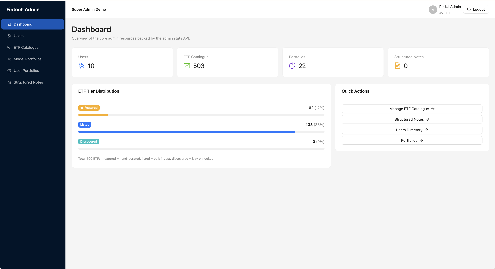
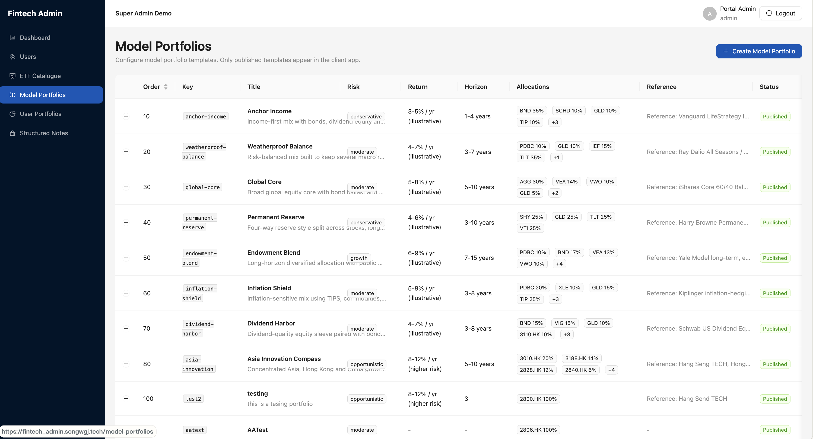
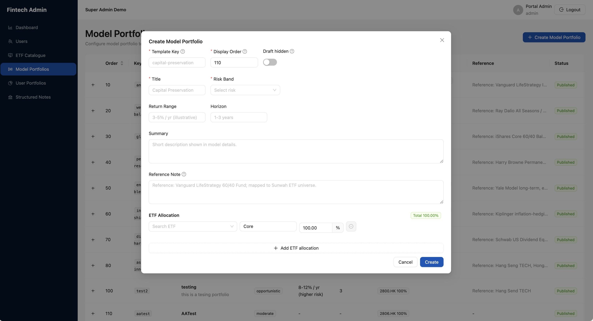
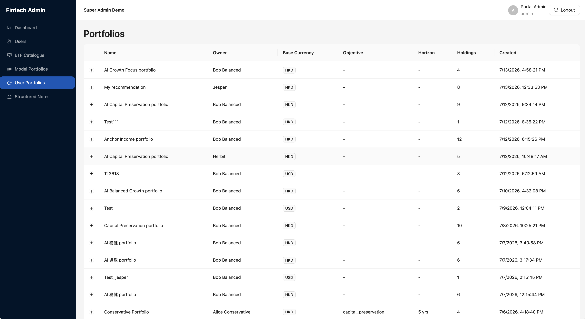

# Admin Module

## Module Overview

`Admin Portal` is the operations console behind the client application. This module proves that the portal and mobile app use the same backend resources: changes to `ETF Catalogue` and `Model Portfolios` can be verified after refreshing the mobile app, while administrators can monitor platform status through `Dashboard`, `Users` and `User Portfolios`.

## User Story / Video Index

| Story | Video theme | Core path | Video |
| --- | --- | --- | --- |
| [US-ADM-01](#us-adm-01) | Admin Functional Acceptance | Dashboard + ETF Catalogue + Model Portfolios + operational visibility | [Video](https://jjpvro70sief.jp.larksuite.com/wiki/BBmUwLwV0iRRxdkl3S9jV9ZHpLe?from=from_copylink) |

## Shared Terminology

| UI original text | Document meaning |
| --- | --- |
| `Admin Portal` | Operations console for internal administrators |
| `Dashboard` | Platform data and resource overview page |
| `ETF Catalogue` | Admin page for managing the ETF universe available to clients |
| `Add by Ticker` | The process of quickly adding ETFs through ticker lookup |
| `Add ETF manually` | Workflow in which the administrator enters all required ETF fields |
| `Model Portfolios` | Admin page for managing client Model Portfolio templates |
| `Users` | Page to search and view user accounts, verifications, status and risk profiles |
| `User Portfolios` | Operations page for viewing My Portfolios created by users |
| `published` / `draft` / `hidden` | The publishing status of the Model Portfolio; only `published` is visible to clients |
| `active` / `inactive` | Whether the ETF belongs to the client's active product universe status |

---

## User Story 1 - Maintain and verify client content through `Admin Portal`

**Story ID:** `US-ADM-01`  
**User story:** As an administrator, I want to maintain the ETF catalog and Model Portfolio templates and validate changes on mobile while viewing user and portfolio operational information from a unified backend.  
**Video:** [US-ADM-01 Acceptance Video](https://jjpvro70sief.jp.larksuite.com/wiki/BBmUwLwV0iRRxdkl3S9jV9ZHpLe?from=from_copylink)

### Walkthrough

#### A. View `Dashboard`

1. Log in to the `Admin Portal` and open the `Dashboard`.
2. Display overview data such as total users, ETF catalogue size, user portfolios, structured notes, and ETF tier distribution, indicating that these resources come from the backend shared with the mobile app.

**Screenshot** — ADM-US1-01: `Dashboard` A complete overview of major counters, ETF tier distributions and recent activity.

#### B. Add an ETF and verify it in the mobile app

3. First search for a test ETF that does not currently exist or is not enabled in the iOS simulator, and record the baseline status of the ETF that cannot be found.
4. Switch to `Admin Portal > ETF Catalogue`. Show search by symbol/name/issuer and filters for tier and asset class.
5. Display the exchange, currency, asset class, region, sector, issuer, expense ratio and other fields in the catalog.

**Screenshot** — `ETF Catalogue` list, search, tier/asset class filters, and ETF maintenance fields.

6. Add a test ETF using `Add by Ticker` or `Add ETF manually`. If using manual process, fill in symbol, name, exchange, currency, asset class, region, sector, issuer, inception date, expense ratio and tier.

**Screenshot** — `Add by Ticker` displays duplicate record verification for an existing `VOO`; this picture only proves the verification behavior and is not used as evidence of successful ETF creation.

7. Return to the simulator, refresh the ETF search/list, and confirm that the same ETF appears.

#### C. Deactivate an ETF and verify it in the mobile app

8. In `ETF Catalogue`, select a test ETF that is currently searchable in the mobile app and set it to inactive/deactivated.
9. Return to the simulator, refresh the ETF search/list, and confirm that the ETF no longer appears as an active product.

#### D. Modify `Model Portfolios` and verify the change in the mobile app

10. First open a published Model Portfolio in the simulator and record its title, display order, risk band, summary and ETF allocations baseline.
11. Switch to `Admin Portal > Model Portfolios`. Display template key, display order, title, risk band, return range, horizon, summary, reference note, status and ETF allocations.

**Screenshot** — `Model Portfolios` management list, showing template, display order, risk, status and maintenance operation entry.

12. Edit a field that is easily identifiable and appropriate for the presentation, such as title, display order, risk band, summary, or allocation. If you modify allocation, confirm that the total weight is 100%. Save and keep the template as `published`.
13. Return to the simulator, refresh or reopen the Model Portfolio page, and confirm that the client displays the latest configuration.

**Screenshot** — ADM-US1-05: `Create Model Portfolio` form, showing main configuration fields, ETF allocations and `Total 100.00%`; publishing status and saved client results still need to be continuously verified in the video.

14. Optional supplementary release boundary: change the dedicated test template to `draft` or `hidden`, refresh the client to confirm that it no longer appears; then restore the test data to avoid affecting subsequent demonstrations.

#### E. View the operations pages

15. Open `Users` to display search, role/status filters, verification status, account status, risk profile, last login, and created date. Use test users or redact PII.

**Screenshot** — `Users` operations list and filter area; identifiable emails are redacted.

16. Open `User Portfolios` and display owner, base currency, objective, horizon, holdings count and created time.

**Screenshot** — ADM-US1-07: `User Portfolios` operational list, including search / filters, owner, base currency, objective, horizon, holdings and created time.

### Acceptance Criteria

| ID | Requirement | Reference | Ownership | Priority |
| --- | --- | --- | --- | --- |
| ADM-US1-AC01 | `Dashboard` displays an overview of the platform returned by the current backend, including currently available indicators in users, ETF catalog, user portfolios, structured notes and ETF tier distribution. | US-ADM-01 | Integration | Must |
| ADM-US1-AC02 | `ETF Catalogue` supports searching by symbol, name or issuer, and supports the tier and asset-class filters provided by the current implementation. | US-ADM-01 | Integration | Must |
| ADM-US1-AC03 | ETF records display fields required for maintenance such as exchange, currency, asset class, region, sector, issuer, and expense ratio. | US-ADM-01 | Integration | Must |
| ADM-US1-AC04 | Administrators can create a valid ETF record through `Add by Ticker` or `Add ETF manually`. | US-ADM-01 | Integration | Must |
| ADM-US1-AC05 | A test ETF that was absent from the mobile app before creation can be found after it is added in `Admin Portal` and the mobile search/list is refreshed; its symbol and name match the admin record. | US-ADM-01 | Integration | Must |
| ADM-US1-AC06 | Administrators can deactivate an active ETF; after deactivation and a mobile-app refresh, the ETF no longer appears in the active product universe. | US-ADM-01 | Integration | Must |
| ADM-US1-AC07 | ETF addition or deactivation request cannot be submitted repeatedly during the process, and no duplicate records or conflict status will be generated after completion. | US-ADM-01 | Integration | Must |
| ADM-US1-AC08 | `Model Portfolios` supports maintaining template key, display order, title, risk band, return range, horizon, summary, reference note, status and ETF allocations. | US-ADM-01 | Integration | Must |
| ADM-US1-AC09 | Model Portfolio allocation can only be saved or published as a valid template if the total weight is 100%. | US-ADM-01 | Integration | Must |
| ADM-US1-AC10 | Changes made in `Admin Portal` to the title, order, risk band, summary or allocation of a published Model Portfolio appear after refreshing or reopening it in the mobile app. | US-ADM-01 | Integration | Must |
| ADM-US1-AC11 | Only the `published` Model Portfolio is visible to the client; the `draft` or `hidden` template does not appear in the client directory. | US-ADM-01 | Integration | Must |
| ADM-US1-AC12 | The client displays the current Model Portfolio configuration, without using hard-coded content or the last opened template state. | US-ADM-01 | Integration | Must |
| ADM-US1-AC13 | `Users` supports search and role/status filters, and displays currently available verification status, account status, risk profile, last login and created date. | US-ADM-01 | Integration | Must |
| ADM-US1-AC14 | `User Portfolios` displays the currently available fields such as owner, base currency, objective, horizon, holdings count and created time. | US-ADM-01 | Integration | Must |
| ADM-US1-AC15 | `Users` and `User Portfolios` are used for operational visibility and troubleshooting. Ordinary user positions are not modified in this story. | US-ADM-01 | Integration | Must |
| ADM-US1-AC16 | Every admin change that affects the client is verified by refreshing the simulator or reopening the page; an admin Toast alone is not sufficient evidence of success. | US-ADM-01 | Integration | Must |
| ADM-US1-AC17 | Videos and screenshots use test data or redact personal information such as email addresses and portfolio owners. | US-ADM-01 | Integration | Must |
