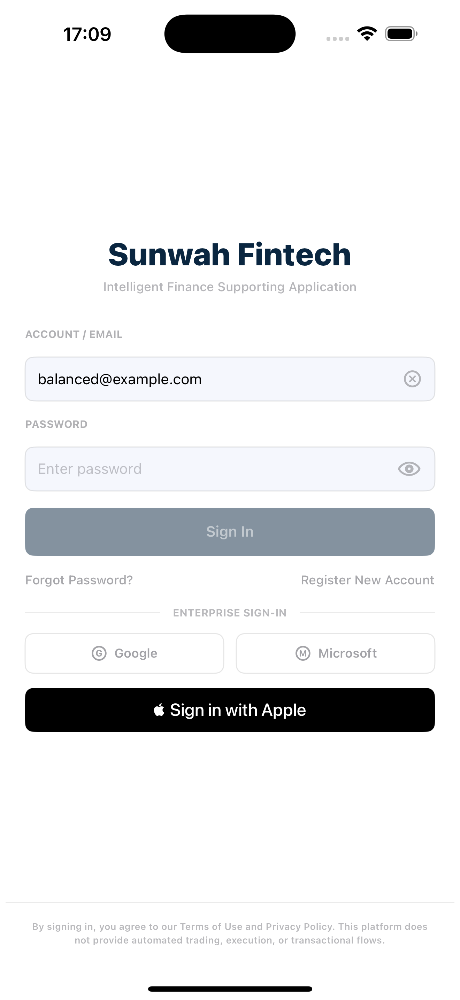
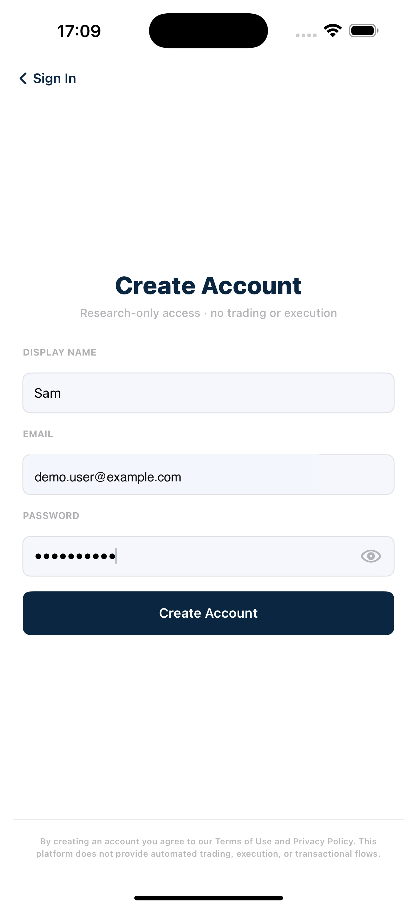
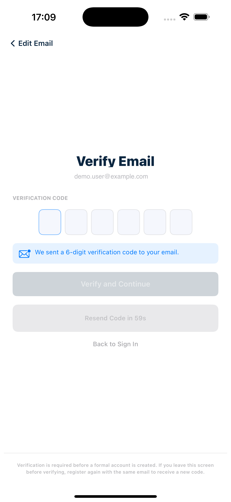
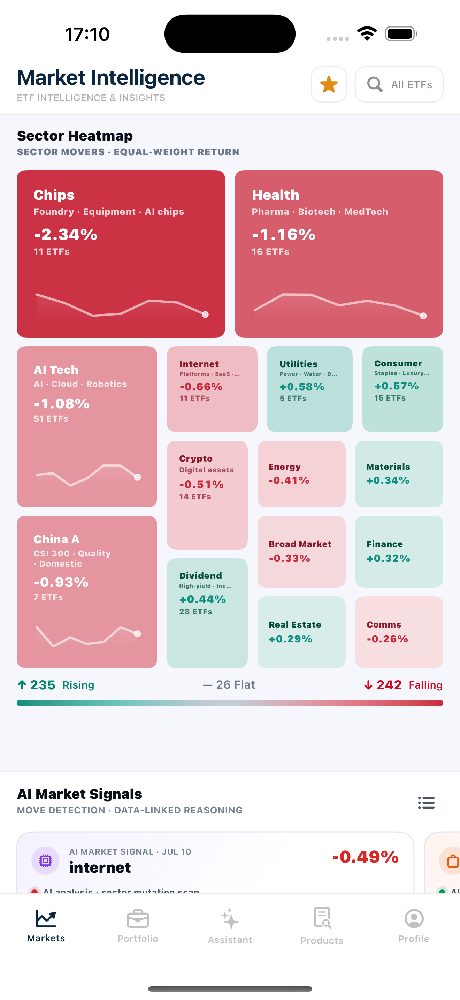

# Login / Register Module

## 模块说明

Login / Register 模块覆盖未登录用户的两个可用认证路径：注册新账号并完成 email verification，以及使用已有 account/email 与 password 登录。当前源材料将两条路径录在同一支视频中，因此本模块保留为一个 User Story。

> 范围说明：`Google`、`Microsoft` 和 `Sign in with Apple` 虽然显示在 `Login` 页面，但不属于本次验收范围。当前验收路径仅包括 `Register New Account` 和标准 email/password `Sign In`。

## User Story 索引

| Story | User Story | 核心路径 |
| --- | --- | --- |
| [US-AUTH-01](#us-auth-01) | Authentication Flow | `Register New Account` + email/password `Sign In` |

## 统一术语

| UI 原文 | 文档含义 |
| --- | --- |
| `Login` | 未登录用户的认证起始页面 |
| `Sign In` | 使用已有 account/email 与 password 登录 |
| `Register New Account` | 从 `Login` 进入注册流程的入口 |
| `Create Account` | 输入 display name、email 和 password 的注册页面/提交操作 |
| `Verify Email` | 输入六位 email verification code 的页面 |
| `Verify and Continue` | 验证六位 code 并完成注册的操作 |
| `Markets` | 成功注册或登录后的默认 landing page |

---

## User Story 1 - 注册新账号并使用已有账号登录

**Story ID:** `US-AUTH-01`  
**用户故事：** 作为未登录用户，我希望注册新账号并验证 email，或使用已有 account/email 和 password 登录，从而进入应用的 `Markets` 页面。  

### Walkthrough

#### A. `Login` 页面与范围说明

1. 打开应用并停留在 `Login` 页面。
2. 展示 account/email 与 password 输入框。输入 password 后操作 eye icon，确认 password 可显示和隐藏。
3. 在任一必填字段为空时展示 `Sign In` 不可用；两个字段均填写后展示 `Sign In` 可用。
4. 简短展示 `Google`、`Microsoft`、`Sign in with Apple`，说明它们不属于当前验收路径。

**Screenshot** — AUTH-US1-01：`Login` 页面默认态，包含 account/email 与 password 输入框、`Sign In`、`Register New Account` 和三种其他登录入口。

#### B. 注册新账号并验证 email

5. 点击 `Register New Account`，进入 `Create Account`。
6. 依次输入 display name、email 和 password。先用少于 8 个字符的 password 展示按钮不可用，再补足为有效 password。

**Screenshot** — AUTH-US1-02：`Create Account` 有效表单完成态，包含 display name、已脱敏的 demo email、隐藏的 password，以及已启用的 `Create Account`。

7. 点击 `Create Account`。确认应用创建 pending registration、向 email 发送六位 verification code，并进入 `Verify Email`。
8. 在 code 未满六位时展示 `Verify and Continue` 不可用；输入完整六位 code 后按钮可用。

**Screenshot** — AUTH-US1-03：`Verify Email` 初始态，显示已脱敏的收件 email、空 code 输入框，以及 code 未满六位时不可用的 `Verify and Continue`。六位 code 完成态及提交操作由视频连续展示。

9. 点击 `Verify and Continue`。验证成功后，确认账号创建完成、用户自动登录，并进入 `Markets`。

**Screenshot** — AUTH-US1-04：新账号验证成功后进入 `Markets` landing page；底部导航保留在画面中，用于证明已离开认证流程。

#### C. 已有账号登录

10. 退出或重置到 `Login` 页面。
11. 输入已有 account/email 和 password；两个字段都有效后点击 `Sign In`。
12. 展示 signing-in state；认证成功后再次确认默认进入 `Markets`。

### Acceptance Criteria

| ID | Requirement | Reference | Ownership | Priority |
| --- | --- | --- | --- | --- |
| AUTH-US1-AC01 | 未认证用户打开应用后首先看到 `Login` 页面。 | US-AUTH-01 | Integration | Must |
| AUTH-US1-AC02 | `Login` 提供 account/email 与 password 两个必填字段，password 默认隐藏。 | US-AUTH-01 | Integration | Must |
| AUTH-US1-AC03 | eye icon 可以显示或隐藏 password，且不会清除已输入内容。 | US-AUTH-01 | Integration | Must |
| AUTH-US1-AC04 | 任一必填字段为空时 `Sign In` 不可用；两个字段填写后按钮可用。 | US-AUTH-01 | Integration | Must |
| AUTH-US1-AC05 | `Google`、`Microsoft` 和 `Sign in with Apple` 不属于本版本已验收的工作路径。 | US-AUTH-01 | Integration | Must |
| AUTH-US1-AC06 | 点击 `Register New Account` 打开 `Create Account`，并提供 display name、email 和 password 字段。 | US-AUTH-01 | Integration | Must |
| AUTH-US1-AC07 | 注册表单缺少任一必填字段或 password 少于 8 个字符时，`Create Account` 不可用。 | US-AUTH-01 | Integration | Must |
| AUTH-US1-AC08 | 有效注册表单提交后创建 pending registration、发送六位 verification code，并进入 `Verify Email`。 | US-AUTH-01 | Integration | Must |
| AUTH-US1-AC09 | verification code 少于六位时 `Verify and Continue` 不可用；六位输入完成后按钮可用。 | US-AUTH-01 | Integration | Must |
| AUTH-US1-AC10 | 正确 code 验证成功后完成账号创建并自动登录，只产生一个新账号。 | US-AUTH-01 | Integration | Must |
| AUTH-US1-AC11 | 新注册用户成功后进入默认 `Markets` landing page。 | US-AUTH-01 | Integration | Must |
| AUTH-US1-AC12 | 已有用户可以使用 account/email 与 password 提交 `Sign In`。 | US-AUTH-01 | Integration | Must |
| AUTH-US1-AC13 | 登录请求进行中显示 signing-in state，且不会重复提交同一次登录请求。 | US-AUTH-01 | Integration | Must |
| AUTH-US1-AC14 | 已有用户认证成功后进入默认 `Markets` landing page。 | US-AUTH-01 | Integration | Must |
| AUTH-US1-AC15 | 视频和截图不暴露真实 password、可复用 verification code 或非测试账号的个人资料。 | US-AUTH-01 | Integration | Must |
