# M2 功能验收演示文稿完整大纲

> 本文件是后续 PPT 的页级内容源。英文标题、Walkthrough 和 AC 文案以 `*.en.md` 为准；中文只用于说明排版与制作规则。当前规划为 35 页，覆盖 Login、Market、Portfolio、Admin 全部 11 个 User Stories。
>
> 本大纲已逐条映射全部 248 条 Acceptance Criteria。iOS 截图使用独立的 iPhone 17 Pro 带壳 PNG；Admin 使用宽屏真实页面截图。两组尚缺的 Admin → iOS 前后态已明确标记为待补截图，不用不相关画面代替。

## 内容与截图标准

- 每张 Story 页放 2–4 个独立截图对象；截图不合成为一张大图。两图页左右分布，三图页三列，四图页使用 2×2 窗形交错布局。
- Walkthrough 使用连续叙述，不拆成机械编号；AC Mapping 保持逐条 ID + 逐条原文，二者使用不同排版层级。
- 每一步选择 walkthrough 经过页面中最有代表性的稳定状态：页面标题、关键控件、数据边界和与 AC 对应的结果尽量同时可见。
- loading、请求防重、拖拽、缩放、scrub、Toast 和跨端刷新等瞬时行为由视频连续证明；静态截图只承担可稳定观察的状态证据。
- iOS 截图不得暴露真实 password、可复用 verification code 或个人资料；Admin 的 email / owner 使用测试数据或打码。

## 目录索引

| 页码 | 模块 | 层级 | 页面标题 | 版式 |
| ---: | --- | --- | --- | --- |
| 01 | Front matter | — | SUNWAH Fintech Phase 2 | Cover |
| 02 | Front matter | — | M2 Acceptance Walkthrough Structure | Global index |
| 03 | Front matter | — | One Structure, Three Complementary Deliverables | Delivery model |
| 04 | Login | Module overview | 01 Login / Register | Module overview |
| 05 | Login | User Story 1 | User Story 1 — Start from Login and prepare registration | Story — 2 windows |
| 06 | Login | User Story 1 | User Story 1 — Verify the email and enter Markets | Story — 2 windows |
| 07 | Market | Module overview | 02 Market | Module overview |
| 08 | Market | User Story 1 | User Story 1 — Establish research direction from Market Intelligence | Story — 3 columns |
| 09 | Market | User Story 2 | User Story 2 — Understand sector trends and filter ETFs | Story — 3 columns |
| 10 | Market | User Story 3 | User Story 3 — Research and compare individual ETFs | Story — 3 columns |
| 11 | Market | User Story 4 | User Story 4 — Save ETF research results | Story — 3 columns |
| 12 | Portfolio | Module overview | 03 Portfolio | Module overview |
| 13 | Portfolio | User Story 1 | User Story 1 — Discover a Model Portfolio | Story — 3 columns |
| 14 | Portfolio | User Story 1 | User Story 1 — Evaluate the forecast and save for later | Story — 2 windows |
| 15 | Portfolio | User Story 1 | User Story 1 — Edit the configuration before saving | Story — 2 windows |
| 16 | Portfolio | User Story 1 | User Story 1 — Persist or analyze the edited Model Portfolio | Story — 3 columns |
| 17 | Portfolio | User Story 2 | User Story 2 — Create a My Portfolio | Story — 2 windows |
| 18 | Portfolio | User Story 2 | User Story 2 — Inspect and edit saved holdings | Story — 2 windows |
| 19 | Portfolio | User Story 2 | User Story 2 — Maintain baseline history and remove a portfolio | Story — 2 windows |
| 20 | Portfolio | User Story 3 | User Story 3 — Complete the recommendation questionnaire | Story — 3 columns |
| 21 | Portfolio | User Story 3 | User Story 3 — Review how the recommendation was built | Story — 4 windows |
| 22 | Portfolio | User Story 3 | User Story 3 — Save the recommendation | Story — 2 windows |
| 23 | Portfolio | User Story 4 | User Story 4 — Run portfolio analysis | Story — 3 columns |
| 24 | Portfolio | User Story 4 | User Story 4 — Select findings and generate recommendations | Story — 2 windows |
| 25 | Portfolio | User Story 4 | User Story 4 — Review, edit and apply Suggested actions | Story — 2 windows |
| 26 | Portfolio | User Story 5 | User Story 5 — Select a baseline and inspect drift | Story — 2 windows |
| 27 | Portfolio | User Story 5 | User Story 5 — Explain the baseline deviation | Story — 3 columns |
| 28 | Portfolio | User Story 5 | User Story 5 — Adjust and apply the baseline scenario | Story — 2 windows |
| 29 | Admin | Module overview | 04 Admin | Module overview |
| 30 | Admin | User Story 1 | User Story 1 — Monitor the platform and inspect the ETF catalogue | Story — 2 desktop windows |
| 31 | Admin | User Story 1 | User Story 1 — Add or deactivate an ETF and verify it on iOS | Story — 2 windows + capture requirement |
| 32 | Admin | User Story 1 | User Story 1 — Maintain and verify Model Portfolios | Story — 2 desktop windows + capture requirement |
| 33 | Admin | User Story 1 | User Story 1 — Review protected operations data | Story — 2 desktop windows |
| 34 | Back matter | — | Acceptance Traceability Across Modules | Traceability overview |
| 35 | Back matter | — | Acceptance Review and Q&A | Closing |

## 逐页文字与截图规划

### Slide 01 — SUNWAH Fintech Phase 2

- **Module / Story:** Front matter / —
- **Subtitle:** M2 Functional Acceptance Walkthrough
- **Layout:** Template cover. No product screenshot required.
- **On-slide copy:**
  - Documentation, presentation and walkthrough video use one shared evidence chain.
  - Scope: Login, Market, Portfolio and Admin.
  - Environment: live cloud configuration; screenshots use test or redacted data.

### Slide 02 — M2 Acceptance Walkthrough Structure

- **Module / Story:** Front matter / —
- **Subtitle:** Four modules · eleven User Stories · one traceable acceptance path
- **Layout:** Four-module directory with one representative image per module.

#### Evidence 01 — Login

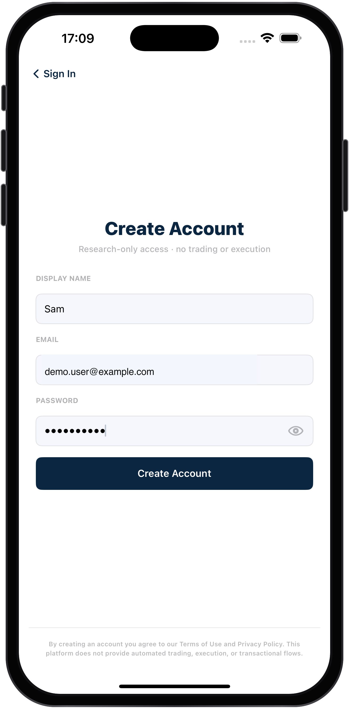

**Walkthrough copy:** One User Story: register, verify email, or sign in with an existing account.

#### Evidence 02 — Market

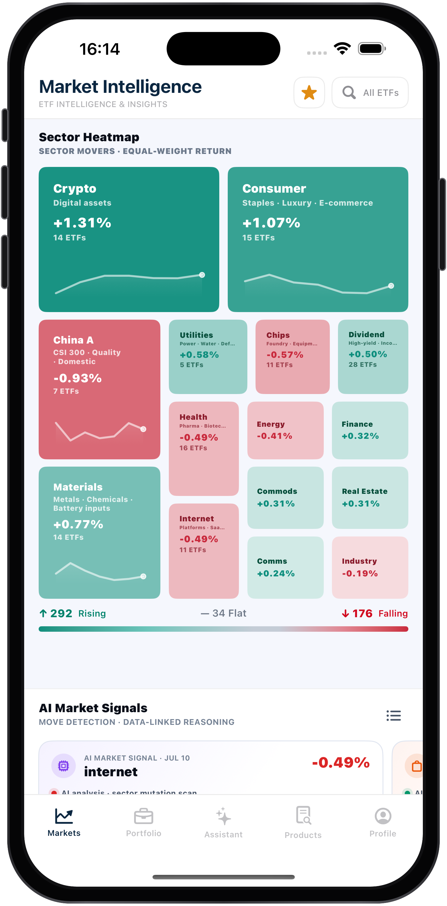

**Walkthrough copy:** Four User Stories: discover market direction, research sectors and ETFs, compare, then save.

#### Evidence 03 — Portfolio

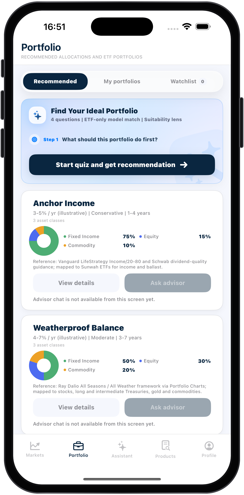

**Walkthrough copy:** Five User Stories: Model Portfolio, My Portfolio, recommendation, analysis and baseline review.

#### Evidence 04 — Admin

**Walkthrough copy:** One cross-platform User Story: maintain back-end resources and verify the result on iOS.

### Slide 03 — One Structure, Three Complementary Deliverables

- **Module / Story:** Front matter / —
- **Subtitle:** Module → User Story → Walkthrough → Screenshot / Video Evidence → Acceptance Criteria
- **Layout:** Three equal cards with a shared evidence-chain footer.
- **On-slide copy:**
  - Documentation defines scope, ordered walkthrough steps and the authoritative AC list.
  - Presentation guides the acceptance meeting with representative screenshots and AC mapping.
  - Video follows the same User Story walkthrough continuously and proves dynamic states that a still image cannot.
  - The three deliverables are complementary, not separate narratives.

### Slide 04 — 01 Login / Register

- **Module / Story:** Login / Module overview
- **Subtitle:** Two accepted authentication paths converge on the same Markets landing
- **Layout:** Representative iPhone screenshot on the left; Mermaid source on the right.
- **Module copy:** One User Story, four representative states and 15 Must Acceptance Criteria. Google, Microsoft and Sign in with Apple remain visible but are outside the accepted working path.

#### Representative screenshot

#### Mermaid source

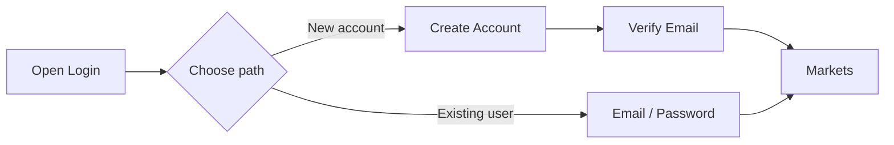
```mermaid
flowchart LR
  A[Open Login] --> B{Choose path}
  B -->|New account| C[Create Account]
  C --> D[Verify Email]
  B -->|Existing user| E[Email / Password]
  D --> F[Markets]
  E --> F
```

### Slide 05 — User Story 1 — Start from Login and prepare registration

- **Module / Story:** Login / User Story 1
- **Subtitle:** The first page proves authentication scope, form gates and the hand-off into registration.
- **Layout:** Two-window layout: screenshots at left and right, walkthrough/AC cards in the centre band.

#### Evidence 01 — 01 · Login and existing-account path

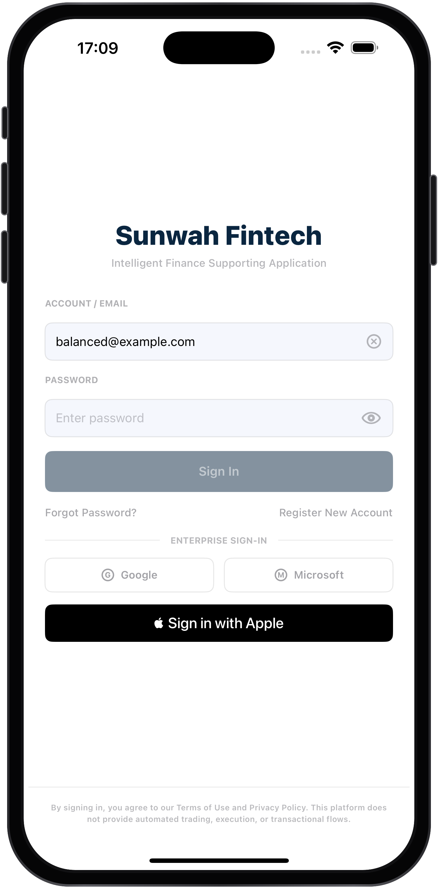

**Walkthrough copy:** Open the app on Login. Show account/email and password fields, toggle password visibility, demonstrate the required-field gate, explain the excluded SSO entries, then submit an existing account and show the in-progress state.

**AC Mapping:**

- `AUTH-US1-AC01` — Unauthenticated users first see the `Login` page after opening the application.
- `AUTH-US1-AC02` — `Login` provides two required fields: account/email and password. Password is hidden by default.
- `AUTH-US1-AC03` — The eye icon can show or hide the password without clearing the entered value.
- `AUTH-US1-AC04` — `Sign In` is not available when any required field is empty; the button is available after both fields are filled in.
- `AUTH-US1-AC05` — `Google`, `Microsoft` and `Sign in with Apple` are not among the accepted working paths for this version.
- `AUTH-US1-AC12` — Existing users can use account/email and password to submit `Sign In`.
- `AUTH-US1-AC13` — The signing-in state is displayed when the login request is in progress, and the same login request will not be submitted repeatedly.
- `AUTH-US1-AC15` — Videos and screenshots do not reveal real passwords, reusable verification codes, or personal information of non-test accounts.

#### Evidence 02 — 02 · Create Account

**Walkthrough copy:** Tap Register New Account. Enter display name, redacted test email and password; show the disabled state below eight characters, then submit a valid form.

**AC Mapping:**

- `AUTH-US1-AC06` — Click `Register New Account` to open `Create Account` and provide the display name, email and password fields.
- `AUTH-US1-AC07` — `Create Account` is not available when the registration form is missing any required field or the password is less than 8 characters.
- `AUTH-US1-AC08` — Submitting a valid registration form creates one pending registration, sends a six-digit verification code, and opens `Verify Email`.

### Slide 06 — User Story 1 — Verify the email and enter Markets

- **Module / Story:** Login / User Story 1
- **Subtitle:** The second page proves email verification and the shared successful landing.
- **Layout:** Two-window layout: screenshots at left and right, walkthrough/AC cards in the centre band.

#### Evidence 01 — 03 · Verify Email

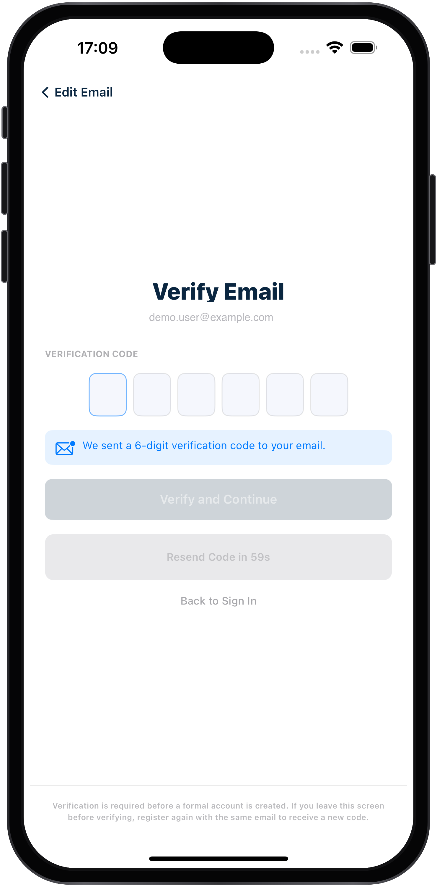

**Walkthrough copy:** Confirm Verify Email opens after registration. Show the disabled state below six digits, enter a complete code, then tap Verify and Continue.

**AC Mapping:**

- `AUTH-US1-AC09` — `Verify and Continue` is not available when the verification code is less than six digits; the button is available after six digits are entered.
- `AUTH-US1-AC10` — A correct code completes account creation and signs the user in automatically; only one new account is created.

#### Evidence 02 — 04 · Markets landing

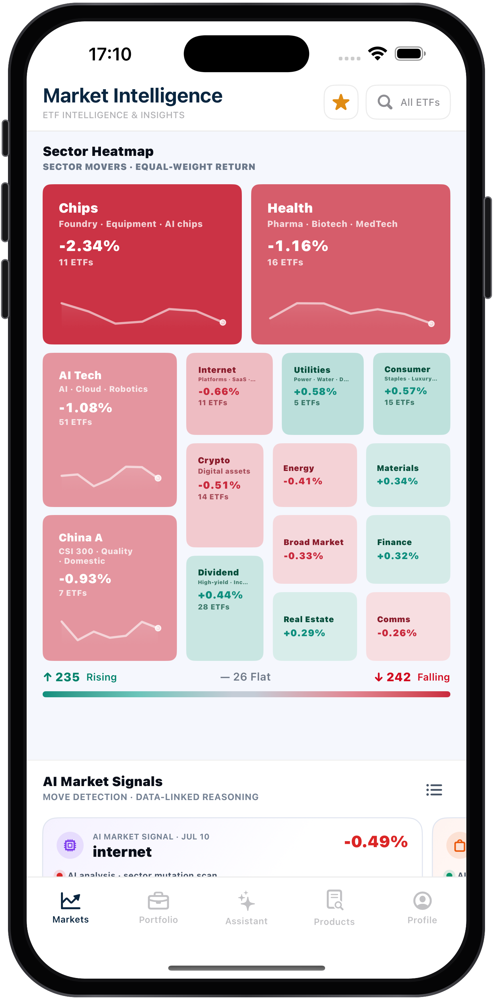

**Walkthrough copy:** Confirm successful registration opens Markets. Repeat the accepted existing-account path and verify that both paths reach the same default landing.

**AC Mapping:**

- `AUTH-US1-AC11` — Newly registered users will enter the default `Markets` landing page.
- `AUTH-US1-AC14` — Enter the default `Markets` landing page after successful user authentication.

### Slide 07 — 02 Market

- **Module / Story:** Market / Module overview
- **Subtitle:** A complete research flow from market direction to ETF comparison and saving
- **Layout:** Representative iPhone screenshot on the left; Mermaid source on the right.
- **Module copy:** Four User Stories cover Market Intelligence, Sector Detail, ETF Detail / Compare ETF, Watchlist, Add to My Portfolio and the unified Screener. Delayed, cached and EOD labels must remain visible.

#### Representative screenshot

#### Mermaid source

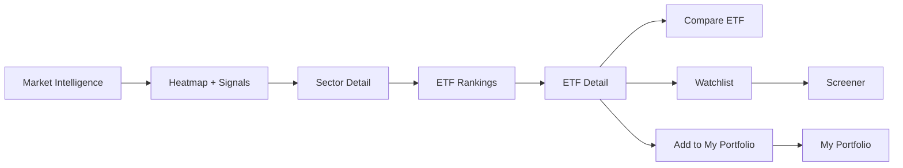
```mermaid
flowchart LR
  A[Market Intelligence] --> B[Heatmap + Signals]
  B --> C[Sector Detail]
  C --> D[ETF Rankings]
  D --> E[ETF Detail]
  E --> F[Compare ETF]
  E --> G[Watchlist]
  E --> H[Add to My Portfolio]
  G --> I[Screener]
  H --> J[My Portfolio]
```

### Slide 08 — User Story 1 — Establish research direction from Market Intelligence

- **Module / Story:** Market / User Story 1
- **Subtitle:** Daily breadth, signals and discovery rails produce the next sector research target.
- **Layout:** Three equal columns; one independent iPhone image and one text card per column.

#### Evidence 01 — 01 · Sector Heatmap

**Walkthrough copy:** Open Market Intelligence, explain its research-only role, then scan sector blocks and the Rising / Flat / Falling breadth summary.

**AC Mapping:**

- `MKT-US1-AC01` — `Market Intelligence` loads successfully and organizes research entries into `Sector Heatmap`, `AI Market Signals`, `Market Indices`, `Market Discovery Rail` and `Recommended ETFs`.
- `MKT-US1-AC02` — Each visible color block in `Sector Heatmap` displays the sector/theme name, movement, ETF count and trend line, with colors distinguishing rising, near-flat and falling values.
- `MKT-US1-AC03` — `Rising`, `Flat`, `Falling` summary corresponds to the current heat map data.
- `MKT-US1-AC10` — The page does not represent market signals, sector performance, or select ETFs as trading recommendations.

#### Evidence 02 — 02 · AI signals and indices

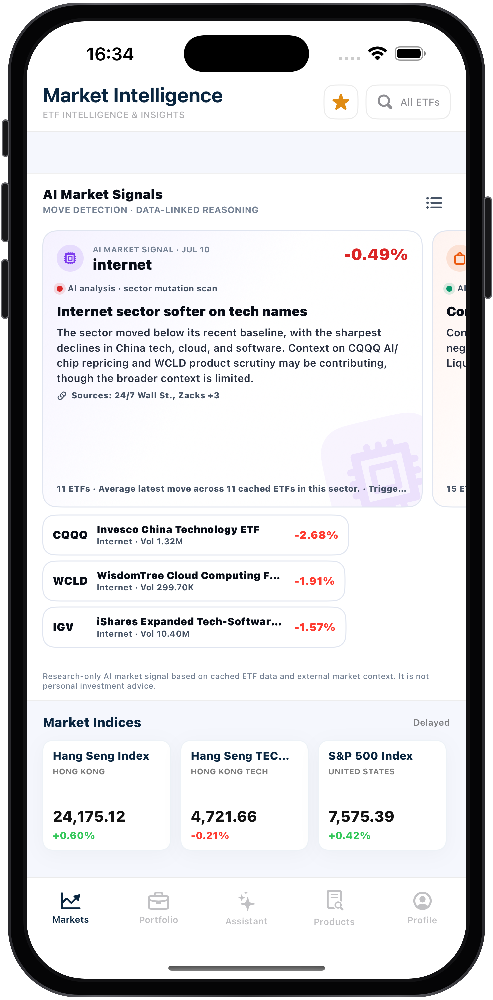

**Walkthrough copy:** Open an AI Market Signal with date, movement, analysis, related ETFs and sources; keep the delayed-data label visible on major indices.

**AC Mapping:**

- `MKT-US1-AC04` — `AI Market Signals` card shows signal date, detected changes, AI analysis summary and contributing/related ETFs; displays source reference when there is an external source.
- `MKT-US1-AC05` — `Market Indices` displays major indices and currently available change data, and clearly displays delayed data boundaries.

#### Evidence 03 — 03 · Discovery to Sector Detail

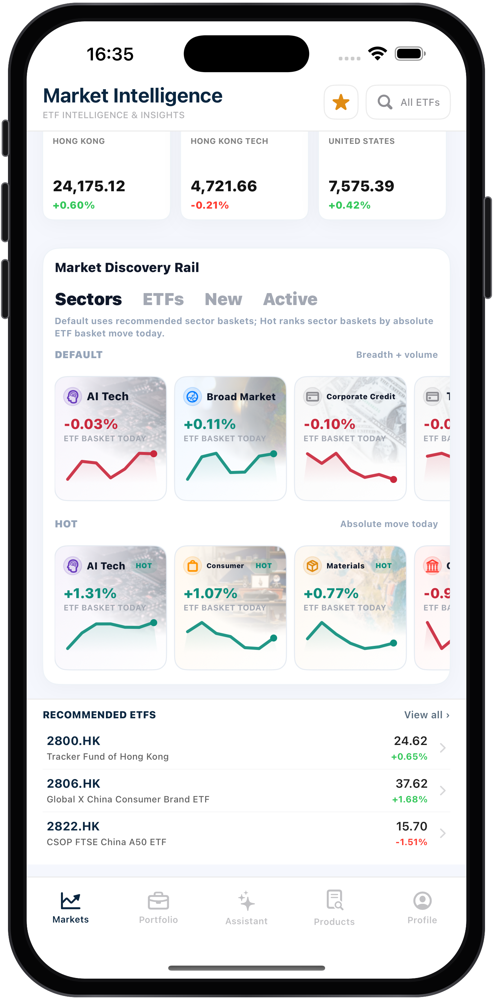

**Walkthrough copy:** Switch Default / Hot sectors, inspect Recommended ETFs and View all, then open a sector to continue into Sector Detail.

**AC Mapping:**

- `MKT-US1-AC06` — `Market Discovery Rail` supports continuing research from sectors, ETF movers, new ETFs or active ETFs.
- `MKT-US1-AC07` — The `Default` and `Hot` scopes in `Sectors` can be switched, and the displayed content is consistent with the current selection.
- `MKT-US1-AC08` — `Recommended ETFs` is a curated pool rather than the full ETF universe; each row displays symbol, name, price and daily move, and provides `View all`.
- `MKT-US1-AC09` — After clicking on a sector, the `Sector Detail` matching the selected sector will be opened.

### Slide 09 — User Story 2 — Understand sector trends and filter ETFs

- **Module / Story:** Market / User Story 2
- **Subtitle:** Sector context, EOD observations and sortable rankings produce an ETF candidate.
- **Layout:** Three equal columns; one independent iPhone image and one text card per column.

#### Evidence 01 — 01 · Sector banner

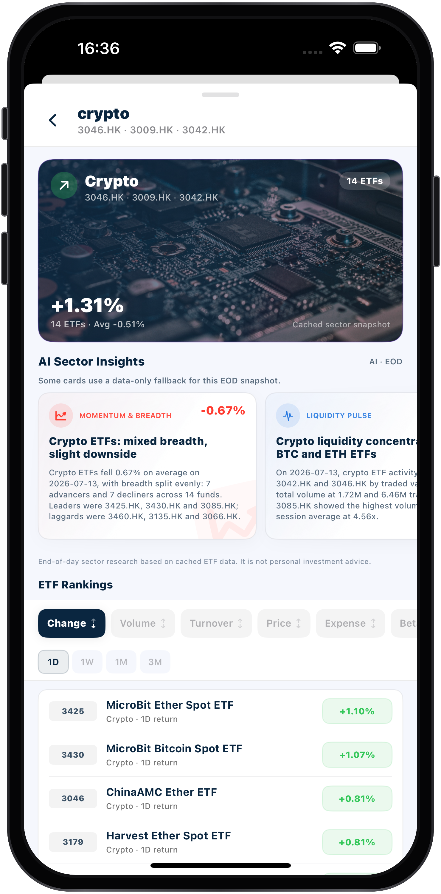

**Walkthrough copy:** Open a selected sector such as Crypto and confirm the banner identity, representative tickers, ETF count, movement and cached snapshot label.

**AC Mapping:**

- `MKT-US2-AC01` — `Sector Detail` displays the name and data for the sector selected by the user and does not retain content from the previously opened sector.
- `MKT-US2-AC02` — The sector banner displays representative tickers, ETF count and the latest sector movement.
- `MKT-US2-AC03` — The page clearly marks the sector snapshot / EOD cached data boundary and does not describe it as real-time data.

#### Evidence 02 — 02 · AI Sector Insights

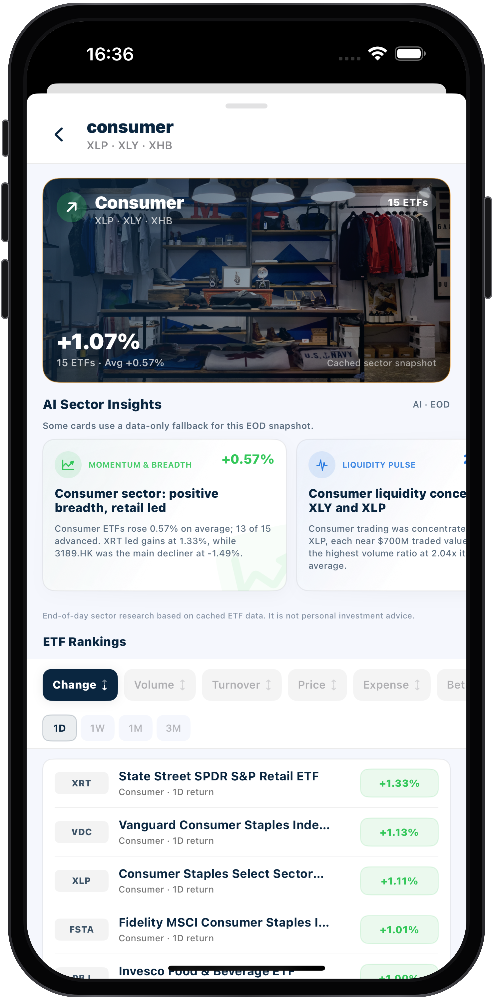

**Walkthrough copy:** Read Momentum & Breadth, Liquidity Pulse and Trend & Risk in order; explain the EOD basis and non-predictive research wording.

**AC Mapping:**

- `MKT-US2-AC04` — `AI Sector Insights` covers at least three research angles: `Momentum & Breadth`, `Liquidity Pulse`, and `Trend & Risk`.
- `MKT-US2-AC05` — When data is insufficient, the corresponding insight displays an unavailable state or data boundary and does not fabricate a conclusion.
- `MKT-US2-AC11` — `AI Sector Insights` uses the wording of research observations and does not predict returns or recommend transactions.

#### Evidence 03 — 03 · ETF Rankings

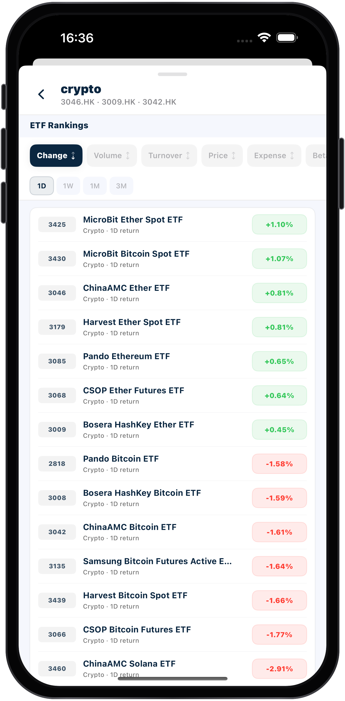

**Walkthrough copy:** Keep the selected sector, switch sorting metrics and return periods, then open one ETF from the sector-only ranking.

**AC Mapping:**

- `MKT-US2-AC06` — `ETF Rankings` only displays ETFs within the currently selected sector.
- `MKT-US2-AC07` — Sorting supports metrics provided by the current implementation, including `Change`, `Volume`, `Turnover`, `Price`, `Expense Ratio`, `Beta`, `Drawdown`, `Sharpe ratio`, `Name` or `Symbol`.
- `MKT-US2-AC08` — return period supports switching between `1D`, `1W`, `1M`, and `3M` provided by the current implementation, and the list result is consistent with the current period.
- `MKT-US2-AC09` — When switching sorting indicators or periods, the current sector range remains unchanged.
- `MKT-US2-AC10` — After clicking on the ETF in the ranking, open the `ETF Detail` matching the symbol of the row.

### Slide 10 — User Story 3 — Research and compare individual ETFs

- **Module / Story:** Market / User Story 3
- **Subtitle:** ETF identity, chart controls and normalized comparison support instrument-level research.
- **Layout:** Three equal columns; one independent iPhone image and one text card per column.

#### Evidence 01 — 01 · ETF Detail and chart

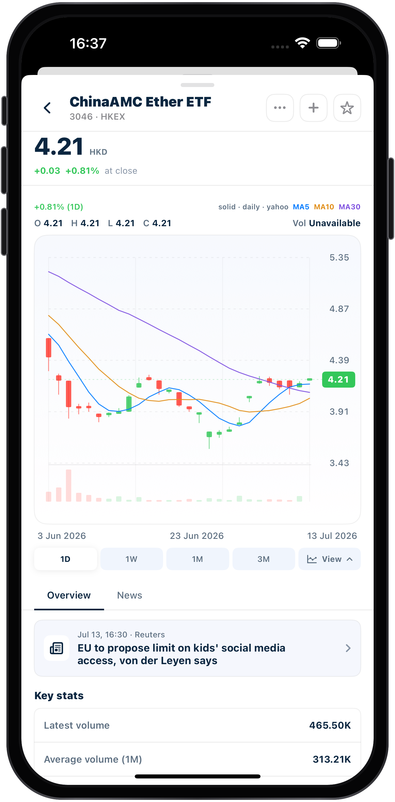

**Walkthrough copy:** Open a candidate ETF, confirm identity and quote context, switch at least two time ranges, then scrub the chart to update OHLC and volume.

**AC Mapping:**

- `MKT-US3-AC01` — `ETF Detail` displays the fund name, symbol, exchange, latest price, currency, daily change and market status consistent with the selected ETF.
- `MKT-US3-AC02` — K-line chart uses the current ETF's price series and does not display residual data from previous ETFs.
- `MKT-US3-AC03` — Users can switch between the `1D`, `1W`, `1M`, and `3M` time ranges provided by the current implementation, and the chart will be updated with the selection.
- `MKT-US3-AC04` — When scrubbing a chart, open, high, low, close and volume are updated synchronously with the currently selected data point.

#### Evidence 02 — 02 · View, Overview and News

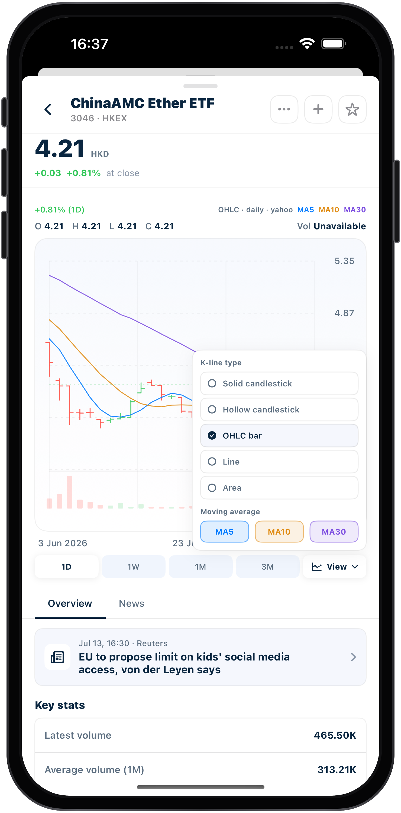

**Walkthrough copy:** Change chart type and one moving average, then check available key stats and ETF-related news metadata.

**AC Mapping:**

- `MKT-US3-AC05` — The `View` panel supports the currently enabled chart types in `solid candlestick`, `hollow candlestick`, `OHLC bar`, `line` and `area`.
- `MKT-US3-AC06` — The `MA5`, `MA10`, `MA30` switches only change the current chart overlay, not the ETF or time range.
- `MKT-US3-AC07` — `Overview` displays the currently available key stats; unavailable values are shown with an explicit unavailable status.
- `MKT-US3-AC08` — `News` displays headlines, sources, and timestamps related to current ETF research streams.

#### Evidence 03 — 03 · Compare ETF

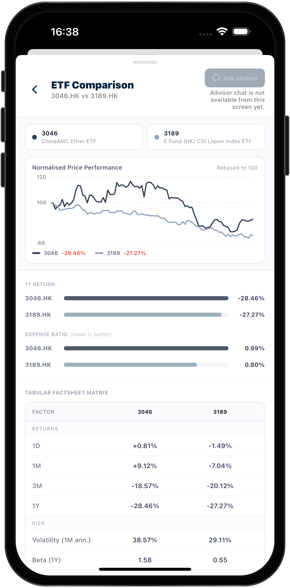

**Walkthrough copy:** Open Compare ETF from More, retain the current ETF as the first object, select a second ETF and inspect the normalized overlay before returning.

**AC Mapping:**

- `MKT-US3-AC09` — `Compare ETF` in `More` uses the current ETF as the first comparison object and allows selection of a second ETF.
- `MKT-US3-AC10` — The comparison chart uses the same chart option to load two sets of price series, and displays the relative performance with normalized overlay.
- `MKT-US3-AC11` — Exit `Compare ETF` and still return to the details context of the original ETF.

### Slide 11 — User Story 4 — Save ETF research results

- **Module / Story:** Market / User Story 4
- **Subtitle:** Watchlist, My Portfolio and Screener preserve research without implying execution.
- **Layout:** Three equal columns; one independent iPhone image and one text card per column.

#### Evidence 01 — 01 · Watchlist

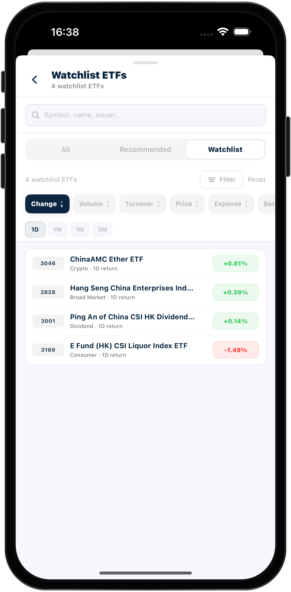

**Walkthrough copy:** Star the ETF, verify it appears in Screener > Watchlist, then remove it and confirm the saved range updates.

**AC Mapping:**

- `MKT-US4-AC01` — After clicking the star icon of `ETF Detail`, the success status is consistent with the actual saved status in `Watchlist`.
- `MKT-US4-AC02` — Saved ETFs appear in `Screener > Watchlist`; disappear from the list when removed.
- `MKT-US4-AC03` — `Watchlist` is used to save research objects and does not create portfolio holdings or trading orders.

#### Evidence 02 — 02 · Add to existing portfolio

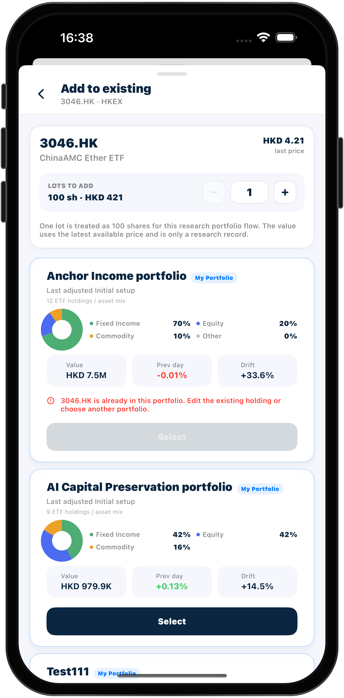

**Walkthrough copy:** Inspect price, lots and value, reject a duplicate portfolio, save to an eligible portfolio, then reopen it to confirm the holding.

**AC Mapping:**

- `MKT-US4-AC04` — The plus button opens the `Add to existing portfolio` sheet for the current ETF.
- `MKT-US4-AC05` — The sheet displays the selected ETF, latest price, lots and estimated market value, calculated as 1 lot = 100 shares.
- `MKT-US4-AC06` — `My Portfolio` that already contains this ETF displays duplicate holding information and cannot be selected again.
- `MKT-US4-AC07` — User can select another eligible `My Portfolio` and save it.
- `MKT-US4-AC08` — After saving, reopen the target `My Portfolio` to see the corresponding ETF holding; it will not be written until it is selected and confirmed.
- `MKT-US4-AC13` — `Add to My Portfolio` only saves research holding records, and the page does not claim that orders have been placed or transactions have been executed.

#### Evidence 03 — 03 · Unified Screener

**Walkthrough copy:** Move through Recommended, All and Watchlist, then use search, filter and sort while preserving the selected data scope.

**AC Mapping:**

- `MKT-US4-AC09` — `Recommended`, `All`, `Watchlist` share the same `Screener` interaction, but are limited to the featured pool, the full available range and the user's saved range respectively.
- `MKT-US4-AC10` — search supports symbol, name or issuer; filter supports issuer, asset class, sector, currency or region provided by the current implementation.
- `MKT-US4-AC11` — sort supports change, volume, turnover, price, expense ratio, beta, drawdown, Sharpe ratio, name or symbol provided by the current implementation.
- `MKT-US4-AC12` — search, filter and sort do not accidentally switch the current `Recommended`, `All` or `Watchlist` data range.

### Slide 12 — 03 Portfolio

- **Module / Story:** Portfolio / Module overview
- **Subtitle:** Five research workflows from templates and saved holdings to analysis and baseline review
- **Layout:** Representative iPhone screenshot on the left; Mermaid source on the right.
- **Module copy:** Five User Stories and 171 Must Acceptance Criteria cover Model Portfolio discovery, My Portfolio maintenance, AI recommendation, draft analysis and Baseline Snapshot review. No workflow executes a brokerage order.

#### Representative screenshot

#### Mermaid source

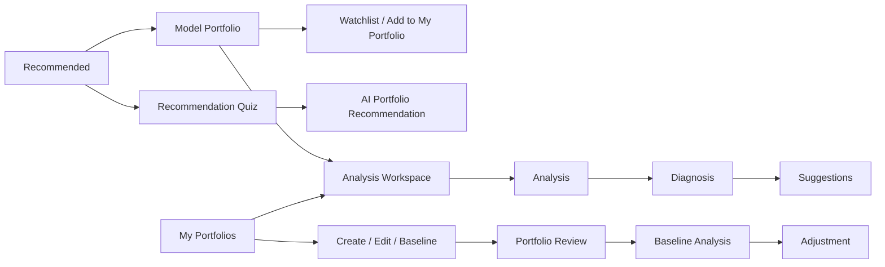
```mermaid
flowchart LR
  A[Recommended] --> B[Model Portfolio]
  B --> C[Watchlist / Add to My Portfolio]
  A --> D[Recommendation Quiz]
  D --> E[AI Portfolio Recommendation]
  F[My Portfolios] --> G[Create / Edit / Baseline]
  B --> H[Analysis Workspace]
  F --> H
  H --> I[Analysis] --> J[Diagnosis] --> K[Suggestions]
  G --> L[Portfolio Review] --> M[Baseline Analysis] --> N[Adjustment]
```

### Slide 13 — User Story 1 — Discover a Model Portfolio

- **Module / Story:** Portfolio / User Story 1
- **Subtitle:** Catalogue identity, portfolio facts and ETF allocation establish the selected template.
- **Layout:** Three equal columns.

#### Evidence 01 — 01 · Recommended catalogue

**Walkthrough copy:** Open Portfolio > Recommended, inspect loaded Model Portfolio cards and their Reference descriptions, then open one selected item.

**AC Mapping:**

- `US1-AC01` — The Portfolio title and three tabs - Recommended, My portfolios, Watchlist - are visible, with Recommended selected.
- `US1-AC02` — Each loaded Model Portfolio card uses back-end data to display the title, return range, risk level label, duration, number of asset classes, and asset allocation visualization.
- `US1-AC03` — Each Model Portfolio card displays the Reference description corresponding to the Model Portfolio.
- `US1-AC04` — `View details` opens the selected Model Portfolio rather than another catalogue item.
- `US1-AC05` — Display the loading status when opening or refreshing the Model Portfolio directory for the first time; after completion, replace the placeholder with the currently returned Model Portfolio.

#### Evidence 02 — 02 · Model Portfolio detail

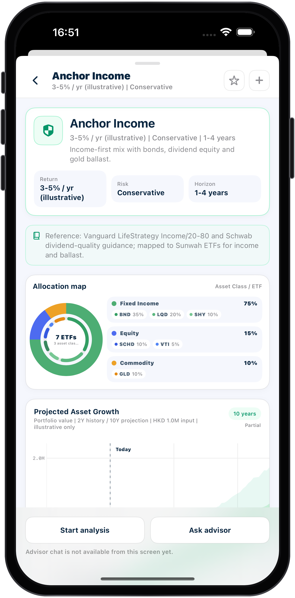

**Walkthrough copy:** Confirm title, return, risk, duration, summary, Reference and allocation groups match the selected catalogue card.

**AC Mapping:**

- `US1-AC06` — The details header displays the title, return, risk, term, and summary of the selected Model Portfolio.
- `US1-AC07` — The detail fact values are consistent with the catalog card and current Model Portfolio data, and do not inherit the contents of the previously opened Model Portfolio.
- `US1-AC08` — Reference descriptions are displayed in a dedicated source/reference style and are consistent with the description on the catalog card.
- `US1-AC09` — The configuration card shows the asset class groupings and their ETF codes; the number of ETFs and number of asset classes shown are consistent with the details returned.
- `US1-AC11` — Selecting an ETF row opens the matching ETF details; returning closes only the detail overlay without losing the Model Portfolio state.
- `US1-AC12` — After returning from ETF details, the current Model Portfolio details remain, and the configuration content and loaded status remain unchanged.

#### Evidence 03 — 03 · ETF allocation

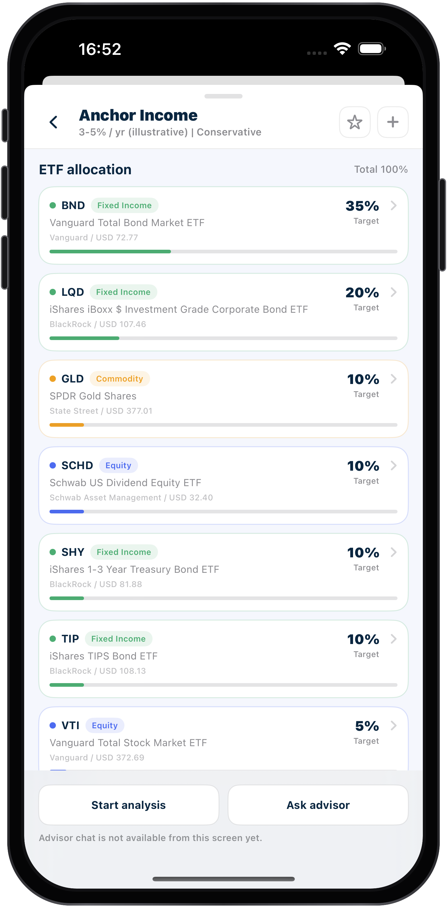

**Walkthrough copy:** Inspect every ETF row, target weight and available metadata; confirm Total 100% and open one matching ETF detail before returning.

**AC Mapping:**

- `US1-AC10` — The ETF configuration area shows Total 100%, with each row displaying the ticker, name, asset class label, target weight, and available issuer/last price/1-year return metadata.

### Slide 14 — User Story 1 — Evaluate the forecast and save for later

- **Module / Story:** Portfolio / User Story 1
- **Subtitle:** Projection evidence is paired with the persistent Watchlist result.
- **Layout:** Two-window left/right layout.

#### Evidence 01 — 04 · Projected Asset Growth

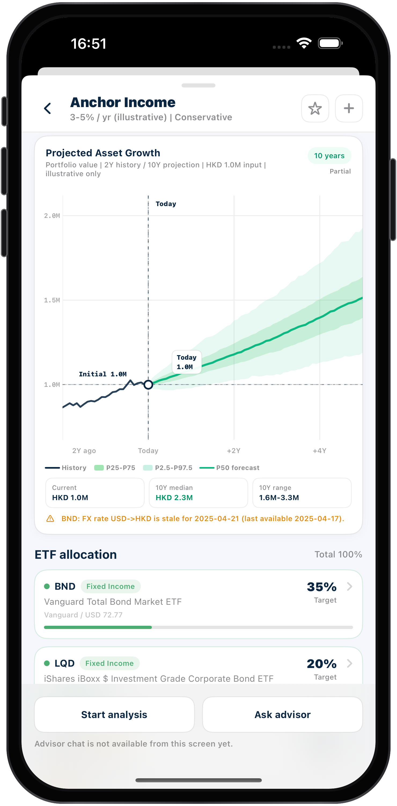

**Walkthrough copy:** Wait for Monte Carlo completion, inspect history and percentile bands, drag and pinch the timeline, select a historical point, generate/hide backtest and keep Partial data coverage visible.

**AC Mapping:**

- `US1-AC13` — The loading status clearly indicates that a Monte Carlo simulation is running; the graph must not be displayed with made-up points until data is available.
- `US1-AC14` — Charts differentiate between historical, P50 forecast, P25–P75 and P2.5–P97.5 intervals, Today, initial value, axis labels, and forecast labels.
- `US1-AC15` — The summary values below the chart are consistent with the chart's starting value, allocation period, P50 endpoint, and P2.5–P97.5 range.
- `US1-AC16` — Horizontal dragging changes the visible timeline while keeping the view within the available historical/forecast range.
- `US1-AC17` — Pinch changes the visible time window; zooming to the boundaries does not display data outside the available date range, and axis labels and plotted values do not extend beyond the chart area.
- `US1-AC18` — Selecting a valid historical point displays a crosshair for its time and value. Backtesting is available only for historical data points, not future forecast points.
- `US1-AC19` — Generate backtest shows the loading status and then adds the backtest percentile range/median and actual series with updated legend.
- `US1-AC20` — Hide backtest removes the generated backtest, but does not remove the original history or forecast.
- `US1-AC21` — When the forecast status is Partial, the corresponding Data coverage is displayed and the current Model Portfolio's available data continues to be used; chart results from other Model Portfolios are not reused.
- `US1-AC22` — Forecasts are expressly described as indicative/research only and are not to be represented as guaranteed forecasts.

#### Evidence 02 — 05 · Watchlist result

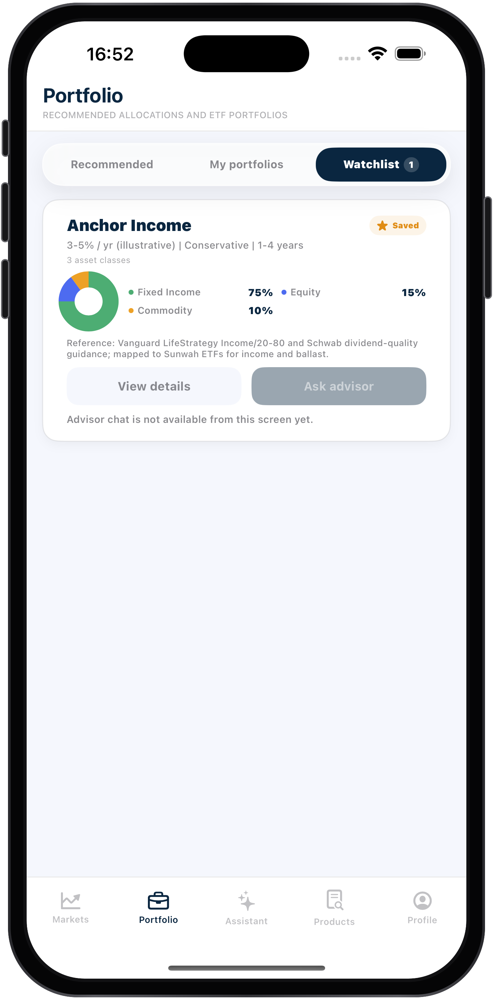

**Walkthrough copy:** Save the selected Model Portfolio, reopen it from Watchlist, remove it and verify the count and final star state remain consistent.

**AC Mapping:**

- `US1-AC23` — The details control changes from a hollow star to a solid star only after the save request is successful.
- `US1-AC24` — The Watchlist count is incremented and the Model Portfolio appears in the Watchlist with the same title, facts, configuration, and Reference.
- `US1-AC25` — A saved Model Portfolio can be opened from the Watchlist.
- `US1-AC26` — Removing a saved Model Portfolio causes it to disappear from the Watchlist and decrement the count; when there are no more saved Model Portfolios, an explicit No portfolios saved status is displayed.
- `US1-AC27` — After returning to Recommended and opening the same Model Portfolio again, its star status will be consistent with the final saved status in the Watchlist.

### Slide 15 — User Story 1 — Edit the configuration before saving

- **Module / Story:** Portfolio / User Story 1
- **Subtitle:** Visual and ETF-list editors preserve one evolving allocation state.
- **Layout:** Two-window left/right layout.

#### Evidence 01 — 06 · Visual editor

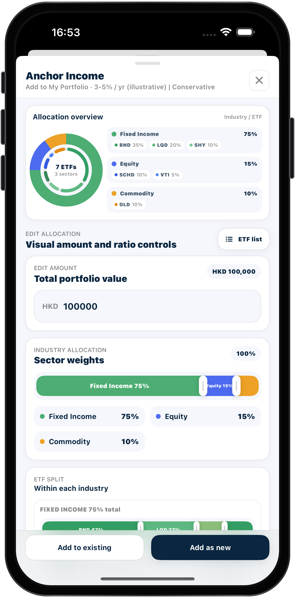

**Walkthrough copy:** Open Add to My Portfolio, change modeled total value and allocation boundaries, and keep all weights non-negative with a 100% total.

**AC Mapping:**

- `US1-AC28` — The Add to My Portfolio page opens for the selected Model Portfolio and displays the configuration overview, Model Portfolio title, risk/reward context, and default modeling amounts.
- `US1-AC29` — Modifying the total value will recalculate the ETF amount and quantity while maintaining the current normalized allocation weight.
- `US1-AC30` — Dragging the industry boundary only changes two adjacent groups; continuing to drag after reaching the draggable boundary will no longer reduce the grouping, and each grouping will not have negative weight, and the sum will remain 100%.
- `US1-AC31` — Dragging an ETF to split changes the ETFs within that group, keeping the group sum unchanged, and updating the within-group and overall allocation percentages.

#### Evidence 02 — 07 · ETF list editor

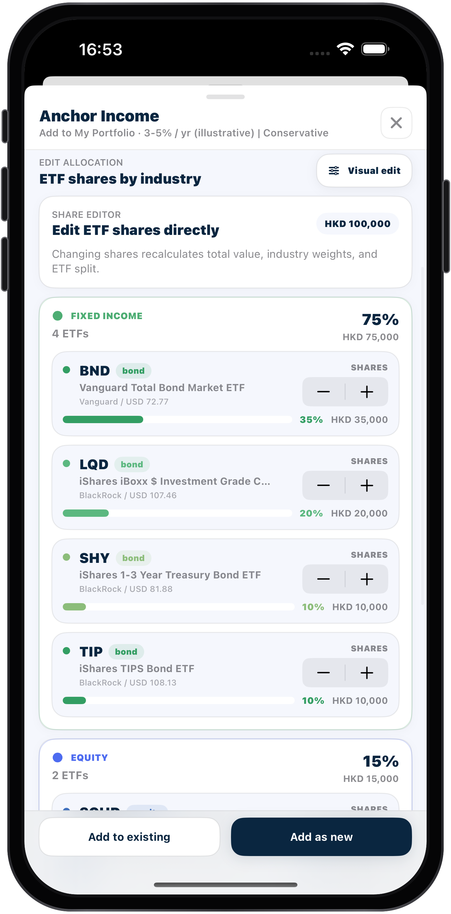

**Walkthrough copy:** Switch to ETF list, edit shares, return to Visual and enter confirmation without losing the latest values, weights or quantities.

**AC Mapping:**

- `US1-AC32` — When switching from Visual to List mode, the current amount and weight will be converted into ETF shares according to the latest price displayed on the interface; modifying the share will recalculate the total value, group weight, ETF weight and configuration visualization.
- `US1-AC33` — When switching back to Visual mode from List, the current share will be converted into the corresponding total amount and normalized weight; repeated switching will not lose the latest edits, and neither mode allows negative shares or negative weights.
- `US1-AC34` — When entering the confirmation step, the summary uses the amount, weight and share after the last Visual/List edit and does not revert to the initial configuration.
- `US1-AC35` — The confirmation step displays the target name, total amount added, ETF count, weight/amount/quantity added per ETF, and resulting quantity.

### Slide 16 — User Story 1 — Persist or analyze the edited Model Portfolio

- **Module / Story:** Portfolio / User Story 1
- **Subtitle:** The final step branches to Add as new, Add to existing, or a read-only analysis draft.
- **Layout:** Three equal columns; reused screens are explicitly marked as shared workflow states.

#### Evidence 01 — 08 · Add as new

**Walkthrough copy:** Choose Add as new, confirm the final edited summary, create one research-only My Portfolio, then reopen it to prove persisted holdings and values.

**AC Mapping:**

- `US1-AC36` — Confirm is disabled when the My Portfolio name is empty or a create request is in progress.
- `US1-AC37` — After successful creation, the new name appears in My portfolios; the number of positions is consistent with the confirmation summary, and the base currency is consistent with the selection when creating.
- `US1-AC38` — After reopening or refreshing, the position, quantity, configuration and value are still consistent with the confirmation results.
- `US1-AC39` — The UI states that a research-only My Portfolio was created and that no order, trade or execution occurred.
- `US1-AC40` — Confirm cannot be triggered repeatedly while the creation request is in progress; only one corresponding new My Portfolio will appear in the list after completion.

#### Evidence 02 — 09 · Add to existing

**Walkthrough copy:** Choose an existing target, wait for preview, confirm combined and new positions, then reopen the target to verify the merged result.

**AC Mapping:**

- `US1-AC41` — The target selector lists the current My Portfolio and displays each item's name, value, number of positions, and allocation summary.
- `US1-AC42` — Confirm is not available until the preview is loaded.
- `US1-AC43` — Preview showing existing value, ETF rows to be added, Model Portfolio weights, amounts, latest price, added quantity and resultant quantity.
- `US1-AC44` — Update the selected existing My Portfolio after confirmation; the new position results will be displayed after the list and details are refreshed.
- `US1-AC45` — After reopening the target, the existing codes in the preview show the combined quantity, and the new codes in the preview are shown as new positions.
- `US1-AC46` — When returning from the target selection or confirmation page, the current editing configuration remains unchanged; the final added result is consistent with the last confirmed preview.

#### Evidence 03 — 10 · Start analysis hand-off

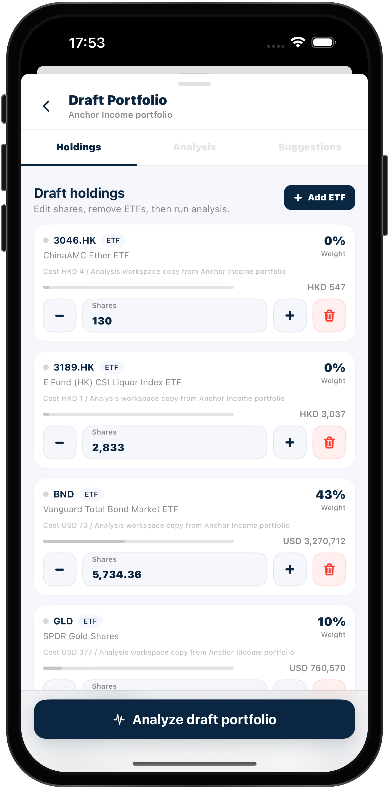

**Walkthrough copy:** Start analysis from the Model Portfolio. Confirm the Analysis Workspace receives the edited working copy and does not expose Apply to My Portfolio for this source.

**AC Mapping:**

- `US1-AC47` — Analysis Workspace opens in Holdings with the source title consistent with the selected Model Portfolio and preloaded with ticker, shares, value, and normalized weights configured by the Model Portfolio ETF.
- `US1-AC48` — Editing the Model Portfolio draft affects only the working copy and does not create or modify My Portfolio; because the source is not My Portfolio, recommendation results do not display the Apply to My Portfolio control.
- `US1-AC49` — `Analyze draft portfolio` uses the current edited draft of the Model Portfolio; the common behavior of analysis, diagnosis, and recommendations is consistent with User Story 4, and old results from other sources are not reused.

### Slide 17 — User Story 2 — Create a My Portfolio

- **Module / Story:** Portfolio / User Story 2
- **Subtitle:** The saved-portfolio list leads into a validated research-only creation draft.
- **Layout:** Two-window left/right layout.

#### Evidence 01 — 01 · My portfolios list

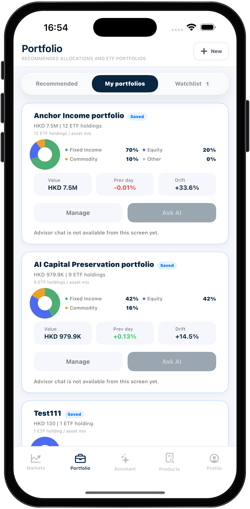

**Walkthrough copy:** Open My portfolios, wait for the saved list, enter New Portfolio, then reopen the created result and confirm its card and values.

**AC Mapping:**

- `US2-AC01` — Shows loading status when opening or refreshing for the first time; when completed the list reflects the currently saved My Portfolio.
- `US2-AC07` — After creation, My Portfolio appears in the list with its name, total value, holding count, asset allocation, prior-day return when available, and Baseline Snapshot deviation when available.
- `US2-AC08` — After opening a new My Portfolio from the list, its name, base currency, initial holding quantities and values match the creation draft.
- `US2-AC09` — The creation process clearly states that it is creating a research-based My Portfolio and will not place orders.

#### Evidence 02 — 02 · Initial holdings

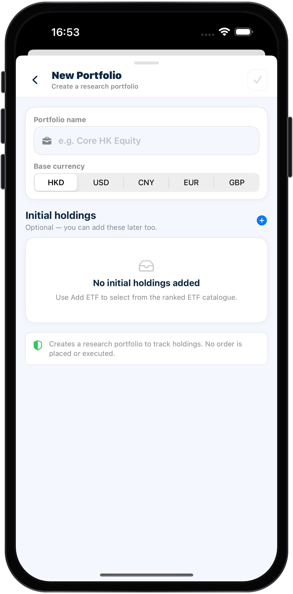

**Walkthrough copy:** Enter name and base currency, add searchable ETF holdings, edit quantities in the draft and create only when all validation gates pass.

**AC Mapping:**

- `US2-AC02` — The new My Portfolio form provides HKD, USD, CNY, EUR and GBP as base currencies.
- `US2-AC03` — The create check button in the upper-right corner is disabled when the name is empty, an initial holding has a non-positive quantity, or a creation request is in progress.
- `US2-AC04` — The ETF selector supports code/name/issuer search, sorting indicators, applicable periods/dimensions, direction and reset; valid ETFs are added with the default values provided by the interface, and temporary ETFs are displayed as Added and cannot be selected repeatedly.
- `US2-AC05` — No matching search shows no results status; clear the search to restore the ETF ranking list and number of results.
- `US2-AC06` — Initial holdings supports +, −, direct input and deletion; these operations only modify the creation draft, and the final effective quantity is reflected in the creation result.

### Slide 18 — User Story 2 — Inspect and edit saved holdings

- **Module / Story:** Portfolio / User Story 2
- **Subtitle:** Current detail context and the editable holdings screen prove persisted, isolated updates.
- **Layout:** Two-window layout; both blocks use the representative editing state at different narrative focus points.

#### Evidence 01 — 03 · Saved portfolio context

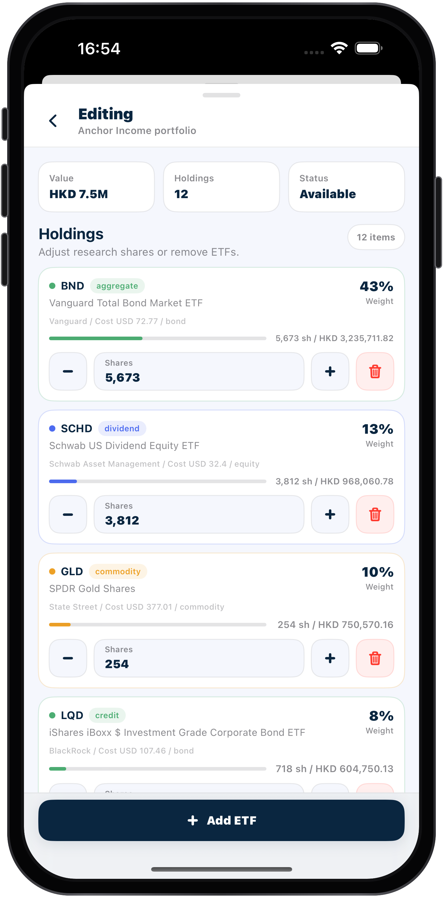

**Walkthrough copy:** Open the saved My Portfolio, confirm header, grouping, positions, current value, allocation and forecast boundaries, then save a Baseline Snapshot.

**AC Mapping:**

- `US2-AC10` — The header displays the name, number of positions, total value and type of the selected My Portfolio; when the valuation data is incomplete, the corresponding Partial or Unavailable status is displayed.
- `US2-AC11` — The configured grouping, ETF quantity and position weight are consistent with the currently saved positions.
- `US2-AC12` — Shared prediction behavior matches User Story 1 and uses the saved value of this My Portfolio instead of the previously opened Model Portfolio.
- `US2-AC13` — Position rows display ticker, name, weight, shares, market cap, cost, and available ETF metadata; selecting a row opens the matching ETF overlay.
- `US2-AC14` — Saving creates a Baseline Snapshot of the current holdings, quantities, values and weights.
- `US2-AC15` — A success Toast appears and UAT Before Edit is added to Baseline History with its timestamp, value and top-weight context.
- `US2-AC16` — Opening a saved Baseline Snapshot displays its holding count, total value, status, and saved ETF quantities and weights.

#### Evidence 02 — 04 · Holdings maintenance

**Walkthrough copy:** Edit quantities, add one valid ETF, reject duplicates, remove only the intended ticker and reopen the portfolio to prove persistence without changing untouched positions.

**AC Mapping:**

- `US2-AC17` — The Edit page identifies the selected My Portfolio and displays the current value, number of positions, status and editable position lines.
- `US2-AC18` — +, −, valid positive quantity input and checkmark Submit will update and persist the selected ETF quantity; attempts to generate non-positive quantities will not commit the value.
- `US2-AC19` — After successful submission, refreshing or reopening will still display the updated quantity, value, weight and configuration.
- `US2-AC20` — Add ETF Search by symbol, name or issuer, and adjust sorting indicators, applicable dimensions and direction; number of results and no-result status are both visible.
- `US2-AC21` — ETFs already held are marked Added, disabled, and cannot be added again via the selector.
- `US2-AC22` — After selecting a valid ETF, the selector is closed and the ETF is added to the Edit list with default values; it still exists after reopening the details.
- `US2-AC23` — Removing an ETF removes only the ticker and refreshes the list, values, weights, and allocations.
- `US2-AC24` — Quantity editing, addition and removal only affect the corresponding ETF; unoperated positions retain the original quantity and cost information.
- `US2-AC25` — Edit can be closed directly when there are no modifications to be submitted, and no additional changes will be made to the saved positions.

### Slide 19 — User Story 2 — Maintain baseline history and remove a portfolio

- **Module / Story:** Portfolio / User Story 2
- **Subtitle:** Historical snapshots remain independently searchable, renameable and removable.
- **Layout:** Two-window left/right layout.

#### Evidence 01 — 05 · Baseline snapshots

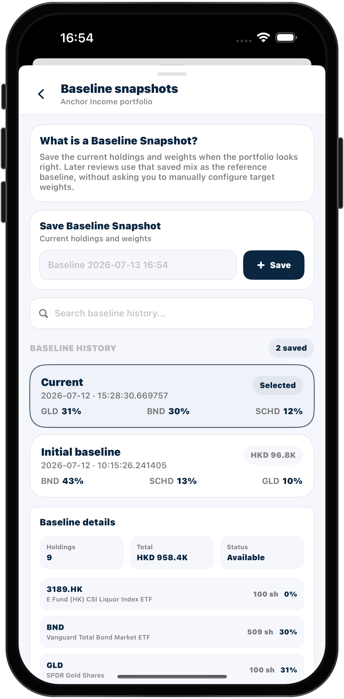

**Walkthrough copy:** Open Baseline snapshots, create exactly one snapshot, search, rename and remove a temporary entry, then reopen the history to verify retained state.

**AC Mapping:**

- `US2-AC26` — Adds only one Baseline Snapshot per creation, selects and loads its details, and updates the save count.
- `US2-AC27` — Searches can be filtered by Baseline Snapshot tag, date, or top weight ETF symbol, and can be cleared.
- `US2-AC28` — Rename rejects empty names, persists valid new tags, and updates history and selected details.
- `US2-AC29` — Delete only removes the selected Baseline Snapshot and reduces the count; if the currently selected item is deleted, the page will no longer display its details, and the remaining valid items will be selected or display an empty status.
- `US2-AC30` — UAT Before Edit retains the positions before operation 2.4, and UAT Current State is consistent with the current My Portfolio after operation 2.4.
- `US2-AC31` — After reopening Baseline snapshots, the retained Baseline Snapshot and rename results still exist, and the deleted temporary Baseline Snapshot no longer appears.

#### Evidence 02 — 06 · Empty and removal boundaries

**Walkthrough copy:** Demonstrate the explicit empty-holdings state, then cancel and confirm destructive portfolio removal while proving other portfolios are unaffected.

**AC Mapping:**

- `US2-AC32` — A My Portfolio with no holdings can still be opened; its details clearly show no holdings, unavailable allocation and unavailable forecast states, without presenting zero values or sample allocations as valid results.
- `US2-AC33` — Removal requires naming My Portfolio and stating irrevocable destructive confirmation; My Portfolio remains unchanged after cancellation.
- `US2-AC34` — Remove this My Portfolio from the list after confirmation without deleting other My Portfolios.

### Slide 20 — User Story 3 — Complete the recommendation questionnaire

- **Module / Story:** Portfolio / User Story 3
- **Subtitle:** Four validated answers lead into a clean, non-stale generation state.
- **Layout:** Three equal columns.

#### Evidence 01 — 01 · Questionnaire start

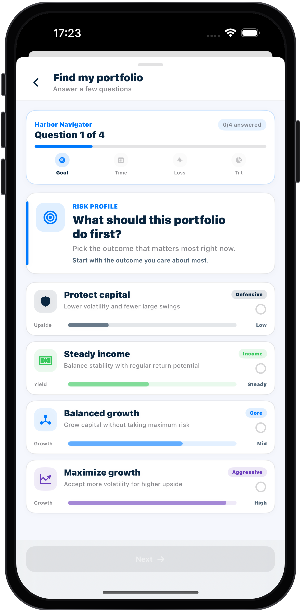

**Walkthrough copy:** Open Find Your Ideal Portfolio. Show the four-step structure, supporting option context and the disabled Next gate before selection.

**AC Mapping:**

- `US3-AC01` — The questionnaire shows exactly four progress steps and the current number of questions/answered.
- `US3-AC02` — Each question displays supporting text and selectable options with labels, details, icons and risk/benefit context.
- `US3-AC03` — Next/See recommendation is always disabled until the current question has an answer.

#### Evidence 02 — 02 · Answer progress

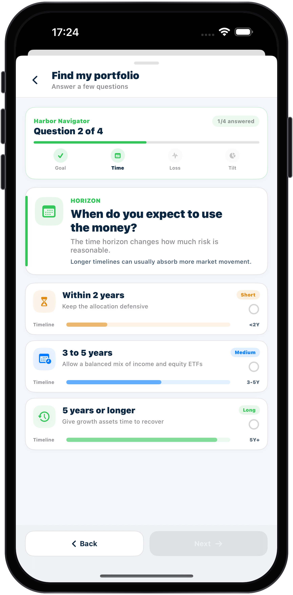

**Walkthrough copy:** Select one option, move forward and backward, retain answers, then later adjust one answer and regenerate from the same questionnaire state.

**AC Mapping:**

- `US3-AC04` — Only one option can be selected per question, and Back/Next navigation retains all previous answers.
- `US3-AC05` — After completing the questionnaire, the results page displays the risk level derived from the combination of answers—Conservative, Moderate, Growth, or Opportunistic—and enters the recommendation generation state corresponding to that level.
- `US3-AC17` — Return to the questionnaire and keep the current answers. Regenerating clears previous suggestions and displays the build status before new results.

#### Evidence 03 — 03 · Generation progress

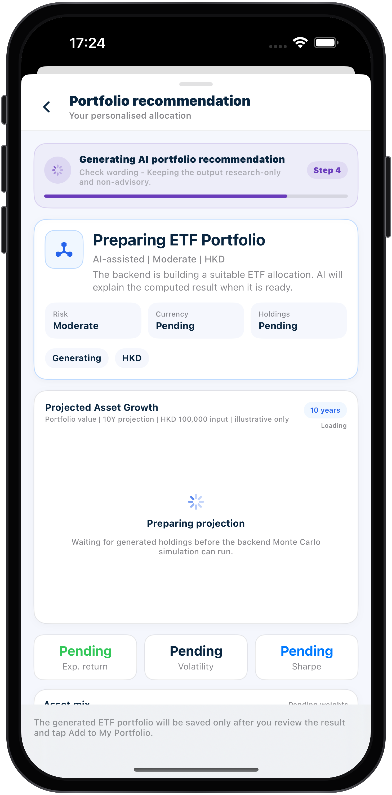

**Walkthrough copy:** Submit all answers and show four generation stages, pending placeholders and the disabled save path without flashing a stale recommendation.

**AC Mapping:**

- `US3-AC06` — The page immediately enters a visible generation state; stale recommendations from a previous run must not appear, even briefly.
- `US3-AC07` — Progress communicates four stages: Screen ETF universe, Optimize allocation, Draft AI explanation, and Check wording.
- `US3-AC08` — Pending header, forecast, build, explanation and ETF rows are clearly marked as generating/pending rather than populated with fabricated final values.
- `US3-AC09` — The save operation is not available until there is a clear Recommendation result.

### Slide 21 — User Story 3 — Review how the recommendation was built

- **Module / Story:** Portfolio / User Story 3
- **Subtitle:** Result, metrics, build explanation and ETF holdings stay consistent with one generated run.
- **Layout:** 2×2 window layout with alternating screenshot and text orientation.

#### Evidence 01 — 04 · Recommendation result

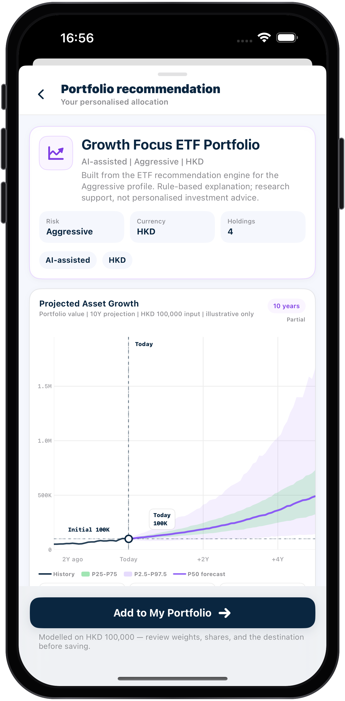

**Walkthrough copy:** Confirm generated title, risk level, currency, positions, projection and AI-assisted research-only boundary.

**AC Mapping:**

- `US3-AC10` — The header displays the title of the generated results, risk level, base currency, number of positions and AI-assisted/research summary only.
- `US3-AC11` — Expected annualized returns, volatility, Sharpe ratio, asset class allocation, number of ETFs, and generated weights are derived from returned recommendations.
- `US3-AC12` — Forecasts are calculated based on the generated ETF weights and modeled amounts and meet the interaction criteria established in User Story 1.
- `US3-AC18` — Recommendation is marked throughout as AI-assisted and for research only; it will not be saved to My portfolios until the user explicitly selects Add to My Portfolio and completes the confirmation.

#### Evidence 02 — 05 · Recommendation build

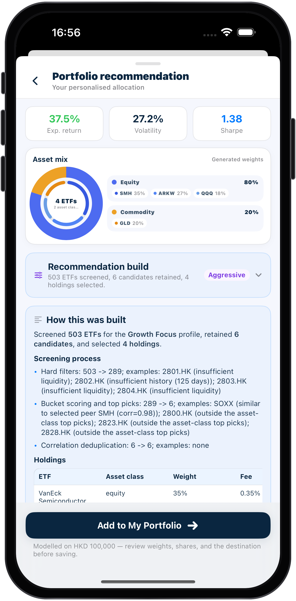

**Walkthrough copy:** Inspect returned metrics, asset mix, screening/optimization summary, as-of date, candidate scope, exclusions and warnings.

**AC Mapping:**

- `US3-AC13` — Recommendation Build displays this run's risk profile, screening and optimization summary, as-of date, candidate scope, exclusion reasons and warnings, and corresponds to the final ETF holdings.

#### Evidence 03 — 06 · Explanation and constraints

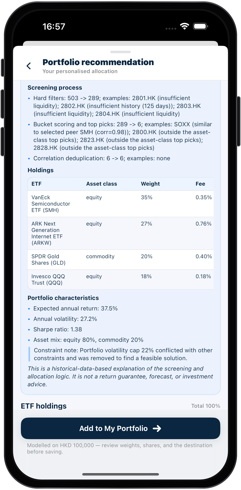

**Walkthrough copy:** Read rendered AI explanation, holdings table, portfolio characteristics and constraints without exposing raw Markdown or overstating the result.

**AC Mapping:**

- `US3-AC14` — Description markup is AI-generated and renders paragraphs, emphasis, bullets, quotes, and tables without displaying the original Markdown markup.
- `US3-AC15` — The explanation matches this Recommendation Build and its generated holdings, and clearly states the historical-data, research-use and no-return-guarantee boundaries.

#### Evidence 04 — 07 · ETF holdings

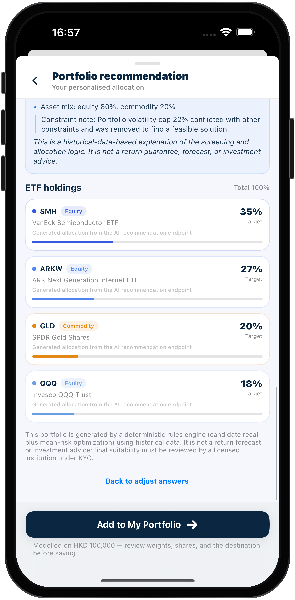

**Walkthrough copy:** Check ticker, name, asset class, target weight and progress for every generated ETF; confirm weights total 100% within rounding tolerance.

**AC Mapping:**

- `US3-AC16` — ETF row shows ticker, name, asset class, generated target weight, and progress; shows weights totaling 100% within rounding tolerance.

### Slide 22 — User Story 3 — Save the recommendation

- **Module / Story:** Portfolio / User Story 3
- **Subtitle:** The generated configuration is not persisted until target selection and confirmation complete.
- **Layout:** Two-window left/right layout.

#### Evidence 01 — 08 · Target selection

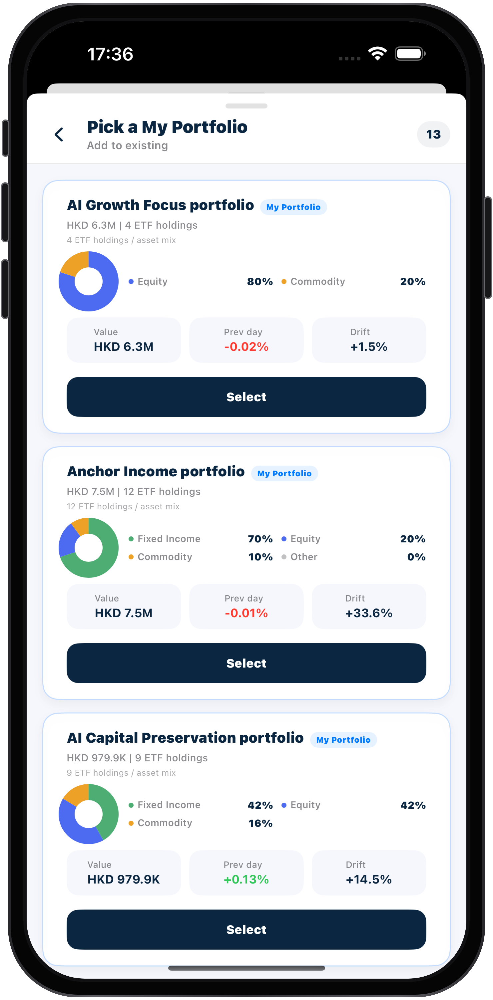

**Walkthrough copy:** Open Add to My Portfolio, choose Add as new or an eligible existing target, finish confirmation and reopen the saved target.

**AC Mapping:**

- `US3-AC19` — The add page uses the generated recommendation, modeled amount, base currency and latest available ETF prices.
- `US3-AC21` — Confirmation is displayed when using Add as new and the new My Portfolio appears in My portfolios with the expected name, base currency and number of positions.
- `US3-AC22` — Use Add to existing to merge quantities: new codes are added and existing codes get the added quantity and weighted cost.
- `US3-AC23` — Only opening the add page or returning to Recommendation will not write to My portfolios; the corresponding save result will only be generated after the target selection and confirmation are completed.

#### Evidence 02 — 09 · Recommendation editor

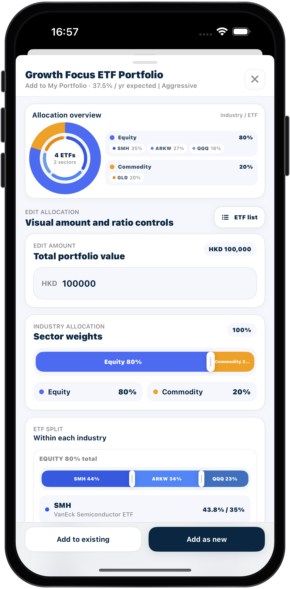

**Walkthrough copy:** Verify the recommendation uses its modeled amount, currency and latest prices while sharing the same Visual/List editing behavior as User Story 1.

**AC Mapping:**

- `US3-AC20` — Visual/List editing and both target options are compliant with Operations 1.5–1.7.

### Slide 23 — User Story 4 — Run portfolio analysis

- **Module / Story:** Portfolio / User Story 4
- **Subtitle:** An editable working draft becomes a traceable analysis result without changing saved holdings.
- **Layout:** Three equal columns.

#### Evidence 01 — 01 · Editable Holdings draft

**Walkthrough copy:** Start analysis from My Portfolio, edit the working copy, add/remove ETFs and run analysis only when the draft is valid; do not alter the saved source yet.

**AC Mapping:**

- `US4-AC01` — Analysis Workspace opens in Holdings, identifies the source My Portfolio, and preloads its saved ETF holdings, quantities, costs, values and weights.
- `US4-AC02` — Analysis remains locked until an analysis exists; Suggestions remains locked until a suggestion exists.
- `US4-AC03` — +/− will update the draft immediately; direct input only displays a check mark when the value changes. After confirmation, values and weights are recalculated, old analysis/recommendations are cleared, and the saved My Portfolio is not modified.
- `US4-AC04` — Add ETF supports catalog search and sorting controls; duplicates are marked Added and cannot be added again, valid new ETFs can be added to the current draft.
- `US4-AC05` — Removing ETFs or Clear all only affects working drafts until you explicitly execute Apply to My Portfolio.
- `US4-AC06` — `Analyze draft portfolio` is disabled when the draft is empty; only progress is displayed during the analysis run and no second analysis operation is provided.
- `US4-AC07` — `Analyze draft portfolio` switches to the `Analysis` tab and continues to display progress until analysis of the current draft completes or fails.

#### Evidence 02 — 02 · Analysis overview

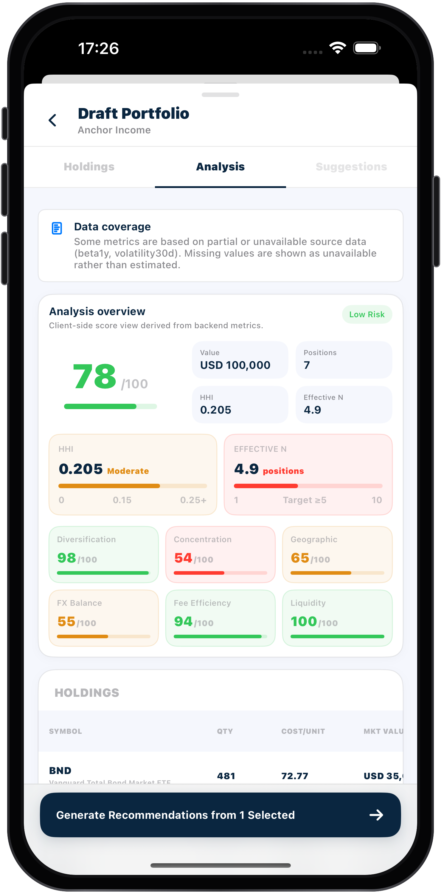

**Walkthrough copy:** Wait for completion, inspect current-draft value, positions, HHI, Effective N, diagnostics and Data coverage, then prove stale results clear after a draft change.

**AC Mapping:**

- `US4-AC08` — The completed overview shows the total value/base currency, number of positions, HHI, Effective N, diversification, concentration, geography, FX, fee efficiency and liquidity information available for the current draft.
- `US4-AC09` — Unavailable indicators are displayed as Unavailable/—; if the available data is insufficient to form an overall score, the score is also displayed as Unavailable and must not be replaced by a zero value.
- `US4-AC12` — Analytics disclaimers are always visible; when a response contains partial/unavailable metrics or warnings, the page displays a blue Data coverage indicating the affected data range without calling it an AI fallback.
- `US4-AC13` — The current result applies only to this draft; returning to Holdings and changing a quantity clears and relocks the old Analysis and Suggestions.

#### Evidence 03 — 03 · Holdings and exposure

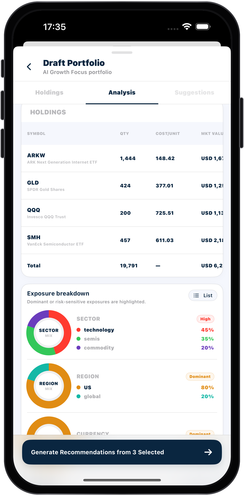

**Walkthrough copy:** Scroll the read-only holdings table and switch Sector, Region and Currency between Pie and List without changing the underlying analysis.

**AC Mapping:**

- `US4-AC10` — The Holdings table displays Symbol, QTY, COST/UNIT, MKT VALUE, WEIGHT and CCY and supports horizontal scrolling; unavailable values display —, and no placeholder return is shown.
- `US4-AC11` — `Exposure breakdown` displays Sector, Region and Currency and consistently switches between `Pie` and `List` using the same data.

### Slide 24 — User Story 4 — Select findings and generate recommendations

- **Module / Story:** Portfolio / User Story 4
- **Subtitle:** Only the diagnosis selected at submission enters the AI-assisted recommendation scope.
- **Layout:** Two-window left/right layout.

#### Evidence 01 — 04 · Diagnosis selection

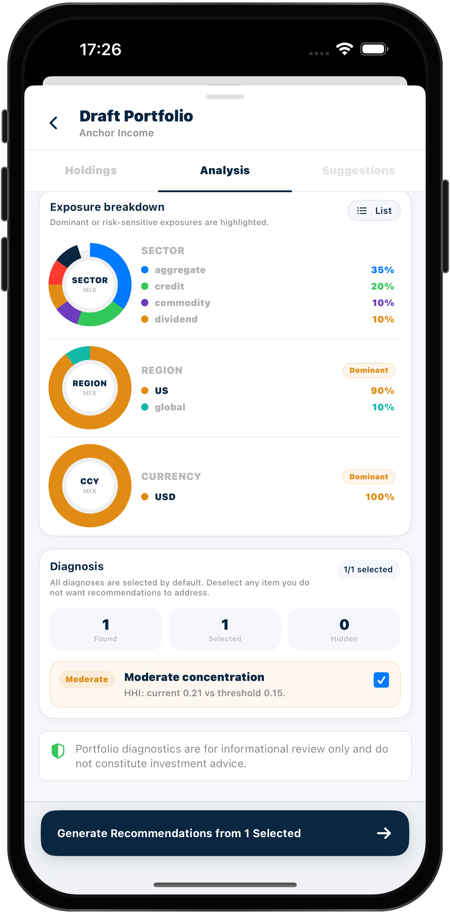

**Walkthrough copy:** Review severity, metric and selection state, change the selected findings, verify counts, and show the disabled generate action when zero items are selected.

**AC Mapping:**

- `US4-AC14` — Diagnostic items display severity, title, metric/threshold and selection state; all returned items are selected by default.
- `US4-AC15` — The number, severity, and selection status of diagnostic items returned by the current analysis are consistent with the page count.
- `US4-AC16` — After switching diagnostic items, the Found/Selected/Hidden count is updated immediately; the diagnostic scope listed in the generated results only includes the items selected when submitting.
- `US4-AC17` — When zero items are selected, the UI instructs the user to select at least one item and `Generate Recommendations from <n> Selected` is disabled.
- `US4-AC18` — Recommendation generation is disabled until analysis completes; while generation is running, only progress is shown and no second generation action is available.

#### Evidence 02 — 05 · Generated scope and considerations

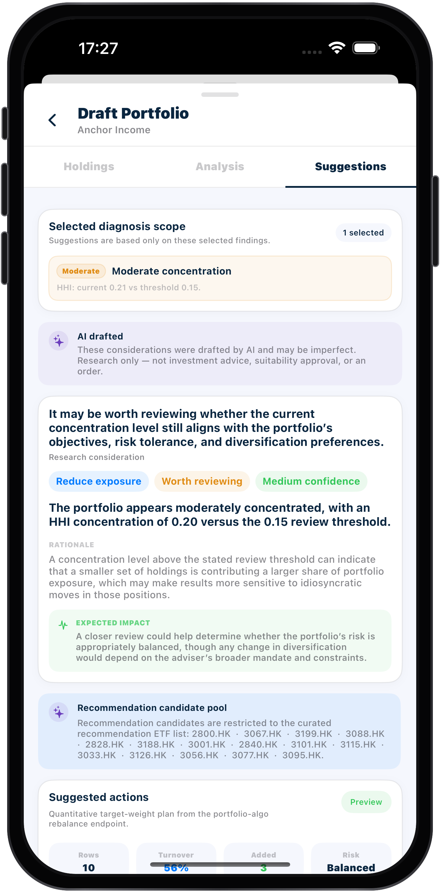

**Walkthrough copy:** Observe the four progress stages, then verify selected diagnosis scope, AI drafted boundary, research consideration content and excluded findings.

**AC Mapping:**

- `US4-AC19` — The generation switches to Suggestions and displays four progress stages: Read selected diagnosis, Draft considerations, Apply safety guard, Prepare preview.
- `US4-AC20` — The results indicate the diagnostic items used to generate recommendations.
- `US4-AC21` — AI-generated considerations appear AI drafted, with hints about research use and what can go wrong with the AI.
- `US4-AC22` — Considerations only cover diagnostic items selected during submission; unselected diagnoses will not appear in the scope of this recommendation and corresponding considerations.
- `US4-AC23` — Each consideration presents observations, rationale, expected impact, confidence level, relevant questions, and wording for research purposes only, without order execution language.

### Slide 25 — User Story 4 — Review, edit and apply Suggested actions

- **Module / Story:** Portfolio / User Story 4
- **Subtitle:** My Portfolio results can be applied after validation; Model Portfolio results remain read-only.
- **Layout:** Two-window left/right layout.

#### Evidence 01 — 06 · Suggested actions

**Walkthrough copy:** Inspect feasibility and candidate scope, scroll every Held/New row, edit non-negative targets, reset, apply once, then reopen the portfolio to prove refreshed holdings and invalidated old analysis.

**AC Mapping:**

- `US4-AC24` — `Suggested actions` displays feasibility, row count, turnover, new candidate count/symbols and risk level.
- `US4-AC25` — Each Suggested Action row displays the code/name, Held/New status, current share/weight, target share/weight, quantity and value difference, and Model target comparison.
- `US4-AC26` — `Suggested actions` supports scrolling through all Held/New rows and updates the corresponding quantity and value difference immediately after editing the target.
- `US4-AC27` — Recommendation candidate pool displays only ETF symbols that are allowed to be considered in the current recommendation process and corresponds to new candidates in `Suggested actions`.
- `US4-AC28` — Target share only accepts non-negative values and recalculates target weight, share difference, weight difference and value difference.
- `US4-AC29` — Reset clears user overrides and restores the target scenario originally provided by the preview.
- `US4-AC30` — Apply to My Portfolio is only enabled if the source is My Portfolio, the scenario is feasible, there are displayable action lines, the price query is completed and all positive targets have available prices; remains disabled if the conditions are not met.
- `US4-AC31` — Applying updates the saved holdings with the edited positive targets, preserves unaffected valid holdings, closes the workspace and refreshes the details.
- `US4-AC32` — Reopening proves that quantities and weights/values were updated; previous analysis/recommendations are no longer considered valid for the revised holdings.
- `US4-AC33` — Apply to My Portfolio cannot be triggered repeatedly while the request is in progress; after success, only one position update will be generated and the refreshed details will be returned.

#### Evidence 02 — 07 · Model Portfolio read-only boundary

**Walkthrough copy:** Run the same workflow from a Model Portfolio and confirm the final rows are read-only with no Reset or Apply to My Portfolio action and no saved-portfolio mutation.

**AC Mapping:**

- `US4-AC34` — Model Portfolio can be used as a draft source to complete the same Analysis Workflow for Holdings, Analysis, Diagnosis and Suggestions.
- `US4-AC35` — `Suggestions` displays the selected diagnostic scope, AI considerations and quantitative `Suggested actions`, and will not skip the results just because the source is Model Portfolio.
- `US4-AC36` — The Model Portfolio's `Suggested actions` are displayed as a read-only list with Current, Target, Change, and Value Difference viewable per row, but no Target shares input or step controls are provided.
- `US4-AC37` — Model Portfolio results do not display Reset or Apply to My Portfolio; closing the workspace does not modify the Model Portfolio, nor does it create or update the My Portfolio.

### Slide 26 — User Story 5 — Select a baseline and inspect drift

- **Module / Story:** Portfolio / User Story 5
- **Subtitle:** Only a changed Baseline Snapshot can drive a review; No changes remains inspectable but not selectable.
- **Layout:** Two-window left/right layout.

#### Evidence 01 — 01 · Baseline selection

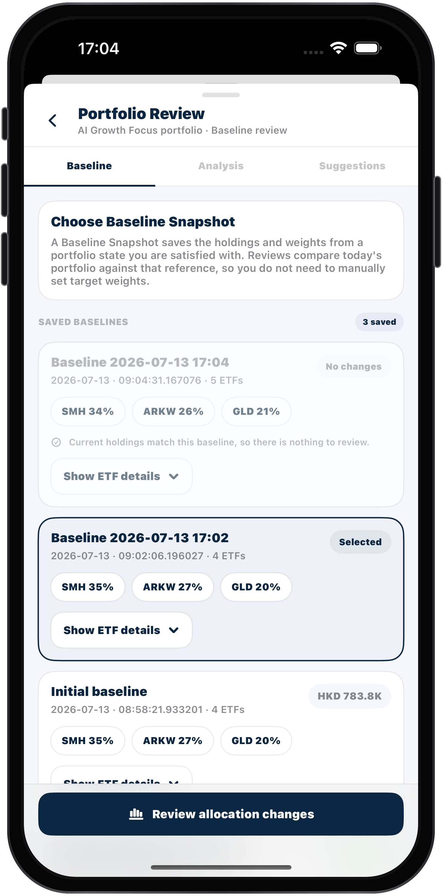

**Walkthrough copy:** Open Portfolio Review, distinguish No changes from a reviewable snapshot, inspect saved ETF details and select one changed baseline.

**AC Mapping:**

- `US5-AC01` — Portfolio Review opens in the Baseline tab and lists only the snapshots saved by this My Portfolio.
- `US5-AC02` — The UI explains that a Baseline Snapshot is a saved reference configuration, not a manually configured target.
- `US5-AC03` — UAT Current State is visibly disabled/dimmed, marked No changes, and states that the current position is the same as the Baseline Snapshot.
- `US5-AC04` — When selecting UAT Before Edit first and then clicking on the unchanged Baseline Snapshot, UAT Current State will not be selected and the original selection will remain unchanged.
- `US5-AC05` — A Baseline Snapshot marked No changes does not provide access to Analysis, and the page states that its positions are consistent with the current status.
- `US5-AC06` — Even if Baseline Snapshot cannot be selected for review, Show ETF details can still be used for inspection.
- `US5-AC07` — Baseline Snapshot with changes becomes Selected and gets selected style.
- `US5-AC08` — Expanded details show saved ETF quantities and weights; collapsed only hides the details panel.

#### Evidence 02 — 02 · Holding drift

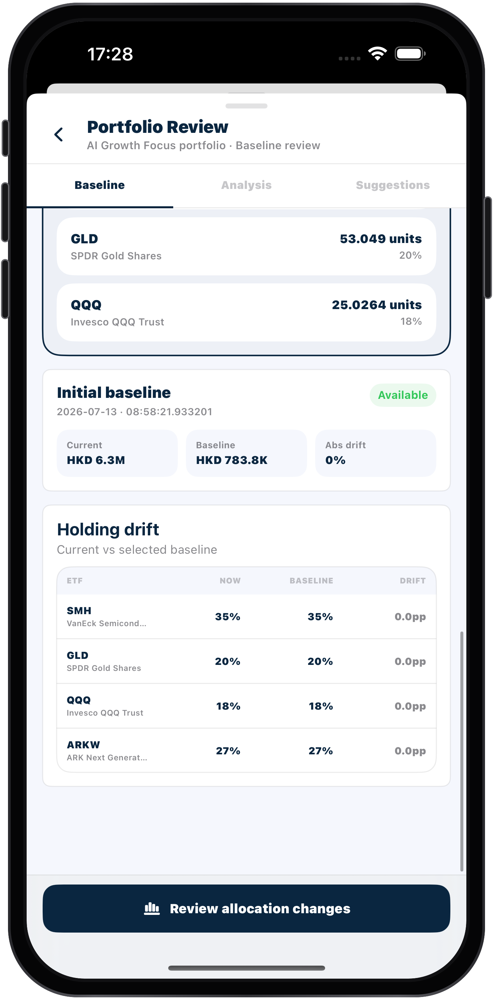

**Walkthrough copy:** Review current/baseline summary and the drift table, including added/removed ETFs, signed deviations and the enabled Review allocation changes action.

**AC Mapping:**

- `US5-AC09` — Deviation results list both new and removed ETFs, and cannot be omitted because a symbol only exists in the current position or Baseline Snapshot.
- `US5-AC10` — The deviation table, sorted by significant change, shows each code's Baseline Snapshot weight, current weight, quantity difference, and signed weight deviation.
- `US5-AC11` — The summary indicates the name, date, and total absolute deviation of the selected Baseline Snapshot; Review allocation changes is now enabled.

### Slide 27 — User Story 5 — Explain the baseline deviation

- **Module / Story:** Portfolio / User Story 5
- **Subtitle:** Status, allocation and quantity views describe a deterministic snapshot comparison rather than AI advice.
- **Layout:** Three equal columns.

#### Evidence 01 — 03 · Review Analysis

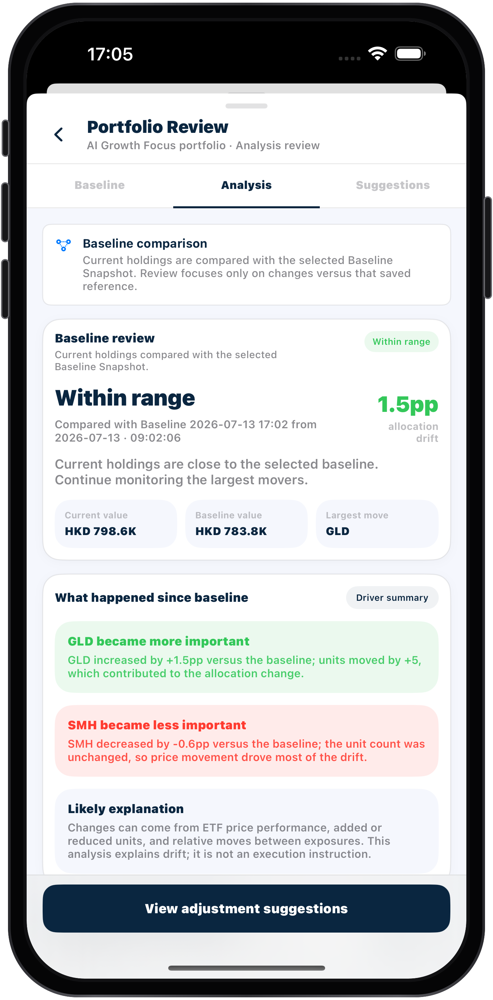

**Walkthrough copy:** Confirm the selected baseline identity, drift status, current/baseline values, largest move and driver summary; keep the comparison explicitly non-AI.

**AC Mapping:**

- `US5-AC12` — Analysis clearly indicates that the current position is being compared to the selected Baseline Snapshot.
- `US5-AC13` — Analysis displays the Within range, Monitor drift, or Review recommended status and displays the current value, Baseline Snapshot value, maximum change, and percentage point deviation.
- `US5-AC14` — `Driver summary` identifies the largest exposure increase/decrease and indicates whether price and/or quantity changes contributed.
- `US5-AC18` — Baseline Snapshot comparisons must not show AI flags such as AI-generated, AI drafted, etc., and are explicitly presented as configuration comparisons based on the selected snapshot.

#### Evidence 02 — 04 · Allocation movements

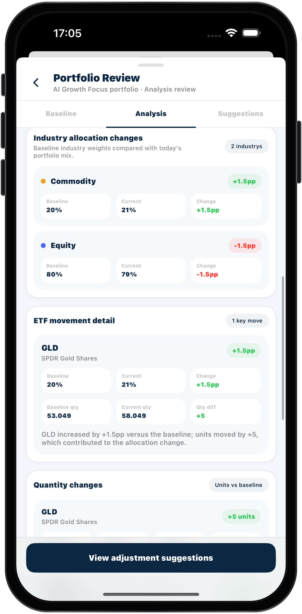

**Walkthrough copy:** Read Industry allocation changes and ETF movement detail with signed weights and plain-language reasons.

**AC Mapping:**

- `US5-AC15` — `Industry allocation changes` summarizes Baseline Snapshot weights and current weights by ETF asset class and shows signed deviations.
- `US5-AC16` — `ETF movement detail` shows Baseline Snapshot weights, current weights and quantities, with a plain-language reason for each material movement.

#### Evidence 03 — 05 · Quantity changes

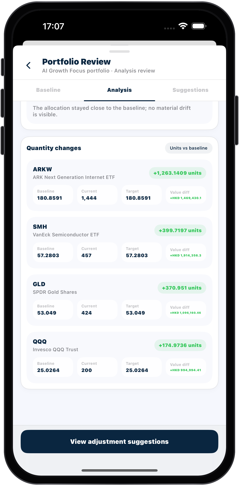

**Walkthrough copy:** Inspect baseline, current and target quantities plus unit and value differences for material ETF rows.

**AC Mapping:**

- `US5-AC17` — `Quantity changes` displays the Baseline Snapshot quantity, current quantity, target quantity, unit difference and value difference for key rows.

### Slide 28 — User Story 5 — Adjust and apply the baseline scenario

- **Module / Story:** Portfolio / User Story 5
- **Subtitle:** A loaded target scenario can be edited, reset and applied once to My Portfolio.
- **Layout:** Two-window left/right layout.

#### Evidence 01 — 06 · Baseline-based suggestions

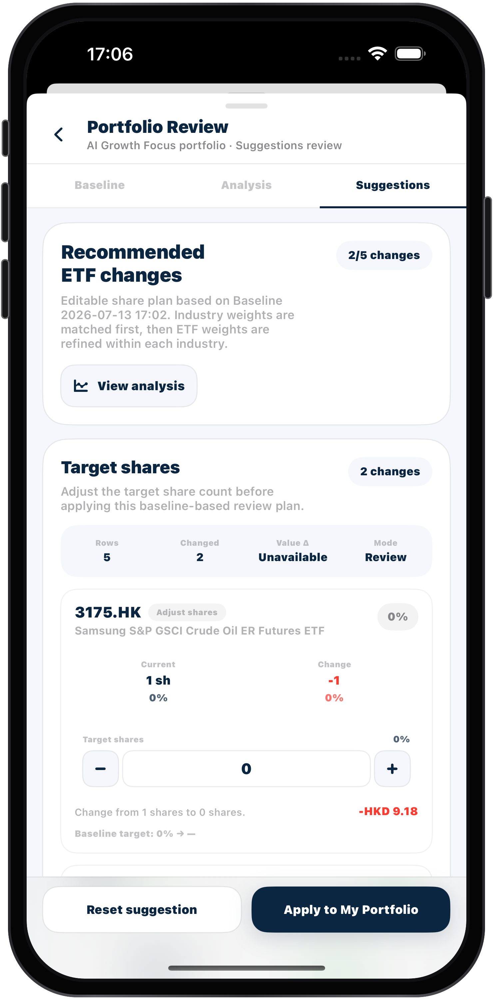

**Walkthrough copy:** Wait for the selected baseline preview, inspect scope and target rows, edit non-negative shares, reset and enable Apply only after the scenario is complete.

**AC Mapping:**

- `US5-AC19` — Suggestions displays the target scenario only after the selected Baseline Snapshot preview finishes loading; a stale preview is not shown while loading or switching scope.
- `US5-AC20` — The scope card takes the Baseline Snapshot and reports the number of changed rows and the total number of rows.
- `US5-AC21` — The target row shows the current share/weight, Baseline Snapshot weight, calculated target share/weight, signed change, value difference, and Hold/Adjust status.
- `US5-AC22` — The default scenario generates reviewable target shares by the selected Baseline Snapshot; ETFs that do not exist in the Baseline Snapshot can appear as zero targets.
- `US5-AC23` — Target values are editable and non-negative, and displayed weights and differences recalculate immediately.
- `US5-AC24` — Reset suggestion removes overrides and restores the calculated default targets.
- `US5-AC25` — Apply to My Portfolio is disabled until target calculation completes and is enabled only when the target scenario is available.

#### Evidence 02 — 07 · Applied result

**Walkthrough copy:** Apply once, return to refreshed My Portfolio details, reopen the review and confirm the final target quantities and updated comparison persist.

**AC Mapping:**

- `US5-AC26` — After Apply to My Portfolio succeeds, the review closes and My Portfolio details refresh to show the updated saved holdings.
- `US5-AC27` — Reopening proves that target shares were applied and the previously selected Baseline Snapshot shows the updated comparison results.
- `US5-AC28` — Apply to My Portfolio cannot be triggered repeatedly while the request is in progress; only one position update will be generated after completion, and the same final status will be displayed when reopening the details and Portfolio Review.

### Slide 29 — 04 Admin

- **Module / Story:** Admin / Module overview
- **Subtitle:** Operational visibility plus a Web Admin → shared backend → iOS verification loop
- **Layout:** Representative desktop screenshot on the left; Mermaid source on the right.
- **Module copy:** One end-to-end User Story covers Dashboard, ETF Catalogue, Model Portfolios, Users and User Portfolios. Any change that affects the client must be verified on the iOS simulator; an Admin toast alone is not acceptance evidence.

#### Representative screenshot

#### Mermaid source

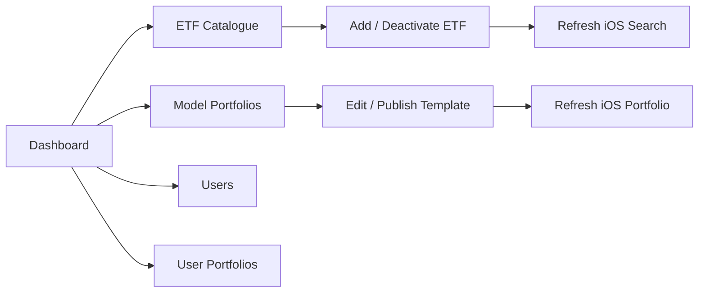
```mermaid
flowchart LR
  A[Dashboard] --> B[ETF Catalogue]
  B --> C[Add / Deactivate ETF]
  C --> D[Refresh iOS Search]
  A --> E[Model Portfolios]
  E --> F[Edit / Publish Template]
  F --> G[Refresh iOS Portfolio]
  A --> H[Users]
  A --> I[User Portfolios]
```

### Slide 30 — User Story 1 — Monitor the platform and inspect the ETF catalogue

- **Module / Story:** Admin / User Story 1
- **Subtitle:** Dashboard metrics lead into searchable, filterable ETF maintenance data.
- **Layout:** Two wide desktop screenshots with text below each image.

#### Evidence 01 — 01 · Dashboard

**Walkthrough copy:** Open Dashboard and explain the current users, ETF catalogue, portfolios, structured notes and ETF tier distribution returned by the shared backend.

**AC Mapping:**

- `ADM-US1-AC01` — `Dashboard` displays an overview of the platform returned by the current backend, including currently available indicators in users, ETF catalog, user portfolios, structured notes and ETF tier distribution.

#### Evidence 02 — 02 · ETF Catalogue

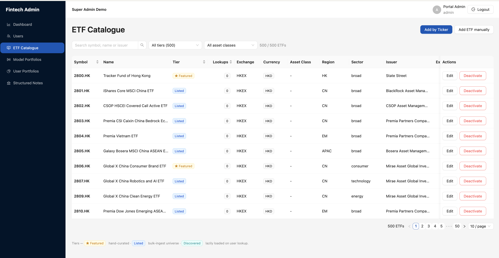

**Walkthrough copy:** Search by symbol/name/issuer, apply tier or asset-class filters, and inspect the fields required to maintain an ETF record.

**AC Mapping:**

- `ADM-US1-AC02` — `ETF Catalogue` supports searching by symbol, name or issuer, and supports the tier and asset-class filters provided by the current implementation.
- `ADM-US1-AC03` — ETF records display fields required for maintenance such as exchange, currency, asset class, region, sector, issuer, and expense ratio.

### Slide 31 — User Story 1 — Add or deactivate an ETF and verify it on iOS

- **Module / Story:** Admin / User Story 1
- **Subtitle:** The acceptance result is the refreshed client state, not the Admin submission toast.
- **Layout:** Admin screenshot on the left; paired before/after iOS screenshots on the right when captured.

#### Evidence 01 — 03 · Add by Ticker validation

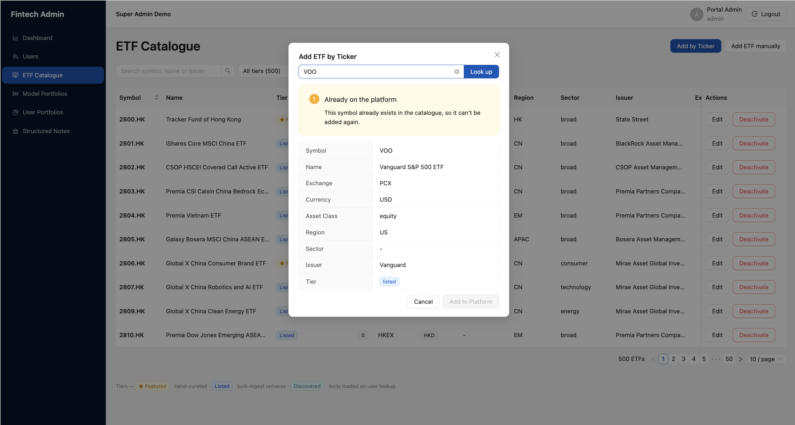

**Walkthrough copy:** Use Add by Ticker or Add ETF manually, show duplicate validation and submit only one valid test record; repeat the process for an active/inactive state change.

**AC Mapping:**

- `ADM-US1-AC04` — Administrators can create a valid ETF record through `Add by Ticker` or `Add ETF manually`.
- `ADM-US1-AC07` — ETF addition or deactivation request cannot be submitted repeatedly during the process, and no duplicate records or conflict status will be generated after completion.

#### Evidence 02 — 04 · iOS before/after verification

> **Screenshot required:** Capture two Simulator states with the same test ticker: absent before Admin creation or present before deactivation, then the inverse after refreshing the client. Keep the search query and scope visible in both images.

**Walkthrough copy:** Return to the simulator after each Admin mutation, refresh or reopen the ETF search/list and prove the client universe changed exactly once.

**AC Mapping:**

- `ADM-US1-AC05` — A test ETF that was absent from the mobile app before creation can be found after it is added in `Admin Portal` and the mobile search/list is refreshed; its symbol and name match the admin record.
- `ADM-US1-AC06` — Administrators can deactivate an active ETF; after deactivation and a mobile-app refresh, the ETF no longer appears in the active product universe.
- `ADM-US1-AC16` — Every admin change that affects the client is verified by refreshing the simulator or reopening the page; an admin Toast alone is not sufficient evidence of success.

### Slide 32 — User Story 1 — Maintain and verify Model Portfolios

- **Module / Story:** Admin / User Story 1
- **Subtitle:** A published template is edited in Admin and then reloaded from the iOS catalogue.
- **Layout:** Two wide Admin screenshots plus one smaller iOS after-state when captured.

#### Evidence 01 — 05 · Model Portfolios list

**Walkthrough copy:** Inspect template key, display order, title, risk band, return range, horizon, summary, reference, status and allocation entry points.

**AC Mapping:**

- `ADM-US1-AC08` — `Model Portfolios` supports maintaining template key, display order, title, risk band, return range, horizon, summary, reference note, status and ETF allocations.

#### Evidence 02 — 06 · Model Portfolio editor

**Walkthrough copy:** Edit one recognizable field, keep allocations at Total 100%, save as published, then verify draft/hidden visibility boundaries with a dedicated test template.

**AC Mapping:**

- `ADM-US1-AC09` — Model Portfolio allocation can only be saved or published as a valid template if the total weight is 100%.
- `ADM-US1-AC10` — Changes made in `Admin Portal` to the title, order, risk band, summary or allocation of a published Model Portfolio appear after refreshing or reopening it in the mobile app.
- `ADM-US1-AC11` — Only the `published` Model Portfolio is visible to the client; the `draft` or `hidden` template does not appear in the client directory.
- `ADM-US1-AC12` — The client displays the current Model Portfolio configuration, without using hard-coded content or the last opened template state.

#### Evidence 03 — 07 · iOS published-template verification

> **Screenshot required:** Capture the same Model Portfolio in Simulator after refresh, with the edited title/risk/summary/allocation visible. If demonstrating draft/hidden, capture the catalogue state in which the test template is absent.

**Walkthrough copy:** Reopen the selected Model Portfolio on iOS and compare the visible data with the saved Admin configuration.

### Slide 33 — User Story 1 — Review protected operations data

- **Module / Story:** Admin / User Story 1
- **Subtitle:** Users and User Portfolios support visibility and troubleshooting without mutating holdings.
- **Layout:** Two wide desktop screenshots with text below each image.

#### Evidence 01 — 08 · Users

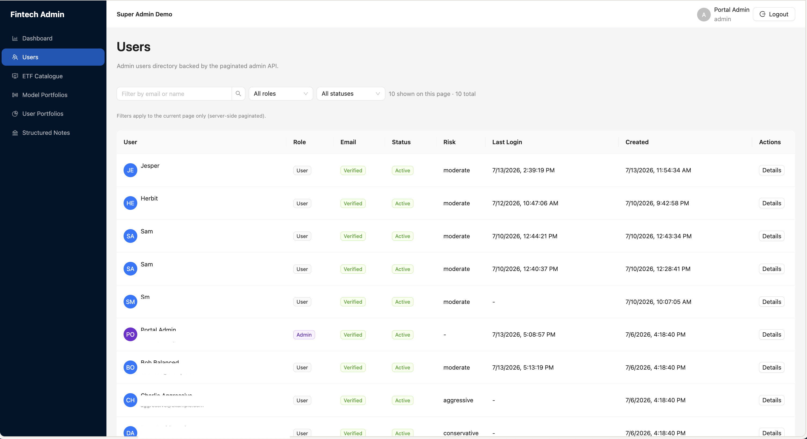

**Walkthrough copy:** Use search and role/status filters, inspect verification, account, risk, last-login and created metadata, and keep identifiable data redacted.

**AC Mapping:**

- `ADM-US1-AC13` — `Users` supports search and role/status filters, and displays currently available verification status, account status, risk profile, last login and created date.
- `ADM-US1-AC17` — Videos and screenshots use test data or redact personal information such as email addresses and portfolio owners.

#### Evidence 02 — 09 · User Portfolios

**Walkthrough copy:** Inspect owner, currency, objective, horizon, holdings count and created time; explain that this story is read-only for ordinary user holdings.

**AC Mapping:**

- `ADM-US1-AC14` — `User Portfolios` displays the currently available fields such as owner, base currency, objective, horizon, holdings count and created time.
- `ADM-US1-AC15` — `Users` and `User Portfolios` are used for operational visibility and troubleshooting. Ordinary user positions are not modified in this story.

### Slide 34 — Acceptance Traceability Across Modules

- **Module / Story:** Back matter / —
- **Subtitle:** One index connects documentation, slide evidence and the corresponding User Story video.
- **Layout:** Module-to-deliverable relationship diagram; no additional screenshot required.
- **On-slide copy:**
  - Every Story page follows walkthrough order and uses the exact AC IDs from the English source documents.
  - Each still image proves a representative UI state; dynamic loading, scrubbing, submission and cross-platform refresh remain continuous video evidence.
  - Admin changes flow through the shared backend and are accepted only after the iOS result is refreshed and observed.
  - Research-only, delayed-data, partial-data and privacy boundaries remain visible wherever applicable.

### Slide 35 — Acceptance Review and Q&A

- **Module / Story:** Back matter / —
- **Subtitle:** Four modules · eleven User Stories · three complementary deliverables
- **Layout:** Minimal closing page using the original template.
- **On-slide copy:**
  - Confirm Story-level walkthrough completeness.
  - Confirm AC mapping and any evidence that must remain video-only.
  - Confirm the two missing Admin iOS before/after capture pairs before final PPT production.

## 覆盖校验

- Source AC total: **248**
- Mapped AC total: **248**
- Missing AC IDs: **0**
- Planned slides: **35**
- Explicit screenshot gaps: **2 Admin → iOS verification pairs** (ETF before/after; Model Portfolio after-state / visibility boundary).

## Source of truth

- [Login / Register English document](../login-register.en.md)
- [Market English document](../market.en.md)
- [Portfolio English document](../portfolio.en.md)
- [Admin English document](../admin.en.md)
