# Market Module

## Module Overview

The Market module provides a complete path from market structure discovery to individual ETF research, comparison and saving. Users first establish market direction in `Market Intelligence`, then enter `Sector Detail` to compare ETFs within sectors, then conduct in-depth research in `ETF Detail`, and save the results to `Watchlist` or `My Portfolio`.

> Data boundaries: When the page displays delayed quotes, cached snapshots or EOD (end-of-day) data, the corresponding tags must be retained. The Market module is used for research discovery and does not constitute trading advice.

## User Story / Video Index

| Story | Video theme | Core path | Video |
| --- | --- | --- | --- |
| [US-MKT-01](#us-mkt-01) | Market Intelligence Home | `Market Intelligence` -> `Sector Detail` | [Video Page](https://jjpvro70sief.jp.larksuite.com/wiki/WE34wt8oyiO3NOkBA3zjFrxppge) |
| [US-MKT-02](#us-mkt-02) | Sector Detail | `Sector Detail` -> `ETF Rankings` | [Video Page](https://jjpvro70sief.jp.larksuite.com/wiki/WE34wt8oyiO3NOkBA3zjFrxppge) |
| [US-MKT-03](#us-mkt-03) | ETF Detail and Compare ETF | `ETF Detail` -> `Compare ETF` | [Video page](https://jjpvro70sief.jp.larksuite.com/wiki/WE34wt8oyiO3NOkBA3zjFrxppge) |
| [US-MKT-04](#us-mkt-04) | Save ETF Research | `Watchlist` / `Add to My Portfolio` / `Screener` | [Video Page](https://jjpvro70sief.jp.larksuite.com/wiki/WE34wt8oyiO3NOkBA3zjFrxppge) |

## Shared Terminology

| UI original text | Document meaning |
| --- | --- |
| `Market Intelligence` | Home page of the Market module, also the starting point for ETF research |
| `Sector Heatmap` | Heatmap that aggregates ETF performance by sector or theme |
| `AI Market Signals` | Card area that turns market movements into readable research signals |
| `Market Discovery Rail` | Horizontal discovery entry points for sectors, ETF movers, new ETFs, active ETFs and other scopes |
| `Sector Detail` | The details page of the selected sector |
| `AI Sector Insights` | Sector research observations generated based on EOD cache data |
| `ETF Rankings` | List of ETF rankings within the selected sector |
| `ETF Detail` | Detailed and chart research page for individual ETFs |
| `Compare ETF` | Normalized overlay comparison function of two ETFs |
| `Screener` | ETF search, filtering and sorting page with `Recommended`, `All` and `Watchlist` scopes |

---

## User Story 1 - Establish research direction from `Market Intelligence`

**Story ID:** `US-MKT-01`  
**User story:** As a user who has not yet selected a specific ETF, I want to understand the day's market breadth, sector movements and major-index context so that I can choose a sector to research next.  
**Video:** [Market acceptance video page](https://jjpvro70sief.jp.larksuite.com/wiki/WE34wt8oyiO3NOkBA3zjFrxppge)

### Walkthrough

1. Open `Market Intelligence`. Show the overall structure of the page first and explain that it is a starting point for ETF research, not a complete ETF directory or trading recommendation page.
2. Browse the `Sector Heatmap`. Explain that each color block represents a sector or theme basket, showing equal weight changes, ETF volume and small trend lines; it also displays `Rising`, `Flat`, and `Falling` summaries.

**Screenshot** — MKT-US1-01: `Market Intelligence` top with full `Sector Heatmap` containing `Rising / Flat / Falling` market breadth summary.

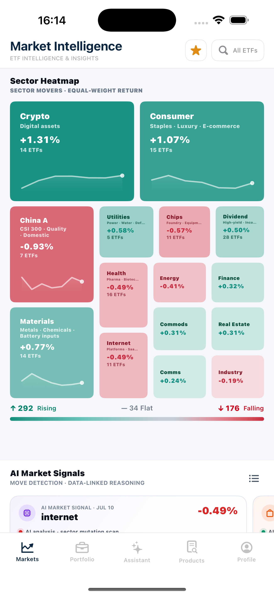

3. Browse down to `AI Market Signals`. Select at least one signal card showing the signal date, market movement, AI analysis summary, related ETFs, and external sources when present.

**Screenshot** — MKT-US1-02: Complete `AI Market Signals` card with signal date, AI analysis, sources, related ETFs, and `Market Indices` with delayed tag.

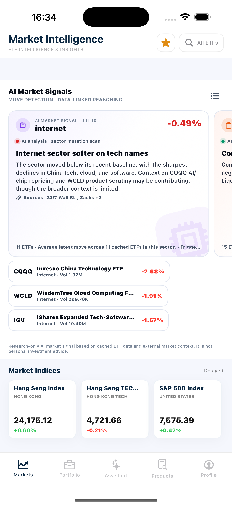

4. Display `Market Indices`, including Hang Seng Index, Hang Seng Tech and S&P 500 Index, and keep the delayed data label visible.
5. Browse `Market Discovery Rail`. In the `Sectors` scope, show `Default` and `Hot` and explain that they provide stable entry points and sectors with large moves that day, respectively.
6. Show the symbol, name, price, daily move and `View all` action in `Recommended ETFs`.

**Screenshot** — MKT-US1-03: `Default / Hot` sector baskets for `Market Discovery Rail`, as well as `Recommended ETFs` and `View all`.

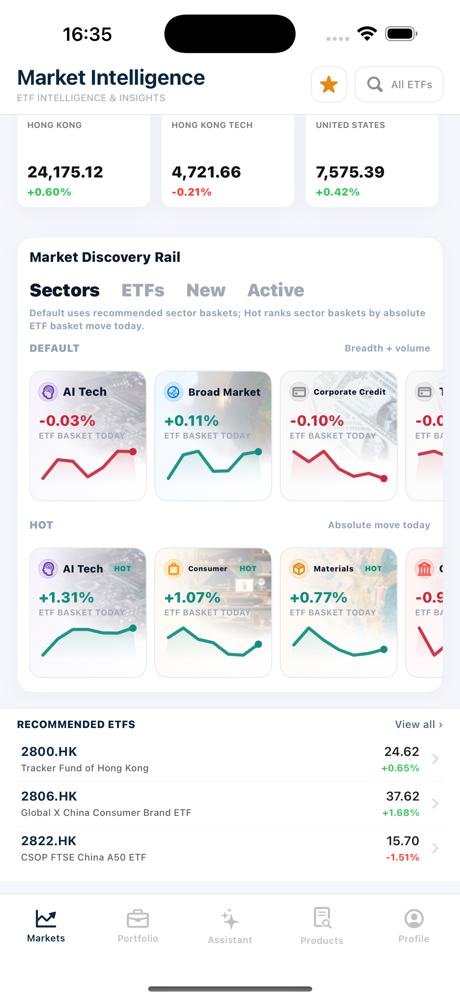

7. Click on a section (it is recommended to use `Crypto`), enter `Sector Detail`, complete the current story and connect to the next story.

### Acceptance Criteria

| ID | Requirement | Reference | Ownership | Priority |
| --- | --- | --- | --- | --- |
| MKT-US1-AC01 | `Market Intelligence` loads successfully and organizes research entries into `Sector Heatmap`, `AI Market Signals`, `Market Indices`, `Market Discovery Rail` and `Recommended ETFs`. | US-MKT-01 | Integration | Must |
| MKT-US1-AC02 | Each visible color block in `Sector Heatmap` displays the sector/theme name, movement, ETF count and trend line, with colors distinguishing rising, near-flat and falling values. | US-MKT-01 | Integration | Must |
| MKT-US1-AC03 | `Rising`, `Flat`, `Falling` summary corresponds to the current heat map data. | US-MKT-01 | Integration | Must |
| MKT-US1-AC04 | `AI Market Signals` card shows signal date, detected changes, AI analysis summary and contributing/related ETFs; displays source reference when there is an external source. | US-MKT-01 | Integration | Must |
| MKT-US1-AC05 | `Market Indices` displays major indices and currently available change data, and clearly displays delayed data boundaries. | US-MKT-01 | Integration | Must |
| MKT-US1-AC06 | `Market Discovery Rail` supports continuing research from sectors, ETF movers, new ETFs or active ETFs. | US-MKT-01 | Integration | Must |
| MKT-US1-AC07 | The `Default` and `Hot` scopes in `Sectors` can be switched, and the displayed content is consistent with the current selection. | US-MKT-01 | Integration | Must |
| MKT-US1-AC08 | `Recommended ETFs` is a curated pool rather than the full ETF universe; each row displays symbol, name, price and daily move, and provides `View all`. | US-MKT-01 | Integration | Must |
| MKT-US1-AC09 | After clicking on a sector, the `Sector Detail` matching the selected sector will be opened. | US-MKT-01 | Integration | Must |
| MKT-US1-AC10 | The page does not represent market signals, sector performance, or select ETFs as trading recommendations. | US-MKT-01 | Integration | Must |

---

## User Story 2 - Understand sector trends and filter ETFs

**Story ID:** `US-MKT-02`  
**User story:** As a user who enters a certain sector from the market homepage, I hope to understand the breadth, liquidity and risk background of changes in the sector, compare ETFs within the sector, and select the next research target.  
**Video:** [Market acceptance video page](https://jjpvro70sief.jp.larksuite.com/wiki/WE34wt8oyiO3NOkBA3zjFrxppge)

### Walkthrough

1. Open a sector from `Sector Heatmap` or `Market Discovery Rail`. Use a sector with complete data, such as `Crypto`.
2. Display the top sector banner: sector name, representative tickers, number of ETFs in the basket, latest sector changes, and cached sector snapshot label.

**Screenshot** — MKT-US2-01: `Crypto Sector Detail` banner, containing representative tickers, ETF count, sector move and cached sector snapshot labels.

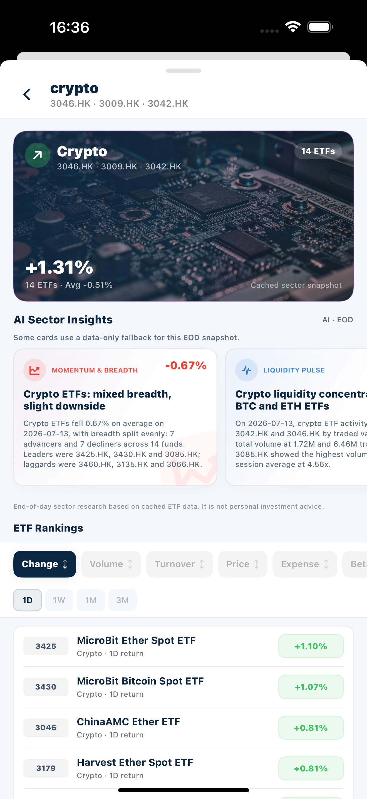

3. Browse `AI Sector Insights`. `Momentum & Breadth`, `Liquidity Pulse`, `Trend & Risk` are displayed in order, indicating that these contents are based on EOD cached ETF data and are not real-time predictions.

**Screenshot** — MKT-US2-02: `AI Sector Insights` for Consumer sector, showing `Momentum & Breadth`, `Liquidity Pulse` and EOD data boundary simultaneously.

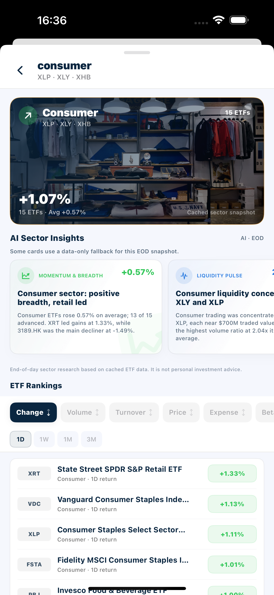

4. Go to `ETF Rankings`. Confirm that the list only contains ETFs within the selected sector.
5. Switch 1 to 2 sorting indicators in sequence, such as `Change`, `Volume` or `Expense Ratio`; switch the return period again, such as `1D` to `1M`.

**Screenshot** — MKT-US2-03: Crypto `ETF Rankings`, showing `Change` sort, `1D` return period and full ETF ranking rows.

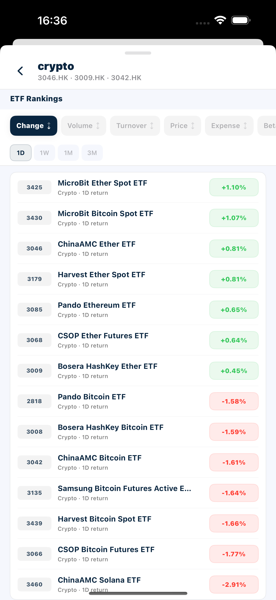

6. Select an ETF and enter `ETF Detail` to complete the transition from sector discovery to product research.

### Acceptance Criteria

| ID | Requirement | Reference | Ownership | Priority |
| --- | --- | --- | --- | --- |
| MKT-US2-AC01 | `Sector Detail` displays the name and data for the sector selected by the user and does not retain content from the previously opened sector. | US-MKT-02 | Integration | Must |
| MKT-US2-AC02 | The sector banner displays representative tickers, ETF count and the latest sector movement. | US-MKT-02 | Integration | Must |
| MKT-US2-AC03 | The page clearly marks the sector snapshot / EOD cached data boundary and does not describe it as real-time data. | US-MKT-02 | Integration | Must |
| MKT-US2-AC04 | `AI Sector Insights` covers at least three research angles: `Momentum & Breadth`, `Liquidity Pulse`, and `Trend & Risk`. | US-MKT-02 | Integration | Must |
| MKT-US2-AC05 | When data is insufficient, the corresponding insight displays an unavailable state or data boundary and does not fabricate a conclusion. | US-MKT-02 | Integration | Must |
| MKT-US2-AC06 | `ETF Rankings` only displays ETFs within the currently selected sector. | US-MKT-02 | Integration | Must |
| MKT-US2-AC07 | Sorting supports metrics provided by the current implementation, including `Change`, `Volume`, `Turnover`, `Price`, `Expense Ratio`, `Beta`, `Drawdown`, `Sharpe ratio`, `Name` or `Symbol`. | US-MKT-02 | Integration | Must |
| MKT-US2-AC08 | return period supports switching between `1D`, `1W`, `1M`, and `3M` provided by the current implementation, and the list result is consistent with the current period. | US-MKT-02 | Integration | Must |
| MKT-US2-AC09 | When switching sorting indicators or periods, the current sector range remains unchanged. | US-MKT-02 | Integration | Must |
| MKT-US2-AC10 | After clicking on the ETF in the ranking, open the `ETF Detail` matching the symbol of the row. | US-MKT-02 | Integration | Must |
| MKT-US2-AC11 | `AI Sector Insights` uses the wording of research observations and does not predict returns or recommend transactions. | US-MKT-02 | Integration | Must |

---

## User Story 3 - Research and compare individual ETFs

**Story ID:** `US-MKT-03`  
**User story:** As a user who has selected a candidate ETF, I would like to view quotes, candlesticks, key statistics and news, and compare relative movements to another ETF.  
**Video:** [Market acceptance video page](https://jjpvro70sief.jp.larksuite.com/wiki/WE34wt8oyiO3NOkBA3zjFrxppge)

### Walkthrough

1. Open an ETF with complete data from `ETF Rankings`, `Recommended ETFs`, `All`, `Watchlist` or ETF movers.
2. Display detailed headers: fund name, symbol, exchange, latest price, currency, daily change and market/close status.

**Screenshot** — MKT-US3-01: `ETF Detail` of ChinaAMC Ether ETF, including identity, quote, close status, K-line chart, moving averages, Overview and key stats.

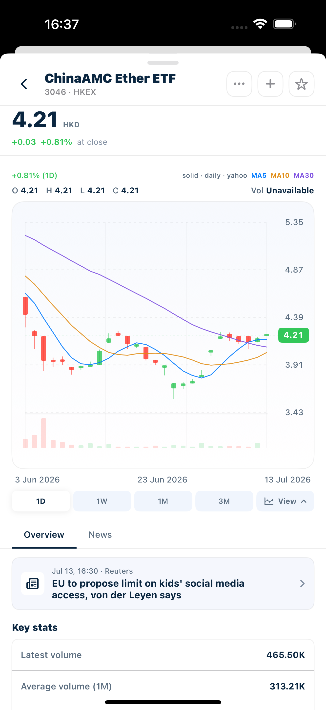

3. Switch at least two time ranges among `1D`, `1W`, `1M` and `3M` on the K-line chart.
4. Scrub the chart to display open, high, low, close and volume updates at the selected time point.
5. Open the `View` panel, switch the chart type once, and turn on or off at least one moving average (`MA5`, `MA10` or `MA30`).

**Screenshot** — MKT-US3-02: `View` panel expanded, showing K-line types, current `OHLC bar` selection and `MA5 / MA10 / MA30` controls.

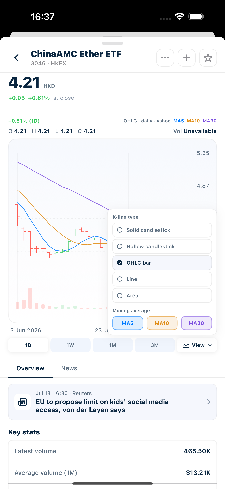

6. Switch between `Overview` and `News`. Check key stats in `Overview`; display headline, source and timestamp in `News`.
7. Open `More`, go to `Compare ETF`, select the second ETF and view the normalized overlay under the same chart option.

**Screenshot** — MKT-US3-03: `ETF Comparison` completed state, including 3046.HK and 3189.HK, normalized price performance, legend and factsheet matrix.

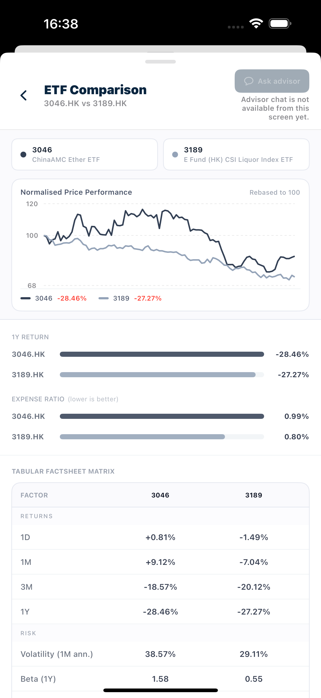

### Acceptance Criteria

| ID | Requirement | Reference | Ownership | Priority |
| --- | --- | --- | --- | --- |
| MKT-US3-AC01 | `ETF Detail` displays the fund name, symbol, exchange, latest price, currency, daily change and market status consistent with the selected ETF. | US-MKT-03 | Integration | Must |
| MKT-US3-AC02 | K-line chart uses the current ETF's price series and does not display residual data from previous ETFs. | US-MKT-03 | Integration | Must |
| MKT-US3-AC03 | Users can switch between the `1D`, `1W`, `1M`, and `3M` time ranges provided by the current implementation, and the chart will be updated with the selection. | US-MKT-03 | Integration | Must |
| MKT-US3-AC04 | When scrubbing a chart, open, high, low, close and volume are updated synchronously with the currently selected data point. | US-MKT-03 | Integration | Must |
| MKT-US3-AC05 | The `View` panel supports the currently enabled chart types in `solid candlestick`, `hollow candlestick`, `OHLC bar`, `line` and `area`. | US-MKT-03 | Integration | Must |
| MKT-US3-AC06 | The `MA5`, `MA10`, `MA30` switches only change the current chart overlay, not the ETF or time range. | US-MKT-03 | Integration | Must |
| MKT-US3-AC07 | `Overview` displays the currently available key stats; unavailable values are shown with an explicit unavailable status. | US-MKT-03 | Integration | Must |
| MKT-US3-AC08 | `News` displays headlines, sources, and timestamps related to current ETF research streams. | US-MKT-03 | Integration | Must |
| MKT-US3-AC09 | `Compare ETF` in `More` uses the current ETF as the first comparison object and allows selection of a second ETF. | US-MKT-03 | Integration | Must |
| MKT-US3-AC10 | The comparison chart uses the same chart option to load two sets of price series, and displays the relative performance with normalized overlay. | US-MKT-03 | Integration | Must |
| MKT-US3-AC11 | Exit `Compare ETF` and still return to the details context of the original ETF. | US-MKT-03 | Integration | Must |

---

## User Story 4 - Save ETF Research Results

**Story ID:** `US-MKT-04`  
**User story:** As a user who has completed preliminary research, I want to save an ETF to `Watchlist` for continued tracking, add it to an existing `My Portfolio` for further portfolio analysis, or continue screening through the unified `Screener`.  
**Video:** [Market acceptance video page](https://jjpvro70sief.jp.larksuite.com/wiki/WE34wt8oyiO3NOkBA3zjFrxppge)

### Walkthrough

1. Click the star icon in `ETF Detail` to add the ETF to `Watchlist`.
2. Open the `Watchlist` tab of `Screener` and confirm that the ETF appears; then remove it and confirm that the list is updated simultaneously.

**Screenshot** — MKT-US4-01: `Watchlist ETFs` save results, showing selected `Watchlist` tag, saved quantity and ETF symbol/name.

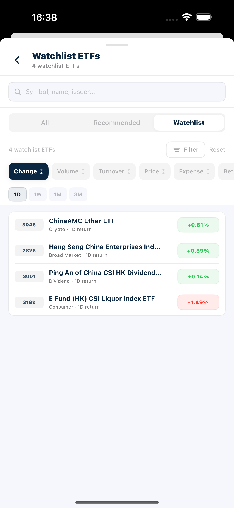

3. Return to `ETF Detail`, click the plus button to open the `Add to existing portfolio` sheet.
4. Display selected ETF, latest price, lots and estimated market value. Note: 1 lot is calculated as 100 shares.
5. Display the duplicate holding status: the portfolio that already contains the ETF displays a duplicate prompt and is unselectable; then select another eligible portfolio to save.

**Screenshot** — MKT-US4-02: `Add to existing` sheet, including selected ETF, lots, estimated value, duplicate/disabled portfolio and eligible portfolio.

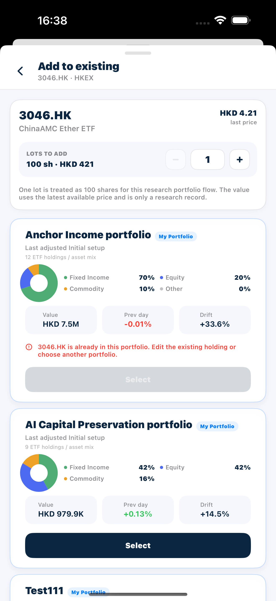

6. Re-open the target `My Portfolio` and confirm that the ETF has been saved as a holding record. It is emphasized that this process does not place orders or execute transactions.
7. Return to `Screener`, display the three data ranges of `Recommended`, `All`, and `Watchlist` in sequence, and operate search, filter and sort once.

**Screenshot** — MKT-US4-03: Unified `Screener` with `All / Recommended / Watchlist` scopes, search, filter, sort metric and return-period controls.

### Acceptance Criteria

| ID | Requirement | Reference | Ownership | Priority |
| --- | --- | --- | --- | --- |
| MKT-US4-AC01 | After clicking the star icon of `ETF Detail`, the success status is consistent with the actual saved status in `Watchlist`. | US-MKT-04 | Integration | Must |
| MKT-US4-AC02 | Saved ETFs appear in `Screener > Watchlist`; disappear from the list when removed. | US-MKT-04 | Integration | Must |
| MKT-US4-AC03 | `Watchlist` is used to save research objects and does not create portfolio holdings or trading orders. | US-MKT-04 | Integration | Must |
| MKT-US4-AC04 | The plus button opens the `Add to existing portfolio` sheet for the current ETF. | US-MKT-04 | Integration | Must |
| MKT-US4-AC05 | The sheet displays the selected ETF, latest price, lots and estimated market value, calculated as 1 lot = 100 shares. | US-MKT-04 | Integration | Must |
| MKT-US4-AC06 | `My Portfolio` that already contains this ETF displays duplicate holding information and cannot be selected again. | US-MKT-04 | Integration | Must |
| MKT-US4-AC07 | User can select another eligible `My Portfolio` and save it. | US-MKT-04 | Integration | Must |
| MKT-US4-AC08 | After saving, reopen the target `My Portfolio` to see the corresponding ETF holding; it will not be written until it is selected and confirmed. | US-MKT-04 | Integration | Must |
| MKT-US4-AC09 | `Recommended`, `All`, `Watchlist` share the same `Screener` interaction, but are limited to the featured pool, the full available range and the user's saved range respectively. | US-MKT-04 | Integration | Must |
| MKT-US4-AC10 | search supports symbol, name or issuer; filter supports issuer, asset class, sector, currency or region provided by the current implementation. | US-MKT-04 | Integration | Must |
| MKT-US4-AC11 | sort supports change, volume, turnover, price, expense ratio, beta, drawdown, Sharpe ratio, name or symbol provided by the current implementation. | US-MKT-04 | Integration | Must |
| MKT-US4-AC12 | search, filter and sort do not accidentally switch the current `Recommended`, `All` or `Watchlist` data range. | US-MKT-04 | Integration | Must |
| MKT-US4-AC13 | `Add to My Portfolio` only saves research holding records, and the page does not claim that orders have been placed or transactions have been executed. | US-MKT-04 | Integration | Must |
