# Portfolio Module

## 模块说明

Portfolio 模块提供仅供研究的工作流：发现 `Model Portfolio`、维护 `My Portfolio`、生成 `AI Portfolio Recommendation`、分析 portfolio 草稿，以及根据历史 `Baseline Snapshot` 审阅已保存的 `My Portfolio`。

模块由三个入口标签组织：`Recommended` 用于浏览管理员维护的 Model Portfolio 并开始 recommendation quiz；`My portfolios` 用于创建、查看、编辑、删除、分析和审阅用户保存的 portfolio；`Watchlist` 用于查看与移除用户保存供日后参考的 Model Portfolio。

> 范围说明：本模块中的预测、分析、Recommendation 和 `Suggested actions` 仅供研究，不代表收益保证，也不会触发券商订单或交易执行。

## User Story / Video 索引

| Story | 视频主题 | 核心路径 | Video |
| --- | --- | --- | --- |
| [US-PORT-01](#user-story-1---探索并保存-model-portfolio) | 探索并保存 Model Portfolio | `Recommended` -> `Model Portfolio` -> `Watchlist` / `My Portfolio` | [视频](https://jjpvro70sief.jp.larksuite.com/wiki/SjhpwcDNLirUxpkHh1vjUbgqphY) |
| [US-PORT-02](#user-story-2---创建、编辑和维护-my-portfolio) | 创建、编辑和维护 My Portfolio | `My portfolios` -> `Edit` / `Baseline snapshots` | [视频](https://jjpvro70sief.jp.larksuite.com/wiki/I9gxw6Uugiw5RxkSJ91jVHKipMf) |
| [US-PORT-03](#user-story-3---生成-ai-portfolio-recommendation) | 生成 AI Portfolio Recommendation | `Find Your Ideal Portfolio` -> `Portfolio recommendation` | [视频](https://jjpvro70sief.jp.larksuite.com/wiki/NSZ1wCHloiD8QAkYSDsj9CNtpje) |
| [US-PORT-04](#user-story-4---分析-portfolio-并审阅-ai-建议) | 分析 Portfolio 并审阅 AI 建议 | `Draft Portfolio` -> `Analysis` -> `Suggestions` | [视频](https://jjpvro70sief.jp.larksuite.com/wiki/Ey4Bw3xDxiPeETk3yBBjhxOHpdf) |
| [US-PORT-05](#user-story-5---根据-baseline-snapshot-审阅) | 根据 Baseline Snapshot 审阅 | `Portfolio Review` -> `Baseline` -> `Analysis` -> `Suggestions` | [视频](https://jjpvro70sief.jp.larksuite.com/wiki/H1ULwBLKeiaEIKkEbQDjhRiepue) |

## 统一术语

| UI 原文 | 文档含义 |
| --- | --- |
| `Model Portfolio` | 由管理员维护并发布的 portfolio template，不是用户持久化配置 |
| `My Portfolio` / `My portfolios` | 用户创建并保存的研究型 portfolio，以及其列表标签 |
| `Watchlist` | 用户保存供日后参考的 Model Portfolio 列表 |
| `Add to My Portfolio` | 将 Model Portfolio 或 Recommendation 转为新的或合并到已有 My Portfolio |
| `Baseline Snapshot` | 某个 My Portfolio 在特定时间保存的持仓、数量、价值和权重参考配置 |
| `Baseline History` / `Baseline snapshots` | 管理 Baseline Snapshot 的历史抽屉/页面 |
| `Analysis Workspace` | 对 portfolio 工作草稿执行 Holdings、Analysis、Diagnosis、Suggestions 流程的工作区 |
| `Suggested actions` | 算法生成的量化调整预览；是否可编辑/应用取决于来源 |
| `Portfolio Review` | 将当前 My Portfolio 与所选 Baseline Snapshot 比较的工作流 |
| `Recommendation Build` | 展示 Recommendation 的风险画像、筛选、优化、候选范围和警告 |
| `Data coverage` / `Unavailable` / `Partial` | 数据不完整或指标不可用时的明确边界状态 |

---

## User Story 1 - 探索并保存 Model Portfolio

**Story ID:** `US-PORT-01`  
**用户故事：** 作为用户，我希望检查精选的 Model Portfolio，了解其配置和示意性预测，将其保存以便稍后参考，并使用 Add to My Portfolio。  
**Video:** [US-PORT-01 验收视频](https://jjpvro70sief.jp.larksuite.com/wiki/SjhpwcDNLirUxpkHh1vjUbgqphY)

### Walkthrough

#### 1.1 打开 Model Portfolio 目录

1. 打开 Portfolio。
2. 选择 Recommended。
3. 观察加载状态，并浏览 Model Portfolio 卡片及其 Reference 说明。
4. 找到包含来源/参考说明的 Model Portfolio，并选择 View details。

> **业务规则：** Model Portfolio 内容由管理员维护。管理员可以创建、更新、排序、设置发布状态、删除及定义 ETF 配置；仅 `published` Model Portfolio 会返回给客户端。`referenceNote` 应根据可信的公开来源人工维护，并以面向客户端的语言说明来源或依据。

**Screenshot** — PORT-US1-01：`Recommended` 目录、recommendation quiz 入口、Model Portfolio cards、allocation mix 和 `Reference`。

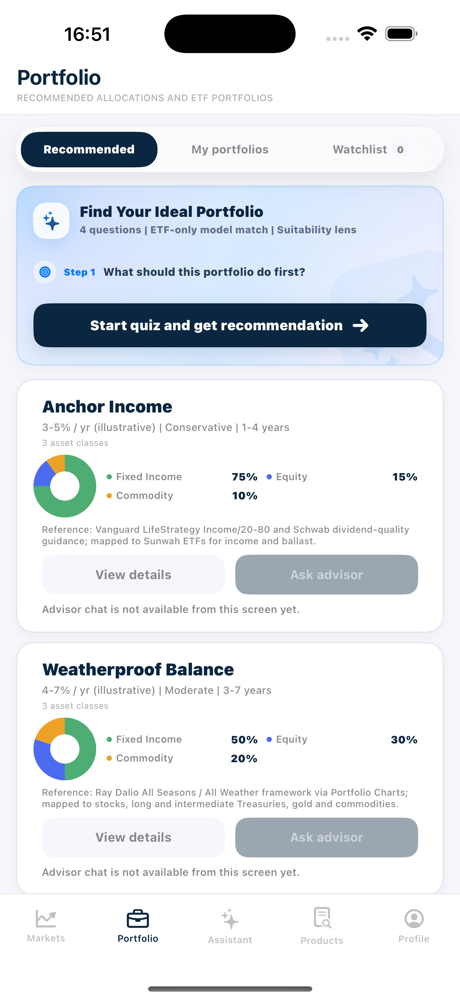

#### 1.2 核验 Model Portfolio 详情

1. 阅读详情头部和来源/参考说明。
2. 查看分层配置图表。
3. 滚动至 ETF 配置列表。
4. 打开一个 ETF 行后返回 Model Portfolio 详情。

**Screenshot** — PORT-US1-02：`Anchor Income` Model Portfolio 详情，包含 return/risk/horizon、`Reference`、allocation map 和 projection 入口。

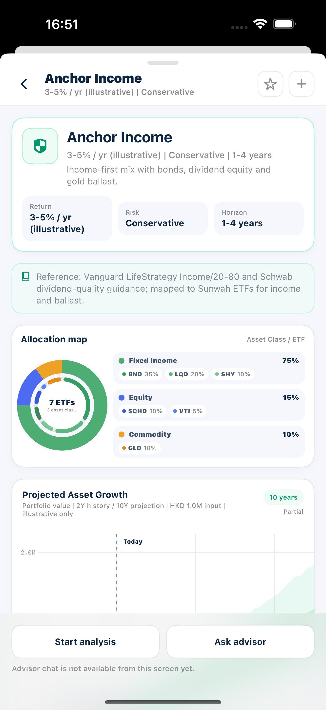

**Screenshot** — `Anchor Income` 的 `ETF allocation` 列表、ETF metadata、target weights 和 `Total 100%`。

#### 1.3 操作预测图与回测

1. 等待 Projected Asset Growth 完成加载。
2. 阅读当前价值、期限中位数和期限范围。
3. 在图表上水平拖动，以平移可见时间线。
4. 双指捏合放大和缩小，以改变可见时间窗口。
5. 触摸或拖过一个历史点，以显示十字准线和值提示。
6. 再触摸一个未来预测点，确认它不提供回测操作。
7. 选中历史点后，选择 Generate backtest。
8. 检查新增的回测和实际序列，然后选择 Hide backtest。
9. 若当前投影显示 Partial 或数据说明，阅读其可见的数据覆盖信息。

**Screenshot** — PORT-US1-03：`Projected Asset Growth` 完成态，包含 history、P50、P25-P75、P2.5-P97.5、Today crosshair、summary 和 `Partial` data warning。

#### 1.4 将 Model Portfolio 加入和移出 Watchlist

1. 在 Model Portfolio 详情头部选择空心星标。
2. 返回 Portfolio 首页并打开 Watchlist。
3. 从 Watchlist 打开已保存的 Model Portfolio 后返回。
4. 使用 Saved/实心星标控件将其移除。
5. 确认移除最后一个已保存的 Model Portfolio 后显示空状态。

**Screenshot** — PORT-US1-04：`Watchlist` 中已保存的 `Anchor Income` Model Portfolio，包含 saved count、事实信息、allocation 和 `Reference`。

#### 1.5 在 Visual 和 List 模式下编辑添加配置

1. 返回 Model Portfolio 详情，选择 + Add to My Portfolio 控件。
2. 在 Visual 模式中修改组合总价值。
3. 拖动行业/资产类别配置边界。
4. 对含多个 ETF 的分组，拖动 ETF 拆分边界。
5. 切换至 ETF list 模式，修改一个 ETF 的份额数量。
6. 尝试输入负份额，确认不可保留，然后恢复有效值。
7. 切回 Visual edit，核对 List 模式的份额编辑已转换为更新后的总金额、权重和配置概览。

**Screenshot** — PORT-US1-05：`Add to My Portfolio` 的 Visual editor，包含 allocation overview、total portfolio value、sector weights 和两个保存目标。

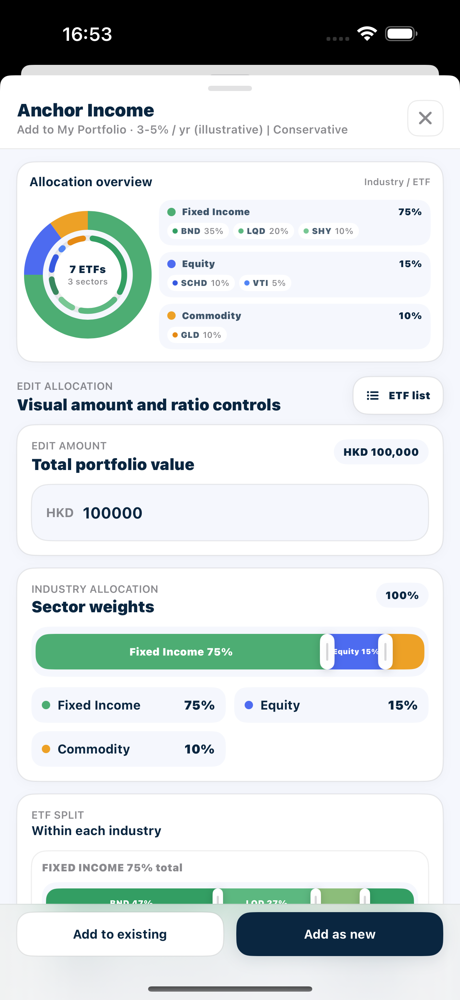

**Screenshot** — 同一配置切换到 `ETF list` 后的 direct-share editor，展示 industry groups、ETF rows 和 share steppers。

#### 1.6 使用 Add as new 创建 My Portfolio

1. 选择 Add as new，查看系统预填的建议名称。
2. 清空名称以确认 Confirm 不可用，再输入唯一的 My Portfolio 名称。
3. 查看确认摘要和 ETF 行。
4. 选择 Confirm。
5. 返回 My portfolios 并打开新建的 My Portfolio。

#### 1.7 使用 Add to existing 更新 My Portfolio

1. 重新打开同一 Model Portfolio 和 Add to My Portfolio 页面。
2. 进行一项可识别的金额/权重编辑。
3. 选择 Add to existing 并选择准备好的已有 My Portfolio。
4. 在预览加载完成前确认 Confirm 不可用；预览完成后选择 Confirm。
5. 从 My portfolios 打开该已有 My Portfolio。
6. 返回 Add to My Portfolio 页面一次，确认当前编辑配置仍然保留，再完成添加。

#### 1.8 从 Model Portfolio 启动草稿分析

1. 重新打开一个 Model Portfolio 详情，选择 Start analysis。
2. 查看预加载的草稿持仓，并进行一项可识别的份额编辑。
3. 运行分析，选择至少一个诊断项并生成建议；确认结果来自当前编辑后的草稿，然后关闭工作区。
4. 刷新 My portfolios，确认没有因 Model Portfolio 草稿分析而创建或修改 My Portfolio。
5. **状态隔离片段：**先对另一个来源生成 Analysis 和 Suggestions，再打开当前 Model Portfolio 重新运行，核对没有沿用上一来源结果。

### Acceptance Criteria

| ID | Requirement | Reference | Ownership | Priority |
| --- | --- | --- | --- | --- |
| US1-AC01 | 可见 Portfolio 标题和三个标签——Recommended、My portfolios、Watchlist，且已选中 Recommended。 | US-PORT-01 / 1.1 | Integration | Must |
| US1-AC02 | 每张已加载的 Model Portfolio 卡片均使用后端数据展示标题、回报范围、风险等级标签、期限、资产类别数量和资产配置可视化。 | US-PORT-01 / 1.1 | Integration | Must |
| US1-AC03 | 每张 Model Portfolio 卡片显示与该 Model Portfolio 对应的 Reference 说明。 | US-PORT-01 / 1.1 | Integration | Must |
| US1-AC04 | View details 打开所选 Model Portfolio，而非其他目录项目。 | US-PORT-01 / 1.1 | Integration | Must |
| US1-AC05 | 首次打开或刷新 Model Portfolio 目录时显示加载状态；完成后以当前返回的 Model Portfolio 替换占位。 | US-PORT-01 / 1.1 | Integration | Must |
| US1-AC06 | 详情头部展示所选 Model Portfolio 的标题、回报、风险、期限和摘要。 | US-PORT-01 / 1.2 | Integration | Must |
| US1-AC07 | 详情事实值与目录卡片及当前 Model Portfolio 数据一致，不沿用先前打开的 Model Portfolio 内容。 | US-PORT-01 / 1.2 | Integration | Must |
| US1-AC08 | 参考说明以专用的来源/参考样式显示，并与目录卡片上的说明一致。 | US-PORT-01 / 1.2 | Integration | Must |
| US1-AC09 | 配置卡展示资产类别分组及其 ETF 代码；显示的 ETF 数量和资产类别数量与返回的详情一致。 | US-PORT-01 / 1.2 | Integration | Must |
| US1-AC10 | ETF 配置区显示 Total 100%，每行展示代码、名称、资产类别标签、目标权重，以及可用的发行方/最新价格/1 年回报元数据。 | US-PORT-01 / 1.2 | Integration | Must |
| US1-AC11 | 选择 ETF 行会打开匹配的 ETF 详情；返回仅关闭该浮层，不丢失 Model Portfolio 详情状态。 | US-PORT-01 / 1.2 | Integration | Must |
| US1-AC12 | 从 ETF 详情返回后仍停留在当前 Model Portfolio 详情，配置内容和已加载状态保持不变。 | US-PORT-01 / 1.2 | Integration | Must |
| US1-AC13 | 加载状态明确说明蒙特卡洛模拟正在运行；数据可用前，不得以编造的点显示图表。 | US-PORT-01 / 1.3 | Integration | Must |
| US1-AC14 | 图表区分历史、P50 预测、P25–P75 和 P2.5–P97.5 区间、Today、初始价值、轴标签及预测标注。 | US-PORT-01 / 1.3 | Integration | Must |
| US1-AC15 | 图表下方摘要值与图表的起始价值、配置期限、P50 终点及 P2.5–P97.5 范围一致。 | US-PORT-01 / 1.3 | Integration | Must |
| US1-AC16 | 水平拖动会改变可见时间线，同时使视图保持在可用的历史/预测范围内。 | US-PORT-01 / 1.3 | Integration | Must |
| US1-AC17 | 捏合会改变可见时间窗口；缩放至边界后不会显示可用日期范围外的数据，轴标签和绘制值不越出图表区域。 | US-PORT-01 / 1.3 | Integration | Must |
| US1-AC18 | 选择有效历史点显示对应时间和值的十字准线。仅历史偏移点可提供回测操作，未来预测点不可提供。 | US-PORT-01 / 1.3 | Integration | Must |
| US1-AC19 | Generate backtest 显示加载状态，随后添加含更新图例的回测百分位区间/中位数和实际序列。 | US-PORT-01 / 1.3 | Integration | Must |
| US1-AC20 | Hide backtest 移除生成的回测，但不移除原始历史或预测。 | US-PORT-01 / 1.3 | Integration | Must |
| US1-AC21 | 预测标记为 Partial 时显示对应的 Data coverage，并继续使用当前 Model Portfolio 的可用数据，不沿用其他 Model Portfolio 的图表结果。 | US-PORT-01 / 1.3 | Integration | Must |
| US1-AC22 | 预测明确描述为示意性/仅供研究，不得表述为保证的预测。 | US-PORT-01 / 1.3 | Integration | Must |
| US1-AC23 | 保存请求成功后，详情控件才从空心星标变为实心星标。 | US-PORT-01 / 1.4 | Integration | Must |
| US1-AC24 | Watchlist 计数增加，且 Model Portfolio 以相同标题、事实信息、配置和 Reference 出现在 Watchlist 中。 | US-PORT-01 / 1.4 | Integration | Must |
| US1-AC25 | 可从 Watchlist 打开已保存的 Model Portfolio。 | US-PORT-01 / 1.4 | Integration | Must |
| US1-AC26 | 移除已保存的 Model Portfolio 会使其从 Watchlist 消失并减少计数；当不再有已保存的 Model Portfolio 时，显示明确的 No portfolios saved 状态。 | US-PORT-01 / 1.4 | Integration | Must |
| US1-AC27 | 返回 Recommended 后再次打开同一 Model Portfolio，其星标状态与 Watchlist 中的最终保存状态一致。 | US-PORT-01 / 1.4 | Integration | Must |
| US1-AC28 | Add to My Portfolio 页面为所选 Model Portfolio 打开，并展示配置概览、Model Portfolio 标题、风险/回报背景及默认建模金额。 | US-PORT-01 / 1.5 | Integration | Must |
| US1-AC29 | 修改总价值会在保持当前归一化配置权重的前提下，重新计算 ETF 金额和数量。 | US-PORT-01 / 1.5 | Integration | Must |
| US1-AC30 | 拖动行业边界仅改变相邻两个分组；到达可拖动边界后继续拖动不再降低该分组，且各分组不出现负权重、总和保持 100%。 | US-PORT-01 / 1.5 | Integration | Must |
| US1-AC31 | 拖动 ETF 拆分会改变该分组内 ETF，保持分组总和不变，并更新组内及总体配置百分比。 | US-PORT-01 / 1.5 | Integration | Must |
| US1-AC32 | 从 Visual 切换至 List 模式时，当前金额和权重会按界面显示的最新价格转换为 ETF 份额；修改份额会重新计算总价值、分组权重、ETF 权重及配置可视化。 | US-PORT-01 / 1.5 | Integration | Must |
| US1-AC33 | 从 List 切回 Visual 模式时，当前份额会转换为对应的总金额和归一化权重；反复切换不会丢失最新编辑，且两种模式均不允许负份额或负权重。 | US-PORT-01 / 1.5 | Integration | Must |
| US1-AC34 | 进入确认步骤时，摘要使用最后一次 Visual/List 编辑后的金额、权重和份额，不恢复为初始配置。 | US-PORT-01 / 1.5 | Integration | Must |
| US1-AC35 | 确认步骤展示目标名称、添加总额、ETF 数量、每只 ETF 的权重/金额/添加数量以及结果数量。 | US-PORT-01 / 1.6 | Integration | Must |
| US1-AC36 | 当 My Portfolio 名称为空或创建请求进行中时，Confirm 被禁用。 | US-PORT-01 / 1.6 | Integration | Must |
| US1-AC37 | 创建成功后，新名称出现在 My portfolios 中；持仓数与确认摘要一致，基础货币与创建时选择一致。 | US-PORT-01 / 1.6 | Integration | Must |
| US1-AC38 | 重新打开或刷新后，持仓、数量、配置和价值仍与确认结果一致。 | US-PORT-01 / 1.6 | Integration | Must |
| US1-AC39 | UI 说明已创建研究型 My Portfolio，未发生下单、交易或执行。 | US-PORT-01 / 1.6 | Integration | Must |
| US1-AC40 | 创建请求进行中时 Confirm 不可重复触发；完成后列表只出现一个对应的新 My Portfolio。 | US-PORT-01 / 1.6 | Integration | Must |
| US1-AC41 | 目标选择器列出当前 My Portfolio，并显示各项的名称、价值、持仓数和配置摘要。 | US-PORT-01 / 1.7 | Integration | Must |
| US1-AC42 | 预览加载完成前 Confirm 不可用。 | US-PORT-01 / 1.7 | Integration | Must |
| US1-AC43 | 预览展示已有价值、待添加 ETF 行、Model Portfolio 权重、金额、最新价格、添加数量和结果数量。 | US-PORT-01 / 1.7 | Integration | Must |
| US1-AC44 | 确认后更新所选已有 My Portfolio；列表和详情刷新后显示新的持仓结果。 | US-PORT-01 / 1.7 | Integration | Must |
| US1-AC45 | 重新打开目标后，预览中的已有代码显示合并后的数量，预览中的新增代码显示为新持仓。 | US-PORT-01 / 1.7 | Integration | Must |
| US1-AC46 | 从目标选择或确认页返回时，当前编辑配置保持不变；最终添加结果与最后确认的预览一致。 | US-PORT-01 / 1.7 | Integration | Must |
| US1-AC47 | Analysis Workspace 在 Holdings 打开，来源标题与所选 Model Portfolio 一致，并按 Model Portfolio ETF 配置预加载代码、份额、价值和归一化权重。 | US-PORT-01 / 1.8 | Integration | Must |
| US1-AC48 | 对 Model Portfolio 草稿的编辑仅作用于工作副本，不会创建或修改 My Portfolio；由于来源不是 My Portfolio，建议结果不显示 Apply to My Portfolio 控件。 | US-PORT-01 / 1.8 | Integration | Must |
| US1-AC49 | `Analyze draft portfolio` 使用当前编辑后的 Model Portfolio 草稿；分析、诊断和建议的共同行为符合用户故事 4，且不会复用其他来源的旧结果。 | US-PORT-01 / 1.8 | Integration | Must |
---

## User Story 2 - 创建、编辑和维护 My Portfolio

**Story ID:** `US-PORT-02`  
**用户故事：** 作为用户，我希望创建和维护已保存的 ETF My Portfolio，包括其持仓和 Baseline Snapshot 历史记录。  
**Video:** [US-PORT-02 验收视频](https://jjpvro70sief.jp.larksuite.com/wiki/I9gxw6Uugiw5RxkSJ91jVHKipMf)

### Walkthrough

#### 2.1 创建 My Portfolio 并核验列表

1. 打开 Portfolio → My portfolios，观察加载完成后的列表；下拉刷新一次，然后选择右上角 +。
2. 在名称为空时查看右上角创建勾选按钮；输入唯一名称并切换基础货币。
3. 从 Initial holdings 打开 ETF 选择器，按代码/名称/发行方搜索，修改排序指标、周期/维度和方向，再用无匹配关键词触发空结果并清除搜索。
4. 选择一只有当前价格的 ETF；重新打开选择器搜索同一代码，确认它显示 Added 且不可重复选择。
5. 在 Initial holdings 中使用 +、− 和直接输入调整数量；输入非正数量确认创建不可用，再恢复有效数量；删除并重新加入该 ETF。
6. 选择创建勾选按钮，返回列表并打开新 My Portfolio。

**Screenshot** — PORT-US2-01：`My portfolios` 列表、`New` 入口、saved portfolios、value、holdings count、asset mix 和 drift。

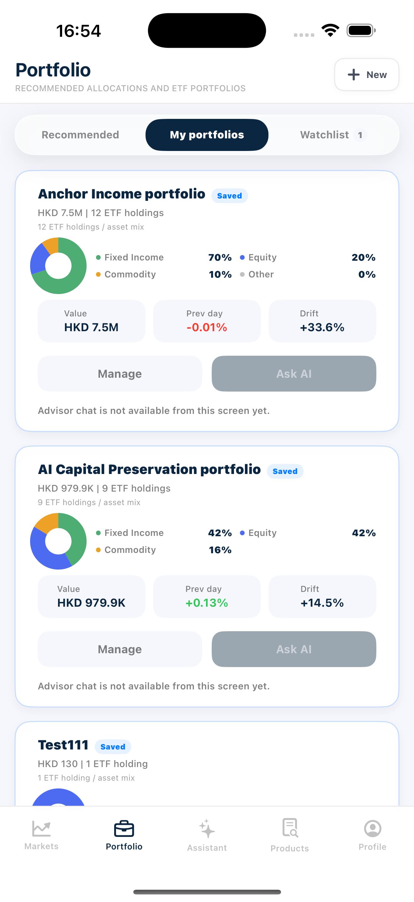

**Screenshot** — PORT-US2-02：`New Portfolio` 初始状态，包含 name、base currency、`Initial holdings`、Add ETF 入口和 research-only 边界。

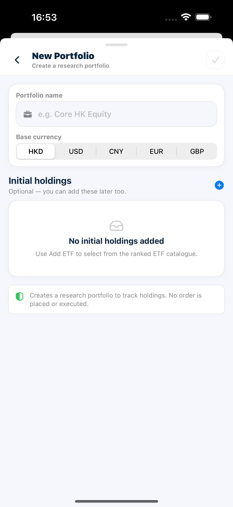

#### 2.2 不重复故事 1 地核验 My Portfolio 详情

1. 打开 UAT Review Portfolio。
2. 简要查看其头部、配置、预测和持仓。
3. 打开一行 ETF 后返回 My Portfolio 详情。

#### 2.3 保存编辑前的 Baseline Snapshot

1. 从 My Portfolio 详情通过时钟/历史图标打开 Baseline snapshots。
2. 保存名为 UAT Before Edit 的快照。
3. 打开刚保存的 Baseline Snapshot 详情，再关闭抽屉。

#### 2.4 编辑数量、添加 ETF 并移除 ETF

1. 从 My Portfolio 详情选择 Edit。
2. 分别使用 + 和 − 修改一只已有 ETF，再直接输入一个明确的正数量并用勾选提交；尝试一次非正数量并恢复。
3. 选择 Add ETF，按代码/名称/发行方搜索，修改排序指标/维度/方向，用无匹配关键词触发空结果后清除搜索。
4. 搜索一只已持有 ETF，确认它显示 Added 且不可选择；再添加一只有效的未持有 ETF。
5. 移除另一只 ETF。
6. 关闭 Edit 并查看 My Portfolio 详情。
7. 再次打开 Edit，不做修改直接关闭，确认详情没有额外变化。

**Screenshot** — PORT-US2-03：My Portfolio `Editing` 页面，包含 value/holdings/status、weights、share steppers、remove controls 和 `Add ETF`。

#### 2.5 完成 Baseline Snapshot CRUD 并准备用户故事 5 数据

1. 持仓编辑后重新打开 Baseline snapshots。
2. 保存名为 UAT Current State 的快照。
3. 再保存名为 UAT Temporary 的快照。
4. 分别按标签、日期片段和最高权重 ETF 代码搜索，并清除搜索。
5. 滑动 UAT Temporary，先尝试用空名称重命名，再将其重命名为 UAT Delete Me，搜索新名称，然后删除。
6. 清除搜索，并核验 UAT Before Edit 和 UAT Current State 仍然存在。
7. 关闭并重新打开 Baseline snapshots，核验最终历史列表和标签。

**Screenshot** — PORT-US2-04：`Baseline snapshots` history、保存入口、search、两个 saved snapshots 和所选 snapshot 的 ETF details。

#### 2.6 删除一个可弃用 My Portfolio

1. 创建一个不含初始持仓、且后续故事不会使用的可弃用 My Portfolio。
2. 打开它，查看无持仓时的详情、配置、预测和持仓状态，然后返回列表。
3. 滑动或使用上下文菜单选择 Remove，先取消一次。
4. 确认取消后该 My Portfolio 仍在列表；再次选择 Remove 并确认移除。

### Acceptance Criteria

| ID | Requirement | Reference | Ownership | Priority |
| --- | --- | --- | --- | --- |
| US2-AC01 | 首次打开或刷新时显示加载状态；完成后列表反映当前保存的 My Portfolio。 | US-PORT-02 / 2.1 | Integration | Must |
| US2-AC02 | 新建 My Portfolio 表单提供 HKD、USD、CNY、EUR 和 GBP 作为基础货币。 | US-PORT-02 / 2.1 | Integration | Must |
| US2-AC03 | 名称为空、存在非正数量的初始持仓或创建请求进行中时，右上角创建勾选按钮不可用。 | US-PORT-02 / 2.1 | Integration | Must |
| US2-AC04 | ETF 选择器支持代码/名称/发行方搜索、排序指标、适用周期/维度、方向和重置；有效 ETF 以界面提供的默认值加入，已暂存 ETF 显示 Added 且不可重复选择。 | US-PORT-02 / 2.1 | Integration | Must |
| US2-AC05 | 无匹配搜索显示无结果状态；清除搜索后恢复 ETF 排行列表和结果数量。 | US-PORT-02 / 2.1 | Integration | Must |
| US2-AC06 | Initial holdings 支持 +、−、直接输入和删除；这些操作只修改创建草稿，最终有效数量反映在创建结果中。 | US-PORT-02 / 2.1 | Integration | Must |
| US2-AC07 | 创建后，My Portfolio 出现在列表中，显示名称、总价值、持仓数、资产配置、可用时的前一日回报，以及可用时基于 Baseline Snapshot 的偏离。 | US-PORT-02 / 2.1 | Integration | Must |
| US2-AC08 | 从列表打开新建 My Portfolio 后，名称、基础货币、初始持仓数量和价值与创建草稿一致。 | US-PORT-02 / 2.1 | Integration | Must |
| US2-AC09 | 创建流程清楚说明它创建的是研究型 My Portfolio，不会下单。 | US-PORT-02 / 2.1 | Integration | Must |
| US2-AC10 | 头部展示所选 My Portfolio 的名称、持仓数、总价值和类型；估值数据不完整时显示对应的 Partial 或 Unavailable 状态。 | US-PORT-02 / 2.2 | Integration | Must |
| US2-AC11 | 配置分组、ETF 数量和持仓权重与当前已保存持仓一致。 | US-PORT-02 / 2.2 | Integration | Must |
| US2-AC12 | 共享预测行为符合用户故事 1，且使用该 My Portfolio 的已保存价值，而非此前打开的 Model Portfolio。 | US-PORT-02 / 2.2 | Integration | Must |
| US2-AC13 | 持仓行展示代码、名称、权重、份额、市值、成本和可用 ETF 元数据；选择某行会打开匹配的 ETF 浮层。 | US-PORT-02 / 2.2 | Integration | Must |
| US2-AC14 | 保存会创建当前持仓、数量、价值和权重的 Baseline Snapshot。 | US-PORT-02 / 2.3 | Integration | Must |
| US2-AC15 | 显示成功 Toast，UAT Before Edit 被加入 Baseline History，并带有时间戳、价值和最高权重背景信息。 | US-PORT-02 / 2.3 | Integration | Must |
| US2-AC16 | 打开已保存的 Baseline Snapshot 详情会显示持仓数、总额、状态以及保存的 ETF 数量和权重。 | US-PORT-02 / 2.3 | Integration | Must |
| US2-AC17 | Edit 页面标明所选 My Portfolio，并显示当前价值、持仓数、状态和可编辑的持仓行。 | US-PORT-02 / 2.4 | Integration | Must |
| US2-AC18 | +、−、有效的正数量输入及勾选提交会更新并持久化所选 ETF 数量；尝试产生非正数量时不会提交该值。 | US-PORT-02 / 2.4 | Integration | Must |
| US2-AC19 | 提交成功后，刷新或重新打开仍显示更新后的数量、价值、权重和配置。 | US-PORT-02 / 2.4 | Integration | Must |
| US2-AC20 | Add ETF 可按代码、名称或发行方搜索，并可调整排序指标、适用维度和方向；结果数量和无结果状态均可见。 | US-PORT-02 / 2.4 | Integration | Must |
| US2-AC21 | 已持有的 ETF 标记为 Added、被禁用，且无法通过选择器重复添加。 | US-PORT-02 / 2.4 | Integration | Must |
| US2-AC22 | 选择有效 ETF 后，选择器关闭，该 ETF 以默认值加入 Edit 列表；重新打开详情后仍存在。 | US-PORT-02 / 2.4 | Integration | Must |
| US2-AC23 | 移除 ETF 仅删除该代码，并刷新列表、价值、权重和配置。 | US-PORT-02 / 2.4 | Integration | Must |
| US2-AC24 | 数量编辑、添加和移除只影响对应 ETF；未操作的持仓保持原数量和成本信息。 | US-PORT-02 / 2.4 | Integration | Must |
| US2-AC25 | Edit 在没有待提交修改时可以直接关闭，且不会额外改变已保存持仓。 | US-PORT-02 / 2.4 | Integration | Must |
| US2-AC26 | 每次创建仅添加一个 Baseline Snapshot，选中并加载其详情，同时更新保存计数。 | US-PORT-02 / 2.5 | Integration | Must |
| US2-AC27 | 搜索可按 Baseline Snapshot 标签、日期或最高权重 ETF 代码筛选，并可清除。 | US-PORT-02 / 2.5 | Integration | Must |
| US2-AC28 | 重命名拒绝空名称，持久化有效的新标签，并更新历史和所选详情。 | US-PORT-02 / 2.5 | Integration | Must |
| US2-AC29 | 删除仅移除所选 Baseline Snapshot 并减少计数；若删除当前选中项，页面不再显示其详情，并选中剩余有效项或显示空状态。 | US-PORT-02 / 2.5 | Integration | Must |
| US2-AC30 | UAT Before Edit 保留操作 2.4 前的持仓，而 UAT Current State 与操作 2.4 后的当前 My Portfolio 一致。 | US-PORT-02 / 2.5 | Integration | Must |
| US2-AC31 | 重新打开 Baseline snapshots 后，保留的 Baseline Snapshot 及重命名结果仍存在，被删除的临时 Baseline Snapshot 不再出现。 | US-PORT-02 / 2.5 | Integration | Must |
| US2-AC32 | 无持仓 My Portfolio 可正常打开；详情明确显示无持仓、配置不可用和预测不可用状态，不以零值或示例配置冒充有效结果。 | US-PORT-02 / 2.6 | Integration | Must |
| US2-AC33 | 移除需要点名 My Portfolio 并说明不可撤销的破坏性确认；取消后 My Portfolio 保持不变。 | US-PORT-02 / 2.6 | Integration | Must |
| US2-AC34 | 确认后从列表移除该 My Portfolio，且不删除其他 My Portfolio。 | US-PORT-02 / 2.6 | Integration | Must |
---

## User Story 3 - 生成 AI Portfolio Recommendation

**Story ID:** `US-PORT-03`  
**用户故事：** 作为用户，我希望回答适配度问卷，获得可解释的 ETF 建议，检查生成的结果并保存到 My portfolios。  
**Video:** [US-PORT-03 验收视频](https://jjpvro70sief.jp.larksuite.com/wiki/NSZ1wCHloiD8QAkYSDsj9CNtpje)

### Walkthrough

#### 3.1 开始并完成四题问卷

1. 打开 Portfolio → Recommended。
2. 在 Find Your Ideal Portfolio 中选择 Start quiz and get recommendation。
3. 在第一题尚未选择答案时确认 Next 不可用，再逐题回答 Goal、Time、Loss 和 Tilt。
4. 使用一次 Back，确认先前答案被保留，然后继续。
5. 在最后一步选择 See recommendation。

**Screenshot** — `Find my portfolio` 问卷起始状态，展示四步结构、`0/4 answered`、Goal options 和尚未启用的 `Next`。

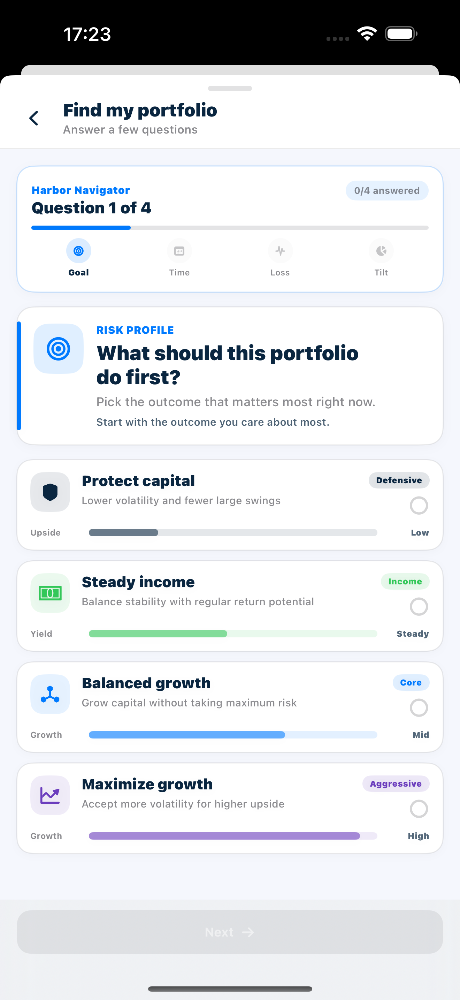

**Screenshot** — PORT-US3-01：问卷进入 Question 2 后的进度状态，显示已完成 Goal、当前 Time step、`1/4 answered` 和 horizon options。

#### 3.2 观察实时建议生成

1. 保持生成页面可见，直至建议完成。
2. 阅读变化中的进度步骤和待定结果占位符。
3. 在生成完成前确认没有可用的保存操作。

**Screenshot** — PORT-US3-02：Recommendation 正在生成的 Step 4，显示 progress、pending header/holdings、loading projection 和 pending metrics。

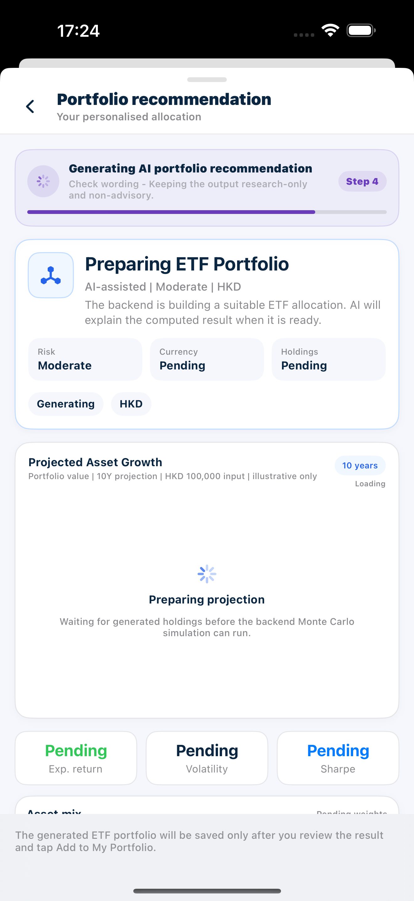

#### 3.3 核验生成的 Recommendation 详情

1. 查看结果头部和画像指标。
2. 操作一次共享预测图，包括一次回测。
3. 展开 Recommendation build。
4. 阅读说明和 ETF 持仓。
5. 选择 Back to adjust answers，修改一个答案，重新生成并确认结果已重新计算。

**Screenshot** — PORT-US3-03：生成完成的 `Growth Focus ETF Portfolio`，包含 AI-assisted/risk/currency/holdings 头部、projection 和 `Add to My Portfolio`。

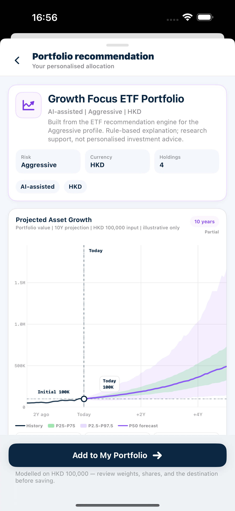

**Screenshot** — Recommendation 的 expected return、volatility、Sharpe、asset mix、generated weights 和 `Recommendation build`。

**Screenshot** — `How this was built` 的 screening process、holdings table、portfolio characteristics 和 constraint note。

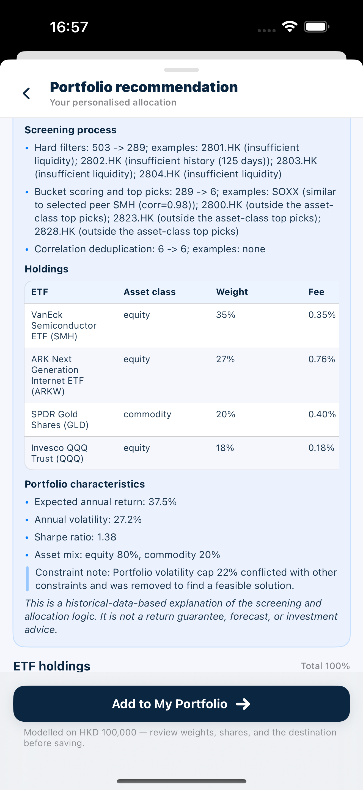

**Screenshot** — 生成结果的完整 `ETF holdings`、target weights、deterministic-engine disclosure 和 `Back to adjust answers`。

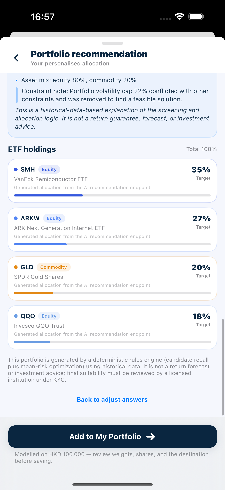

#### 3.4 审阅并保存 Recommendation

1. 选择 Add to My Portfolio。
2. 返回 Recommendation 一次，确认尚未产生新的 My Portfolio；重新进入添加页并进行一项可识别的 Visual 或 List 编辑。
3. 使用 Add as new 创建 My Portfolio，并从 My portfolios 打开核验。
4. 重新生成 Recommendation，再使用 Add to existing 更新一个包含重叠代码的 My Portfolio；打开目标核验合并结果。

> **Fallback：** 若 AI 文案调用失败，ETF 筛选、优化、持仓、预测和保存流程仍保持可用；说明改为确定性的 `How this was built` 内容，不显示 `AI-generated` 徽标，也不把确定性内容表述为 AI 生成。

**Screenshot** — PORT-US3-04：Recommendation 的 `Add to existing` 目标选择页，展示可选 My Portfolio、value、holdings count、asset mix 和 drift。

**Screenshot** — Recommendation 进入 `Add to My Portfolio` 后的 Visual editor，下一步可选择 `Add to existing` 或 `Add as new`。

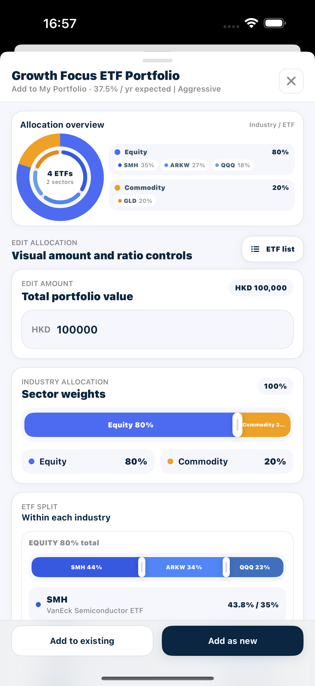

### Acceptance Criteria

| ID | Requirement | Reference | Ownership | Priority |
| --- | --- | --- | --- | --- |
| US3-AC01 | 问卷恰好显示四个进度步骤及当前问题/已回答数量。 | US-PORT-03 / 3.1 | Integration | Must |
| US3-AC02 | 每个问题均展示辅助文本和可选择的选项卡，含标签、详情、徽标及风险/强度背景。 | US-PORT-03 / 3.1 | Integration | Must |
| US3-AC03 | 在当前问题已有答案前，Next/See recommendation 始终禁用。 | US-PORT-03 / 3.1 | Integration | Must |
| US3-AC04 | 每个问题仅可选择一个选项，且 Back/Next 导航保留所有先前答案。 | US-PORT-03 / 3.1 | Integration | Must |
| US3-AC05 | 完成问卷后，结果页显示由答案组合得出的风险等级——Conservative、Moderate、Growth 或 Opportunistic——并进入该等级对应的建议生成状态。 | US-PORT-03 / 3.1 | Integration | Must |
| US3-AC06 | 页面立即进入可见的生成状态；不得短暂显示上一次运行留下的过期建议。 | US-PORT-03 / 3.2 | Integration | Must |
| US3-AC07 | 进度传达四个阶段：Screen ETF universe、Optimize allocation、Draft AI explanation、Check wording。 | US-PORT-03 / 3.2 | Integration | Must |
| US3-AC08 | 待定的头部、预测、构建、说明和 ETF 行均清楚标记为生成中/待定，而非填入虚构的最终数值。 | US-PORT-03 / 3.2 | Integration | Must |
| US3-AC09 | 在存在明确 Recommendation 结果前，保存操作不可用。 | US-PORT-03 / 3.2 | Integration | Must |
| US3-AC10 | 头部展示生成结果的标题、风险等级、基础货币、持仓数和 AI 辅助/仅供研究摘要。 | US-PORT-03 / 3.3 | Integration | Must |
| US3-AC11 | 预期年化回报、波动率、夏普比率、资产类别配置、ETF 数量和生成权重均来自返回的建议。 | US-PORT-03 / 3.3 | Integration | Must |
| US3-AC12 | 预测基于生成的 ETF 权重和建模金额计算，并满足用户故事 1 中确立的交互标准。 | US-PORT-03 / 3.3 | Integration | Must |
| US3-AC13 | Recommendation Build 展示本次构建的风险画像、筛选与优化摘要、截至日期、候选范围、删除原因和警告，并与最终 ETF 持仓对应。 | US-PORT-03 / 3.3 | Integration | Must |
| US3-AC14 | AI 生成时，说明标记为 AI-generated，并能渲染段落、强调、项目符号、引用和表格，且不显示原始 Markdown 标记。 | US-PORT-03 / 3.3 | Integration | Must |
| US3-AC15 | 说明内容与本次 Recommendation Build 和生成持仓一致，并清楚说明历史数据、研究用途和非收益保证边界。 | US-PORT-03 / 3.3 | Integration | Must |
| US3-AC16 | ETF 行展示代码、名称、资产类别、生成的目标权重和进度；显示权重在舍入容差内合计 100%。 | US-PORT-03 / 3.3 | Integration | Must |
| US3-AC17 | 返回问卷保留当前答案。重新生成会清除先前建议，并在新结果前显示生成状态。 | US-PORT-03 / 3.3 | Integration | Must |
| US3-AC18 | Recommendation 全程标明 AI 辅助和仅供研究；在用户明确选择 Add to My Portfolio 并完成确认前，不会保存到 My portfolios。 | US-PORT-03 / 3.3 | Integration | Must |
| US3-AC19 | 添加页面使用生成的建议、建模金额、基础货币和可用的最新 ETF 价格。 | US-PORT-03 / 3.4 | Integration | Must |
| US3-AC20 | Visual/List 编辑以及两种目标选项均符合操作 1.5–1.7 的标准。 | US-PORT-03 / 3.4 | Integration | Must |
| US3-AC21 | 使用 Add as new 时显示确认，且新 My Portfolio 以预期的名称、基础货币和持仓数出现在 My portfolios 中。 | US-PORT-03 / 3.4 | Integration | Must |
| US3-AC22 | 使用 Add to existing 会合并数量：新代码被添加，已有代码获得相加后的数量和加权成本。 | US-PORT-03 / 3.4 | Integration | Must |
| US3-AC23 | 仅打开添加页或返回 Recommendation 不会写入 My portfolios；只有完成目标选择和确认后才产生对应保存结果。 | US-PORT-03 / 3.4 | Integration | Must |
---

## User Story 4 - 分析 Portfolio 并审阅 AI 建议

**Story ID:** `US-PORT-04`  
**用户故事：** 作为用户，我希望分析 My Portfolio 或 Model Portfolio 的工作草稿，选择重要的诊断问题，并审阅 AI 辅助的考虑因素和量化 `Suggested actions`；当来源是 My Portfolio 时，我还可以编辑并应用这些操作。  
**Video:** [US-PORT-04 验收视频](https://jjpvro70sief.jp.larksuite.com/wiki/Ey4Bw3xDxiPeETk3yBBjhxOHpdf)

本 story 先以 `UAT Analysis Portfolio` 演示完整的编辑与应用流程；操作 4.6 再以 Model Portfolio 重跑 `Analysis Workflow`。Model Portfolio 不是用户持久化配置，因此结果只提供只读 `Suggested actions`，不提供编辑或应用控件。

### Walkthrough

#### 4.1 以草稿持仓打开 My Portfolio

1. 打开 UAT Analysis Portfolio。
2. 选择 Start analysis。
3. 查看预加载的草稿持仓，并尝试进入尚未解锁的 Analysis 和 Suggestions。
4. 在草稿中分别使用步进按钮和直接输入修改数量；直接输入后选择勾选确认。
5. 在 Add ETF 中搜索一个已添加代码，再添加一只有效 ETF，并移除另一只 ETF。
6. **草稿隔离检查：**选择 Clear all，确认空草稿不能运行分析；关闭且不执行应用，重新打开 My Portfolio 验证已保存持仓未变。

**Screenshot** — PORT-US4-01：`Draft Portfolio > Holdings` 的 analysis 前可编辑草稿，包含 shares 输入与步进控件、删除操作、`Add ETF`、尚未解锁的 `Analysis / Suggestions`，以及 `Analyze draft portfolio`。

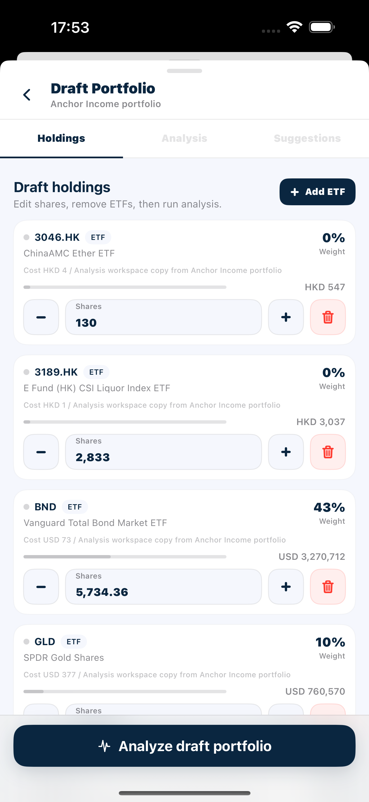

#### 4.2 运行分析并检查结果

1. 选择 `Analyze draft portfolio`。
2. 观察分析进度状态。
3. 查看 `Analysis overview`、Holdings、`Exposure breakdown` 和 `Diagnosis`。
4. 在 `Pie` 和 `List` 之间切换 `Exposure breakdown`。
5. 水平滚动 Holdings 表。
6. 阅读当前结果中自然显示的 Data coverage 及其受影响指标说明。

**Screenshot** — PORT-US4-02：`Draft Portfolio > Analysis`，包含 `Data coverage`、`Analysis overview`、score、value/positions、HHI、Effective N 和多维 diagnostics。

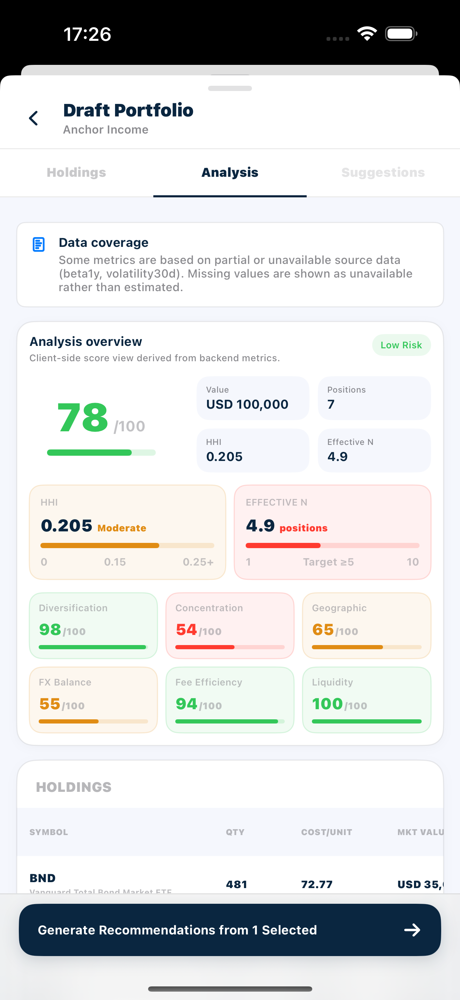

**Screenshot** — Analysis 结果中的 read-only Holdings table 和 `Exposure breakdown`；该表不是运行分析前的 editable Holdings 草稿。

#### 4.3 选择诊断范围并生成建议

1. 查看所有诊断项。
2. 至少取消选择一项，再重新选择另一项。
3. 临时取消选择全部项目，然后恢复至少一项。
4. 选择 `Generate Recommendations from <n> Selected`；其中 `<n>` 与当前 selected diagnosis 数量一致。

**Screenshot** — PORT-US4-03：`Exposure breakdown` 的 Sector/Region/Currency，以及 `Diagnosis` 的 Found/Selected/Hidden counts、selected finding 和 generate action。

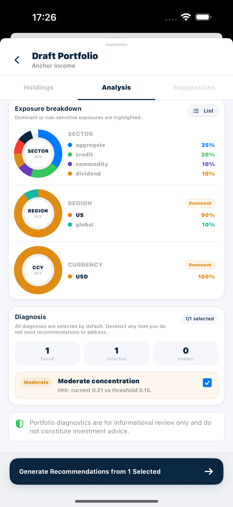

#### 4.4 审阅 AI 考虑因素和 `Suggested actions`

1. 查看所选问题范围。
2. 阅读返回的考虑因素卡片和前后信息。
3. 查看量化 `Suggested actions` 和任何新增候选 ETF。
4. 返回 Holdings 修改数量，确认旧 Analysis 和 Suggestions 被清除并重新锁定。

**Screenshot** — PORT-US4-04：`Suggestions` 中的 selected diagnosis scope、`AI drafted` boundary、research consideration、candidate pool 和量化 `Suggested actions` preview。

#### 4.5 编辑、重置并应用 `Suggested actions`

1. 用 +/− 修改一个目标份额值，并用直接输入修改另一个。
2. 输入一次负目标，确认无法保留，再选择 Reset，确认计算目标恢复。
3. 再编辑一个值，并选择 Apply to My Portfolio。
4. 重新打开 My Portfolio 详情。

#### 4.6 核验 Model Portfolio 的只读 `Suggested actions`

1. 返回 Recommended，打开一个已发布的 Model Portfolio，并选择 Start analysis。
2. 核对 `Analysis Workspace` 以该 Model Portfolio 的配置预加载草稿持仓，然后选择 `Analyze draft portfolio`。
3. 分析完成后保留至少一个诊断项，选择 `Generate Recommendations from <n> Selected`，并等待进入 `Suggestions`。
4. 浏览 AI 考虑因素和完整 `Suggested actions` 列表。
5. 查看 action 行的 Current、Target 和 Change，确认没有 Target shares 编辑控件、Reset 或 Apply to My Portfolio。
6. 关闭 Analysis Workspace，重新打开该 Model Portfolio，确认其发布配置未发生变化。

> **Fallback：** 若 AI 建议调用失败，系统会显示确定性的研究考虑因素，并明确标注为 `AI recommendations fallback`，不会显示 `AI drafted` 或将规则内容表述为 AI 生成。量化 `Suggested actions` 仍由算法预览提供。

### Acceptance Criteria

| ID | Requirement | Reference | Ownership | Priority |
| --- | --- | --- | --- | --- |
| US4-AC01 | Analysis Workspace 在 Holdings 中打开，标明来源 My Portfolio，并预加载其已保存的 ETF 持仓、数量、成本、价值和权重。 | US-PORT-04 / 4.1 | Integration | Must |
| US4-AC02 | 在存在分析前，Analysis 保持锁定；在存在建议前，Suggestions 保持锁定。 | US-PORT-04 / 4.1 | Integration | Must |
| US4-AC03 | +/− 会立即更新草稿；直接输入仅在数值变化时显示勾选确认。确认后重算价值和权重、清除旧分析/建议，且不修改已保存的 My Portfolio。 | US-PORT-04 / 4.1 | Integration | Must |
| US4-AC04 | Add ETF 支持目录搜索和排序控件；重复项标记为 Added 且无法再次添加，有效的新 ETF 可加入当前草稿。 | US-PORT-04 / 4.1 | Integration | Must |
| US4-AC05 | 移除 ETF 或 Clear all 仅影响工作草稿，直至显式执行 Apply to My Portfolio。 | US-PORT-04 / 4.1 | Integration | Must |
| US4-AC06 | 草稿为空时 `Analyze draft portfolio` 被禁用；分析运行期间只显示进度，不提供第二个分析操作。 | US-PORT-04 / 4.1 | Integration | Must |
| US4-AC07 | `Analyze draft portfolio` 切换至 `Analysis` 标签，并持续显示进度，直至当前草稿的分析完成或失败。 | US-PORT-04 / 4.2 | Integration | Must |
| US4-AC08 | 完成后的概览展示当前草稿可用的总价值/基础货币、头寸数、HHI、Effective N、分散化、集中度、地域、外汇、费用效率和流动性信息。 | US-PORT-04 / 4.2 | Integration | Must |
| US4-AC09 | 不可用指标显示为 Unavailable/—；若可用数据不足以形成总体评分，该评分同样显示为不可用，不得以零值代替。 | US-PORT-04 / 4.2 | Integration | Must |
| US4-AC10 | Holdings 表显示 Symbol、QTY、COST/UNIT、MKT VALUE、WEIGHT 和 CCY，并可横向滚动；不可用值显示为 —，不显示占位收益。 | US-PORT-04 / 4.2 | Integration | Must |
| US4-AC11 | `Exposure breakdown` 显示 Sector、Region 和 Currency，并使用同一数据在 `Pie` 和 `List` 间一致切换。 | US-PORT-04 / 4.2 | Integration | Must |
| US4-AC12 | 分析免责声明始终可见；响应包含部分/不可用指标或 warning 时，页面显示蓝色 Data coverage，说明受影响的数据范围，而不将其称为 AI fallback。 | US-PORT-04 / 4.2 | Integration | Must |
| US4-AC13 | 当前结果只对应本次草稿；后续返回 Holdings 修改数量时，旧 Analysis 和 Suggestions 会被清除并重新锁定。 | US-PORT-04 / 4.2 | Integration | Must |
| US4-AC14 | 诊断项展示严重性、标题、指标/阈值和选择状态，返回项默认全选。 | US-PORT-04 / 4.3 | Integration | Must |
| US4-AC15 | 当前分析返回的诊断项数量、严重程度和选中状态与页面计数一致。 | US-PORT-04 / 4.3 | Integration | Must |
| US4-AC16 | 切换诊断项后，Found/Selected/Hidden 计数立即更新；生成结果列出的诊断范围仅包含提交时选中的项目。 | US-PORT-04 / 4.3 | Integration | Must |
| US4-AC17 | 选择零项时，UI 指示用户至少选择一项，且 `Generate Recommendations from <n> Selected` 被禁用。 | US-PORT-04 / 4.3 | Integration | Must |
| US4-AC18 | 分析尚未完成时生成 recommendation 的操作不可用；建议生成期间只显示生成进度，不提供可再次触发的生成操作。 | US-PORT-04 / 4.3 | Integration | Must |
| US4-AC19 | 生成切换至 Suggestions，并显示四个进度阶段：Read selected diagnosis、Draft considerations、Apply safety guard、Prepare preview。 | US-PORT-04 / 4.3 | Integration | Must |
| US4-AC20 | 结果标明用于生成建议的诊断项。 | US-PORT-04 / 4.4 | Integration | Must |
| US4-AC21 | AI 生成的考虑因素显示 AI drafted，并带有研究用途和 AI 可能出错的提示。 | US-PORT-04 / 4.4 | Integration | Must |
| US4-AC22 | 考虑因素只覆盖提交时选中的诊断项；未选中的诊断不会出现在本次建议范围和对应考虑因素中。 | US-PORT-04 / 4.4 | Integration | Must |
| US4-AC23 | 每项考虑因素展示观察、理由、预期影响、置信度、相关问题和仅供研究措辞，不含订单执行语言。 | US-PORT-04 / 4.4 | Integration | Must |
| US4-AC24 | `Suggested actions` 展示可行性、行数、换手率、新增候选数量/代码及风险等级。 | US-PORT-04 / 4.4 | Integration | Must |
| US4-AC25 | 每个 Suggested Action 行展示代码/名称、Held/New 状态、当前份额/权重、目标份额/权重、数量和价值差额，以及 Model target 比较。 | US-PORT-04 / 4.4 | Integration | Must |
| US4-AC26 | `Suggested actions` 支持滚动查看全部 Held/New 行，并在编辑目标后立即更新对应的数量和价值差额。 | US-PORT-04 / 4.4 | Integration | Must |
| US4-AC27 | Recommendation candidate pool 仅展示当前建议流程允许考虑的 ETF 代码，并与 `Suggested actions` 中的新增候选对应。 | US-PORT-04 / 4.4 | Integration | Must |
| US4-AC28 | 目标份额仅接受非负值，并重新计算目标权重、份额差、权重差和价值差。 | US-PORT-04 / 4.5 | Integration | Must |
| US4-AC29 | Reset 清除用户覆盖值，并恢复预览最初给出的目标方案。 | US-PORT-04 / 4.5 | Integration | Must |
| US4-AC30 | Apply to My Portfolio 仅在来源为 My Portfolio、方案可行、存在可显示操作行、价格查询完成且所有正目标都有可用价格时启用；不满足条件时保持禁用。 | US-PORT-04 / 4.5 | Integration | Must |
| US4-AC31 | 应用会以编辑后的正目标更新已保存持仓，保留未受影响的有效持仓，关闭工作区并刷新详情。 | US-PORT-04 / 4.5 | Integration | Must |
| US4-AC32 | 重新打开可证明数量和权重/价值已更新；先前分析/建议不再被视为对修改后的持仓有效。 | US-PORT-04 / 4.5 | Integration | Must |
| US4-AC33 | Apply to My Portfolio 请求进行中时不可重复触发；成功后只产生一次持仓更新并返回刷新后的详情。 | US-PORT-04 / 4.5 | Integration | Must |
| US4-AC34 | Model Portfolio 可以作为草稿来源完成 Holdings、Analysis、Diagnosis 和 Suggestions 的同一套 Analysis Workflow。 | US-PORT-04 / 4.6 | Integration | Must |
| US4-AC35 | `Suggestions` 展示本次选定的诊断范围、AI 考虑因素和量化 `Suggested actions`，不会仅因来源为 Model Portfolio 而跳过结果。 | US-PORT-04 / 4.6 | Integration | Must |
| US4-AC36 | Model Portfolio 的 `Suggested actions` 以只读列表展示，每行可查看 Current、Target、Change 和价值差额，但不提供 Target shares 输入或步进控件。 | US-PORT-04 / 4.6 | Integration | Must |
| US4-AC37 | Model Portfolio 结果不显示 Reset 或 Apply to My Portfolio；关闭工作区不会修改该 Model Portfolio，也不会创建或更新 My Portfolio。 | US-PORT-04 / 4.6 | Integration | Must |
---

## User Story 5 - 根据 Baseline Snapshot 审阅

**Story ID:** `US-PORT-05`  
**用户故事：** 作为用户，我希望将今天的 My Portfolio 与有效的历史 Baseline Snapshot 比较，了解配置偏离，编辑基于 Baseline Snapshot 的调整方案并应用。  
**Video:** [US-PORT-05 验收视频](https://jjpvro70sief.jp.larksuite.com/wiki/H1ULwBLKeiaEIKkEbQDjhRiepue)

本 story 使用 Story 2 中准备的两个测试快照：

- `UAT Current State`：与当前 My Portfolio 相同，因此不可审阅。
- `UAT Before Edit`：与当前 My Portfolio 不同，因此可审阅。

### Walkthrough

#### 5.1 证明无变化的 Baseline Snapshot 不可审阅

1. 打开 UAT Review Portfolio，并在完成本故事前不做任何无关编辑。
2. 选择 Portfolio review，先选中 UAT Before Edit。
3. 在 Baseline 标签上点击 UAT Current State，观察选择是否改变。
4. 展开再折叠 UAT Current State 的 Show ETF details。

**Screenshot** — PORT-US5-01：`Portfolio Review > Baseline`，同时显示 `No changes` snapshot、selected snapshot、ETF summary 和 `Review allocation changes`。

#### 5.2 选择有变化的 Baseline Snapshot 并检查偏离

1. 选择 UAT Before Edit。
2. 展开和折叠其 ETF 详情。
3. 查看 Baseline Snapshot 摘要和偏离表。
4. 选择 Review allocation changes。

**Screenshot** — PORT-US5-02：所选 Baseline Snapshot 的 current/baseline value、absolute drift 和 `Holding drift` table，逐行比较 Now、Baseline 和 Drift。

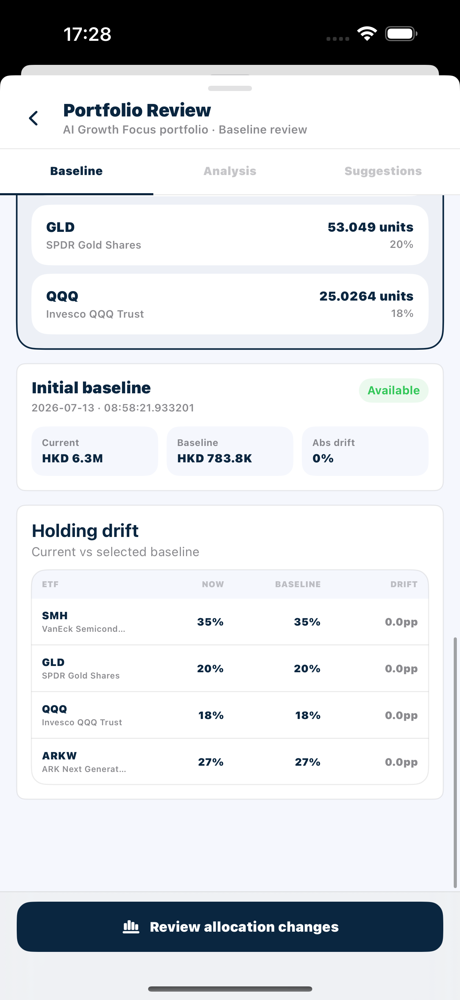

#### 5.3 审阅 Baseline Snapshot 分析

1. 在 Analysis 中阅读状态和驱动因素摘要。
2. 查看行业配置变动、ETF 变动详情和数量变动。
3. 选择 View adjustment suggestions。

**Screenshot** — PORT-US5-03：Baseline comparison 的 `Analysis`，包含 status、allocation drift、current/baseline values、largest move 和 driver summary。

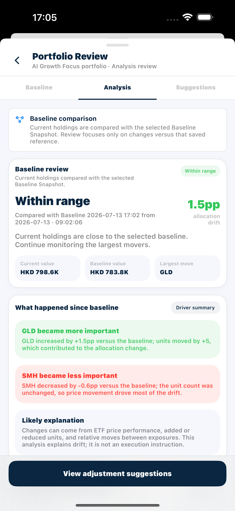

**Screenshot** — `Industry allocation changes`、`ETF movement detail` 和 quantity-difference summary。

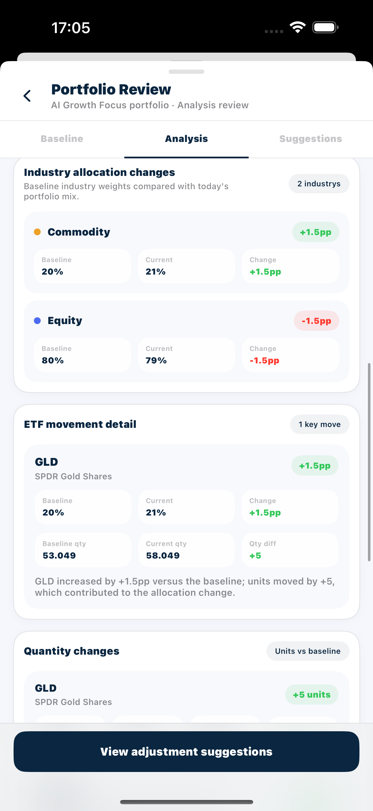

**Screenshot** — `Quantity changes` 中各 ETF 的 baseline/current/target quantities 和 value differences。

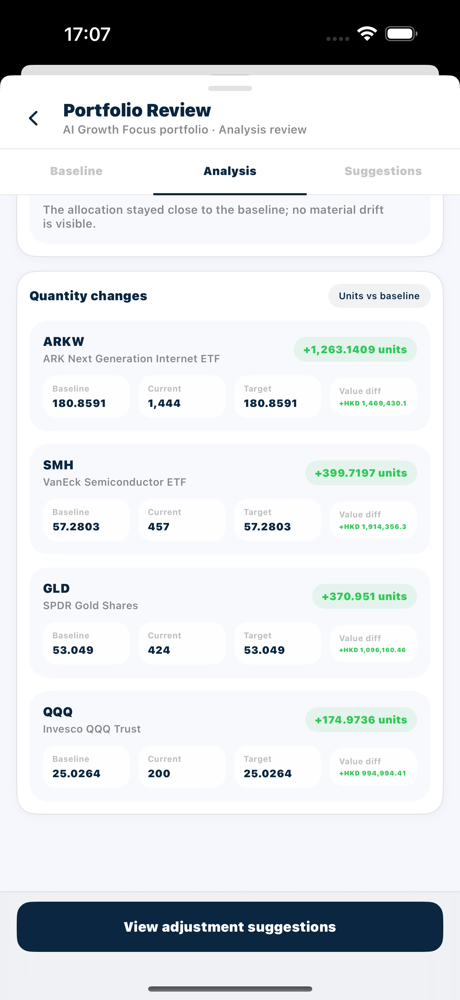

#### 5.4 编辑并应用 Baseline Snapshot 调整方案

1. 在 Suggestions 中查看所选 Baseline Snapshot 的范围和预览。
2. 在预览加载时确认旧方案不可见且应用按钮禁用；加载完成后检查当前持仓独有和 Baseline Snapshot 独有的 ETF 行。
3. 用 +/− 修改一个目标，并用直接输入修改另一个；输入一次负目标并确认无法保留。
4. 选择 Reset suggestion，然后再次编辑一个有效目标。
5. 选择 Apply to My Portfolio，重新打开 My Portfolio 并再次打开 Portfolio Review。

**Screenshot** — PORT-US5-04：可编辑的 baseline-based `Recommended ETF changes`，包含 target-share controls、`Reset suggestion` 和 `Apply to My Portfolio`。

### Acceptance Criteria

| ID | Requirement | Reference | Ownership | Priority |
| --- | --- | --- | --- | --- |
| US5-AC01 | Portfolio Review 在 Baseline 标签打开，且仅列出该 My Portfolio 保存的快照。 | US-PORT-05 / 5.1 | Integration | Must |
| US5-AC02 | UI 说明 Baseline Snapshot 是已保存的参考配置，而不是手动配置的目标。 | US-PORT-05 / 5.1 | Integration | Must |
| US5-AC03 | UAT Current State 明显禁用/变暗，标记为 No changes，并说明当前持仓与 Baseline Snapshot 相同。 | US-PORT-05 / 5.1 | Integration | Must |
| US5-AC04 | 先选中 UAT Before Edit 再点击无变化的 Baseline Snapshot 时，UAT Current State 不会被选中，原选择保持不变。 | US-PORT-05 / 5.1 | Integration | Must |
| US5-AC05 | 标记为 No changes 的 Baseline Snapshot 不会提供进入 Analysis 的操作，且页面说明其持仓与当前状态一致。 | US-PORT-05 / 5.1 | Integration | Must |
| US5-AC06 | 即使 Baseline Snapshot 无法选中以供审阅，Show ETF details 仍可用于检查。 | US-PORT-05 / 5.1 | Integration | Must |
| US5-AC07 | 有变化的 Baseline Snapshot 变为 Selected，并获得选中样式。 | US-PORT-05 / 5.2 | Integration | Must |
| US5-AC08 | 展开的详情展示保存的 ETF 数量和权重；折叠仅隐藏详情面板。 | US-PORT-05 / 5.2 | Integration | Must |
| US5-AC09 | 偏离结果同时列出新增和已移除的 ETF，不得因某代码只存在于当前持仓或 Baseline Snapshot 中而遗漏。 | US-PORT-05 / 5.2 | Integration | Must |
| US5-AC10 | 偏离表按重大变动排序，展示每个代码的 Baseline Snapshot 权重、当前权重、数量差和带符号的权重偏离。 | US-PORT-05 / 5.2 | Integration | Must |
| US5-AC11 | 摘要标明所选 Baseline Snapshot 的名称、日期及总绝对偏离；Review allocation changes 现已启用。 | US-PORT-05 / 5.2 | Integration | Must |
| US5-AC12 | Analysis 清楚标明正在比较当前持仓与所选 Baseline Snapshot。 | US-PORT-05 / 5.3 | Integration | Must |
| US5-AC13 | Analysis 显示 Within range、Monitor drift 或 Review recommended 状态，并展示当前价值、Baseline Snapshot 价值、最大变动和百分点偏离。 | US-PORT-05 / 5.3 | Integration | Must |
| US5-AC14 | `Driver summary` 标识最大增加/减少的敞口，并说明价格变动和/或数量变动是否有贡献。 | US-PORT-05 / 5.3 | Integration | Must |
| US5-AC15 | `Industry allocation changes` 按 ETF 资产类别汇总 Baseline Snapshot 权重和当前权重，并展示带符号的偏离。 | US-PORT-05 / 5.3 | Integration | Must |
| US5-AC16 | `ETF movement detail` 展示 Baseline Snapshot 权重、当前权重和数量，以及每项重大变动的通俗原因。 | US-PORT-05 / 5.3 | Integration | Must |
| US5-AC17 | `Quantity changes` 为关键行展示 Baseline Snapshot 数量、当前数量、目标数量、单位差和价值差。 | US-PORT-05 / 5.3 | Integration | Must |
| US5-AC18 | Baseline Snapshot 比较不得显示 AI-generated、AI drafted 等 AI 标记，并明确呈现为基于所选快照的配置比较。 | US-PORT-05 / 5.3 | Integration | Must |
| US5-AC19 | Suggestions 仅在所选 Baseline Snapshot 的预览加载完成后显示目标方案；加载或切换范围时不显示上一份过期预览。 | US-PORT-05 / 5.4 | Integration | Must |
| US5-AC20 | 范围卡点名 Baseline Snapshot，并报告变更行数和总行数。 | US-PORT-05 / 5.4 | Integration | Must |
| US5-AC21 | 目标行展示当前份额/权重、Baseline Snapshot 权重、计算出的目标份额/权重、带符号的变动、价值差和 Hold/Adjust 状态。 | US-PORT-05 / 5.4 | Integration | Must |
| US5-AC22 | 默认方案按所选 Baseline Snapshot 生成可审阅的目标份额；Baseline Snapshot 中不存在的 ETF 可显示为零目标。 | US-PORT-05 / 5.4 | Integration | Must |
| US5-AC23 | 目标值可编辑、非负，并立即重新计算显示的权重和差额。 | US-PORT-05 / 5.4 | Integration | Must |
| US5-AC24 | Reset suggestion 移除覆盖值，并重新设定计算出的默认目标。 | US-PORT-05 / 5.4 | Integration | Must |
| US5-AC25 | 在目标计算完成前 Apply to My Portfolio 被禁用；目标方案可用后才允许提交。 | US-PORT-05 / 5.4 | Integration | Must |
| US5-AC26 | Apply to My Portfolio 成功后关闭审阅并刷新 My Portfolio 详情，详情显示已更新的保存持仓。 | US-PORT-05 / 5.4 | Integration | Must |
| US5-AC27 | 重新打开可证明已应用目标份额，且此前选中的 Baseline Snapshot 显示更新后的比较结果。 | US-PORT-05 / 5.4 | Integration | Must |
| US5-AC28 | Apply to My Portfolio 请求进行中时不可重复触发；完成后只产生一次持仓更新，重新打开详情和 Portfolio Review 均显示同一最终状态。 | US-PORT-05 / 5.4 | Integration | Must |
