# Portfolio Module

## 模块说明

Portfolio 模块提供仅供研究的工作流：发现 `Model Portfolio`、维护 `My Portfolio`、生成 `AI Portfolio Recommendation`、分析 portfolio 草稿，以及根据历史 `Baseline Snapshot` 审阅已保存的 `My Portfolio`。

模块由三个入口标签组织：`Recommended` 用于浏览管理员维护的 Model Portfolio 并开始 recommendation quiz；`My portfolios` 用于创建、查看、编辑、删除、分析和审阅用户保存的 portfolio；`Watchlist` 用于查看与移除用户保存供日后参考的 Model Portfolio。

> 范围说明：本模块中的预测、分析、Recommendation 和 `Suggested actions` 仅供研究，不代表收益保证，也不会触发券商订单或交易执行。

## User Story / Video 索引

| Story | 视频主题 | 核心路径 | Video |
| --- | --- | --- | --- |
| [US-PORT-01](#us-port-01) | 探索并保存 Model Portfolio | `Recommended` -> `Model Portfolio` -> `Watchlist` / `My Portfolio` | [视频](https://jjpvro70sief.jp.larksuite.com/wiki/SjhpwcDNLirUxpkHh1vjUbgqphY) |
| [US-PORT-02](#us-port-02) | 创建、编辑和维护 My Portfolio | `My portfolios` -> `Edit` / `Baseline snapshots` | [视频](https://jjpvro70sief.jp.larksuite.com/wiki/I9gxw6Uugiw5RxkSJ91jVHKipMf) |
| [US-PORT-03](#us-port-03) | 生成 AI Portfolio Recommendation | `Find Your Ideal Portfolio` -> `Portfolio recommendation` | [视频](https://jjpvro70sief.jp.larksuite.com/wiki/NSZ1wCHloiD8QAkYSDsj9CNtpje) |
| [US-PORT-04](#us-port-04) | 分析 Portfolio 并审阅 AI 建议 | `Draft Portfolio` -> `Analysis` -> `Suggestions` | [视频](https://jjpvro70sief.jp.larksuite.com/wiki/Ey4Bw3xDxiPeETk3yBBjhxOHpdf) |
| [US-PORT-05](#us-port-05) | 根据 Baseline Snapshot 审阅 | `Portfolio Review` -> `Baseline` -> `Analysis` -> `Suggestions` | [视频](https://jjpvro70sief.jp.larksuite.com/wiki/H1ULwBLKeiaEIKkEbQDjhRiepue) |

## 统一术语

| UI 原文 | 文档含义 |
| --- | --- |
| `Model Portfolio` | 由管理员维护并发布的 portfolio template，不是用户持久化配置 |
| `My Portfolio` / `My portfolios` | 用户创建并保存的研究型 portfolio，以及其列表标签 |
| `Watchlist` | 用户保存供日后参考的 Model Portfolio 列表 |
| `Add to My Portfolio` | 将 Model Portfolio 或 Recommendation 转为新的或合并到已有 My Portfolio |
| `Baseline Snapshot` | 某个 My Portfolio 在特定时间保存的持仓、数量、价值和权重参考配置 |
| `Baseline History` / `Baseline snapshots` | 管理 Baseline Snapshot 的历史抽屉/页面 |
| `Analysis Workspace` | 对 portfolio 工作草稿执行 Holdings、Analysis、Diagnosis、Suggestions 流程的工作区 |
| `Suggested actions` | 算法生成的量化调整预览；是否可编辑/应用取决于来源 |
| `Portfolio Review` | 将当前 My Portfolio 与所选 Baseline Snapshot 比较的工作流 |
| `Recommendation Build` | 展示 Recommendation 的风险画像、筛选、优化、候选范围和警告 |
| `Data coverage` / `Unavailable` / `Partial` | 数据不完整或指标不可用时的明确边界状态 |

---

## User Story 1 - 探索并保存 Model Portfolio

**Story ID:** `US-PORT-01`  
**用户故事：** 作为用户，我希望检查精选的 Model Portfolio，了解其配置和示意性预测，将其保存以便稍后参考，并使用 Add to My Portfolio。  
**Video:** [US-PORT-01 验收视频](https://jjpvro70sief.jp.larksuite.com/wiki/SjhpwcDNLirUxpkHh1vjUbgqphY)

### Walkthrough

1. 打开 `Portfolio > Recommended`，浏览 Model Portfolio 卡片及其 `Reference` 说明。

**Screenshot** — PORT-US1-01：`Recommended` 目录、recommendation quiz 入口、Model Portfolio cards、allocation mix 和 `Reference`。

2. 打开一个 Model Portfolio，查看回报、风险、期限、配置和 ETF allocations。

**Screenshot** — PORT-US1-02：`Anchor Income` Model Portfolio 详情，包含 return/risk/horizon、`Reference`、allocation map 和 projection 入口。

**Screenshot** — `Anchor Income` 的 `ETF allocation` 列表、ETF metadata、target weights 和 `Total 100%`。

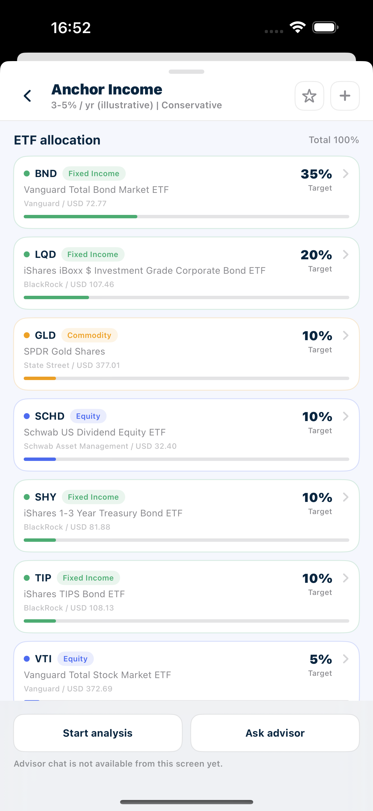

3. 浏览 `Projected Asset Growth`，操作时间范围和历史数据点，并查看可用的 backtest 与 data coverage。

**Screenshot** — PORT-US1-03：`Projected Asset Growth` 完成态，包含 history、P50、P25-P75、P2.5-P97.5、Today crosshair、summary 和 `Partial` data warning。

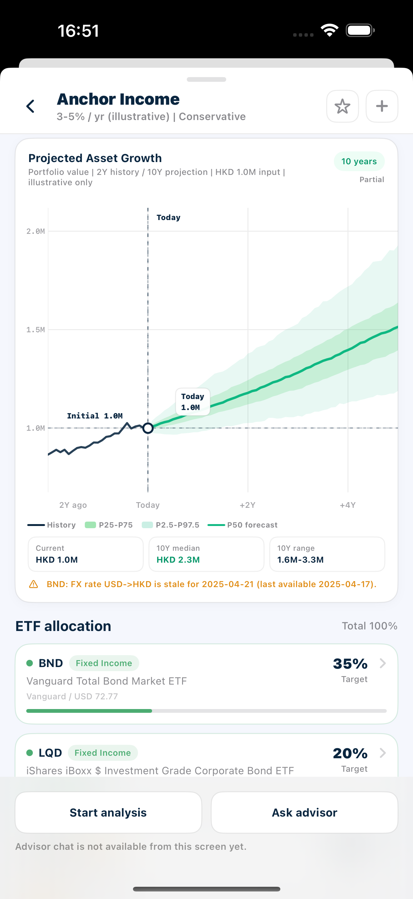

4. 将 Model Portfolio 保存到 `Watchlist`，确认可以从 Watchlist 重新打开或移除。

**Screenshot** — PORT-US1-04：`Watchlist` 中已保存的 `Anchor Income` Model Portfolio，包含 saved count、事实信息、allocation 和 `Reference`。

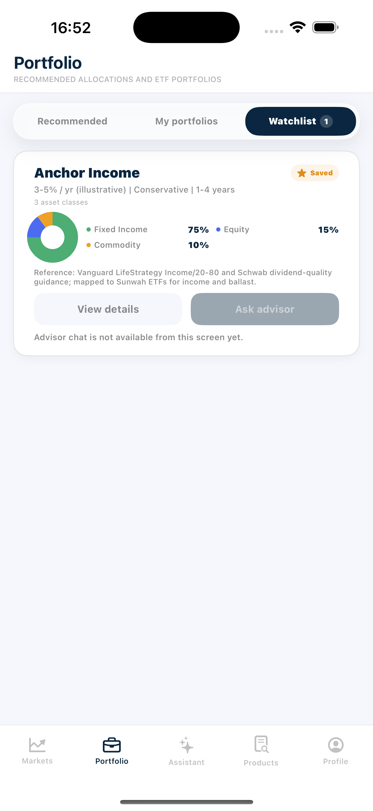

5. 选择 `Add to My Portfolio`，在 `Visual` 和 `ETF list` 模式中审阅或调整金额、权重和份额。

**Screenshot** — PORT-US1-05：`Add to My Portfolio` 的 Visual editor，包含 allocation overview、total portfolio value、sector weights 和两个保存目标。

**Screenshot** — 同一配置切换到 `ETF list` 后的 direct-share editor，展示 industry groups、ETF rows 和 share steppers。

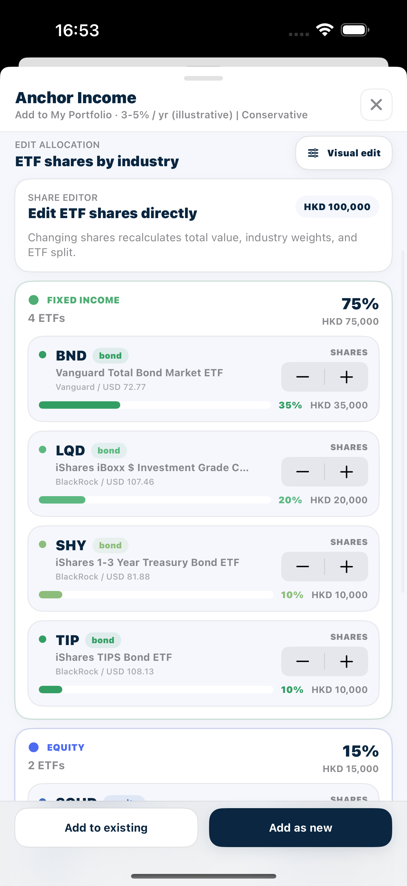

6. 使用 `Add as new` 创建新的 My Portfolio，并从 `My portfolios` 打开确认。
7. 使用 `Add to existing` 将配置加入已有 My Portfolio，并确认持仓结果更新。
8. 从 Model Portfolio 选择 `Start analysis`，浏览只读的分析与建议流程。

### Acceptance Criteria

| ID | Requirement | Reference | Ownership | Priority |
| --- | --- | --- | --- | --- |
| US1-AC01 | 可见 Portfolio 标题和三个标签——Recommended、My portfolios、Watchlist，且已选中 Recommended。 | US-PORT-01 | Integration | Must |
| US1-AC02 | 每张已加载的 Model Portfolio 卡片均使用后端数据展示标题、回报范围、风险等级标签、期限、资产类别数量和资产配置可视化。 | US-PORT-01 | Integration | Must |
| US1-AC03 | 每张 Model Portfolio 卡片显示与该 Model Portfolio 对应的 Reference 说明。 | US-PORT-01 | Integration | Must |
| US1-AC04 | View details 打开所选 Model Portfolio，而非其他目录项目。 | US-PORT-01 | Integration | Must |
| US1-AC05 | 首次打开或刷新 Model Portfolio 目录时显示加载状态；完成后以当前返回的 Model Portfolio 替换占位。 | US-PORT-01 | Integration | Must |
| US1-AC06 | 详情头部展示所选 Model Portfolio 的标题、回报、风险、期限和摘要。 | US-PORT-01 | Integration | Must |
| US1-AC07 | 详情事实值与目录卡片及当前 Model Portfolio 数据一致，不沿用先前打开的 Model Portfolio 内容。 | US-PORT-01 | Integration | Must |
| US1-AC08 | 参考说明以专用的来源/参考样式显示，并与目录卡片上的说明一致。 | US-PORT-01 | Integration | Must |
| US1-AC09 | 配置卡展示资产类别分组及其 ETF 代码；显示的 ETF 数量和资产类别数量与返回的详情一致。 | US-PORT-01 | Integration | Must |
| US1-AC10 | ETF 配置区显示 Total 100%，每行展示代码、名称、资产类别标签、目标权重，以及可用的发行方/最新价格/1 年回报元数据。 | US-PORT-01 | Integration | Must |
| US1-AC11 | 选择 ETF 行会打开匹配的 ETF 详情；返回仅关闭该浮层，不丢失 Model Portfolio 详情状态。 | US-PORT-01 | Integration | Must |
| US1-AC12 | 从 ETF 详情返回后仍停留在当前 Model Portfolio 详情，配置内容和已加载状态保持不变。 | US-PORT-01 | Integration | Must |
| US1-AC13 | 加载状态明确说明蒙特卡洛模拟正在运行；数据可用前，不得以编造的点显示图表。 | US-PORT-01 | Integration | Must |
| US1-AC14 | 图表区分历史、P50 预测、P25–P75 和 P2.5–P97.5 区间、Today、初始价值、轴标签及预测标注。 | US-PORT-01 | Integration | Must |
| US1-AC15 | 图表下方摘要值与图表的起始价值、配置期限、P50 终点及 P2.5–P97.5 范围一致。 | US-PORT-01 | Integration | Must |
| US1-AC16 | 水平拖动会改变可见时间线，同时使视图保持在可用的历史/预测范围内。 | US-PORT-01 | Integration | Must |
| US1-AC17 | 捏合会改变可见时间窗口；缩放至边界后不会显示可用日期范围外的数据，轴标签和绘制值不越出图表区域。 | US-PORT-01 | Integration | Must |
| US1-AC18 | 选择有效历史点显示对应时间和值的十字准线。仅历史偏移点可提供回测操作，未来预测点不可提供。 | US-PORT-01 | Integration | Must |
| US1-AC19 | Generate backtest 显示加载状态，随后添加含更新图例的回测百分位区间/中位数和实际序列。 | US-PORT-01 | Integration | Must |
| US1-AC20 | Hide backtest 移除生成的回测，但不移除原始历史或预测。 | US-PORT-01 | Integration | Must |
| US1-AC21 | 预测标记为 Partial 时显示对应的 Data coverage，并继续使用当前 Model Portfolio 的可用数据，不沿用其他 Model Portfolio 的图表结果。 | US-PORT-01 | Integration | Must |
| US1-AC22 | 预测明确描述为示意性/仅供研究，不得表述为保证的预测。 | US-PORT-01 | Integration | Must |
| US1-AC23 | 保存请求成功后，详情控件才从空心星标变为实心星标。 | US-PORT-01 | Integration | Must |
| US1-AC24 | Watchlist 计数增加，且 Model Portfolio 以相同标题、事实信息、配置和 Reference 出现在 Watchlist 中。 | US-PORT-01 | Integration | Must |
| US1-AC25 | 可从 Watchlist 打开已保存的 Model Portfolio。 | US-PORT-01 | Integration | Must |
| US1-AC26 | 移除已保存的 Model Portfolio 会使其从 Watchlist 消失并减少计数；当不再有已保存的 Model Portfolio 时，显示明确的 No portfolios saved 状态。 | US-PORT-01 | Integration | Must |
| US1-AC27 | 返回 Recommended 后再次打开同一 Model Portfolio，其星标状态与 Watchlist 中的最终保存状态一致。 | US-PORT-01 | Integration | Must |
| US1-AC28 | Add to My Portfolio 页面为所选 Model Portfolio 打开，并展示配置概览、Model Portfolio 标题、风险/回报背景及默认建模金额。 | US-PORT-01 | Integration | Must |
| US1-AC29 | 修改总价值会在保持当前归一化配置权重的前提下，重新计算 ETF 金额和数量。 | US-PORT-01 | Integration | Must |
| US1-AC30 | 拖动行业边界仅改变相邻两个分组；到达可拖动边界后继续拖动不再降低该分组，且各分组不出现负权重、总和保持 100%。 | US-PORT-01 | Integration | Must |
| US1-AC31 | 拖动 ETF 拆分会改变该分组内 ETF，保持分组总和不变，并更新组内及总体配置百分比。 | US-PORT-01 | Integration | Must |
| US1-AC32 | 从 Visual 切换至 List 模式时，当前金额和权重会按界面显示的最新价格转换为 ETF 份额；修改份额会重新计算总价值、分组权重、ETF 权重及配置可视化。 | US-PORT-01 | Integration | Must |
| US1-AC33 | 从 List 切回 Visual 模式时，当前份额会转换为对应的总金额和归一化权重；反复切换不会丢失最新编辑，且两种模式均不允许负份额或负权重。 | US-PORT-01 | Integration | Must |
| US1-AC34 | 进入确认步骤时，摘要使用最后一次 Visual/List 编辑后的金额、权重和份额，不恢复为初始配置。 | US-PORT-01 | Integration | Must |
| US1-AC35 | 确认步骤展示目标名称、添加总额、ETF 数量、每只 ETF 的权重/金额/添加数量以及结果数量。 | US-PORT-01 | Integration | Must |
| US1-AC36 | 当 My Portfolio 名称为空或创建请求进行中时，Confirm 被禁用。 | US-PORT-01 | Integration | Must |
| US1-AC37 | 创建成功后，新名称出现在 My portfolios 中；持仓数与确认摘要一致，基础货币与创建时选择一致。 | US-PORT-01 | Integration | Must |
| US1-AC38 | 重新打开或刷新后，持仓、数量、配置和价值仍与确认结果一致。 | US-PORT-01 | Integration | Must |
| US1-AC39 | UI 说明已创建研究型 My Portfolio，未发生下单、交易或执行。 | US-PORT-01 | Integration | Must |
| US1-AC40 | 创建请求进行中时 Confirm 不可重复触发；完成后列表只出现一个对应的新 My Portfolio。 | US-PORT-01 | Integration | Must |
| US1-AC41 | 目标选择器列出当前 My Portfolio，并显示各项的名称、价值、持仓数和配置摘要。 | US-PORT-01 | Integration | Must |
| US1-AC42 | 预览加载完成前 Confirm 不可用。 | US-PORT-01 | Integration | Must |
| US1-AC43 | 预览展示已有价值、待添加 ETF 行、Model Portfolio 权重、金额、最新价格、添加数量和结果数量。 | US-PORT-01 | Integration | Must |
| US1-AC44 | 确认后更新所选已有 My Portfolio；列表和详情刷新后显示新的持仓结果。 | US-PORT-01 | Integration | Must |
| US1-AC45 | 重新打开目标后，预览中的已有代码显示合并后的数量，预览中的新增代码显示为新持仓。 | US-PORT-01 | Integration | Must |
| US1-AC46 | 从目标选择或确认页返回时，当前编辑配置保持不变；最终添加结果与最后确认的预览一致。 | US-PORT-01 | Integration | Must |
| US1-AC47 | Analysis Workspace 在 Holdings 打开，来源标题与所选 Model Portfolio 一致，并按 Model Portfolio ETF 配置预加载代码、份额、价值和归一化权重。 | US-PORT-01 | Integration | Must |
| US1-AC48 | 对 Model Portfolio 草稿的编辑仅作用于工作副本，不会创建或修改 My Portfolio；由于来源不是 My Portfolio，建议结果不显示 Apply to My Portfolio 控件。 | US-PORT-01 | Integration | Must |
| US1-AC49 | `Analyze draft portfolio` 使用当前编辑后的 Model Portfolio 草稿；分析、诊断和建议的共同行为符合用户故事 4，且不会复用其他来源的旧结果。 | US-PORT-01 | Integration | Must |
---

## User Story 2 - 创建、编辑和维护 My Portfolio

**Story ID:** `US-PORT-02`  
**用户故事：** 作为用户，我希望创建和维护已保存的 ETF My Portfolio，包括其持仓和 Baseline Snapshot 历史记录。  
**Video:** [US-PORT-02 验收视频](https://jjpvro70sief.jp.larksuite.com/wiki/I9gxw6Uugiw5RxkSJ91jVHKipMf)

### Walkthrough

1. 打开 `Portfolio > My portfolios`，查看已保存的 portfolios，并进入 `New Portfolio`。

**Screenshot** — PORT-US2-01：`My portfolios` 列表、`New` 入口、saved portfolios、value、holdings count、asset mix 和 drift。

**Screenshot** — PORT-US2-02：`New Portfolio` 初始状态，包含 name、base currency、`Initial holdings`、Add ETF 入口和 research-only 边界。

2. 输入名称和 base currency，添加初始 ETF holdings，然后创建并打开新的 My Portfolio。
3. 查看 My Portfolio 的概览、配置、预测和持仓，并保存一个 `Baseline Snapshot`。
4. 进入 `Edit`，调整持仓数量，并使用 `Add ETF` 或移除操作更新 portfolio。

**Screenshot** — PORT-US2-03：My Portfolio `Editing` 页面，包含 value/holdings/status、weights、share steppers、remove controls 和 `Add ETF`。

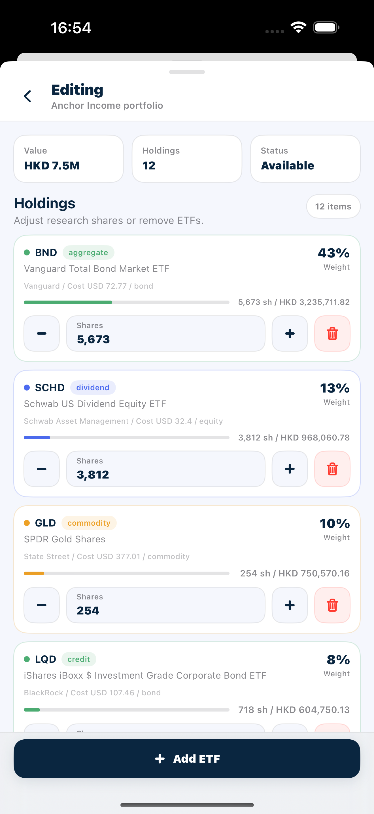

5. 返回 `Baseline snapshots`，查看和管理编辑前后的历史快照。

**Screenshot** — PORT-US2-04：`Baseline snapshots` history、保存入口、search、两个 saved snapshots 和所选 snapshot 的 ETF details。

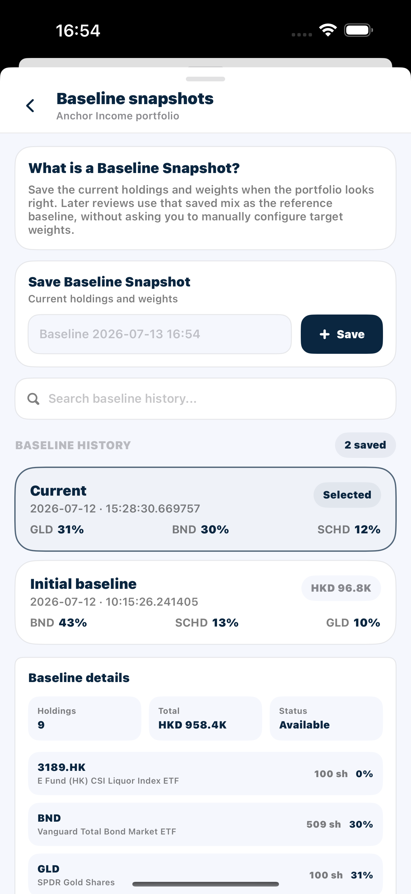

6. 从列表移除一个不再需要的 My Portfolio，并确认其他 portfolios 不受影响。

### Acceptance Criteria

| ID | Requirement | Reference | Ownership | Priority |
| --- | --- | --- | --- | --- |
| US2-AC01 | 首次打开或刷新时显示加载状态；完成后列表反映当前保存的 My Portfolio。 | US-PORT-02 | Integration | Must |
| US2-AC02 | 新建 My Portfolio 表单提供 HKD、USD、CNY、EUR 和 GBP 作为基础货币。 | US-PORT-02 | Integration | Must |
| US2-AC03 | 名称为空、存在非正数量的初始持仓或创建请求进行中时，右上角创建勾选按钮不可用。 | US-PORT-02 | Integration | Must |
| US2-AC04 | ETF 选择器支持代码/名称/发行方搜索、排序指标、适用周期/维度、方向和重置；有效 ETF 以界面提供的默认值加入，已暂存 ETF 显示 Added 且不可重复选择。 | US-PORT-02 | Integration | Must |
| US2-AC05 | 无匹配搜索显示无结果状态；清除搜索后恢复 ETF 排行列表和结果数量。 | US-PORT-02 | Integration | Must |
| US2-AC06 | Initial holdings 支持 +、−、直接输入和删除；这些操作只修改创建草稿，最终有效数量反映在创建结果中。 | US-PORT-02 | Integration | Must |
| US2-AC07 | 创建后，My Portfolio 出现在列表中，显示名称、总价值、持仓数、资产配置、可用时的前一日回报，以及可用时基于 Baseline Snapshot 的偏离。 | US-PORT-02 | Integration | Must |
| US2-AC08 | 从列表打开新建 My Portfolio 后，名称、基础货币、初始持仓数量和价值与创建草稿一致。 | US-PORT-02 | Integration | Must |
| US2-AC09 | 创建流程清楚说明它创建的是研究型 My Portfolio，不会下单。 | US-PORT-02 | Integration | Must |
| US2-AC10 | 头部展示所选 My Portfolio 的名称、持仓数、总价值和类型；估值数据不完整时显示对应的 Partial 或 Unavailable 状态。 | US-PORT-02 | Integration | Must |
| US2-AC11 | 配置分组、ETF 数量和持仓权重与当前已保存持仓一致。 | US-PORT-02 | Integration | Must |
| US2-AC12 | 共享预测行为符合用户故事 1，且使用该 My Portfolio 的已保存价值，而非此前打开的 Model Portfolio。 | US-PORT-02 | Integration | Must |
| US2-AC13 | 持仓行展示代码、名称、权重、份额、市值、成本和可用 ETF 元数据；选择某行会打开匹配的 ETF 浮层。 | US-PORT-02 | Integration | Must |
| US2-AC14 | 保存会创建当前持仓、数量、价值和权重的 Baseline Snapshot。 | US-PORT-02 | Integration | Must |
| US2-AC15 | 显示成功 Toast，UAT Before Edit 被加入 Baseline History，并带有时间戳、价值和最高权重背景信息。 | US-PORT-02 | Integration | Must |
| US2-AC16 | 打开已保存的 Baseline Snapshot 详情会显示持仓数、总额、状态以及保存的 ETF 数量和权重。 | US-PORT-02 | Integration | Must |
| US2-AC17 | Edit 页面标明所选 My Portfolio，并显示当前价值、持仓数、状态和可编辑的持仓行。 | US-PORT-02 | Integration | Must |
| US2-AC18 | +、−、有效的正数量输入及勾选提交会更新并持久化所选 ETF 数量；尝试产生非正数量时不会提交该值。 | US-PORT-02 | Integration | Must |
| US2-AC19 | 提交成功后，刷新或重新打开仍显示更新后的数量、价值、权重和配置。 | US-PORT-02 | Integration | Must |
| US2-AC20 | Add ETF 可按代码、名称或发行方搜索，并可调整排序指标、适用维度和方向；结果数量和无结果状态均可见。 | US-PORT-02 | Integration | Must |
| US2-AC21 | 已持有的 ETF 标记为 Added、被禁用，且无法通过选择器重复添加。 | US-PORT-02 | Integration | Must |
| US2-AC22 | 选择有效 ETF 后，选择器关闭，该 ETF 以默认值加入 Edit 列表；重新打开详情后仍存在。 | US-PORT-02 | Integration | Must |
| US2-AC23 | 移除 ETF 仅删除该代码，并刷新列表、价值、权重和配置。 | US-PORT-02 | Integration | Must |
| US2-AC24 | 数量编辑、添加和移除只影响对应 ETF；未操作的持仓保持原数量和成本信息。 | US-PORT-02 | Integration | Must |
| US2-AC25 | Edit 在没有待提交修改时可以直接关闭，且不会额外改变已保存持仓。 | US-PORT-02 | Integration | Must |
| US2-AC26 | 每次创建仅添加一个 Baseline Snapshot，选中并加载其详情，同时更新保存计数。 | US-PORT-02 | Integration | Must |
| US2-AC27 | 搜索可按 Baseline Snapshot 标签、日期或最高权重 ETF 代码筛选，并可清除。 | US-PORT-02 | Integration | Must |
| US2-AC28 | 重命名拒绝空名称，持久化有效的新标签，并更新历史和所选详情。 | US-PORT-02 | Integration | Must |
| US2-AC29 | 删除仅移除所选 Baseline Snapshot 并减少计数；若删除当前选中项，页面不再显示其详情，并选中剩余有效项或显示空状态。 | US-PORT-02 | Integration | Must |
| US2-AC30 | UAT Before Edit 保留操作 2.4 前的持仓，而 UAT Current State 与操作 2.4 后的当前 My Portfolio 一致。 | US-PORT-02 | Integration | Must |
| US2-AC31 | 重新打开 Baseline snapshots 后，保留的 Baseline Snapshot 及重命名结果仍存在，被删除的临时 Baseline Snapshot 不再出现。 | US-PORT-02 | Integration | Must |
| US2-AC32 | 无持仓 My Portfolio 可正常打开；详情明确显示无持仓、配置不可用和预测不可用状态，不以零值或示例配置冒充有效结果。 | US-PORT-02 | Integration | Must |
| US2-AC33 | 移除需要点名 My Portfolio 并说明不可撤销的破坏性确认；取消后 My Portfolio 保持不变。 | US-PORT-02 | Integration | Must |
| US2-AC34 | 确认后从列表移除该 My Portfolio，且不删除其他 My Portfolio。 | US-PORT-02 | Integration | Must |
---

## User Story 3 - 生成 AI Portfolio Recommendation

**Story ID:** `US-PORT-03`  
**用户故事：** 作为用户，我希望回答适配度问卷，获得可解释的 ETF 建议，检查生成的结果并保存到 My portfolios。  
**Video:** [US-PORT-03 验收视频](https://jjpvro70sief.jp.larksuite.com/wiki/NSZ1wCHloiD8QAkYSDsj9CNtpje)

### Walkthrough

1. 从 `Portfolio > Recommended` 打开 `Find Your Ideal Portfolio`，完成四题问卷并查看回答进度。

**Screenshot** — `Find my portfolio` 问卷起始状态，展示四步结构、`0/4 answered`、Goal options 和尚未启用的 `Next`。

**Screenshot** — PORT-US3-01：问卷进入 Question 2 后的进度状态，显示已完成 Goal、当前 Time step、`1/4 answered` 和 horizon options。

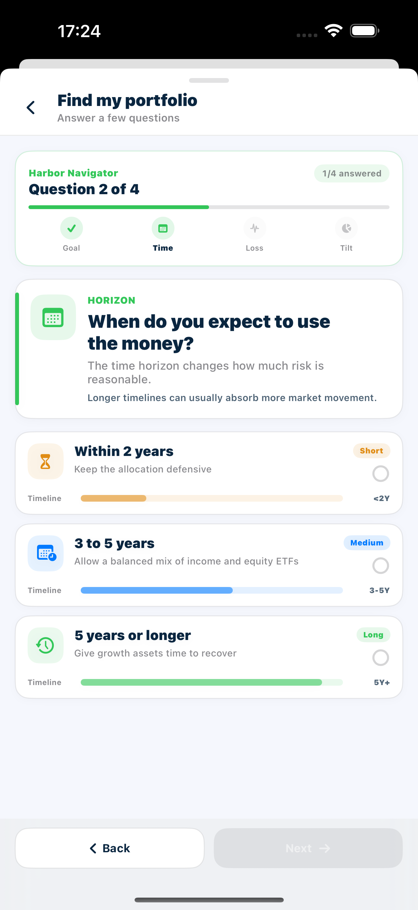

2. 提交答案，观察 Recommendation 的生成进度和 pending states。

**Screenshot** — PORT-US3-02：Recommendation 正在生成的 Step 4，显示 progress、pending header/holdings、loading projection 和 pending metrics。

3. 查看生成结果的风险画像、projection、portfolio metrics、Recommendation build 和 ETF holdings。

**Screenshot** — PORT-US3-03：生成完成的 `Growth Focus ETF Portfolio`，包含 AI-assisted/risk/currency/holdings 头部、projection 和 `Add to My Portfolio`。

**Screenshot** — Recommendation 的 expected return、volatility、Sharpe、asset mix、generated weights 和 `Recommendation build`。

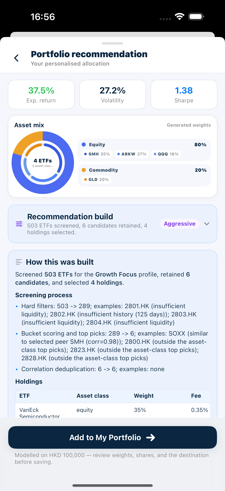

**Screenshot** — `How this was built` 的 screening process、holdings table、portfolio characteristics 和 constraint note。

**Screenshot** — 生成结果的完整 `ETF holdings`、target weights、deterministic-engine disclosure 和 `Back to adjust answers`。

4. 返回问卷调整一个答案，重新生成并确认结果随新答案更新。
5. 选择 `Add to My Portfolio`，审阅配置，并选择 `Add as new` 或 `Add to existing`。

**Screenshot** — PORT-US3-04：Recommendation 的 `Add to existing` 目标选择页，展示可选 My Portfolio、value、holdings count、asset mix 和 drift。

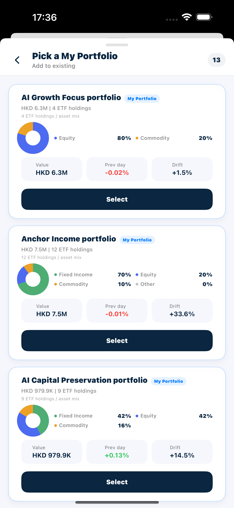

**Screenshot** — Recommendation 进入 `Add to My Portfolio` 后的 Visual editor，下一步可选择 `Add to existing` 或 `Add as new`。

6. 从 `My portfolios` 打开目标 portfolio，确认 Recommendation 已按所选方式保存。

### Acceptance Criteria

| ID | Requirement | Reference | Ownership | Priority |
| --- | --- | --- | --- | --- |
| US3-AC01 | 问卷恰好显示四个进度步骤及当前问题/已回答数量。 | US-PORT-03 | Integration | Must |
| US3-AC02 | 每个问题均展示辅助文本和可选择的选项卡，含标签、详情、徽标及风险/强度背景。 | US-PORT-03 | Integration | Must |
| US3-AC03 | 在当前问题已有答案前，Next/See recommendation 始终禁用。 | US-PORT-03 | Integration | Must |
| US3-AC04 | 每个问题仅可选择一个选项，且 Back/Next 导航保留所有先前答案。 | US-PORT-03 | Integration | Must |
| US3-AC05 | 完成问卷后，结果页显示由答案组合得出的风险等级——Conservative、Moderate、Growth 或 Opportunistic——并进入该等级对应的建议生成状态。 | US-PORT-03 | Integration | Must |
| US3-AC06 | 页面立即进入可见的生成状态；不得短暂显示上一次运行留下的过期建议。 | US-PORT-03 | Integration | Must |
| US3-AC07 | 进度传达四个阶段：Screen ETF universe、Optimize allocation、Draft AI explanation、Check wording。 | US-PORT-03 | Integration | Must |
| US3-AC08 | 待定的头部、预测、构建、说明和 ETF 行均清楚标记为生成中/待定，而非填入虚构的最终数值。 | US-PORT-03 | Integration | Must |
| US3-AC09 | 在存在明确 Recommendation 结果前，保存操作不可用。 | US-PORT-03 | Integration | Must |
| US3-AC10 | 头部展示生成结果的标题、风险等级、基础货币、持仓数和 AI 辅助/仅供研究摘要。 | US-PORT-03 | Integration | Must |
| US3-AC11 | 预期年化回报、波动率、夏普比率、资产类别配置、ETF 数量和生成权重均来自返回的建议。 | US-PORT-03 | Integration | Must |
| US3-AC12 | 预测基于生成的 ETF 权重和建模金额计算，并满足用户故事 1 中确立的交互标准。 | US-PORT-03 | Integration | Must |
| US3-AC13 | Recommendation Build 展示本次构建的风险画像、筛选与优化摘要、截至日期、候选范围、删除原因和警告，并与最终 ETF 持仓对应。 | US-PORT-03 | Integration | Must |
| US3-AC14 | AI 生成时，说明标记为 AI-generated，并能渲染段落、强调、项目符号、引用和表格，且不显示原始 Markdown 标记。 | US-PORT-03 | Integration | Must |
| US3-AC15 | 说明内容与本次 Recommendation Build 和生成持仓一致，并清楚说明历史数据、研究用途和非收益保证边界。 | US-PORT-03 | Integration | Must |
| US3-AC16 | ETF 行展示代码、名称、资产类别、生成的目标权重和进度；显示权重在舍入容差内合计 100%。 | US-PORT-03 | Integration | Must |
| US3-AC17 | 返回问卷保留当前答案。重新生成会清除先前建议，并在新结果前显示生成状态。 | US-PORT-03 | Integration | Must |
| US3-AC18 | Recommendation 全程标明 AI 辅助和仅供研究；在用户明确选择 Add to My Portfolio 并完成确认前，不会保存到 My portfolios。 | US-PORT-03 | Integration | Must |
| US3-AC19 | 添加页面使用生成的建议、建模金额、基础货币和可用的最新 ETF 价格。 | US-PORT-03 | Integration | Must |
| US3-AC20 | Visual/List 编辑以及两种目标选项均符合操作 1.5–1.7 的标准。 | US-PORT-03 | Integration | Must |
| US3-AC21 | 使用 Add as new 时显示确认，且新 My Portfolio 以预期的名称、基础货币和持仓数出现在 My portfolios 中。 | US-PORT-03 | Integration | Must |
| US3-AC22 | 使用 Add to existing 会合并数量：新代码被添加，已有代码获得相加后的数量和加权成本。 | US-PORT-03 | Integration | Must |
| US3-AC23 | 仅打开添加页或返回 Recommendation 不会写入 My portfolios；只有完成目标选择和确认后才产生对应保存结果。 | US-PORT-03 | Integration | Must |
---

## User Story 4 - 分析 Portfolio 并审阅 AI 建议

**Story ID:** `US-PORT-04`  
**用户故事：** 作为用户，我希望分析 My Portfolio 或 Model Portfolio 的工作草稿，选择重要的诊断问题，并审阅 AI 辅助的考虑因素和量化 `Suggested actions`；当来源是 My Portfolio 时，我还可以编辑并应用这些操作。  
**Video:** [US-PORT-04 验收视频](https://jjpvro70sief.jp.larksuite.com/wiki/Ey4Bw3xDxiPeETk3yBBjhxOHpdf)

### Walkthrough

1. 从一个 My Portfolio 选择 `Start analysis`，查看并按需要调整草稿持仓。

**Screenshot** — PORT-US4-01：`Draft Portfolio > Holdings` 的 analysis 前可编辑草稿，包含 shares 输入与步进控件、删除操作、`Add ETF`、尚未解锁的 `Analysis / Suggestions`，以及 `Analyze draft portfolio`。

2. 选择 `Analyze draft portfolio`，查看 Analysis overview、Holdings、Exposure breakdown 和 Data coverage。

**Screenshot** — PORT-US4-02：`Draft Portfolio > Analysis`，包含 `Data coverage`、`Analysis overview`、score、value/positions、HHI、Effective N 和多维 diagnostics。

**Screenshot** — Analysis 结果中的 read-only Holdings table 和 `Exposure breakdown`；该表不是运行分析前的 editable Holdings 草稿。

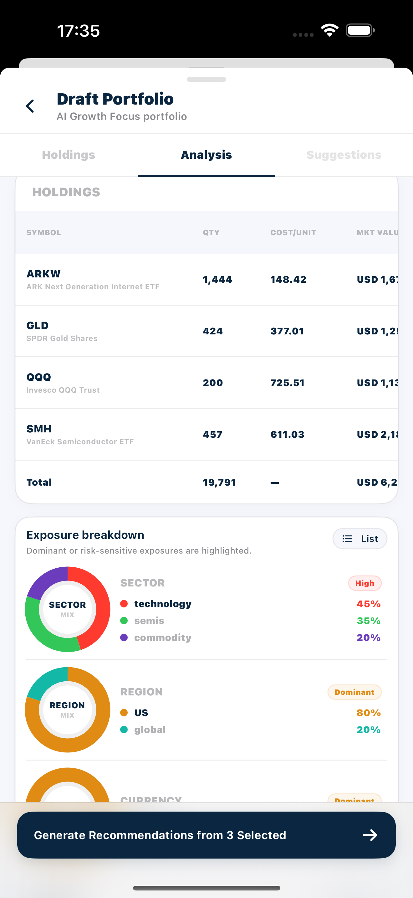

3. 查看并选择希望建议覆盖的 Diagnosis，然后生成 recommendations。

**Screenshot** — PORT-US4-03：`Exposure breakdown` 的 Sector/Region/Currency，以及 `Diagnosis` 的 Found/Selected/Hidden counts、selected finding 和 generate action。

4. 审阅所选诊断范围、AI considerations、candidate pool 和量化 `Suggested actions`。

**Screenshot** — PORT-US4-04：`Suggestions` 中的 selected diagnosis scope、`AI drafted` boundary、research consideration、candidate pool 和量化 `Suggested actions` preview。

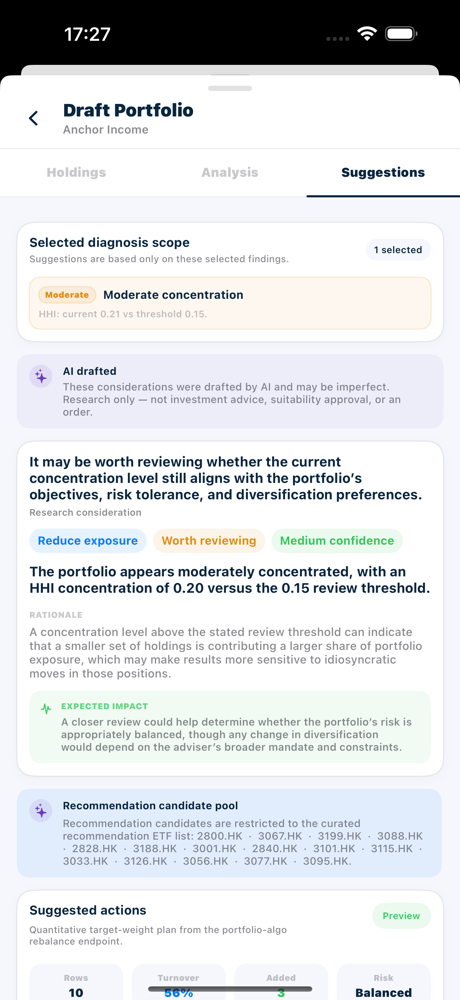

5. 对 My Portfolio 来源审阅或调整目标份额，应用方案并确认 portfolio 更新。
6. 从 Model Portfolio 再次启动 Analysis Workflow，确认 `Suggested actions` 为只读结果。

### Acceptance Criteria

| ID | Requirement | Reference | Ownership | Priority |
| --- | --- | --- | --- | --- |
| US4-AC01 | Analysis Workspace 在 Holdings 中打开，标明来源 My Portfolio，并预加载其已保存的 ETF 持仓、数量、成本、价值和权重。 | US-PORT-04 | Integration | Must |
| US4-AC02 | 在存在分析前，Analysis 保持锁定；在存在建议前，Suggestions 保持锁定。 | US-PORT-04 | Integration | Must |
| US4-AC03 | +/− 会立即更新草稿；直接输入仅在数值变化时显示勾选确认。确认后重算价值和权重、清除旧分析/建议，且不修改已保存的 My Portfolio。 | US-PORT-04 | Integration | Must |
| US4-AC04 | Add ETF 支持目录搜索和排序控件；重复项标记为 Added 且无法再次添加，有效的新 ETF 可加入当前草稿。 | US-PORT-04 | Integration | Must |
| US4-AC05 | 移除 ETF 或 Clear all 仅影响工作草稿，直至显式执行 Apply to My Portfolio。 | US-PORT-04 | Integration | Must |
| US4-AC06 | 草稿为空时 `Analyze draft portfolio` 被禁用；分析运行期间只显示进度，不提供第二个分析操作。 | US-PORT-04 | Integration | Must |
| US4-AC07 | `Analyze draft portfolio` 切换至 `Analysis` 标签，并持续显示进度，直至当前草稿的分析完成或失败。 | US-PORT-04 | Integration | Must |
| US4-AC08 | 完成后的概览展示当前草稿可用的总价值/基础货币、头寸数、HHI、Effective N、分散化、集中度、地域、外汇、费用效率和流动性信息。 | US-PORT-04 | Integration | Must |
| US4-AC09 | 不可用指标显示为 Unavailable/—；若可用数据不足以形成总体评分，该评分同样显示为不可用，不得以零值代替。 | US-PORT-04 | Integration | Must |
| US4-AC10 | Holdings 表显示 Symbol、QTY、COST/UNIT、MKT VALUE、WEIGHT 和 CCY，并可横向滚动；不可用值显示为 —，不显示占位收益。 | US-PORT-04 | Integration | Must |
| US4-AC11 | `Exposure breakdown` 显示 Sector、Region 和 Currency，并使用同一数据在 `Pie` 和 `List` 间一致切换。 | US-PORT-04 | Integration | Must |
| US4-AC12 | 分析免责声明始终可见；响应包含部分/不可用指标或 warning 时，页面显示蓝色 Data coverage，说明受影响的数据范围，而不将其称为 AI fallback。 | US-PORT-04 | Integration | Must |
| US4-AC13 | 当前结果只对应本次草稿；后续返回 Holdings 修改数量时，旧 Analysis 和 Suggestions 会被清除并重新锁定。 | US-PORT-04 | Integration | Must |
| US4-AC14 | 诊断项展示严重性、标题、指标/阈值和选择状态，返回项默认全选。 | US-PORT-04 | Integration | Must |
| US4-AC15 | 当前分析返回的诊断项数量、严重程度和选中状态与页面计数一致。 | US-PORT-04 | Integration | Must |
| US4-AC16 | 切换诊断项后，Found/Selected/Hidden 计数立即更新；生成结果列出的诊断范围仅包含提交时选中的项目。 | US-PORT-04 | Integration | Must |
| US4-AC17 | 选择零项时，UI 指示用户至少选择一项，且 `Generate Recommendations from <n> Selected` 被禁用。 | US-PORT-04 | Integration | Must |
| US4-AC18 | 分析尚未完成时生成 recommendation 的操作不可用；建议生成期间只显示生成进度，不提供可再次触发的生成操作。 | US-PORT-04 | Integration | Must |
| US4-AC19 | 生成切换至 Suggestions，并显示四个进度阶段：Read selected diagnosis、Draft considerations、Apply safety guard、Prepare preview。 | US-PORT-04 | Integration | Must |
| US4-AC20 | 结果标明用于生成建议的诊断项。 | US-PORT-04 | Integration | Must |
| US4-AC21 | AI 生成的考虑因素显示 AI drafted，并带有研究用途和 AI 可能出错的提示。 | US-PORT-04 | Integration | Must |
| US4-AC22 | 考虑因素只覆盖提交时选中的诊断项；未选中的诊断不会出现在本次建议范围和对应考虑因素中。 | US-PORT-04 | Integration | Must |
| US4-AC23 | 每项考虑因素展示观察、理由、预期影响、置信度、相关问题和仅供研究措辞，不含订单执行语言。 | US-PORT-04 | Integration | Must |
| US4-AC24 | `Suggested actions` 展示可行性、行数、换手率、新增候选数量/代码及风险等级。 | US-PORT-04 | Integration | Must |
| US4-AC25 | 每个 Suggested Action 行展示代码/名称、Held/New 状态、当前份额/权重、目标份额/权重、数量和价值差额，以及 Model target 比较。 | US-PORT-04 | Integration | Must |
| US4-AC26 | `Suggested actions` 支持滚动查看全部 Held/New 行，并在编辑目标后立即更新对应的数量和价值差额。 | US-PORT-04 | Integration | Must |
| US4-AC27 | Recommendation candidate pool 仅展示当前建议流程允许考虑的 ETF 代码，并与 `Suggested actions` 中的新增候选对应。 | US-PORT-04 | Integration | Must |
| US4-AC28 | 目标份额仅接受非负值，并重新计算目标权重、份额差、权重差和价值差。 | US-PORT-04 | Integration | Must |
| US4-AC29 | Reset 清除用户覆盖值，并恢复预览最初给出的目标方案。 | US-PORT-04 | Integration | Must |
| US4-AC30 | Apply to My Portfolio 仅在来源为 My Portfolio、方案可行、存在可显示操作行、价格查询完成且所有正目标都有可用价格时启用；不满足条件时保持禁用。 | US-PORT-04 | Integration | Must |
| US4-AC31 | 应用会以编辑后的正目标更新已保存持仓，保留未受影响的有效持仓，关闭工作区并刷新详情。 | US-PORT-04 | Integration | Must |
| US4-AC32 | 重新打开可证明数量和权重/价值已更新；先前分析/建议不再被视为对修改后的持仓有效。 | US-PORT-04 | Integration | Must |
| US4-AC33 | Apply to My Portfolio 请求进行中时不可重复触发；成功后只产生一次持仓更新并返回刷新后的详情。 | US-PORT-04 | Integration | Must |
| US4-AC34 | Model Portfolio 可以作为草稿来源完成 Holdings、Analysis、Diagnosis 和 Suggestions 的同一套 Analysis Workflow。 | US-PORT-04 | Integration | Must |
| US4-AC35 | `Suggestions` 展示本次选定的诊断范围、AI 考虑因素和量化 `Suggested actions`，不会仅因来源为 Model Portfolio 而跳过结果。 | US-PORT-04 | Integration | Must |
| US4-AC36 | Model Portfolio 的 `Suggested actions` 以只读列表展示，每行可查看 Current、Target、Change 和价值差额，但不提供 Target shares 输入或步进控件。 | US-PORT-04 | Integration | Must |
| US4-AC37 | Model Portfolio 结果不显示 Reset 或 Apply to My Portfolio；关闭工作区不会修改该 Model Portfolio，也不会创建或更新 My Portfolio。 | US-PORT-04 | Integration | Must |
---

## User Story 5 - 根据 Baseline Snapshot 审阅

**Story ID:** `US-PORT-05`  
**用户故事：** 作为用户，我希望将今天的 My Portfolio 与有效的历史 Baseline Snapshot 比较，了解配置偏离，编辑基于 Baseline Snapshot 的调整方案并应用。  
**Video:** [US-PORT-05 验收视频](https://jjpvro70sief.jp.larksuite.com/wiki/H1ULwBLKeiaEIKkEbQDjhRiepue)

### Walkthrough

1. 从一个 My Portfolio 打开 `Portfolio Review`，浏览可用的 Baseline Snapshots，并区分 `No changes` 与可审阅状态。

**Screenshot** — PORT-US5-01：`Portfolio Review > Baseline`，同时显示 `No changes` snapshot、selected snapshot、ETF summary 和 `Review allocation changes`。

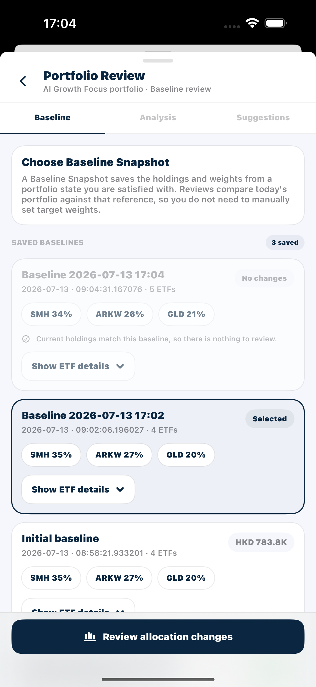

2. 选择一个有变化的 Baseline Snapshot，查看 portfolio 摘要和 holdings drift。

**Screenshot** — PORT-US5-02：所选 Baseline Snapshot 的 current/baseline value、absolute drift 和 `Holding drift` table，逐行比较 Now、Baseline 和 Drift。

3. 进入 `Analysis`，阅读 drift status、driver summary、allocation changes 和 ETF quantity changes。

**Screenshot** — PORT-US5-03：Baseline comparison 的 `Analysis`，包含 status、allocation drift、current/baseline values、largest move 和 driver summary。

**Screenshot** — `Industry allocation changes`、`ETF movement detail` 和 quantity-difference summary。

**Screenshot** — `Quantity changes` 中各 ETF 的 baseline/current/target quantities 和 value differences。

4. 打开 `Suggestions`，审阅并按需要调整 Baseline-based target shares。

**Screenshot** — PORT-US5-04：可编辑的 baseline-based `Recommended ETF changes`，包含 target-share controls、`Reset suggestion` 和 `Apply to My Portfolio`。

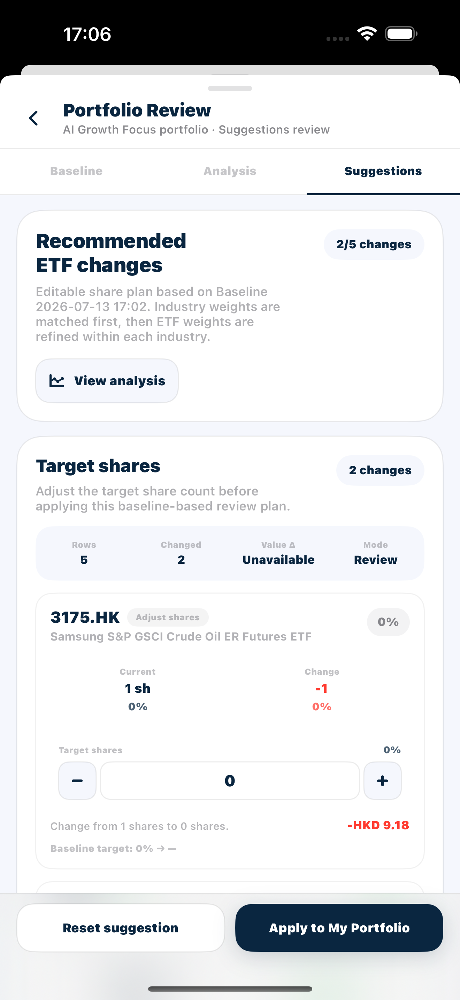

5. 选择 `Apply to My Portfolio`，返回 portfolio 并确认调整结果已更新。

### Acceptance Criteria

| ID | Requirement | Reference | Ownership | Priority |
| --- | --- | --- | --- | --- |
| US5-AC01 | Portfolio Review 在 Baseline 标签打开，且仅列出该 My Portfolio 保存的快照。 | US-PORT-05 | Integration | Must |
| US5-AC02 | UI 说明 Baseline Snapshot 是已保存的参考配置，而不是手动配置的目标。 | US-PORT-05 | Integration | Must |
| US5-AC03 | UAT Current State 明显禁用/变暗，标记为 No changes，并说明当前持仓与 Baseline Snapshot 相同。 | US-PORT-05 | Integration | Must |
| US5-AC04 | 先选中 UAT Before Edit 再点击无变化的 Baseline Snapshot 时，UAT Current State 不会被选中，原选择保持不变。 | US-PORT-05 | Integration | Must |
| US5-AC05 | 标记为 No changes 的 Baseline Snapshot 不会提供进入 Analysis 的操作，且页面说明其持仓与当前状态一致。 | US-PORT-05 | Integration | Must |
| US5-AC06 | 即使 Baseline Snapshot 无法选中以供审阅，Show ETF details 仍可用于检查。 | US-PORT-05 | Integration | Must |
| US5-AC07 | 有变化的 Baseline Snapshot 变为 Selected，并获得选中样式。 | US-PORT-05 | Integration | Must |
| US5-AC08 | 展开的详情展示保存的 ETF 数量和权重；折叠仅隐藏详情面板。 | US-PORT-05 | Integration | Must |
| US5-AC09 | 偏离结果同时列出新增和已移除的 ETF，不得因某代码只存在于当前持仓或 Baseline Snapshot 中而遗漏。 | US-PORT-05 | Integration | Must |
| US5-AC10 | 偏离表按重大变动排序，展示每个代码的 Baseline Snapshot 权重、当前权重、数量差和带符号的权重偏离。 | US-PORT-05 | Integration | Must |
| US5-AC11 | 摘要标明所选 Baseline Snapshot 的名称、日期及总绝对偏离；Review allocation changes 现已启用。 | US-PORT-05 | Integration | Must |
| US5-AC12 | Analysis 清楚标明正在比较当前持仓与所选 Baseline Snapshot。 | US-PORT-05 | Integration | Must |
| US5-AC13 | Analysis 显示 Within range、Monitor drift 或 Review recommended 状态，并展示当前价值、Baseline Snapshot 价值、最大变动和百分点偏离。 | US-PORT-05 | Integration | Must |
| US5-AC14 | `Driver summary` 标识最大增加/减少的敞口，并说明价格变动和/或数量变动是否有贡献。 | US-PORT-05 | Integration | Must |
| US5-AC15 | `Industry allocation changes` 按 ETF 资产类别汇总 Baseline Snapshot 权重和当前权重，并展示带符号的偏离。 | US-PORT-05 | Integration | Must |
| US5-AC16 | `ETF movement detail` 展示 Baseline Snapshot 权重、当前权重和数量，以及每项重大变动的通俗原因。 | US-PORT-05 | Integration | Must |
| US5-AC17 | `Quantity changes` 为关键行展示 Baseline Snapshot 数量、当前数量、目标数量、单位差和价值差。 | US-PORT-05 | Integration | Must |
| US5-AC18 | Baseline Snapshot 比较不得显示 AI-generated、AI drafted 等 AI 标记，并明确呈现为基于所选快照的配置比较。 | US-PORT-05 | Integration | Must |
| US5-AC19 | Suggestions 仅在所选 Baseline Snapshot 的预览加载完成后显示目标方案；加载或切换范围时不显示上一份过期预览。 | US-PORT-05 | Integration | Must |
| US5-AC20 | 范围卡点名 Baseline Snapshot，并报告变更行数和总行数。 | US-PORT-05 | Integration | Must |
| US5-AC21 | 目标行展示当前份额/权重、Baseline Snapshot 权重、计算出的目标份额/权重、带符号的变动、价值差和 Hold/Adjust 状态。 | US-PORT-05 | Integration | Must |
| US5-AC22 | 默认方案按所选 Baseline Snapshot 生成可审阅的目标份额；Baseline Snapshot 中不存在的 ETF 可显示为零目标。 | US-PORT-05 | Integration | Must |
| US5-AC23 | 目标值可编辑、非负，并立即重新计算显示的权重和差额。 | US-PORT-05 | Integration | Must |
| US5-AC24 | Reset suggestion 移除覆盖值，并重新设定计算出的默认目标。 | US-PORT-05 | Integration | Must |
| US5-AC25 | 在目标计算完成前 Apply to My Portfolio 被禁用；目标方案可用后才允许提交。 | US-PORT-05 | Integration | Must |
| US5-AC26 | Apply to My Portfolio 成功后关闭审阅并刷新 My Portfolio 详情，详情显示已更新的保存持仓。 | US-PORT-05 | Integration | Must |
| US5-AC27 | 重新打开可证明已应用目标份额，且此前选中的 Baseline Snapshot 显示更新后的比较结果。 | US-PORT-05 | Integration | Must |
| US5-AC28 | Apply to My Portfolio 请求进行中时不可重复触发；完成后只产生一次持仓更新，重新打开详情和 Portfolio Review 均显示同一最终状态。 | US-PORT-05 | Integration | Must |
