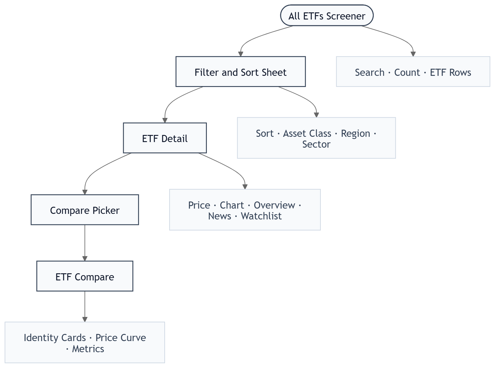
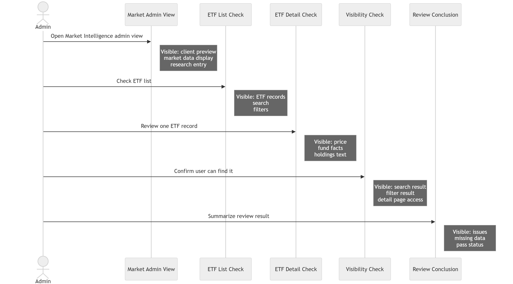
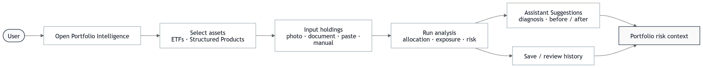
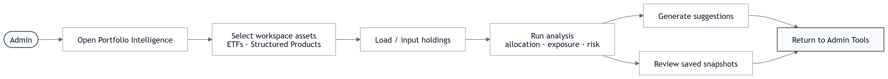
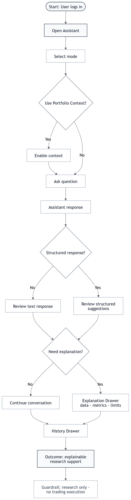
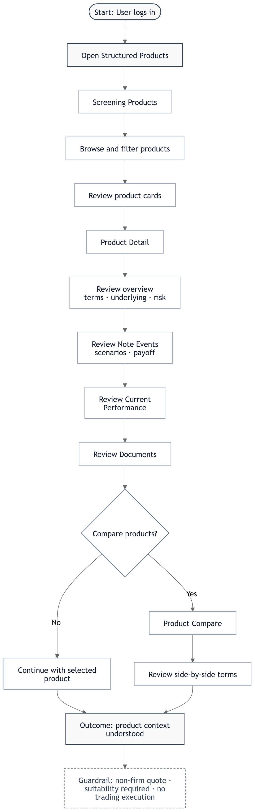
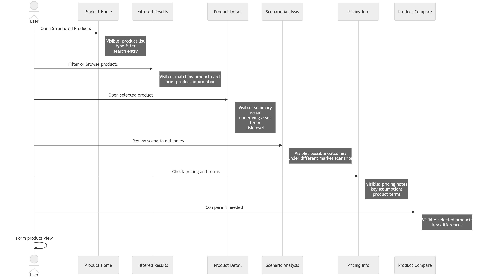
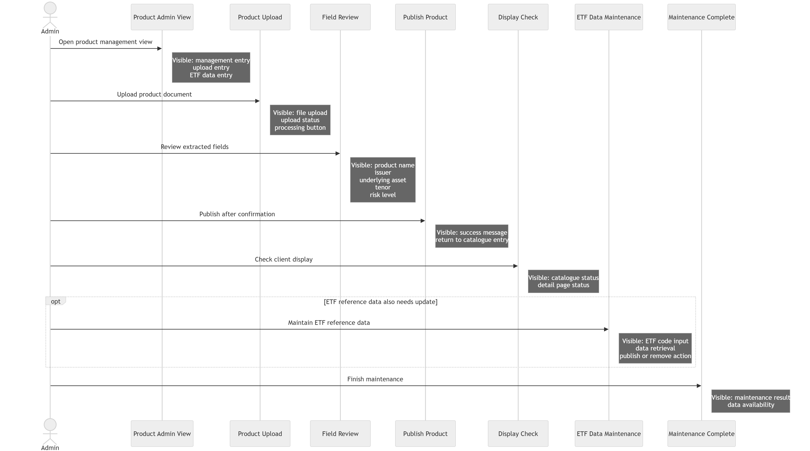
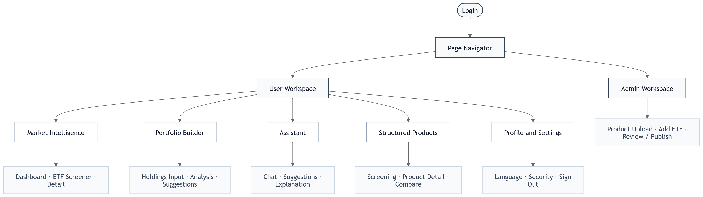

# Sunwah Fintech iOS — 产品需求文档（PRD）

## 一、项目概述

| 项目项 | 内容 |
| --- | --- |
| 产品定位 | 原生 iOS 投资智能助手，面向机构投资者 |
| 核心闭环 | ETF / 结构化产品数据 → 组合诊断 → AI 解释 → 决策辅助 |
| 试点目标 | 可安装、可登录、可访问四大核心模块、具备基础安全控制 |
| 不做范围 | 交易执行 · 正式受监管投顾 · tick/Level II 实时行情 · Web/Android · 跨发行人结构化产品比较 |

### 1.1 各模块数据来源与流向

### 1.2 里程碑

| 里程碑 | 目标 | 进度 |
| --- | --- | --- |
| M1 架构与后端基础 | 骨架 · 安全基线 · 初始数据模型 | approx. 48%，目标 2026-06-01 |
| M2 市场情报与组合情报核心 | ETF 指标 · 组合评分 · 敞口分析 | approx. 86% |
| M3 再平衡与 AI 投顾逻辑 | 再平衡 · Value/Income Mode · 解释生成 | 0% |
| M4 iOS 客户端与结构化产品模块 | 原生 iOS UI · 结构化产品 · payoff 分析 | 0% |
| M5 测试、验收与试点部署 | UAT · Bug 修复 · 部署 · 客户验收 | 最终阶段 |

---

## 二、用户定义

### 2.1 Persona

| | 普通用户 User | 管理员 Admin |
| --- | --- | --- |
| 典型账号 | investor@sunwah.com.hk | admin@sunwah.com.hk |
| 核心诉求 | 浏览行情 · 诊断组合 · 理解风险 · 获取 AI 辅助建议 | User 全部能力 + 维护产品目录与 ETF 数据 |
| 进入方式 | 账号密码 / Google / Microsoft SSO | 同左，邮箱含 admin 时触发 Admin 权限 |
| 登录后差异 | 无额外控件 | 结构化产品页出现上传按钮；Profile 出现 Admin Tools |

### 2.2 角色–权限矩阵

| 功能区域 | 具体权限 | User | Admin |
| --- | --- | :---: | :---: |
| 认证 | 登录 / 登出 | Y | Y |
| 市场情报 | Dashboard · Screener · Watchlist · ETF 详情 · 对比 | Y | Y |
| 市场情报 | 添加 ETF by ID | N | Y |
| 组合情报 | 持仓输入 · 分析 · AI 建议 · 历史 | Y | Y |
| AI 投顾 | 对话 · 附件 · Portfolio Context · 自定义模式 | Y | Y |
| 结构化产品 | 查看列表 · 详情 · 情景 · 定价 · 对比 | Y | Y |
| 结构化产品 | 上传 PDF · 审核字段 · 发布 | N | Y |
| 个人设置 | 语言 · 通知 · 2FA · 登出 | Y | Y |
| 个人设置 | Admin Tools 入口 | N | Y |

---

## 三、页面结构

| Tab | 默认页 | 二级页面 |
| --- | --- | --- |
| 市场情报 | Market Dashboard | ETF Screener · Filter Sheet · ETF 详情 · Compare Picker · ETF 对比 · Watchlist |
| 组合情报 | 持仓输入 | 组合分析 · 评分详情 Sheet · AI 建议 · 历史 Drawer |
| AI 投顾 | AI 对话 | 解释 Drawer · 历史 Drawer · 创建自定义模式 |
| 结构化产品 | 产品列表 | 产品详情 · 情景分析 · 定价分析 · 产品对比 · Admin 上传面板 · 字段审核 |
| 个人设置 | Profile & Settings | Admin Tools（Admin 专属） |

---

## 四、功能模块

### 4.1 市场情报（Market Intelligence）

#### 4.1.1 功能概述

| 能力 | 输入数据 | 输出 | 边界 |
| --- | --- | --- | --- |
| 市场总览看板 | ETF / 指数日终行情 | 指数摘要 · Top Movers · Watchlist 预览 | 不做实时交易流 |
| ETF 筛选器 | 搜索词 · 类别 · 地区 · 发行人 · 币种 · 排序 | ETF 列表 / 空状态 | 不接 Level II |
| ETF 详情 | ETF symbol | 价格图 · 风险指标 · 新闻 | HKEX 15-min 延迟 |
| ETF 对比 | 2 个 ETF | 标准化收益曲线 + 指标双栏 | 原型限 2 ETF |

#### 4.1.2 页面介绍

| 截图 | 页面说明 |
| :---: | --- |
|  | **Market Dashboard** — 指数摘要卡（HSI · Hang Seng Tech · S&P 500 ETF）；Gainers / Losers 切换列表（前 5 条）；Watchlist 预览区；Browse All ETFs 入口 |
|  | **加载骨架屏** — 数据请求中各区域以灰色 skeleton 条占位，到达后平滑切换 |
|  | **加载错误** — HKEX 数据源异常提示 + 「Reload Data」按钮 |
|  | **ETF Screener** — 搜索框 · ETF 数量统计 · Filter 按钮 · ETF 行（代码 · 名称 · 涨跌幅 · 星标）；实时过滤 |
|  | **筛选 / 排序面板** — Bottom Sheet；Asset Class · Region · Issuer · Currency 多条件组合；Active filter badge 计数；Reset 一键清除 |
|  | **Screener 空状态** — 筛选无结果时插图 + 「No matching ETFs」+ 「Clear filters」入口 |
|  | **ETF 详情** — 价格头部（代码 · 最新价 · 涨跌幅）；折线图（多时间区间）；Overview / News Tab；风险指标卡（波动率 · 最大回撤 · Sharpe · AUM · 费用率） |
|  | **对比选择器** — Bottom Sheet 含搜索框，选中第二只 ETF 后跳转对比页 |
|  | **ETF 对比** — 双 ETF 身份卡头部；标准化价格曲线双线图；各维度指标左右列对比 |

#### 4.1.3 User Stories

**M-1：浏览市场行情，筛选 ETF 深入研究**

> **用户类型**：User | **需求**：快速扫市场动态，找到感兴趣的 ETF 深入了解 | **价值**：节省筛选时间，支持有依据的决策

**M-2：核查 ETF 数据质量与展示完整性**

> **用户类型**：Admin | **需求**：确认 ETF 数据完整可见，投资者能正常检索和查看 | **价值**：维护平台数据质量，避免展示缺失或错误信息

**Acceptance Criteria**

- [ ] Dashboard 加载时展示骨架屏，数据到达后平滑切换；网络失败展示错误态 + Reload | **Must**
- [ ] Gainers / Losers 切换即时更新前 5 条 ETF 行（代码 · 名称 · 涨跌幅）| **Must**
- [ ] Screener 搜索框实时过滤列表，数量统计同步更新 | **Must**
- [ ] Filter Sheet 以 Bottom Sheet 弹出；多条件可组合；Active filter badge 显示激活数；Reset 一键清除 | **Must**
- [ ] 筛选无结果时展示空状态插图 + 「Clear filters」入口 | **Must**
- [ ] ETF 详情价格图支持时间区间切换；Overview / News Tab 切换不重新加载图表 | **Must**
- [ ] 风险指标卡展示：波动率 · 最大回撤 · Sharpe Ratio · AUM · Expense Ratio | **Must**
- [ ] Watchlist 星标切换后出现 Toast + Undo；Watchlist 列表 / 空状态正确展示 | **Should**
- [ ] Compare Picker 搜索选中第二只 ETF，对比页价格曲线以 100 为基准标准化 | **Must**
- [ ] More Sheet 明确标注「HKEX 15-min delayed」| **Must**
- [ ] Admin 登录后 Screener 显示「Add ETF」入口，普通用户不可见 | **Must**

---

### 4.2 组合情报（Portfolio Intelligence）

#### 4.2.1 功能概述

| 阶段 | 用户动作 | 系统输出 | 关键指标 |
| --- | --- | --- | --- |
| 输入 | 上传文件 / 粘贴文本 / 手动添加 | 持仓草稿（代码 · 数量 · 市值 · 权重 · P&L） | qty · cost · marketValue · weight · currency |
| 分析 | 触发 Start Analysis | 六维评分 · HHI · Effective N · 敞口 · Diagnosis Issues | HHI · Effective N · sector/region/currency |
| 建议 | 查看 AI 建议 | 调整前后对比 · 具体动作 · rationale | Health Score · HHI target · Sharpe 改善 |

#### 4.2.2 评分维度与 Diagnosis Issue 触发规则

| 评分维度 | 计算方式 | Diagnosis Issue | 触发条件 | 严重度 |
| --- | --- | --- | --- | --- |
| 分散化 | Effective N = 1 / HHI | Insufficient diversification | Effective N < 3 | High |
| 集中度 | HHI = sum(weight_i^2) | High concentration risk | HHI > 0.25 | High |
| 集中度 | 同上 | Moderate concentration | 0.15 < HHI <= 0.25 | Medium |
| 地区 | HK+China 持仓权重加总 | Geographic concentration | HK+China > 70% | High |
| 汇率平衡 | HKD 持仓权重加总 | FX concentration — HKD | HKD > 70% | Medium |
| 分散化 | Tech 板块权重加总 | Technology sector overweight | Tech > 35% | Medium |
| 分散化 | Fixed Income 权重加总 | Insufficient defensive allocation | Fixed Income < 15% | Low |
| 费用效率 | 加权平均 Expense Ratio | — | — | — |
| 流动性 | 加权平均流动性评分 | — | — | — |

#### 4.2.3 页面介绍

| 截图 | 页面说明 |
| :---: | --- |
|  | **持仓输入** — Photos / Document 上传按钮；文本粘贴框 + Parse 按钮（AI 解析 symbol/qty/cost）；Current Portfolio 持仓草稿列表（代码 · 数量 · 市值 · 权重 · P&L · 币种）；总市值；Start Analysis 主按钮 |
|  | **组合分析** — 四步加载 checklist（定价 → HHI → 敞口 → 评分）；Overall Score 评分环；HHI & Effective N 双指标卡；六个可点击子评分卡（颜色区分健康/警告/危险）；行业 / 地区 / 货币敞口条形图；Diagnosis Issues 列表 |
|  | **AI 建议** — Before / After Optimisation 对比图；具体再平衡动作列表（目标权重 · confidence · impact）；AI rationale 文案；合规免责声明 |
|  | **历史 Drawer** — 从左侧滑入；历次分析快照列表（名称 · 日期 · 总市值 · 持仓摘要） |

#### 4.2.4 User Stories

**P-1：上传持仓 → 组合健康诊断 → 查看 AI 再平衡建议**

> **用户类型**：User | **需求**：快速了解持仓风险状况并获取优化方向 | **价值**：量化诊断替代主观判断，提供有依据的调整建议

**P-2：测试组合分析流程，验证输出质量**

> **用户类型**：Admin | **需求**：确认分析输出逻辑正确、建议表达清晰 | **价值**：在投资者使用前发现并修正分析或措辞问题

**Acceptance Criteria**

- [ ] 持仓输入页同时展示 Photos · Document 上传按钮 + 文本输入框 | **Must**
- [ ] 上传文件后出现文件名 Chip + Spinner；解析完成后变为成功状态 | **Must**
- [ ] 文本 Parse 后提取 symbol / qty / cost 填入草稿；市值 · 权重 · P&L 即时计算 | **Must**
- [ ] Start Analysis 展示四步加载动画，各步完成后打勾标记 | **Should**
- [ ] Overall Score 以色阶区分健康等级；HHI · Effective N 以独立指标卡展示含阈值刻度 | **Must**
- [ ] 六个子评分卡可点击，弹出 Bottom Sheet 展示触发的 Diagnosis Issue 与量化指标 | **Must**
- [ ] 行业 / 地区 / 货币敞口以横向进度条展示，超阈值时颜色加深 | **Must**
- [ ] AI 建议展示 Before / After 权重变化对比；每条建议标注 confidence 与 impact | **Must**
- [ ] AI 建议页底部展示合规声明（非正式投顾 · 非交易执行）| **Must**
- [ ] 文件格式不支持或解析失败时提示明确错误，持仓草稿保持原状 | **Must**
- [ ] 历史 Drawer 从左侧滑入，展示历次快照列表 | **Should**

---

### 4.3 AI 投顾（AI Advisory）

#### 4.3.1 功能概述

| 能力 | 输入 | 输出 | 说明 |
| --- | --- | --- | --- |
| 模式化聊天 | Value / Income / Custom Mode + 用户提问 | 结构化建议卡 / 文本回复 | 关键词（value/income/HHI）触发结构化结果 |
| Portfolio Context | 开/关切换 | 将持仓注入 AI 上下文 | 用于组合相关问题 |
| 附件分析 | 图片 / PDF | 文件摘要或问答 | 显示 attachment preview chip |
| 可解释 Drawer | 「Analytical Details」入口 | 触发条件 · 数据 · 指标 · 解释 · Guardrails | 让每条建议可追溯 |
| 历史会话 | 历史对话列表 | 切换 / 恢复上下文 | 左侧 Drawer |
| Custom Mode | System Prompt / Fintech Survey | 新 mode pill | 自定义 AI 投资约束 |

#### 4.3.2 页面介绍

| 截图 | 页面说明 |
| :---: | --- |
|  | **AI 对话** — 历史 Drawer 按钮 · 标题 · New 按钮；Mode 选择栏（Value · Income · 自定义 +）；空状态展示 3 个 Sample Questions；底部输入栏（附件 · Portfolio Context 切换 · 文本框 · 发送） |
|  | **结构化建议卡** — AI 回复含结构化建议（ETF 推荐行 · 指标数据 · rationale）；每条建议有「Analytical Details」入口 |
|  | **解释 Drawer** — Bottom Sheet；触发条件 · 使用数据集 · 关键指标 · LLM Interpretation · Guardrails（合规边界） |
|  | **历史 Drawer** — 从左侧滑入；历次会话列表（标题 · 最后消息 · 时间戳）；「New conversation」按钮 |
|  | **创建自定义模式** — System Prompt 编辑 或 Fintech Survey（目标 · 时间跨度 · 最大回撤承受）；确认后新 mode pill 出现在选择栏 |

#### 4.3.3 User Stories

**A-1：选择投资模式 → 提问 → 查看建议 → 追溯分析依据**

> **用户类型**：User | **需求**：在特定投资逻辑下获得 AI 分析，并理解建议依据 | **价值**：可解释建议降低盲目跟随风险

**A-2：测试 AI 问答质量，验证附件解读能力**

> **用户类型**：Admin | **需求**：确认 AI 回答质量、措辞合规性与文件理解准确性 | **价值**：在投资者使用前发现并改进 AI 输出问题

**Acceptance Criteria**

- [ ] 对话空状态展示 3 个 Sample Questions；第一条消息发送后自动消失 | **Should**
- [ ] Value / Income 模式切换触发 iOS HUD Toast（中央弹出 · 1.5s 消失）；当前激活 mode pill 高亮 | **Must**
- [ ] Portfolio Context 切换为 On 后 Toggle 高亮；AI 回复体现持仓数据（HHI · 集中度等）| **Must**
- [ ] 发送消息后立即显示用户气泡；AI 回复前展示 3 点脉冲 Typing Indicator | **Must**
- [ ] 含 value / growth / HHI 关键词时返回结构化建议卡；其余返回文本回复 | **Must**
- [ ] 解释 Drawer 必须包含：触发条件 · 数据集 · 关键指标 · LLM 解释 · Guardrails | **Must**
- [ ] 附件上传后显示预览 Chip；AI 回复中可引用附件内容 | **Should**
- [ ] 历史 Drawer 从左侧滑入，可点击历史会话恢复上下文 | **Should**
- [ ] 自定义 mode 创建后出现在 Mode 选择栏，可选中生效 | **Should**
- [ ] 每条 AI 建议 / 解释页均展示合规边界（非正式投顾 · 非实时数据 · 非交易执行）| **Must**

---

### 4.4 结构化产品（Structured Products）

#### 4.4.1 功能概述

| 能力 | 输入 | 输出 | 边界 |
| --- | --- | --- | --- |
| 产品目录 | 类型 filter | 产品卡列表（类型 · 状态 · 收益 · 风险 · tenor 进度） | 单一平台目录，不做交易 |
| 产品详情 | product id | Overview / Scenario / Pricing 三 Tab | 聚焦单一发行人 |
| 情景分析 | Bull / Base / Bear | payoff 柱状图 · probability · 场景说明 | 预设情景，非真实估值承诺 |
| 定价 | product id | 指示价格 · Implied Yield · source · date | 非 firm quote |
| 产品对比 | 当前产品 + 同发行人产品 | 条款列对比 | 不跨发行人 |
| Admin 上传 | PDF Term Sheet | AI 抽取字段 → 可编辑审核 → 发布 | 仅 Admin 可见 |

#### 4.4.2 产品核心字段

| 分组 | 字段 | 对应页面 |
| --- | --- | --- |
| 基础信息 | id · name · issuer · type · currency · tenor · status · riskScore | 产品卡 |
| 标的 & Payoff | underlying · asset class · capitalProtection · participationRate · coupon · knockIn · knockOut | Detail Overview |
| 生命周期 | issueDate · maturityDate · totalTenorDays · daysToMaturity | Overview 存续进度条 |
| 情景 | bull/base/bear payoff_pct · probability · explanation · chartData | Scenario Tab |
| 定价 | price level · impliedYield · date · source · disclaimer | Pricing Tab |

#### 4.4.3 页面介绍

**普通用户可见**

| 截图 | 页面说明 |
| :---: | --- |
|  | **产品列表** — 类型 Filter pills（All · Protected · ELN · Autocall · Commodity）；产品卡（类型 · 状态 · P&L · 币种 · 发行人 · 风险等级 · tenor 进度）；Admin 登录时右上角出现上传按钮 |
|  | **产品详情 Overview** — 存续进度条（发行日 → 到期日 · 剩余天数）；Underlying 条款表；Payoff Terms 条款表；AI Extracted 标注；Compare 按钮 |
|  | **情景分析** — Bull / Base / Bear 三个情景选择按钮（高亮当前）；Payoff 柱状图；payoff_pct · probability · 解释文案即时更新；All Scenarios 汇总表 |
|  | **定价分析** — 指示性价格卡（Price · Implied Yield · Date · Source）；同发行人产品列表；定价免责声明 |
|  | **产品对比** — 同发行人产品选择 pills；左右双栏条款逐行对比（保本率 · 参与率 · Knock-In · 期限 · 币种 · 最低投资额） |

**Admin 专属**

| 截图 | 页面说明 |
| :---: | --- |
|  | **Admin 上传面板** — 两个 Tab：「Upload Structured Product Sheet」（PDF 拖拽/选择）·「Add ETF by ID」（ticker 输入 + Fetch）；仅 Admin 登录后可见 |
|  | **字段审核** — 「Extraction complete」状态；逐行可编辑字段（Issuer · Product · Underlying · Payoff · Pricing）；底部「Discard」与「Publish」 |

#### 4.4.4 User Stories

**S-1：筛选结构化产品 → 查看条款与情景 → 对比同发行人产品**

> **用户类型**：User | **需求**：了解结构化产品条款与风险收益特征 | **价值**：可视化情景分析帮助理解 payoff 逻辑

**S-2：上传 Term Sheet → AI 字段抽取 → 审核发布，并维护 ETF 数据**

> **用户类型**：Admin | **需求**：快速将新产品录入平台目录，确保产品数据与 ETF 参考数据准确可见 | **价值**：AI 辅助抽取减少手动录入，人工审核保证准确性

**Acceptance Criteria**

- [ ] 类型 Filter pills 单选切换，激活态高亮；无结果时展示空状态提示 | **Must**
- [ ] 产品卡展示：类型 · 状态（Active/Matured）· P&L · 币种 · 发行人 · 风险等级 · tenor 进度 | **Must**
- [ ] Overview 展示存续进度条（已用天数占比 · 到期日 · 剩余天数）；条款表分组含 AI Extracted 标注 | **Must**
- [ ] 情景 Tab 三个情景按钮高亮切换；payoff 柱状图 · probability · 解释文案即时更新 | **Must**
- [ ] 定价页展示非 firm quote 免责声明；同发行人产品列表不跨发行人 | **Must**
- [ ] 产品对比双栏逐行对齐；差异值可通过颜色或标注区分 | **Should**
- [ ] 每处产品页面展示风险披露（非交易执行 · 非 firm quote · Suitability required）| **Must**
- [ ] Admin 上传按钮仅对 Admin 可见，普通用户完全不可见不可触达 | **Must**
- [ ] Admin Fetch ETF：loading 后成功返回字段预览表；失败显示错误 + 重试 | **Must**
- [ ] PDF 上传后 AI 抽取字段，Extracted Review 每个字段可 inline 编辑 | **Must**
- [ ] Publish 后产品出现在列表；Discard 后清空 pending 状态 | **Must**
- [ ] 后端记录上传者 · 时间 · 来源 · 发布动作的审计日志 | **Should**

---

## 五、非功能性需求

### 5.1 认证与登录

| 要求 | 细则 | 优先级 |
| --- | --- | --- |
| 认证方式 | 账号密码登录 + Google / Microsoft OAuth 2.0 SSO | Must |
| 错误反馈 | 账号或密码错误时 inline 红色提示，不跳转；网络超时跳转错误页并提供 Retry | Must |
| Token 管理 | Access Token 存储于 iOS Keychain；过期后静默刷新；登出时立即撤销本地及服务端 Token | Must |
| 会话安全 | 应用进入后台超过 30 分钟要求重新认证 | Should |
| 失败保护 | 连续 5 次登录失败后锁定账号并提示联系管理员 | Should |
| 双因素验证（2FA） | 支持 TOTP；Profile 页提供启用/禁用入口，状态明确展示 | Should |

### 5.2 访问控制（RBAC）

| 要求 | 细则 | 优先级 |
| --- | --- | --- |
| 角色识别 | 服务端根据账号类型下发角色；前端根据角色字段控制 Admin 控件可见性 | Must |
| 双重校验 | 客户端隐藏控件不作为唯一保护；服务端 API 同样校验角色，拒绝未授权请求 | Must |
| Admin 入口隔离 | 结构化产品上传按钮 · Admin Tools 入口 · Add ETF 入口，普通用户不可见、不可触达、不可通过 URL 直达 | Must |
| 最小权限原则 | 每个 API 端点仅开放该角色必要的操作范围 | Must |

### 5.3 数据安全

| 要求 | 细则 | 优先级 |
| --- | --- | --- |
| 传输加密 | 所有 API 通信使用 TLS 1.2+；启用 Certificate Pinning 防止中间人攻击 | Must |
| 本地存储 | Token 及敏感配置使用 iOS Keychain 存储；持仓草稿如需缓存须使用加密存储 | Must |
| 持仓数据处理 | 用户持仓数据仅在当次分析会话中使用，不持久化至第三方服务，不写入分析日志 | Must |
| PII 处理 | 用户邮箱 · 姓名等个人信息传输前脱敏；服务端日志中不记录明文 PII | Must |
| 数据最小化 | 仅采集功能所需最少数据；不申请位置 · 通讯录 · 麦克风等无关系统权限 | Must |
| Admin 审计日志 | 所有发布操作（上传者 · 时间 · 来源文件摘要 · 发布内容 ID）记录于服务端不可篡改日志 | Should |

### 5.4 iOS 客户端开发规范

| 要求 | 细则 | 优先级 |
| --- | --- | --- |
| 设计规范 | 遵循 Apple Human Interface Guidelines（HIG） | Must |
| 交互控件 | Tab Bar · Bottom Sheet · Drawer · Toast · Segmented Control · iOS Switch 采用原生或行为等效的自定义组件 | Must |
| 触摸目标 | 所有可交互元素最小触摸区域 44×44pt | Must |
| 安全区域 | 内容区域尊重 Safe Area Insets；兼容 Dynamic Island 与 Home Indicator | Must |
| 手势交互 | 左滑关闭 Drawer · 下拉关闭 Bottom Sheet 等标准手势正确响应；不与系统手势冲突 | Must |
| 动画时长 | 页面切换 · Drawer 滑入 · Toast 淡出等动画时长控制在 200–350ms | Must |
| 键盘处理 | 输入框获焦时键盘弹起不遮挡内容；支持点击空白区域收起键盘 | Must |
| 深色模式 | 优先浅色主题；深色模式下保持色彩语义一致，文字对比度满足 WCAG AA | Should |
| 动态字体 | 界面在 Accessibility Large Text 设置下不出现文本溢出或截断 | Should |

### 5.5 性能

| 指标 | 目标 | 测量条件 |
| --- | --- | --- |
| 首屏加载（Market Dashboard） | <= 2s | Wi-Fi，冷启动 |
| 页面交互响应 | <= 300ms | 点击到视觉反馈 |
| ETF 数据接口 p95 延迟 | <= 800ms | 正常网络环境 |
| AI 推理首次响应 | <= 3s | 含 Typing Indicator 起始时 |
| 文件解析（PDF/CSV，5MB 以内） | <= 10s | 含 AI 抽取阶段 |
| 内存占用 | 正常使用 < 150MB RSS | iPhone 13 |
| Loading 状态覆盖 | 所有网络请求均有 Skeleton 或 Spinner，无白屏闪烁 | 全机型 |
| 离线处理 | 网络断开时展示缓存数据 + 提示横幅；写操作类功能禁用并提示原因 | Should |

### 5.6 兼容性与可访问性

| 要求 | 细则 | 优先级 |
| --- | --- | --- |
| iOS 版本 | iOS 16.0+；主要测试机型 iPhone 13 / 14 / 15 系列 | Must |
| 屏幕尺寸 | 4.7" 至 6.7" 屏幕均可滚动访问全部内容，无内容遮挡或布局溢出 | Must |
| 横竖屏 | 竖屏为主要方向；图表区域可在横屏下展示（可选优化） | Could |
| VoiceOver | 核心操作元素提供 accessibilityLabel 与 accessibilityHint；兼容 VoiceOver 朗读主要流程 | Should |
| 语言本地化 | 英文与繁体中文双语；切换后全局文案即时生效，不需重启 | Should |
| 文字对比度 | 正文文字与背景对比度满足 WCAG AA（4.5:1）| Should |

### 5.7 合规性

| 要求 | 细则 | 优先级 |
| --- | --- | --- |
| 投资建议边界 | 所有 AI 分析建议页面明确声明：不构成正式投资建议，不具执行效力 | Must |
| 禁止交易指令 | 界面及 AI 回复中不出现 Buy / Sell / Execute / Order / Place 等交易指令性文案 | Must |
| 数据延迟披露 | ETF 行情页标注「HKEX 15-min delayed」；结构化产品定价标注「Indicative，非 firm quote」 | Must |
| 产品适当性声明 | 结构化产品页注明「Private Placement，Suitability assessment required before investment」 | Must |
| 收益免责 | AI 建议及组合分析结果不得承诺或暗示特定收益率；注明历史表现不代表未来收益 | Must |
| 隐私政策 | 应用内提供隐私政策阅读入口；遵循香港《个人资料（私隐）条例》（PDPO） | Must |
| 数据驻留 | 明确用户数据处理与存储所在地区，符合适用监管要求 | Should |
| 第三方 AI 边界 | AI 引擎调用时不传入用户可识别身份信息；返回内容经过合规过滤后再展示 | Should |

### 5.8 可观测性与可维护性

| 要求 | 细则 | 优先级 |
| --- | --- | --- |
| 崩溃监控 | 集成崩溃报告（如 Firebase Crashlytics），自动上报 crash 及 ANR，含设备与系统版本信息 | Must |
| 错误日志 | API 错误 · 文件解析失败 · AI 超时均记录结构化日志，含 request ID 便于追踪 | Must |
| 配置化 | ETF 数据源地址 · AI prompt 模板 · 评分阈值 · 合规声明文案应可配置，不硬编码于客户端 | Should |
| Feature Flag | 新功能通过 Feature Flag 控制上线，支持按账号或比例灰度发布 | Should |
| API 版本控制 | 后端 API 采用版本化路由（/v1/），允许不同版本客户端并存，旧版本接口有计划下线通知 | Should |
| 监控告警 | 关键接口（ETF 数据拉取 · AI 推理 · 产品发布）设置 p95 延迟与错误率告警阈值 | Should |

### 5.9 个人设置

**Profile & Settings** — 用户身份行（姓名 · 邮箱 · 头像首字母 · 会员标签）；Language 切换（EN / 繁中，即时生效）；Notifications 开关（iOS 原生样式）；Security & 2FA 状态行（Active/Inactive）；Base Currency 偏好；Terms · Privacy · About 法务入口；Sign Out；Admin 登录时底部展示 Admin Tools 快捷入口
