# Sunwah Fintech iOS — 产品需求文档（PRD）

## 一、项目概述

| 项目项 | 内容 |
| --- | --- |
| 产品定位 | 面向机构 / 高净值投资者的 iOS 投资智能助手 |
| 核心闭环 | 市场情报 → ETF / 结构化产品研究 → 组合诊断 → Assistant 解释与建议 → 决策辅助 |
| 交付物 | 单页交互式网页原型，用于评审页面结构、模块边界、用户旅程与交互状态 |
| 试点目标 | 可登录、可浏览四大核心模块、可模拟 User / Admin 权限、可查看核心 loading / error / empty / drawer / sheet 状态 |
| 不做范围 | 交易执行 · 正式受监管投顾 · Level II / tick 实时行情 · 真实下单 · 真实 PDF OCR 服务 · Web/Android 生产客户端 |

### 1.1 产品 Guardrails

原型首页左侧 Page Navigator 明确展示产品边界：

- No Trading / Buy Flows Included
- No Guaranteed Return Claims
- No Licensed Advice / Execution UI

### 1.2 各模块数据来源与流向

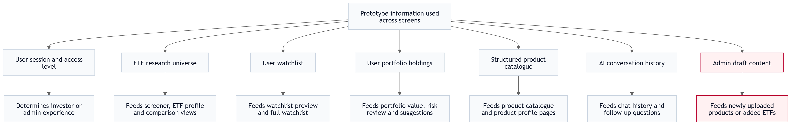

---

## 二、用户定义

### 2.1 Persona

| | 普通用户 User | 管理员 Admin |
| --- | --- | --- |
| 典型账号 | investor@sunwah.com.hk | admin@sunwah.com.hk |
| 核心诉求 | 浏览市场、筛选 ETF、构建组合、理解风险、获得 Assistant 辅助解释 | User 全部能力 + 维护产品目录、上传结构化产品、添加 ETF 数据 |
| 进入方式 | 邮箱密码 / Google / Microsoft SSO / Page Navigator User 快捷入口 | 邮箱密码 / SSO / Page Navigator Admin 快捷入口 |
| 登录后差异 | 可访问 Market、Portfolio、Assistant、Products、Profile | Products 顶部显示上传入口；Screener 显示 Add ETF；Profile 显示 Admin Tools |

### 2.2 角色–权限矩阵

| 功能区域 | 具体权限 | User | Admin |
| --- | --- | :---: | :---: |
| 认证 | 登录 / 登出 / 错误提示 / 网络错误提示 | Y | Y |
| Page Navigator | 点击节点跳转页面、模拟 User / Admin 登录 | Y | Y |
| 市场情报 | Dashboard · ETF Screener · Filter Sheet · Watchlist · ETF 详情 · ETF 对比 | Y | Y |
| 市场情报 | 添加 ETF by ID | N | Y |
| 组合情报 | 持仓输入 · 文件 / 图片 / 文本输入 · 草稿组合 · 分析 · Assistant 建议 · 历史 | Y | Y |
| Assistant | 对话 · 附件 · Portfolio Context · 解释 Drawer · 历史 Drawer · 自定义模式 | Y | Y |
| 结构化产品 | 产品列表 · Smart filters · Advanced Search · 详情 · 情景 · 定价 · 文档 · 同发行人对比 | Y | Y |
| 结构化产品 | 上传 PDF · AI 字段抽取 · 字段审核 · 发布 | N | Y |
| 个人设置 | 语言 · 通知 · 2FA · Base Currency · Terms / Privacy / About · Sign Out | Y | Y |
| 个人设置 | Admin Tools 入口 | N | Y |

---

## 三、页面结构

### 3.1 入口与页面树

| 截图 | 说明 |
| :---: | --- |
| 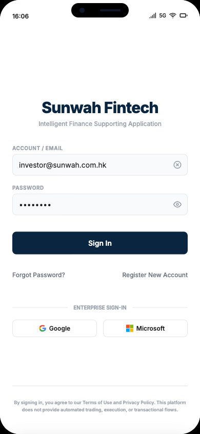 | **Login** — 邮箱、密码、记住我、Forgot password、Google / Microsoft SSO；用于进入普通用户或管理员流程。 |
| 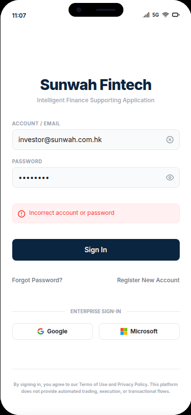 | **Auth Error** — 账号或密码错误时在表单内展示红色 inline 错误，不跳转。 |
| 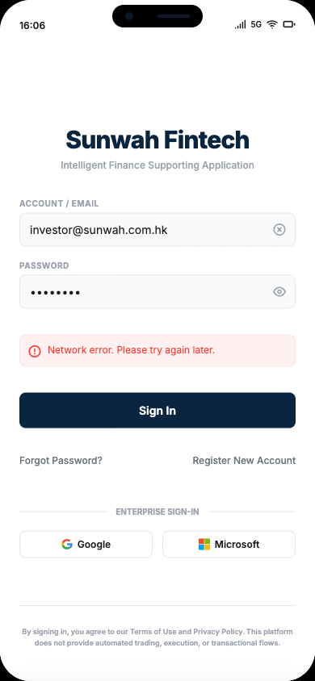 | **Network Error** — 网络异常时展示可恢复错误信息，引导用户稍后重试。 |
| 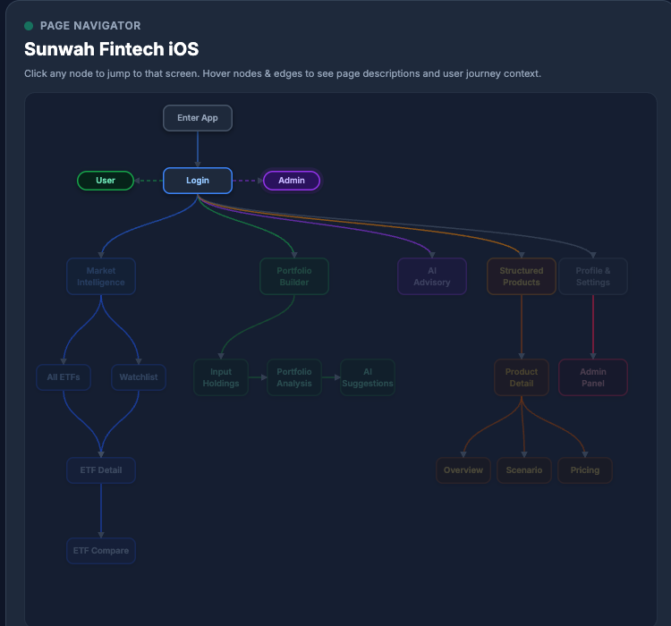 | **Page Navigator 左侧面板** — 展示产品页面树、User / Admin 快捷登录、模块颜色图例、产品边界声明。用于评审页面范围与用户旅程。 |
| 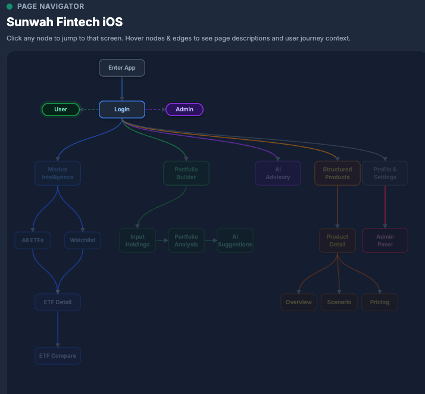 | **页面节点图** — 包含 Login、Market Intelligence、Portfolio Builder、Assistant、Structured Products、Profile & Settings、Admin Panel 等节点；点击节点可直接跳转对应原型状态。 |


---

### 3.2 页面目录

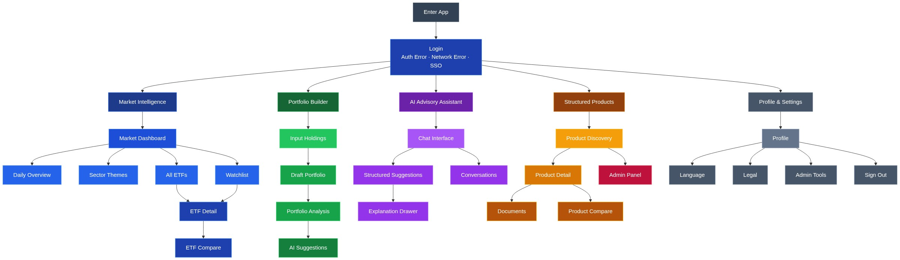

| 模块 | 页面路径 |
| --- | --- |
| Market Intelligence | Market Dashboard → Daily Overview / Sector Themes / All ETFs / Watchlist → ETF Detail → ETF Compare |
| Portfolio Builder | Input Holdings → Draft Portfolio → Portfolio Analysis → AI Suggestions |
| AI Advisory | Chat Interface → Structured Suggestions / Explanation Drawer；Conversations |
| Structured Products | Product Discovery → Product Detail（Overview / Performance / Note Events / Documents）→ Product Compare；Admin Panel |
| Profile & Settings | Profile → Language / Legal / Admin Tools / Sign Out |

## 四、功能模块

### 4.0 模块概览

第四章涵盖四个核心功能模块，每个模块按统一结构组织：

| 模块编号 | 模块名称 |
|----------|----------|
| 4.1 | Market Intelligence |
| 4.2 | Portfolio Intelligence |
| 4.3 | AI Advisory |
| 4.4 | Structured Products |

#### 4.0.1 模块结构

每个功能模块包含以下四个子章节：

| 子章节 | 说明 |
|--------|------|
| 功能概述 | 用户能力边界、数据输入输出、系统限制 |
| 页面介绍 | 原型截图与页面功能说明 |
| User Stories | 用户旅程与核心场景 |
| Acceptance Criteria | 验收标准 |

#### 4.0.2 Acceptance Criteria 设计标准

**分类标签体系**

AC 条目前缀标识验收项的类型：

| 前缀 | 类型 | 说明 |
|------|------|------|
| UI | 界面层 | 布局、组件、状态展示 |
| Flow | 流程层 | 用户旅程、页面流转、操作触发 |
| Data | 数据层 | 数据展示、校验、业务规则 |
| Access | 权限层 | 角色隔离、入口可见性 |
| Compliance | 合规层 | 免责声明、风险提示 |

**归属定义**

| 归属 | 定义 |
|------|------|
| Frontend | 前端独立实现，无需后端支持 |
| Backend | 后端独立实现，前端仅负责调用 |
| Integration | 前后端协同，需明确接口契约 |

**优先级定义**

| 优先级 | 定义 |
|--------|------|
| Must | 必须实现，阻塞发布 |
| Should | 强烈建议，影响核心体验 |
| Could | 可选实现，提升用户满意度 |

**表格格式**

```
| ID | AC Content (EN) | Content (CN) | References | Ownership | Priority |
```

- ID：类型前缀 + 序号，序号跨模块共享
- AC Content：英文验收项描述
- Content：中文对照描述
- References：对应页面、User Story 或功能章节
- Ownership：Frontend / Backend / Integration
- Priority：Must / Should / Could

#### 4.0.3 Profile & Settings

该模块功能相对简单，AC 合并至各模块或非功能性需求章节中。

---

### 4.1 Market Intelligence

#### 4.1.1 功能概述

| 能力 | 输入数据 | 输出 | 边界 |
| --- | --- | --- | --- |
| ETF Market Overview | ETF / 指数延迟行情 | 市场宽度、成交量、Rising / Flat / Falling、Return Distribution、ETF Rankings | 不做实时交易流 |
| Sector Themes | ETF basket / sector mapping | Default sectors + Daily Hot sectors、Sector Detail | 仅为研究入口，不构成推荐 |
| Market Indices | Hang Seng / HS Tech / S&P 500 等指数数据 | 指数卡片与涨跌幅 | 原型使用模拟 / delayed 数据 |
| ETF Screener | 搜索词、分类、地区、行业、发行人、币种、排序 | ETF 列表、空状态、active filter badge | 不接 Level II |
| My Watchlist | 用户星标 ETF | Watchlist 列表 / 空状态 | 仅研究关注，不做交易提醒 |
| ETF Detail | ETF symbol | 价格图、风险指标、分类、新闻、AI 分析入口 | HKEX delayed disclosure |
| ETF Compare | 两只 ETF | 标准化价格曲线与指标对比 | 原型限 2 ETF 对比 |
| Admin ETF Maintenance | ticker id | Fetch preview → Add to Platform → 更新 Screener | 仅 Admin 可见 |

#### 4.1.2 页面介绍

| 截图 | 页面说明 |
| :---: | --- |
| 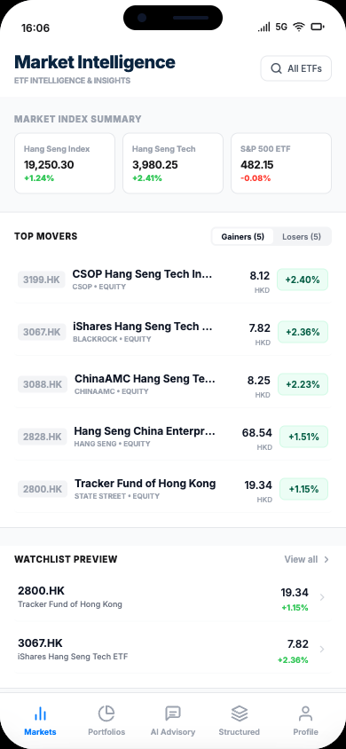 | **Market Dashboard** — 标题为 Market Intelligence / ETF intelligence & insights；包含 ETF Market Overview、Sectors、Daily Hot、Market Indices、Watchlist Preview，并提供 All ETFs 入口。 |
| 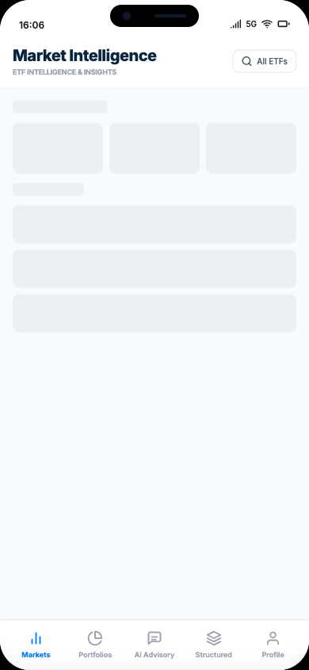 | **加载骨架屏** — Dashboard 数据请求中，以 skeleton 模拟卡片、列表和行情区域加载。 |
| 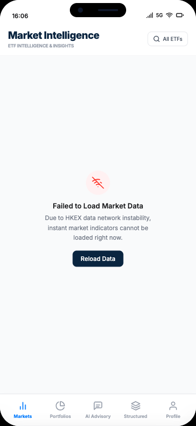 | **加载错误** — 数据源异常时展示错误状态和重试按钮。 |
| 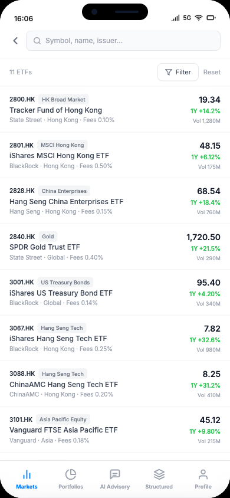 | **All ETFs Screener** — 搜索框、ETF 数量、Filter 按钮、ETF 列表；ETF 行展示 symbol、名称、主题标签、价格 / 涨跌幅、星标；Admin 登录后显示 Add ETF 入口。 |
| 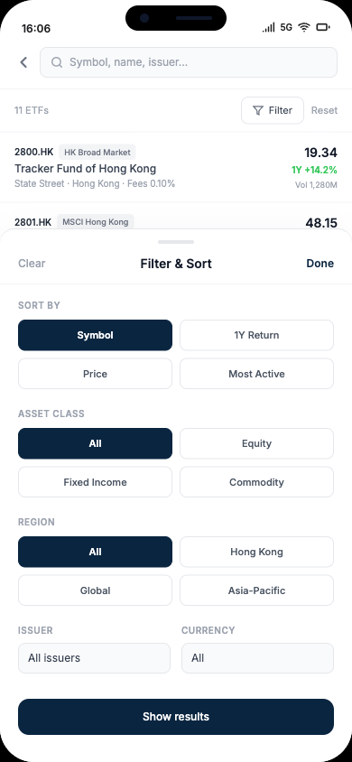 | **Filter & Sort Bottom Sheet** — 支持 Sort、Asset Class、Region、Sector、Issuer、Currency 组合筛选；Filter badge 显示激活数。 |
| 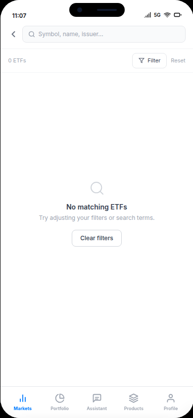 | **Screener Empty State** — 搜索 / 筛选无结果时展示 No matching ETFs 和 Clear filters。 |
| 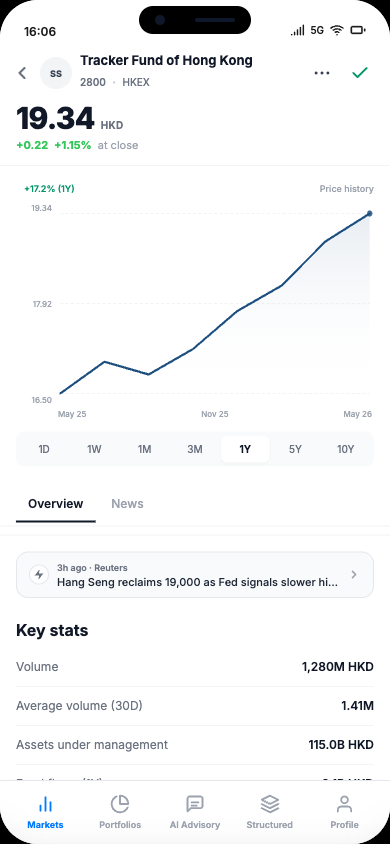 | **ETF Detail** — ETF header、价格、涨跌幅、时间区间图表、Watchlist、Quick Compare、Overview / News、风险指标、分类与新闻摘要。 |
| 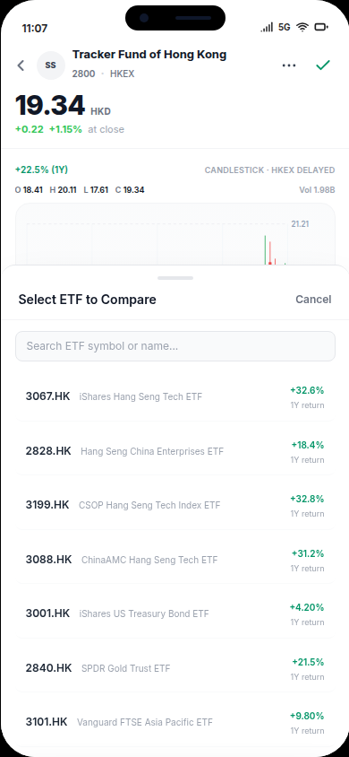 | **Compare Picker** — 从 ETF 详情打开 Bottom Sheet，搜索并选择第二只 ETF。 |
| 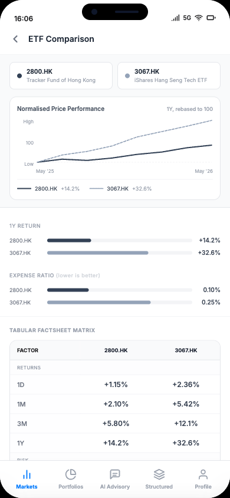 | **ETF Compare** — 双 ETF 头部卡、标准化价格曲线、收益 / 风险 / 费用等指标对比。 |

#### 4.1.3 User Stories

**M-1：浏览 ETF 详情**

> **用户类型**：User | **需求**：从 Market Dashboard 通过 Watchlist 预览、板块主题、自选 ETF 入口进入 ETF 详情页，查看 K 线图、风险指标、AI 评分等数据 | **价值**：快速获取任一关注 ETF 的完整研究上下文

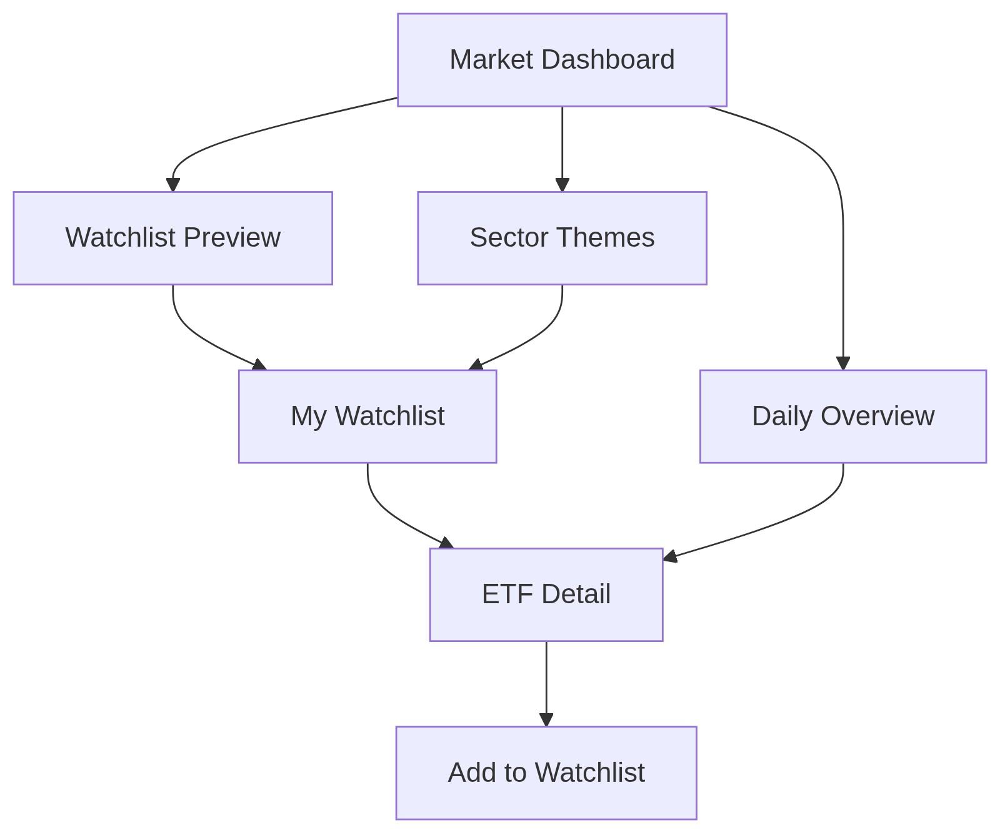

**M-2：筛选搜索 ETF**

> **用户类型**：User | **需求**：通过 All ETFs 筛选器，使用 Filter 或关键词匹配找到目标 ETF 并进入详情页 | **价值**：将模糊需求转化为具体可研究的 ETF 标的

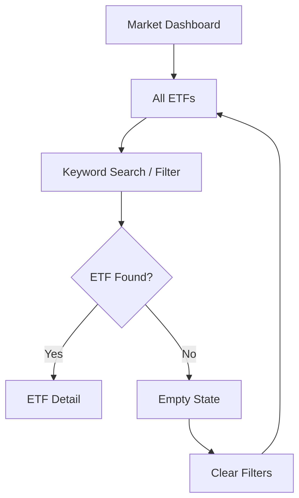

**M-3：对比 ETF**

> **用户类型**：User | **需求**：在 ETF 详情页点击 Compare，选择第二只 ETF 进入 Compare 页面，对比两只 ETF 的业绩、费用、风险等指标 | **价值**：辅助选品决策

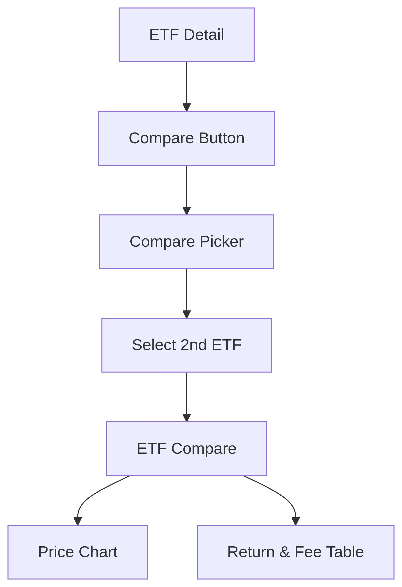

**M-4：维护 ETF 列表**

> **用户类型**：Admin | **需求**：通过 Add ETF by ID 页面，按 ticker 添加新 ETF 到平台，维护 Screener 可检索的产品范围 | **价值**：确保用户端 ETF 研究入口数据完整、可追溯

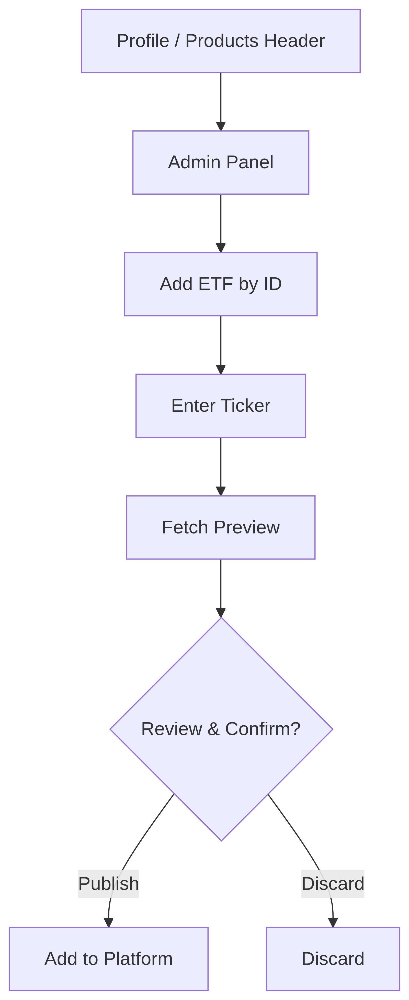

#### 4.1.4 Acceptance Criteria

| ID | AC Content | Content | References | Ownership | Priority |
| --- | --- | --- | --- | --- | --- |
| UI-001 | Market Dashboard displays ETF Market Overview, Sectors, Daily Hot, Market Indices, Watchlist Preview, and All ETFs entry by default. | Dashboard 默认展示 ETF 市场概览、板块、今日热门、市场指数、自选预览和全部 ETF 入口。 | 4.1.2 Market Dashboard | Frontend | Must |
| UI-002 | Dashboard renders loading skeleton during data fetch and displays error state with retry option on failure. | Dashboard 在数据加载中展示骨架屏，加载失败时展示错误状态和重试按钮。 | 4.1.2 Skeleton/Error states | Integration | Must |
| UI-003 | Screener shows Empty State with "No matching ETFs" message and Clear filters action when search/filter yields no results. | 筛选无结果时展示空状态，显示"无匹配 ETF"提示和清除筛选按钮。 | 4.1.2 Empty State; M-2 | Frontend | Must |
| UI-004 | ETF Detail page renders time-range chart, Overview/News tabs, Watchlist toggle, and Quick Compare button. | ETF 详情页展示时间区间图表、概览/新闻标签页、自选切换和快捷对比按钮。 | 4.1.2 ETF Detail; M-1 | Integration | Must |
| Flow-001 | User can navigate from Watchlist Preview, Sector cards, or Daily Hot section directly into corresponding ETF Detail page. | 用户可从自选预览、板块卡片或今日热门直接进入对应 ETF 详情页。 | M-1 User Story flowchart | Frontend | Must |
| Flow-002 | User can tap Compare button on ETF Detail, search and select a second ETF via Compare Picker, then enter ETF Compare page. | 用户可在 ETF 详情页点击对比按钮，通过对比选择器搜索选择第二只 ETF，进入 ETF 对比页面。 | M-3; 4.1.2 Compare Picker | Integration | Must |
| Flow-003 | Admin user can access Add ETF by ID page; regular users cannot view or access this entry. | 管理员可访问按 ID 添加 ETF 页面；普通用户无法看到或访问此入口。 | M-4; 4.1.2 Admin entry | Frontend | Must |
| Data-001 | ETF Screener filters results in real-time as user types or toggles filter options, with count update. | ETF 筛选器在用户输入或切换筛选条件时实时过滤结果，并同步更新数量统计。 | M-2; 4.1.2 Filter Sheet | Integration | Must |
| Data-002 | ETF Compare page displays normalized price curves (unified baseline) and left-right aligned metrics comparison table. | ETF 对比页以统一基准展示标准化价格曲线，并左右对齐展示指标对比表格。 | M-3; 4.1.2 ETF Compare | Integration | Must |
| Compliance-001 | Market data pages display delayed data disclaimer (e.g., "HKEX data delayed 15 min"). | 市场数据页面展示数据延迟免责声明（如"港交所数据延迟 15 分钟"）。 | 1.2 Guardrails | Frontend | Must |

---

### 4.2 Portfolio Intelligence

#### 4.2.1 功能概述

| 阶段 | 用户动作 | 系统输出 | 关键指标 |
| --- | --- | --- | --- |
| 输入 | Photos / Document 上传、粘贴文本、Add ETF、Add Structured Product、套用模板 | Draft Portfolio（symbol、qty、cost、market value、weight、P&L） | qty · cost · marketValue · weight · currency |
| 复核 | 点击 Review holdings | 草稿持仓可读列表、总市值、权重与 P&L 汇总 | holdings count · total value · weight |
| 分析 | 点击 Analyze draft portfolio | 四步 checklist、评分卡、HHI、Effective N、敞口图、Diagnosis Issues | HHI · Effective N · sector / region / currency |
| 建议 | 点击 Generate Recommendations | AI Portfolio Recommendations、Selected diagnosis scope、Before / After、具体调整动作、rationale、impact | Health Score · HHI target · exposure change |
| 历史 | 打开 Portfolio History Drawer | Portfolio History / Saved snapshots | date · total value · holdings summary |

#### 4.2.2 Diagnosis Issue 触发规则

| 评分维度 | 计算方式 | Diagnosis Issue | 触发条件 | 严重度 |
| --- | --- | --- | --- | --- |
| 集中度 | HHI = sum(weight_i²) | High concentration risk | HHI > 0.25 | High |
| 集中度 | HHI = sum(weight_i²) | Moderate concentration | 0.15 < HHI <= 0.25 | Medium |
| 分散化 | Effective N = 1 / HHI | Insufficient diversification | Effective N < 3 | High |
| 地区 | HK / China 权重加总 | Geographic concentration — HK/China | HK / China > 70% | High |
| 汇率 | HKD 权重加总 | FX concentration — HKD | HKD > 70% | Medium |
| 行业 | Tech sector 权重 | Technology sector overweight | Tech > 35% | Medium |
| 防御性 | Fixed Income / defensive 权重 | Insufficient defensive allocation | Fixed Income < 15% | Low |

#### 4.2.3 页面介绍

| 截图 | 页面说明 |
| :---: | --- |
| 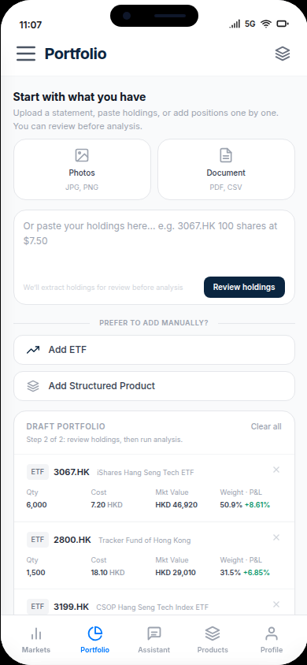 | **Start with what you have** — Photos / Document 上传入口、Add ETF、Add Structured Product、文本粘贴框、模板示例、Draft Portfolio、Review holdings 与 Analyze draft portfolio 按钮。 |
| 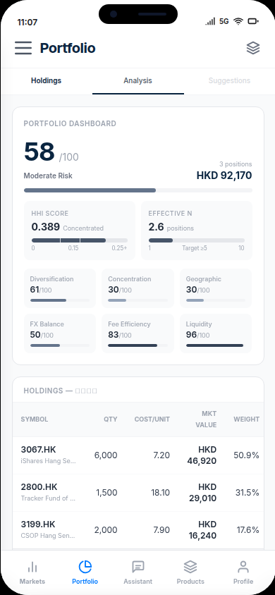 | **Portfolio Analysis** — 四步 checklist（Verifying HKEX pricing、Computing HHI concentration index、Assessing sector & currency bias、Calculating risk sub-scores）；展示评分卡、HHI / Effective N、敞口与 Diagnosis Issues。 |
| 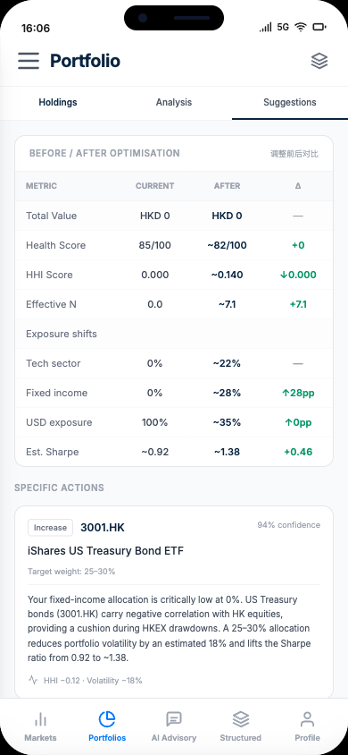 | **AI Portfolio Recommendations** — Selected diagnosis scope、Before / After Optimisation、具体动作建议、rationale、impact 与合规声明；由 Generate Recommendations 触发。 |
| 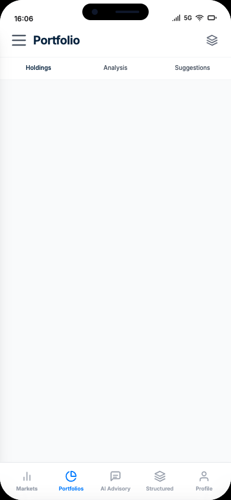 | **Portfolio History / Saved snapshots** — 左侧抽屉展示历史分析快照，用于恢复或对比过往组合状态。 |

#### 4.2.4 User Stories

**P-1：录入持仓 → 运行组合诊断 → 获取调仓建议**

> **用户类型**：User | **需求**：通过在 ETF / 结构化产品列表中选择，或上传文本 / 文件 / 图片让 AI 解析转化两种方式录入持仓；运行持仓分析，查看评分与 Diagnosis Issues，可选择接受或放弃部分诊断；最后获取 AI 调仓建议与 Before / After 对比 | **价值**：形成可解释的组合风险上下文，并基于诊断获取个性化调仓建议

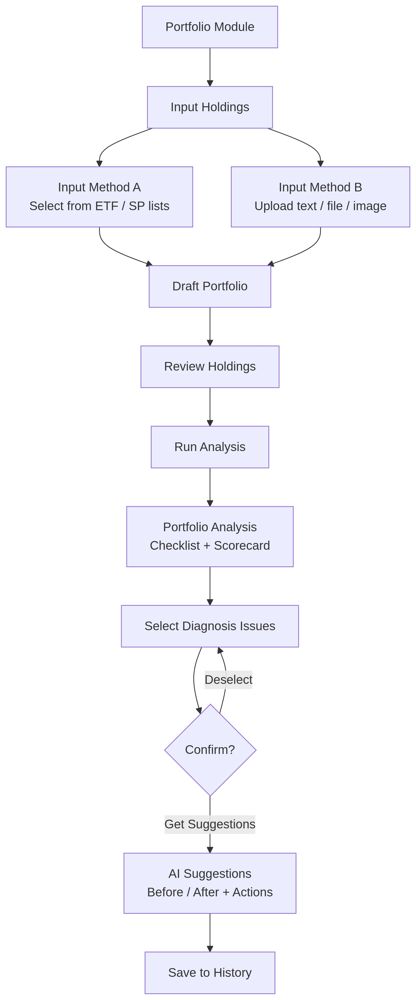

**P-2：查看历史持仓分析记录**

> **用户类型**：User | **需求**：在 Portfolio 模块左上角呼出 History Drawer，浏览历史持仓分析快照，选择任意历史记录恢复到当前 Draft Portfolio | **价值**：支持用户回顾和对比不同时间点的组合状态

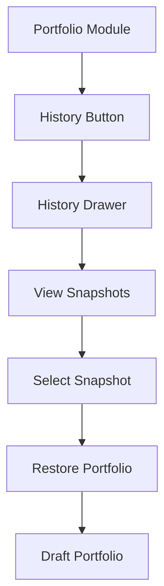

#### 4.2.5 Acceptance Criteria

| ID | AC Content | Content | References | Ownership | Priority |
| --- | --- | --- | --- | --- | --- |
| Flow-004 | Portfolio Input page offers Photos upload, Document upload, text paste, and manual Add ETF/Structured Product entry as four parallel input methods. | 组合录入页面同时提供照片上传、文档上传、文本粘贴和手动添加 ETF/结构化产品四种并行输入方式。 | P-1; 4.2.1 Input stage | Frontend | Must |
| Flow-005 | User can trigger portfolio analysis after holdings are entered; analysis shows a multi-step checklist with progress indicators. | 用户在录入持仓后可触发组合分析；分析过程展示带进度指示的多步骤检查清单。 | P-1; 4.2.3 Analysis page | Integration | Must |
| Flow-006 | User can toggle individual Diagnosis Issues to include/exclude them from the recommendation scope before generating suggestions. | 用户可在生成建议前切换单个诊断问题的选中状态，以纳入或排除其对应的建议范围。 | P-1; 4.2.3 Analysis page | Frontend | Must |
| Flow-007 | User can open History Drawer from Portfolio module header to browse and restore past analysis snapshots. | 用户可从组合模块顶部打开历史抽屉，浏览并恢复历史分析快照。 | P-2; 4.2.4 History Drawer | Frontend | Should |
| Data-003 | Draft Portfolio displays symbol, quantity, cost, market value, weight, P&L, and currency for each holding. | 草稿组合展示每个持仓的代码、数量、成本、市值、权重、盈亏和币种。 | P-1; 4.2.1 Input stage | Integration | Must |
| Data-004 | Analysis result displays HHI concentration index, Effective N, sector/currency/region exposure breakdown, and selectable Diagnosis Issues with severity levels. | 分析结果展示 HHI 集中度指数、有效数量 N、分行业/币种/地区敞口分布，以及带严重度等级的可选诊断问题。 | P-1; 4.2.2, 4.2.3 | Integration | Must |
| Data-005 | AI Recommendations display Before/After comparison table and per-action details including symbol, target weight, rationale, and projected impact. | AI 建议展示前后对比表格，以及每条建议的代码、目标权重、理由和预期影响详情。 | P-1; 4.2.3 Recommendations page | Integration | Must |
| Compliance-002 | Portfolio Analysis and Recommendations pages display non-investment-advice disclaimer at bottom (e.g., "Not financial advice. For informational purposes only."). | 组合分析和建议页面底部展示非投资建议免责声明（如"非财务建议，仅供参考"）。 | P-1; 1.2 Guardrails | Frontend | Must |

---

### 4.3 Assistant

#### 4.3.1 功能概述

| 能力 | 输入 | 输出 | 说明 |
| --- | --- | --- | --- |
| 模式化聊天 | Value focus / Income focus + 用户问题 | 文本回复或结构化建议卡 | 关键词 value / income / HHI 触发结构化结果 |
| Portfolio Context | On / Off | 将当前组合上下文用于回答 | Toggle 高亮并影响组合相关问题 |
| 附件分析 | 图片 / PDF / report | Attachment preview chip + 文件摘要 / 问答 | 原型模拟文件读取 |
| 可解释 Drawer | 点击建议 / Analytical Details | Why this suggestion appeared、What prompted this、Data considered、Assistant interpretation、Limits to this explanation | 提升可追溯性 |
| Conversations | 左侧 Drawer | 会话列表、恢复、删除、New conversation | 管理多轮研究对话 |
| Custom Mode | 点击 + 后用 Prompt 或 Guided Survey 创建 | 新 mode pill | 自定义投资目标、约束、风险偏好 |

#### 4.3.2 页面介绍

| 截图 | 页面说明 |
| :---: | --- |
| 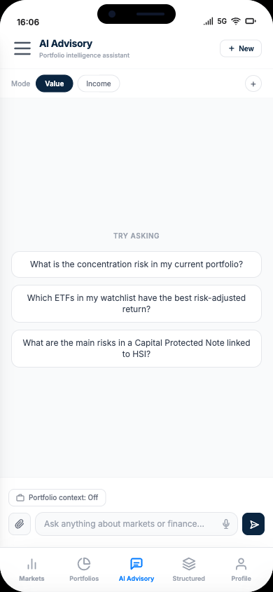 | **Advisory Assistant Chat** — 标题为 Advisory Assistant；历史按钮、New、Value focus / Income focus 模式、+ 自定义模式入口、Sample Questions、Portfolio Context、附件与输入框。 |
| 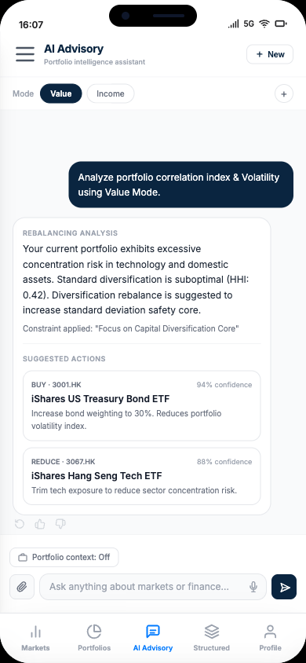 | **Structured Suggestions** — 触发 value / income / HHI 等关键词后展示结构化 rebalancing analysis 与 suggested actions。 |
| 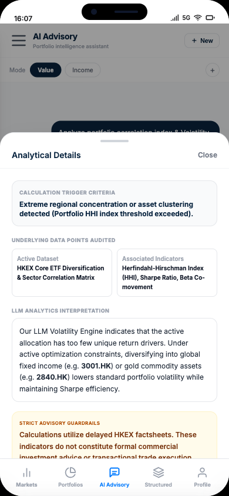 | **Explanation Drawer** — Bottom Sheet 展示 Why this suggestion appeared、What prompted this、Data considered、Assistant interpretation、Limits to this explanation。 |
| 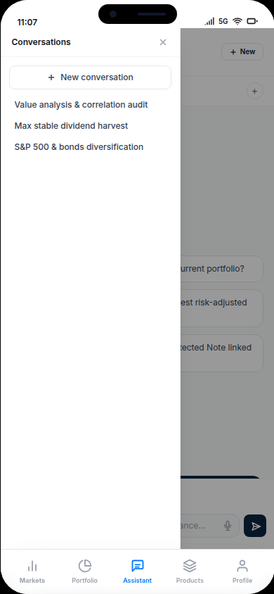 | **Conversations Drawer** — 左侧抽屉展示历史会话，可恢复或删除会话，并支持 New conversation。 |
| 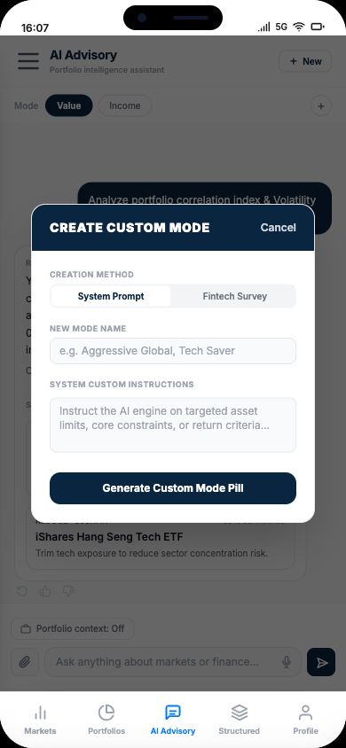 | **Create Custom Mode** — 点击 + 后创建自定义模式，支持 Prompt 与 Guided Survey 两种创建方式，创建后新增 mode pill。 |

#### 4.3.3 User Stories

**A-1：通过 Chat 进行问答**

> **用户类型**：User | **需求**：选择 Value / Income / Custom 模式，配置 Portfolio Context 或附件等工具，输入问题并获取结构化建议与详细解释 | **价值**：在不同投资偏好下获得可追溯的研究支持，支持持续追问和上下文延续

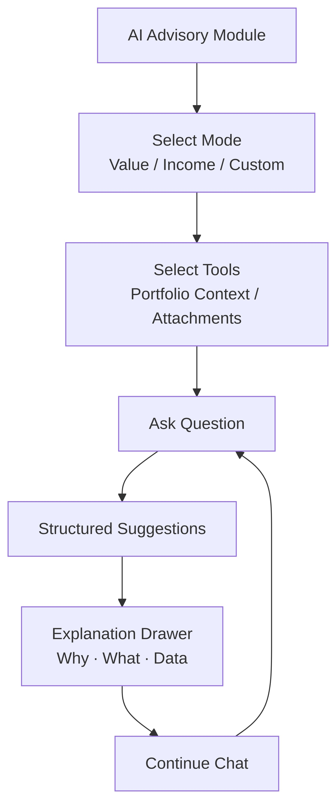

**A-2：查看历史对话记录**

> **用户类型**：User | **需求**：在 AI Advisory 模块左上角呼出 History Drawer，浏览历史会话列表，选择任意历史记录恢复到当前对话 | **价值**：支持用户回顾和继续之前的咨询上下文

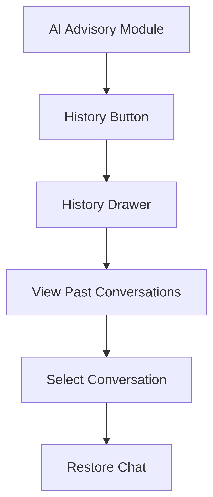

**A-3：创建自定义 Mode**

> **用户类型**：User | **需求**：点击 + 创建自定义 Mode，通过填写 Prompt 或完成问卷（投资期限、风险偏好、收益目标）两种方式生成专属模式，并保存到 Mode 列表 | **价值**：让用户根据个人投资需求定制 AI 顾问的行为模式

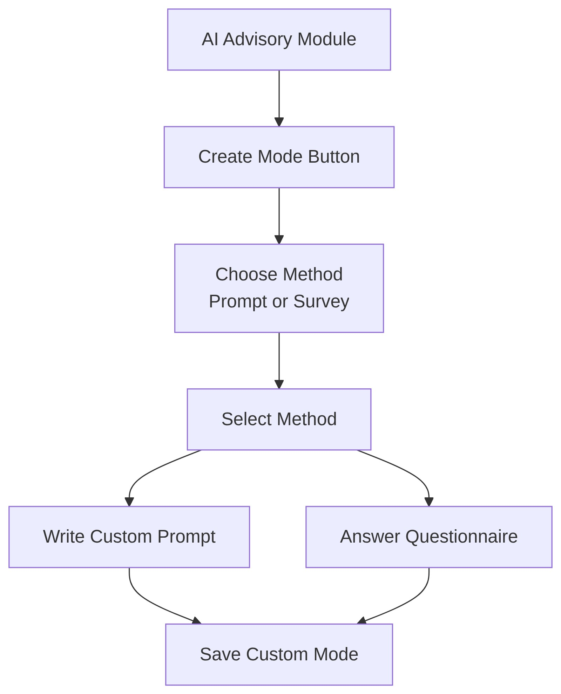

#### 4.3.4 Acceptance Criteria

| ID | AC Content | Content | References | Ownership | Priority |
| --- | --- | --- | --- | --- | --- |
| UI-005 | Chat page displays Sample Questions in empty state; first message sent hides the samples. | 聊天页面空状态展示示例问题；发送第一条消息后隐藏示例。 | A-1; 4.3.2 Chat page | Frontend | Should |
| UI-006 | User message bubble appears immediately upon send; Assistant typing indicator shown before response arrives. | 用户消息气泡在发送后立即显示；助手回复前展示打字指示器。 | A-1; 4.3.2 Chat page | Frontend | Must |
| UI-007 | Explanation Drawer displays five sections: Why this suggestion appeared, What prompted this, Data considered, Assistant interpretation, Limits to this explanation. | 解释抽屉展示五个部分：本建议出现原因、触发因素、参考数据、助手解读、解释局限性。 | A-1; 4.3.2 Explanation Drawer | Integration | Must |
| Flow-008 | User can switch between Value focus, Income focus, and Custom modes; active mode is visually highlighted with mode-switch feedback. | 用户可在价值导向、收益导向和自定义模式间切换；当前激活模式高亮显示并有切换反馈。 | A-1; 4.3.1 Mode capability | Frontend | Must |
| Flow-009 | User can toggle Portfolio Context On/Off; when On, AI responses incorporate current portfolio metrics for relevant queries. | 用户可切换组合上下文开关；开启时 AI 回答针对相关问题引用当前组合指标。 | A-1; 4.3.1 Portfolio Context | Integration | Must |
| Flow-010 | User can open History Drawer to browse, restore, or delete past conversations, and start new conversations. | 用户可打开历史抽屉浏览、恢复或删除历史会话，并开始新对话。 | A-2; 4.3.2 History Drawer | Integration | Should |
| Flow-011 | User can create Custom Mode via Prompt entry or Guided Survey; newly created mode appears in mode list and is activated. | 用户可通过输入 Prompt 或完成引导问卷创建自定义模式；新创建的模式出现在模式列表中并被激活。 | A-3; 4.3.2 Create Mode | Integration | Should |
| Compliance-003 | AI suggestions and recommendations must not contain trading execution language (e.g., "buy", "sell", "order", "execute") or guaranteed return claims. | AI 建议和推荐不得包含交易执行措辞（如"买入"、"卖出"、"下单"、"执行"）或收益保证声明。 | A-1; 1.2 Guardrails | Backend | Must |

---

### 4.4 Structured Products

#### 4.4.1 功能概述

| 能力 | 输入 | 输出 | 边界 |
| --- | --- | --- | --- |
| 产品目录 | Issuer list、Smart filters、Advanced search | 产品卡列表、风险 / 期限 / 状态摘要、Screening only 提示 | 仅研究发现，不做交易 |
| Advanced search | 产品类型、结构、标的、barrier、日期、期限、币种、状态等 | 精细过滤后的产品列表 | 原型使用模拟数据 |
| 产品详情 | product id | Overview / Performance / Note Events / Documents | 风险优先展示 |
| Note Events | Bull / Base / Bear | Payoff Story、Outcome selector、Payoff map、Rule quick check | 预设情景，非收益承诺 |
| 当前表现 / Performance | product id | indicative price、implied yield、barrier watch、source、date | 非 firm quote |
| Compare Products | 当前产品 + 同发行人产品 | Tabular Factsheet Matrix 双栏条款对比 | 不跨发行人比较 |
| Admin Panel | PDF Term Sheet | Upload Structured Product Sheet → Select PDF product sheet → Extraction complete → Publish | 仅 Admin 可见 |
| Admin ETF 维护 | ticker id | Add ETF by ID → Fetch preview → Add to Platform | 仅 Admin 可见 |

#### 4.4.2 页面介绍

**User 侧页面**

| 截图 | 页面说明 |
| :---: | --- |
| 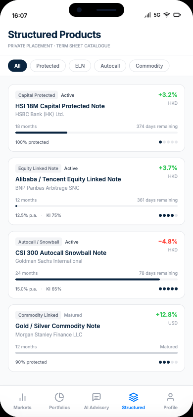 | **Structured Products** — Screening only 风险提示、Issuer list、Smart filters、Advanced search、产品卡展示 payoff type、principal treatment、barrier / buffer、status、risk 与 suitability cues；Admin 登录后显示 Admin Panel。 |
| 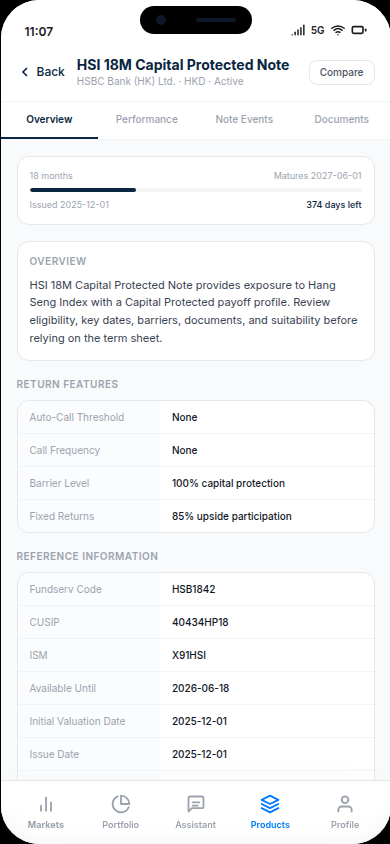 | **Product Detail Overview** — 产品名称、发行人、状态、Overview / Performance / Note Events / Documents tabs、underlying、terms、illustrative outcomes、Risk Disclosure、compare 入口。 |
| 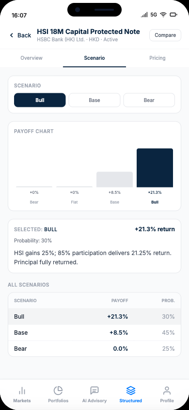 | **Note Events** — 展示 Payoff Story、Outcome selector、Payoff map、Rule quick check、coupon / barrier / settlement 规则。 |
| 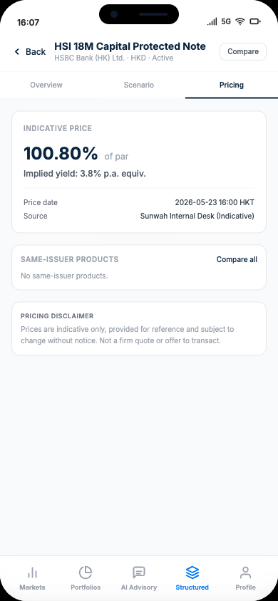 | **Performance** — 指示性价格、implied yield、barrier watch、同发行人产品参考与 pricing disclaimer。 |
| 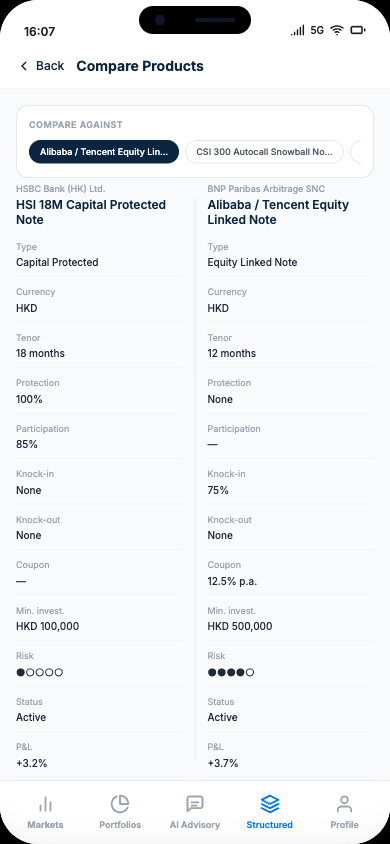 | **Compare Products** — 同发行人产品选择器 + Tabular Factsheet Matrix / 左右双栏条款对比，避免跨发行人不可比。 |

**Admin 专属页面**

| 截图 | 页面说明 |
| :---: | --- |
| 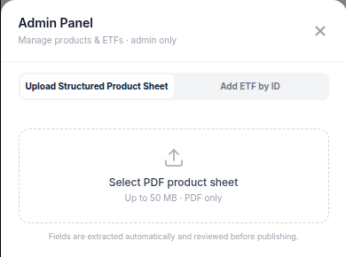 | **Admin Panel** — Admin 专属；Upload Structured Product Sheet、Select PDF product sheet 与 Add ETF by ID 两个维护入口。 |
| 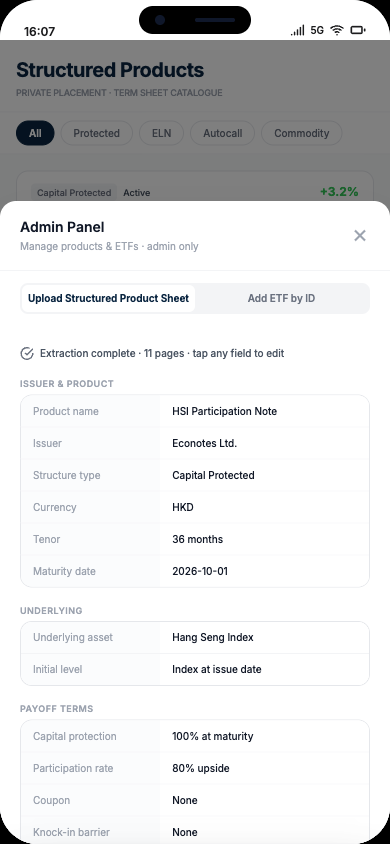 | **Extracted Review** — Extraction complete 后展示 AI 抽取字段，管理员可审核、Discard 或 Publish；ETF 维护成功后可 Add to Platform。 |

#### 4.4.3 User Stories

**S-1：浏览结构化产品详情**

> **用户类型**：User | **需求**：通过 Issuer / Strategy / Risk 等过滤器浏览产品列表，点击产品卡片进入详情页，查看 Overview / Performance / Note Events / Documents 等标签页，并可加入关注列表 | **价值**：形成结构化产品研究上下文，帮助理解条款、状态和关键指标

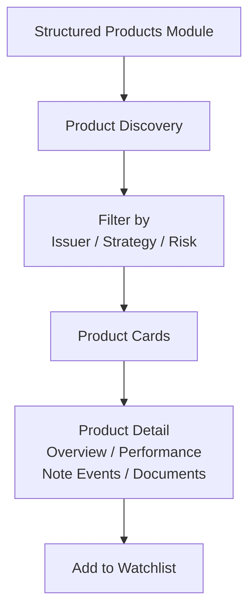

**S-2：筛选搜索结构化产品**

> **用户类型**：User | **需求**：通过 Smart Filters 或 Advanced Search 使用产品类型、标的、barrier、期限、币种等条件筛选产品，找到目标产品后进入详情页 | **价值**：将模糊需求转化为具体可研究的产品标的

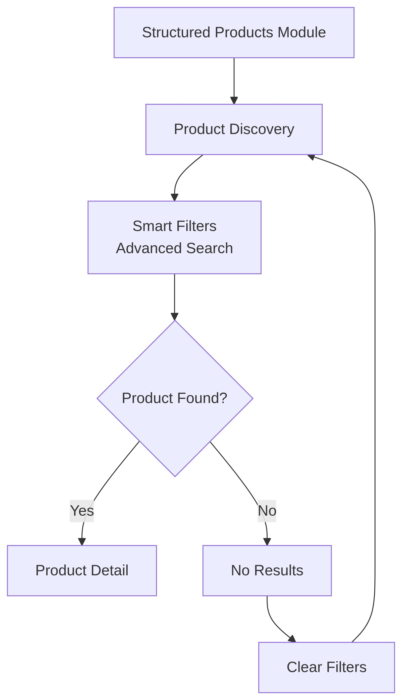

**S-3：对比结构化产品**

> **用户类型**：User | **需求**：在产品详情页点击 Compare，选择同发行人的第二只产品进入 Compare 页面，对比收益结构、票息、barrier、风险等条款信息 | **价值**：辅助选品决策，避免跨发行人不可比的产品对比

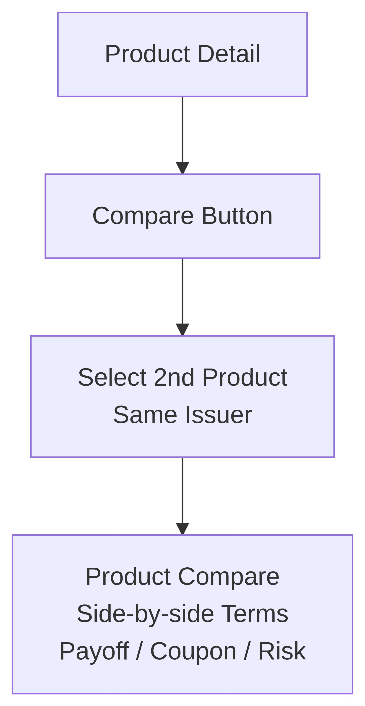

**S-4：上传结构化产品 PDF**

> **用户类型**：Admin | **需求**：通过 Admin Panel 上传结构化产品 term sheet PDF，AI 自动提取字段，管理员审核编辑后 Publish 发布到平台 | **价值**：统一维护结构化产品数据，让产品目录保持最新

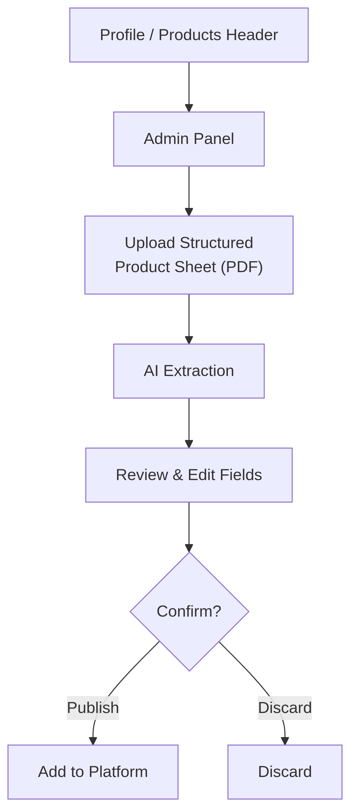

#### 4.4.4 Acceptance Criteria

| ID | AC Content | Content | References | Ownership | Priority |
| --- | --- | --- | --- | --- | --- |
| UI-008 | Product Discovery page displays Screening only banner, Issuer list, Smart Filters, and Advanced Search entry. | 产品发现页展示"仅供筛选"提示横幅、发行人列表、智能筛选器和高级搜索入口。 | S-1, S-2; 4.4.3 Product list page | Frontend | Must |
| UI-009 | Product cards display payoff type, principal treatment, barrier/buffer, issuer, status, risk level, and suitability cues. | 产品卡展示收益类型、本金处理、 barrier/buffer、发行人、状态、风险等级和适当性提示。 | S-1; 4.4.3 Product list page | Integration | Must |
| UI-010 | Product Detail page renders Overview, Performance, Note Events, and Documents tabs with respective content. | 产品详情页渲染概览、表现、情景事件和文档标签页及对应内容。 | S-1; 4.4.3 Detail Overview | Integration | Must |
| UI-011 | Note Events tab displays Payoff Story, Outcome selector, Payoff map, Rule quick check, and rule explanations for Bull/Base/Bear scenarios. | 情景事件标签页展示收益故事、情景选择器、收益地图、规则速查和涨跌/中性/熊市情景的规则解释。 | S-1; 4.4.3 Note Events page | Integration | Must |
| Flow-012 | User can filter products via Smart Filters or Advanced Search; no results shows Empty State with Clear action. | 用户可通过智能筛选或高级搜索筛选产品；无结果时展示空状态和清除操作。 | S-2; 4.4.3 Filter/Search | Integration | Must |
| Flow-013 | User can tap Compare on Product Detail, select a second product (same issuer only) via picker, and enter Compare page. | 用户可在产品详情页点击对比，通过选择器选择第二只产品（仅限同发行人），进入对比页面。 | S-3; 4.4.3 Compare page | Integration | Must |
| Flow-014 | Admin can upload structured product PDF via Admin Panel; system shows extraction progress then enters field review. | 管理员可通过管理面板上传结构化产品 PDF；系统展示抽取进度后进入字段审核页面。 | S-4; 4.4.3 Admin Panel | Integration | Must |
| Flow-015 | Admin can edit extracted fields and choose Discard or Publish; success shows confirmation feedback. | 管理员可编辑抽取的字段并选择放弃或发布；成功后展示确认反馈。 | S-4; 4.4.3 Extracted Review | Integration | Must |
| Access-001 | Admin Panel entry and Upload/Add ETF features are visible and accessible only to Admin role users. | 管理面板入口和上传/添加 ETF 功能仅对管理员角色用户可见和可访问。 | S-4; 2.2 Role Matrix | Frontend | Must |
| Compliance-004 | Product pages display non-trading disclaimer, non-firm-quote disclaimer, and suitability assessment notice. | 产品页面展示非交易执行免责声明、非确定报价免责声明和适当性评估提示。 | S-1; 1.2 Guardrails | Frontend | Must |

---

### 4.5 Profile & Settings

#### 4.5.1 功能概述

| 能力 | 说明 | 优先级 |
| --- | --- | --- |
| 用户身份 | 展示姓名、邮箱、头像首字母、PRO / ADMIN 标签 | Must |
| Language | EN / 繁中切换，Profile 文案即时切换 | Should |
| Notifications | iOS switch 样式开关 | Should |
| Security & 2FA | 展示安全状态，并提供 2FA 设置入口 | Should |
| Base Currency | 显示基础币种偏好 | Should |
| Legal Links | Terms of Use、Privacy Policy、About | Must |
| Sign Out | 登出并回到 Login | Must |
| Admin Tools | Admin 专属入口，包含 Add ETF by ID 与 Upload Structured Product | Must |

#### 4.5.2 页面介绍

| 截图 | 页面说明 |
| :---: | --- |
| 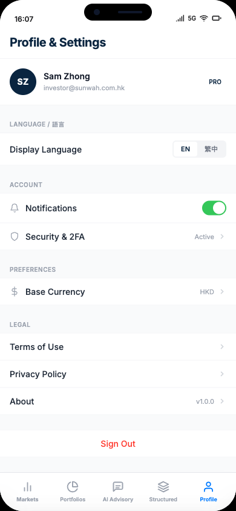 | **Profile** — 用户身份、会员标签；Language / 語言、Account、Preferences、Legal 分组；Notifications、Security & 2FA、Base Currency、Terms / Privacy / About、Sign Out；Admin 登录时出现 Admin Tools（Add ETF by ID、Upload Structured Product）；底部提示 HKEX data delayed 15 min · No trading execution。 |

---

## 五、非功能性需求

### 5.1 认证与登录

| 要求 | 细则 | 优先级 |
| --- | --- | --- |
| 认证方式 | 账号密码登录 + Google / Microsoft OAuth 2.0 SSO | Must |
| 错误反馈 | 账号或密码错误时 inline 红色提示；网络异常显示明确错误文案 | Must |
| Token 管理 | Access Token 存储于 iOS Keychain；过期后静默刷新；登出时撤销本地与服务端 token | Must |
| 会话安全 | 应用进入后台超过 30 分钟要求重新认证 | Should |
| 失败保护 | 连续失败达到阈值后锁定或要求额外验证 | Should |
| 双因素验证 | 支持 TOTP / 企业 SSO 2FA；Profile 展示状态 | Should |

### 5.2 RBAC / Admin 隔离

| 要求 | 细则 | 优先级 |
| --- | --- | --- |
| 角色识别 | 服务端根据账号类型下发角色，前端仅用于显示控制 | Must |
| 双重校验 | 客户端隐藏控件不作为唯一保护；Admin API 必须服务端鉴权 | Must |
| Admin 入口隔离 | Upload Product、Add ETF、Admin Tools 普通用户不可见不可调用 | Must |
| 审计日志 | 上传、发布、删除、字段修改记录 actor、时间、来源、内容 ID | Should |

### 5.3 数据安全与隐私

| 要求 | 细则 | 优先级 |
| --- | --- | --- |
| 传输加密 | 所有 API 使用 TLS 1.2+；生产客户端启用 certificate pinning | Must |
| 本地存储 | Token、敏感配置、持仓缓存使用 Keychain / 加密存储 | Must |
| 持仓数据处理 | 持仓数据仅用于当前分析与用户授权场景，不写入明文日志 | Must |
| PII 处理 | 邮箱、姓名等 PII 在日志与 AI 请求前脱敏或最小化 | Must |
| 数据最小化 | 不申请位置、通讯录、麦克风等无关系统权限 | Must |
| 第三方 AI 边界 | 调用 AI 时不传入可识别身份信息，输出经过合规过滤 | Should |

### 5.4 iOS 客户端开发规范

| 要求 | 细则 | 优先级 |
| --- | --- | --- |
| 设计规范 | 遵循 Apple Human Interface Guidelines（HIG） | Must |
| 交互控件 | Tab Bar、Bottom Sheet、Drawer、Toast、Segmented Control、iOS Switch 采用原生或行为等效组件 | Must |
| 触摸目标 | 所有可交互元素最小触摸区域 44×44pt | Must |
| 安全区域 | 兼容 Dynamic Island、Home Indicator 与 Safe Area Insets | Must |
| 手势交互 | Drawer 左滑关闭、Bottom Sheet 下拉关闭等标准手势正确响应 | Should |
| 动画时长 | 页面切换、Drawer、Toast、Sheet 动画控制在 200–350ms | Must |
| 键盘处理 | 输入框获焦时不遮挡内容，支持点击空白收起键盘 | Must |
| 动态字体 | Accessibility Large Text 下不出现核心内容截断 | Should |

### 5.5 性能

| 指标 | 目标 | 测量条件 |
| --- | --- | --- |
| 首屏加载（Market Dashboard） | <= 2s | Wi-Fi，冷启动 |
| 页面交互响应 | <= 300ms | 点击到视觉反馈 |
| ETF 数据接口 p95 延迟 | <= 800ms | 正常网络环境 |
| Assistant 首次响应 | <= 3s | Typing Indicator 出现后 |
| 文件解析（PDF / CSV / 图片，5MB 内） | <= 10s | 含抽取阶段 |
| 内存占用 | 正常使用 < 150MB RSS | iPhone 13 |
| Loading 状态覆盖 | 所有网络请求均有 Skeleton / Spinner / Error，不白屏 | 全机型 |
| 离线处理 | 展示缓存数据 + 离线提示；写操作禁用并解释原因 | Should |

### 5.6 兼容性与可访问性

| 要求 | 细则 | 优先级 |
| --- | --- | --- |
| iOS 版本 | iOS 16.0+；主要测试 iPhone 13 / 14 / 15 系列 | Must |
| 屏幕尺寸 | 4.7" 至 6.7" 竖屏可滚动访问全部内容 | Must |
| 横竖屏 | 竖屏为主要使用方向；图表区域可在横屏下增强展示 | Could |
| VoiceOver | 核心按钮、输入框、图表摘要提供 accessibilityLabel / Hint | Should |
| 本地化 | 英文与繁体中文双语；关键业务文案应统一进入 i18n 资源 | Should |
| 文字对比度 | 正文与背景满足 WCAG AA（4.5:1） | Should |

### 5.7 合规性

| 要求 | 细则 | 优先级 |
| --- | --- | --- |
| 投资建议边界 | 所有 Assistant / Portfolio / Product 建议明确声明不构成正式投资建议 | Must |
| 禁止交易指令 | 不出现 Execute / Order / Place Trade 等交易执行 UI 或文案 | Must |
| 数据延迟披露 | ETF 行情标注 delayed；产品定价标注 indicative / non-firm quote | Must |
| 产品适当性声明 | 结构化产品页注明 Private Placement 与 Suitability assessment required | Must |
| 收益免责 | 不承诺收益；历史表现不代表未来表现 | Must |
| 隐私政策 | App 内提供 Privacy Policy；遵循香港 PDPO | Must |
| 数据驻留 | 明确用户数据处理与存储地区 | Should |

### 5.8 可观测性与可维护性

| 要求 | 细则 | 优先级 |
| --- | --- | --- |
| 崩溃监控 | 集成 crash reporting，含设备、系统版本、页面上下文 | Must |
| 错误日志 | API 错误、文件解析失败、Assistant 超时记录 request ID | Must |
| 配置化 | ETF 数据源、AI prompt、评分阈值、合规声明文案可配置 | Should |
| Feature Flag | 新功能通过 feature flag 灰度上线 | Should |
| API 版本控制 | 后端 API 采用 `/v1/` 等版本化路由 | Should |
| 监控告警 | ETF 数据、Assistant 推理、产品发布设置 p95 和错误率告警 | Should |
