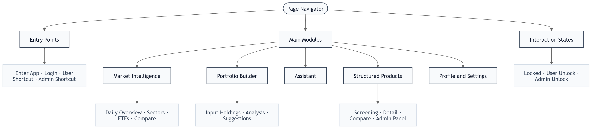
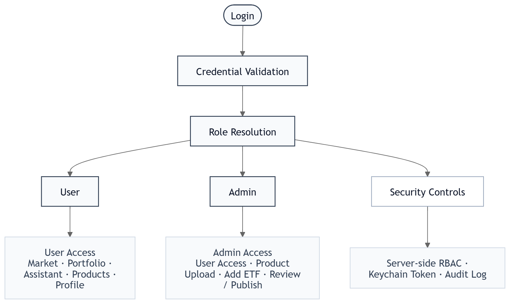
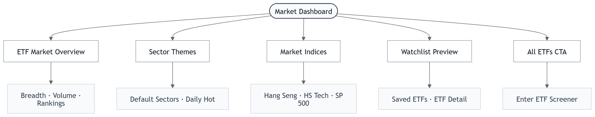
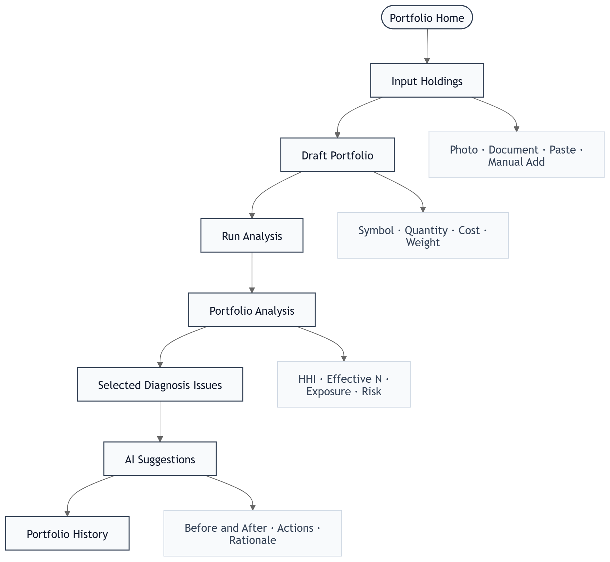
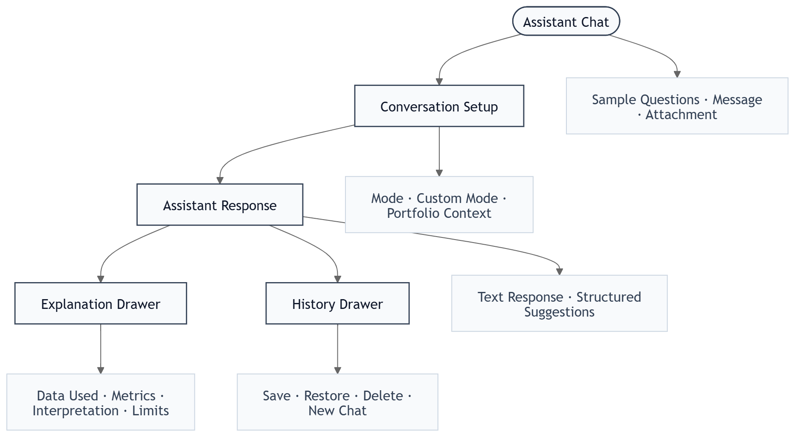
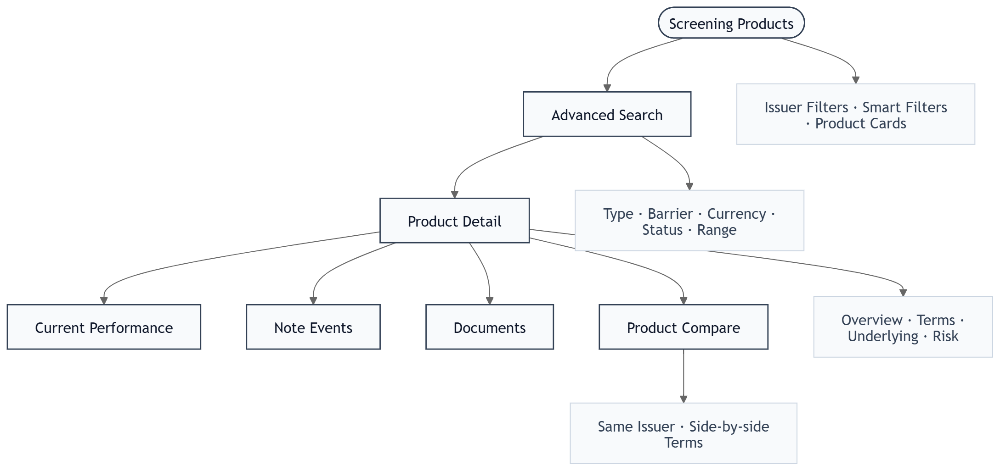
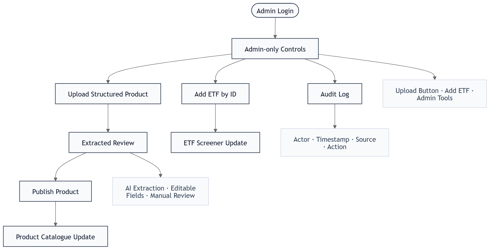

# Sunwah Fintech iOS — 产品需求文档（PRD）

## 一、项目概述

| 项目项 | 内容 |
| --- | --- |
| 产品定位 | 面向机构 / 高净值投资者的 iOS 投资智能助手原型 |
| 核心闭环 | 市场情报 → ETF / 结构化产品研究 → 组合诊断 → Assistant 解释与建议 → 决策辅助 |
| 交付物 | 单页交互式网页原型，用于评审页面结构、模块边界、用户旅程与交互状态 |
| 试点目标 | 可登录、可浏览所有主模块、可模拟 User / Admin 权限、可查看核心 loading / error / empty / drawer / sheet 状态 |
| 不做范围 | 交易执行 · 正式受监管投顾 · Level II / tick 实时行情 · 真实下单 · 真实 PDF OCR 服务 · Web/Android 生产客户端 |

### 1.1 产品 Guardrails

原型首页左侧 Page Navigator 明确展示产品边界：

- No Trading / Buy Flows Included
- No Guaranteed Return Claims
- No Licensed Advice / Execution UI

### 1.2 各模块数据来源与流向

---

## 二、用户定义

### 2.1 Persona

| | 普通用户 User | 管理员 Admin |
| --- | --- | --- |
| 典型账号 | investor@sunwah.com.hk | admin@sunwah.com.hk |
| 核心诉求 | 浏览市场、筛选 ETF、构建组合、理解风险、获得 Assistant 辅助解释 | User 全部能力 + 维护产品目录、上传结构化产品、添加 ETF 数据 |
| 进入方式 | 邮箱密码 / Google / Microsoft SSO / Page Navigator User 快捷入口 | 邮箱密码 / SSO / Page Navigator Admin 快捷入口 |
| 登录后差异 | 可访问 Market、Portfolio、Assistant、Products、Profile | Products 顶部显示上传入口；Screener 显示 Add ETF；Profile 显示 Admin Tools |

### 2.2 角色–权限矩阵

| 功能区域 | 具体权限 | User | Admin |
| --- | --- | :---: | :---: |
| 认证 | 登录 / 登出 / 错误提示 / 网络错误提示 | Y | Y |
| Page Navigator | 点击节点跳转页面、模拟 User / Admin 登录 | Y | Y |
| 市场情报 | Dashboard · ETF Screener · Filter Sheet · Watchlist · ETF 详情 · ETF 对比 | Y | Y |
| 市场情报 | 添加 ETF by ID | N | Y |
| 组合情报 | 持仓输入 · 文件 / 图片 / 文本输入 · 草稿组合 · 分析 · AI 建议 · 历史 | Y | Y |
| Assistant | 对话 · 附件 · Portfolio Context · 解释 Drawer · 历史 Drawer · 自定义模式 | Y | Y |
| 结构化产品 | 产品列表 · Smart filters · Advanced Search · 详情 · 情景 · 定价 · 文档 · 同发行人对比 | Y | Y |
| 结构化产品 | 上传 PDF · AI 字段抽取 · 字段审核 · 发布 | N | Y |
| 个人设置 | 语言 · 通知 · 2FA · Base Currency · Terms / Privacy / About · Sign Out | Y | Y |
| 个人设置 | Admin Tools 入口 | N | Y |

---

## 三、页面结构

### 3.1 总体旅程

### 3.2 Page Navigator

| 截图 | 说明 |
| :---: | --- |
|  | **Page Navigator 左侧面板** — 展示产品页面树、User / Admin 快捷登录、模块颜色图例、产品边界声明。用于评审页面范围与用户旅程。 |
|  | **页面节点图** — 包含 Login、Market Intelligence、Portfolio Builder、Assistant、Structured Products、Profile & Settings、Admin Panel 等节点；点击节点可直接跳转对应原型状态。 |

### 3.3 页面目录

| 主模块 | 默认页 | 二级 / 状态页面 |
| --- | --- | --- |
| Login | 登录页 | Auth error · Network error · User / Admin 快捷登录 |
| Market Intelligence | Market Dashboard | ETF Market Overview · Sector Themes · Daily Hot · Market Indices · Watchlist Preview · All ETFs Screener · Filter & Sort Sheet · Empty State · ETF Detail · Compare Picker · ETF Compare |
| Portfolio | Input Holdings | 文件 / 图片上传 · 文本解析 · 手动添加 · Draft Portfolio · Analysis · Selected Diagnosis · AI Suggestions · History Drawer |
| Assistant | Advisory Assistant Chat | Value / Income / Custom Mode · Sample Questions · Portfolio Context · Attachment Preview · Structured Suggestions · Explanation Drawer · History Drawer · Create Custom Mode |
| Structured Products | Screening Products | Issuer filters · Smart filters · Advanced Search · Product Detail Overview · Note Events · Current Performance · Documents · Product Compare · Admin Upload · Extracted Review |
| Profile | Profile & Settings | Language · Notifications · Security & 2FA · Base Currency · Legal Links · Admin Tools · Sign Out |

---

## 四、原型页面说明

### 4.1 Login / Auth 状态

| 截图 | 页面说明 |
| :---: | --- |
|  | **Login** — 邮箱、密码、记住我、Forgot password、Google / Microsoft SSO；用于进入普通用户或管理员流程。 |
|  | **Auth Error** — 账号或密码错误时在表单内展示红色 inline 错误，不跳转。 |
|  | **Network Error** — 网络异常时展示可恢复错误信息，引导用户稍后重试。 |

### 4.2 Market Intelligence

| 截图 | 页面说明 |
| :---: | --- |
|  | **Market Dashboard** — ETF Market Overview 卡片展示市场宽度（Rising / Flat / Falling）与当日成交；Sectors 分为 Default 与 Daily Hot；Market Indices 展示 Hang Seng、HS Tech、S&P 500；底部 Watchlist Preview。 |
|  | **加载骨架屏** — Dashboard 数据请求中，以 skeleton 模拟卡片、列表和行情区域加载。 |
|  | **加载错误** — 数据源异常时展示错误状态和重试按钮。 |
|  | **All ETFs Screener** — 搜索框、ETF 数量、Filter 按钮、ETF 列表；ETF 行展示 symbol、名称、主题标签、价格 / 涨跌幅、星标。 |
|  | **Filter & Sort Bottom Sheet** — 支持 Sort、Asset Class、Region、Sector、Issuer、Currency 组合筛选；Filter badge 显示激活数。 |
|  | **Screener Empty State** — 搜索 / 筛选无结果时展示 No matching ETFs 和 Clear filters。 |
|  | **ETF Detail** — ETF header、价格、涨跌幅、时间区间图表、Watchlist、Quick Compare、Overview / News、风险指标、分类与新闻摘要。 |
|  | **Compare Picker** — 从 ETF 详情打开 Bottom Sheet，搜索并选择第二只 ETF。 |
|  | **ETF Compare** — 双 ETF 头部卡、标准化价格曲线、收益 / 风险 / 费用等指标对比。 |

### 4.3 Portfolio

| 截图 | 页面说明 |
| :---: | --- |
|  | **Input Holdings** — Photos / Document 上传入口、文本粘贴框、手动添加 ETF / 结构化产品、模板示例、Draft Portfolio、总市值和 Run Analysis 按钮。 |
|  | **Portfolio Analysis** — 四步 checklist（HKEX pricing、HHI、sector/currency、risk scores）；展示评分卡、HHI / Effective N、敞口与 Diagnosis Issues。 |
|  | **AI Suggestions** — Selected diagnosis scope、Before / After Optimisation、具体动作建议、rationale、impact 与合规声明。 |
|  | **Portfolio History Drawer** — 左侧抽屉展示历史分析快照，用于恢复或对比过往组合状态。 |

### 4.4 Assistant

| 截图 | 页面说明 |
| :---: | --- |
|  | **Advisory Assistant Chat** — 历史按钮、New、模式选择（Value focus / Income focus / Custom）、Sample Questions、Portfolio Context、附件与输入框。 |
|  | **Structured Suggestions** — 触发 value / income / HHI 等关键词后展示结构化 rebalancing analysis 与 suggested actions。 |
|  | **Explanation Drawer** — Bottom Sheet 展示 Trigger、Data used、Key metrics、Assistant interpretation、Limitations / Guardrails。 |
|  | **Assistant History Drawer** — 左侧抽屉展示历史会话，可恢复或删除会话，并支持创建新对话。 |
|  | **Create Custom Mode** — 支持 Prompt 与 Guided Survey 两种创建方式，创建后新增 mode pill。 |

### 4.5 Structured Products / Admin

| 截图 | 页面说明 |
| :---: | --- |
|  | **Screening Products** — 产品目录、Issuer filter、Smart filters、Advanced Search、产品卡展示 payoff type、principal treatment、barrier / buffer、status、risk 与 suitability cues。 |
|  | **Product Detail Overview** — 产品名称、发行人、状态、Overview Tab、underlying、terms、illustrative outcomes、risk disclosure、compare 入口。 |
|  | **Note Events / Scenario** — 展示 payoff story、Bull / Base / Bear 场景、payoff curve、coupon / barrier / settlement 规则。 |
|  | **Current Performance** — 指示性价格、implied yield、barrier watch、同发行人产品参考与 pricing disclaimer。 |
|  | **Product Compare** — 同发行人产品选择器 + 左右双栏条款对比，避免跨发行人不可比。 |
|  | **Admin Upload Panel** — Admin 专属；Upload Structured Product Sheet 与 Add ETF by ID 两个维护入口。 |
|  | **Extracted Review** — PDF 模拟上传后展示 AI 抽取字段，管理员可审核、Discard 或 Publish。 |

### 4.6 Profile

| 截图 | 页面说明 |
| :---: | --- |
|  | **Profile & Settings** — 用户身份、会员标签、Language（EN / 繁中）、Notifications、Security & 2FA、Base Currency、Terms / Privacy / About、Sign Out；Admin 登录时出现 Admin Tools。 |

---

## 五、功能模块需求

### 5.1 Market Intelligence

#### 5.1.1 功能概述

| 能力 | 输入数据 | 输出 | 边界 |
| --- | --- | --- | --- |
| ETF Market Overview | ETF / 指数延迟行情 | 市场宽度、成交量、Rising / Flat / Falling | 不做实时交易流 |
| Sector Themes | ETF basket / sector mapping | Default sectors + Daily Hot sectors | 仅为研究入口，不构成推荐 |
| Market Indices | Hang Seng / HS Tech / S&P 500 等指数数据 | 指数卡片与涨跌幅 | 原型使用模拟 / delayed 数据 |
| ETF Screener | 搜索词、分类、地区、行业、发行人、币种、排序 | ETF 列表、空状态、active filter badge | 不接 Level II |
| ETF Detail | ETF symbol | 价格图、风险指标、分类、新闻、AI 分析入口 | HKEX delayed disclosure |
| ETF Compare | 两只 ETF | 标准化价格曲线与指标对比 | 原型限 2 ETF 对比 |

#### 5.1.2 ETF 研究流程

#### 5.1.3 Acceptance Criteria

- [ ] Dashboard 默认显示 Market Overview、Sector Themes、Daily Hot、Market Indices、Watchlist Preview | **Must**
- [ ] Dashboard 支持 loading skeleton 与 load error 状态 | **Must**
- [ ] Sectors 可从主题叙事进入相关 ETF 研究路径 | **Should**
- [ ] Screener 搜索实时过滤 ETF 列表，数量统计同步更新 | **Must**
- [ ] Filter Sheet 以 Bottom Sheet 展示，支持多条件组合、active badge 与 clear/reset | **Must**
- [ ] 筛选无结果时展示 Empty State 和 Clear filters | **Must**
- [ ] ETF Detail 支持时间区间图表、Overview / News Tab、Watchlist、Quick Compare | **Must**
- [ ] Compare Picker 搜索选择第二只 ETF 后进入 Compare 页 | **Must**
- [ ] Compare 页价格曲线以统一基准标准化，指标左右对齐 | **Must**
- [ ] Admin 登录后可见 Add ETF by ID 入口；普通用户不可见 | **Must**

#### 5.1.4 User Stories

**M-1：浏览市场行情，筛选 ETF 深入研究**

> **用户类型**：User | **需求**：快速扫市场动态，找到感兴趣的 ETF 深入了解 | **价值**：节省筛选时间，支持有依据的决策

**M-2：核查 ETF 数据质量与展示完整性**

> **用户类型**：Admin | **需求**：确认 ETF 数据完整可见，投资者能正常检索和查看 | **价值**：维护平台数据质量，避免展示缺失或错误信息

---

### 5.2 Portfolio

#### 5.2.1 功能概述

| 阶段 | 用户动作 | 系统输出 | 关键指标 |
| --- | --- | --- | --- |
| 输入 | 上传图片 / 文档、粘贴文本、手动添加 ETF / 结构化产品、套用模板 | Draft Portfolio（symbol、qty、cost、market value、weight、P&L） | qty · cost · marketValue · weight · currency |
| 分析 | 点击 Run Analysis | 四步 checklist、评分卡、HHI、Effective N、敞口图、Diagnosis Issues | HHI · Effective N · sector / region / currency |
| 建议 | 点击 Suggestions / Generate Recommendations | Selected diagnosis scope、Before / After、具体调整动作、rationale、impact | Health Score · HHI target · exposure change |
| 历史 | 打开 Portfolio History Drawer | 历史快照列表 | date · total value · holdings summary |

#### 5.2.2 Diagnosis Issue 触发规则

| 评分维度 | 计算方式 | Diagnosis Issue | 触发条件 | 严重度 |
| --- | --- | --- | --- | --- |
| 集中度 | HHI = sum(weight_i²) | High concentration risk | HHI > 0.25 | High |
| 集中度 | HHI = sum(weight_i²) | Moderate concentration | 0.15 < HHI <= 0.25 | Medium |
| 分散化 | Effective N = 1 / HHI | Insufficient diversification | Effective N < 3 | High |
| 地区 | HK / China 权重加总 | Geographic concentration — HK/China | HK / China > 70% | High |
| 汇率 | HKD 权重加总 | FX concentration — HKD | HKD > 70% | Medium |
| 行业 | Tech sector 权重 | Technology sector overweight | Tech > 35% | Medium |
| 防御性 | Fixed Income / defensive 权重 | Insufficient defensive allocation | Fixed Income < 15% | Low |

#### 5.2.3 Acceptance Criteria

- [ ] Input Holdings 同时提供 Photos、Document、文本粘贴和手动添加入口 | **Must**
- [ ] Draft Portfolio 显示 symbol、数量、成本、市值、权重、P&L 与币种 | **Must**
- [ ] 模板 / 示例组合可快速填入草稿，用于评审分析流程 | **Should**
- [ ] Run Analysis 展示四步 checklist，各步完成后打勾 | **Should**
- [ ] Analysis 展示 HHI、Effective N、敞口与可选择的 Diagnosis Issues | **Must**
- [ ] Recommendations 只基于当前选中的 diagnosis scope 生成 | **Must**
- [ ] Before / After 表格展示关键指标变化 | **Must**
- [ ] 每条建议包含 action、symbol、目标权重、rationale、impact | **Must**
- [ ] 底部展示非正式投顾 / 非交易执行合规声明 | **Must**
- [ ] History Drawer 从左侧滑入，展示历史分析快照 | **Should**

#### 5.2.4 User Stories

**P-1：上传持仓 → 组合健康诊断 → 查看 Assistant 再平衡建议**

> **用户类型**：User | **需求**：快速了解持仓风险状况并获取优化方向 | **价值**：量化诊断替代主观判断，提供有依据的调整建议

**P-2：测试组合分析流程，验证输出质量**

> **用户类型**：Admin | **需求**：确认分析输出逻辑正确、建议表达清晰 | **价值**：在投资者使用前发现并修正分析或措辞问题

---

### 5.3 Assistant

#### 5.3.1 功能概述

| 能力 | 输入 | 输出 | 说明 |
| --- | --- | --- | --- |
| 模式化聊天 | Value focus / Income focus / Custom Mode + 用户问题 | 文本回复或结构化建议卡 | 关键词 value / income / HHI 触发结构化结果 |
| Portfolio Context | On / Off | 将当前组合上下文用于回答 | Toggle 高亮并影响组合相关问题 |
| 附件分析 | 图片 / PDF / report | Attachment preview chip + 文件摘要 / 问答 | 原型模拟文件读取 |
| 可解释 Drawer | 点击建议 / Analytical Details | Trigger · Data used · Metrics · Interpretation · Guardrails | 提升可追溯性 |
| 历史会话 | 左侧 Drawer | 会话列表、恢复、删除、新建 | 管理多轮研究对话 |
| Custom Mode | Prompt 或 Guided Survey | 新 mode pill | 自定义投资目标、约束、风险偏好 |

#### 5.3.2 Acceptance Criteria

- [ ] 空状态展示 Sample Questions，第一条消息发送后隐藏 | **Should**
- [ ] Value / Income / Custom mode 当前激活态高亮，并触发模式切换反馈 | **Must**
- [ ] Portfolio Context On 后 Toggle 高亮，组合相关回答引用持仓指标 | **Must**
- [ ] 发送消息立即显示用户气泡，Assistant 回复前展示 typing indicator | **Must**
- [ ] value / income / HHI 等关键词触发结构化 rebalancing analysis | **Must**
- [ ] Explanation Drawer 包含 Trigger、Data used、Key metrics、Interpretation、Limitations / Guardrails | **Must**
- [ ] 附件上传显示 preview chip，可在回复中引用文件名 | **Should**
- [ ] History Drawer 可恢复历史会话、删除会话、新建对话 | **Should**
- [ ] Custom Mode 支持 Prompt 与 Guided Survey 两种创建方式 | **Should**
- [ ] Assistant 建议不出现下单、买卖执行或收益保证性措辞 | **Must**

#### 5.3.3 User Stories

**A-1：选择投资模式 → 提问 → 查看建议 → 追溯分析依据**

> **用户类型**：User | **需求**：在特定投资逻辑下获得 Assistant 分析，并理解建议依据 | **价值**：可解释建议降低盲目跟随风险

**A-2：测试 Assistant 问答质量，验证附件解读能力**

> **用户类型**：Admin | **需求**：确认回答质量、措辞合规性与文件理解准确性 | **价值**：在投资者使用前发现并改进 Assistant 输出问题

---

### 5.4 Structured Products

#### 5.4.1 功能概述

| 能力 | 输入 | 输出 | 边界 |
| --- | --- | --- | --- |
| 产品目录 | Issuer、Smart filters、Advanced Search | 产品卡列表、风险 / 期限 / 状态摘要 | 仅研究发现，不做交易 |
| Advanced Search | 产品类型、结构、标的、barrier、日期、期限、币种、状态等 | 精细过滤后的产品列表 | 原型使用模拟数据 |
| 产品详情 | product id | Overview / Performance / Events / Documents | 风险优先展示 |
| 情景 / Events | Bull / Base / Bear | payoff curve、scenario table、解释文案 | 预设情景，非收益承诺 |
| 当前表现 / Pricing | product id | indicative price、implied yield、barrier watch、source、date | 非 firm quote |
| 产品对比 | 当前产品 + 同发行人产品 | 双栏条款对比 | 不跨发行人比较 |
| Admin 上传 | PDF Term Sheet | AI 抽取字段 → 人工审核 → 发布 | 仅 Admin 可见 |
| Admin ETF 维护 | ticker id | Fetch preview → 添加 ETF | 仅 Admin 可见 |

#### 5.4.2 产品核心字段

| 分组 | 字段 | 对应页面 |
| --- | --- | --- |
| 基础信息 | id · name · issuer · productType · productClass · currency · status · risk | 产品卡 / Overview |
| 标的 & 结构 | underlier · underlyingInterestType · structureType · capitalProtection · coupon · knockIn · knockOut | Detail Overview / Compare |
| 生命周期 | availableUntil · issueDate · maturityDate · termYears · tenor progress | Overview / Advanced Search |
| 风险与适当性 | barrierBufferLevel · issuerRating · currentStatus · suitability notes | 产品卡 / Detail |
| 情景 | bull / base / bear payoff_pct · probability · explanation · payoffCurve | Events Tab |
| 定价 | price level · impliedYield · date · source · disclaimer | Performance Tab |
| 文档 | pricing supplement · final terms · preview metadata | Documents Tab |

#### 5.4.3 Acceptance Criteria

- [ ] 产品目录展示 issuer filters、smart filters 与 Advanced Search 入口 | **Must**
- [ ] 产品卡展示 payoff type、principal treatment、barrier / buffer、issuer、status、risk、suitability cues | **Must**
- [ ] Advanced Search 支持产品类型、结构、标的、barrier、日期、期限、币种、状态等字段组合 | **Should**
- [ ] Detail Overview 展示关键条款、风险披露、illustrative outcomes 与 compare 入口 | **Must**
- [ ] Events Tab 展示 Bull / Base / Bear、payoff curve、scenario table 与规则解释 | **Must**
- [ ] Performance Tab 展示 indicative price、implied yield、barrier watch、source / date 与 disclaimer | **Must**
- [ ] Documents Tab 展示 term sheet / final terms 等文件入口与静态预览 | **Should**
- [ ] Product Compare 仅允许同发行人产品对比，条款左右双栏对齐 | **Must**
- [ ] 产品页明确展示非交易执行、非 firm quote、需 suitability assessment | **Must**
- [ ] Admin 上传入口仅 Admin 可见，普通用户不可见不可触达 | **Must**
- [ ] PDF 上传后展示 AI 抽取进度，完成后进入 Extracted Review | **Must**
- [ ] Extracted Review 字段可审核，支持 Discard / Publish | **Must**
- [ ] Add ETF by ID 支持输入 ticker、loading、结果预览、发布 / 失败提示 | **Must**

#### 5.4.4 Admin 维护流程

#### 5.4.5 User Stories

**S-1：筛选结构化产品 → 查看条款与情景 → 对比同发行人产品**

> **用户类型**：User | **需求**：了解结构化产品条款与风险收益特征 | **价值**：可视化情景分析帮助理解 payoff 逻辑

**S-2：上传 Term Sheet → AI 字段抽取 → 审核发布，并维护 ETF 数据**

> **用户类型**：Admin | **需求**：快速将新产品录入平台目录，确保产品数据与 ETF 参考数据准确可见 | **价值**：AI 辅助抽取减少手动录入，人工审核保证准确性

---

### 5.5 Profile & Settings

| 能力 | 说明 | 优先级 |
| --- | --- | --- |
| 用户身份 | 展示姓名、邮箱、头像首字母、PRO / ADMIN 标签 | Must |
| Language | EN / 繁中切换，Profile 文案即时切换 | Should |
| Notifications | iOS switch 样式开关 | Should |
| Security & 2FA | 展示安全状态，并提供 2FA 设置入口 | Should |
| Base Currency | 显示基础币种偏好 | Should |
| Legal Links | Terms of Use、Privacy Policy、About | Must |
| Sign Out | 登出并回到 Login | Must |
| Admin Tools | Admin 专属入口，进入产品 / ETF 维护 | Must |

---

## 六、非功能性需求

### 6.1 认证与登录

| 要求 | 细则 | 优先级 |
| --- | --- | --- |
| 认证方式 | 账号密码登录 + Google / Microsoft OAuth 2.0 SSO | Must |
| 错误反馈 | 账号或密码错误时 inline 红色提示；网络异常显示明确错误文案 | Must |
| Token 管理 | Access Token 存储于 iOS Keychain；过期后静默刷新；登出时撤销本地与服务端 token | Must |
| 会话安全 | 应用进入后台超过 30 分钟要求重新认证 | Should |
| 失败保护 | 连续失败达到阈值后锁定或要求额外验证 | Should |
| 双因素验证 | 支持 TOTP / 企业 SSO 2FA；Profile 展示状态 | Should |

### 6.2 RBAC / Admin 隔离

| 要求 | 细则 | 优先级 |
| --- | --- | --- |
| 角色识别 | 服务端根据账号类型下发角色，前端仅用于显示控制 | Must |
| 双重校验 | 客户端隐藏控件不作为唯一保护；Admin API 必须服务端鉴权 | Must |
| Admin 入口隔离 | Upload Product、Add ETF、Admin Tools 普通用户不可见不可调用 | Must |
| 审计日志 | 上传、发布、删除、字段修改记录 actor、时间、来源、内容 ID | Should |

### 6.3 数据安全与隐私

| 要求 | 细则 | 优先级 |
| --- | --- | --- |
| 传输加密 | 所有 API 使用 TLS 1.2+；生产客户端启用 certificate pinning | Must |
| 本地存储 | Token、敏感配置、持仓缓存使用 Keychain / 加密存储 | Must |
| 持仓数据处理 | 持仓数据仅用于当前分析与用户授权场景，不写入明文日志 | Must |
| PII 处理 | 邮箱、姓名等 PII 在日志与 AI 请求前脱敏或最小化 | Must |
| 数据最小化 | 不申请位置、通讯录、麦克风等无关系统权限 | Must |
| 第三方 AI 边界 | 调用 AI 时不传入可识别身份信息，输出经过合规过滤 | Should |

### 6.4 iOS 客户端开发规范

| 要求 | 细则 | 优先级 |
| --- | --- | --- |
| 设计规范 | 遵循 Apple Human Interface Guidelines（HIG） | Must |
| 交互控件 | Tab Bar、Bottom Sheet、Drawer、Toast、Segmented Control、iOS Switch 采用原生或行为等效组件 | Must |
| 触摸目标 | 所有可交互元素最小触摸区域 44×44pt | Must |
| 安全区域 | 兼容 Dynamic Island、Home Indicator 与 Safe Area Insets | Must |
| 手势交互 | Drawer 左滑关闭、Bottom Sheet 下拉关闭等标准手势正确响应 | Should |
| 动画时长 | 页面切换、Drawer、Toast、Sheet 动画控制在 200–350ms | Must |
| 键盘处理 | 输入框获焦时不遮挡内容，支持点击空白收起键盘 | Must |
| 动态字体 | Accessibility Large Text 下不出现核心内容截断 | Should |

### 6.5 性能

| 指标 | 目标 | 测量条件 |
| --- | --- | --- |
| 首屏加载（Market Dashboard） | <= 2s | Wi-Fi，冷启动 |
| 页面交互响应 | <= 300ms | 点击到视觉反馈 |
| ETF 数据接口 p95 延迟 | <= 800ms | 正常网络环境 |
| Assistant 首次响应 | <= 3s | Typing Indicator 出现后 |
| 文件解析（PDF / CSV / 图片，5MB 内） | <= 10s | 含抽取阶段 |
| 内存占用 | 正常使用 < 150MB RSS | iPhone 13 |
| Loading 状态覆盖 | 所有网络请求均有 Skeleton / Spinner / Error，不白屏 | 全机型 |
| 离线处理 | 展示缓存数据 + 离线提示；写操作禁用并解释原因 | Should |

### 6.6 兼容性与可访问性

| 要求 | 细则 | 优先级 |
| --- | --- | --- |
| iOS 版本 | iOS 16.0+；主要测试 iPhone 13 / 14 / 15 系列 | Must |
| 屏幕尺寸 | 4.7" 至 6.7" 竖屏可滚动访问全部内容 | Must |
| 横竖屏 | 竖屏为主要使用方向；图表区域可在横屏下增强展示 | Could |
| VoiceOver | 核心按钮、输入框、图表摘要提供 accessibilityLabel / Hint | Should |
| 本地化 | 英文与繁体中文双语；关键业务文案应统一进入 i18n 资源 | Should |
| 文字对比度 | 正文与背景满足 WCAG AA（4.5:1） | Should |

### 6.7 合规性

| 要求 | 细则 | 优先级 |
| --- | --- | --- |
| 投资建议边界 | 所有 Assistant / Portfolio / Product 建议明确声明不构成正式投资建议 | Must |
| 禁止交易指令 | 不出现 Execute / Order / Place Trade 等交易执行 UI 或文案 | Must |
| 数据延迟披露 | ETF 行情标注 delayed；产品定价标注 indicative / non-firm quote | Must |
| 产品适当性声明 | 结构化产品页注明 Private Placement 与 Suitability assessment required | Must |
| 收益免责 | 不承诺收益；历史表现不代表未来表现 | Must |
| 隐私政策 | App 内提供 Privacy Policy；遵循香港 PDPO | Must |
| 数据驻留 | 明确用户数据处理与存储地区 | Should |

### 6.8 可观测性与可维护性

| 要求 | 细则 | 优先级 |
| --- | --- | --- |
| 崩溃监控 | 集成 crash reporting，含设备、系统版本、页面上下文 | Must |
| 错误日志 | API 错误、文件解析失败、Assistant 超时记录 request ID | Must |
| 配置化 | ETF 数据源、AI prompt、评分阈值、合规声明文案可配置 | Should |
| Feature Flag | 新功能通过 feature flag 灰度上线 | Should |
| API 版本控制 | 后端 API 采用 `/v1/` 等版本化路由 | Should |
| 监控告警 | ETF 数据、Assistant 推理、产品发布设置 p95 和错误率告警 | Should |
