# Sunwah Fintech iOS — 產品需求文件（PRD）

## 一、項目概述

| 項目項 | 內容 |
| --- | --- |
| 產品定位 | 面向機構 / 高淨值投資者的 iOS 投資智能助手 |
| 核心閉環 | 市場情報 → ETF / 結構化產品研究 → 組合診斷 → Assistant 解釋與建議 → 決策輔助 |
| 交付物 | 單頁交互式網頁原型，用於評審頁面結構、模組邊界、用戶旅程與交互狀態 |
| 試點目標 | 可登入、可瀏覽四大核心模組、可模擬 User / Admin 權限、可查看核心 loading / error / empty / drawer / sheet 狀態 |
| 不做範圍 | 交易執行 · 正式受監管投顧 · Level II / tick 即時行情 · 真實下單 · 真實 PDF OCR 服務 · Web/Android 生產客戶端 |

### 1.1 產品邊界 Guardrails

- No Trading / Buy Flows Included
- No Guaranteed Return Claims
- No Licensed Advice / Execution UI

### 1.2 產品架構圖

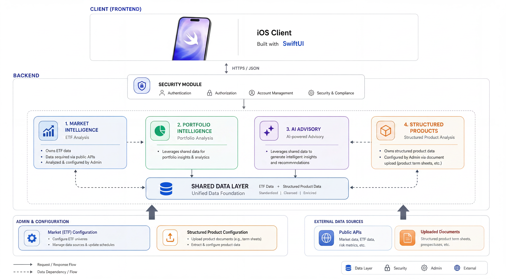

## 二、用戶定義

### 2.1 Persona

| | User | Admin |
| --- | --- | --- |
| 角色 | 投資者、研究者 | 資料管理員 |
| 描述 | 使用 App 瀏覽市場、構建組合、獲取 AI 輔助建議 | 維護 ETF 和結構化產品資料，確保平台內容完整 |
| 核心能力 | Market / Portfolio / AI Advisory / Products / Profile | User 全部能力 + ETF 配置 + 結構化產品配置 |

### 2.2 角色權限矩陣

| 功能 | User | Admin |
| --- | :---: | :---: |
| 市場情報 | 瀏覽、篩選、詳情、對比 | + 添加 ETF |
| 結構化產品 | 瀏覽、篩選、詳情、對比 | + 上傳 PDF、字段抽取、發布 |
| Admin Tools | - | 僅 Admin 可見 |
| 其他模組 | 完全一致 | 完全一致 |

## 三、頁面結構

### 3.1 入口與頁面樹

<table style="width: 80%; margin: 0 auto; border-collapse: collapse;">
<tr>
<td style="padding: 12px; vertical-align: top; width: 50%;">
<div style="border: 1px solid #e0e0e0; border-radius: 8px; overflow: hidden;">
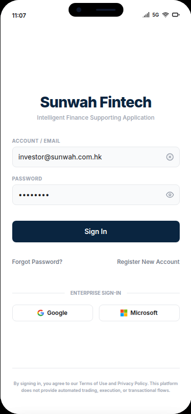
<p style="padding: 12px; margin: 0; font-size: 14px;"><strong>Login</strong> — 郵箱、密碼、記住我、Forgot password、Google / Microsoft SSO；用於進入普通用戶或管理員流程。</p>
</div>
</td>
<td style="padding: 12px; vertical-align: top; width: 50%;">
<div style="border: 1px solid #e0e0e0; border-radius: 8px; overflow: hidden;">
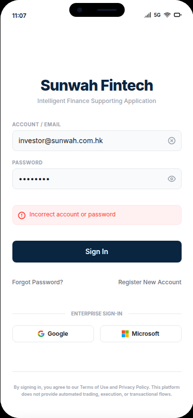
<p style="padding: 12px; margin: 0; font-size: 14px;"><strong>Auth Error</strong> — 賬號或密碼錯誤時在表單內展示紅色 inline 錯誤，不跳轉。</p>
</div>
</td>
</tr>
<tr>
<td style="padding: 12px; vertical-align: top; width: 50%;">
<div style="border: 1px solid #e0e0e0; border-radius: 8px; overflow: hidden;">
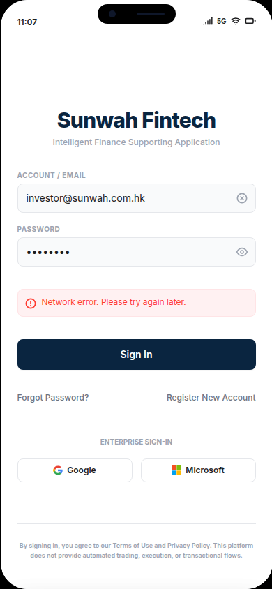
<p style="padding: 12px; margin: 0; font-size: 14px;"><strong>Network Error</strong> — 網絡異常時展示可恢複錯誤信息，引導用戶稍後重試。</p>
</div>
</td>
<td style="padding: 12px; vertical-align: top; width: 50%;">
<div style="border: 1px solid #e0e0e0; border-radius: 8px; overflow: hidden;">
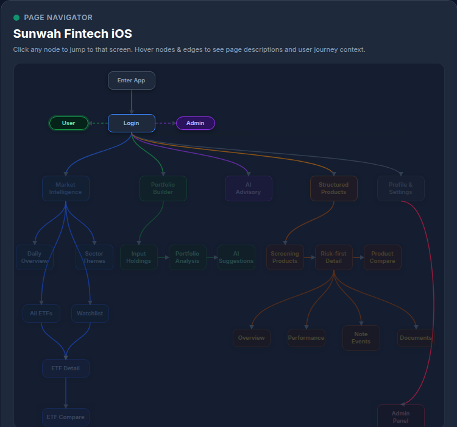
<p style="padding: 12px; margin: 0; font-size: 14px;"><strong>Page Navigator 左側面板</strong> — 展示產品頁面樹、User / Admin 快捷登入、模組顏色圖例、產品邊界聲明。用於評審頁面範圍與用戶旅程。</p>
</div>
</td>
</tr>
<tr>
<td style="padding: 12px; vertical-align: top; width: 50%;">
<div style="border: 1px solid #e0e0e0; border-radius: 8px; overflow: hidden;">
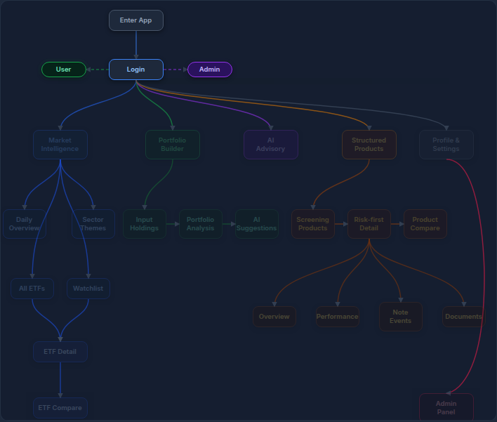
<p style="padding: 12px; margin: 0; font-size: 14px;"><strong>頁面節點圖</strong> — 包含 Login、Market Intelligence、Portfolio Builder、Assistant、Structured Products、Profile & Settings、Admin Panel 等節點；點擊節點可直接跳轉對應原型狀態。</p>
</div>
</td>
<td style="padding: 12px; vertical-align: top; width: 50%;"></td>
</tr>
</table>


### 3.2 頁面目錄

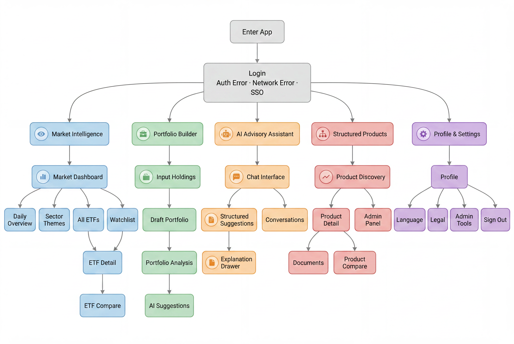

| 模組 | 頁面路徑 |
| --- | --- |
| Market Intelligence | Market Dashboard → Daily Overview / Sector Themes / All ETFs / Watchlist → ETF Detail → ETF Compare |
| Portfolio Builder | Input Holdings → Draft Portfolio → Portfolio Analysis → AI Suggestions |
| AI Advisory | Chat Interface → Structured Suggestions / Explanation Drawer；Conversations |
| Structured Products | Product Discovery → Product Detail（Overview / Performance / Note Events / Documents）→ Product Compare；Admin Panel |
| Profile & Settings | Profile → Language / Legal / Admin Tools / Sign Out |

## 四、功能模組

### 4.0 模組概覽

第四章涵蓋四個核心功能模組，每個模組按統一結構組織：

| 模組編號 | 模組名稱 |
|----------|----------|
| 4.1 | Market Intelligence |
| 4.2 | Portfolio Intelligence |
| 4.3 | AI Advisory |
| 4.4 | Structured Products |

#### 4.0.1 模組結構

每個功能模組包含以下四個子章節：

| 子章節 | 說明 |
|--------|------|
| 功能概述 | 用戶能力邊界、資料輸入輸出、系統限制 |
| 頁面介紹 | 原型截圖與頁面功能說明 |
| User Stories | 用戶旅程與核心場景 |
| Acceptance Criteria | 驗收標準 |

#### 4.0.2 Acceptance Criteria 設計標準

**分類標簽體系**

AC 條目前綴標識驗收項的類型：

| 前綴 | 類型 | 說明 |
|------|------|------|
| UI | 界面層 | 布局、組件、狀態展示 |
| Flow | 流程層 | 用戶旅程、頁面流轉、操作觸發 |
| Data | 資料層 | 資料展示、校驗、業務規則 |
| Access | 權限層 | 角色隔離、入口可見性 |
| Compliance | 合規層 | 免責聲明、風險提示 |

**歸屬定義**

| 歸屬 | 定義 |
|------|------|
| Frontend | 前端獨立實現，無需後端支持 |
| Backend | 後端獨立實現，前端僅負責調用 |
| Integration | 前後端協同，需明確接口契約 |

**優先級定義**

| 優先級 | 定義 |
|--------|------|
| Must | 必須實現，阻塞發布 |
| Should | 強烈建議，影響核心體驗 |
| Could | 可選實現，提升用戶滿意度 |

**表格格式**

```
| ID | 內容 | 參考 | 歸屬 | 優先級 |
```

- ID：類型前綴 + 序號，序號跨模組共享
- 內容：驗收項描述
- 參考：對應頁面、User Story 或功能章節
- 歸屬：Frontend / Backend / Integration
- 優先級：Must / Should / Could

#### 4.0.3 Profile & Settings

該模組功能相對簡單，AC 合並至各模組或非功能性需求章節中。

### 4.1 Market Intelligence

#### 4.1.1 功能概述

| 能力 | 輸入資料 | 輸出 | 邊界 |
| --- | --- | --- | --- |
| ETF Market Overview | ETF / 指數延遲行情 | 市場寬度、成交量、Rising / Flat / Falling、Return Distribution、ETF Rankings | 不做即時交易流 |
| Sector Themes | ETF basket / sector mapping | Default sectors + Daily Hot sectors、Sector Detail | 僅為研究入口，不構成推薦 |
| Market Indices | Hang Seng / HS Tech / S&P 500 等指數資料 | 指數卡片與漲跌幅 | 原型使用模擬 / delayed 資料 |
| ETF Screener | 搜尋詞、分類、地區、行業、發行人、幣種、排序 | ETF 列表、空狀態、active filter badge | 不接 Level II |
| My Watchlist | 用戶星標 ETF | Watchlist 列表 / 空狀態 | 僅研究關註，不做交易提醒 |
| ETF Detail | ETF symbol | 價格圖、風險指標、分類、新聞、AI 分析入口 | HKEX delayed disclosure |
| ETF Compare | 兩只 ETF | 標準化價格曲線與指標對比 | 原型限 2 ETF 對比 |
| Admin ETF Maintenance | ticker id | Fetch preview → Add to Platform → 更新 Screener | 僅 Admin 可見 |

#### 4.1.2 頁面介紹

<table style="width: 80%; margin: 0 auto; border-collapse: collapse;">
<tr>
<td style="padding: 12px; vertical-align: top; width: 50%;">
<div style="border: 1px solid #e0e0e0; border-radius: 8px; overflow: hidden;">
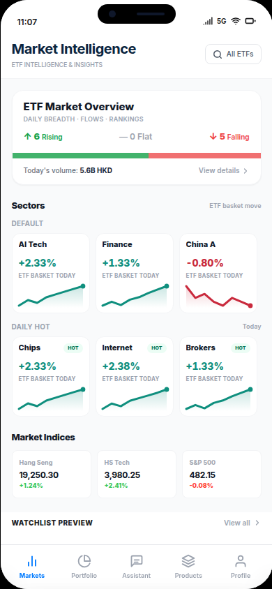
<p style="padding: 12px; margin: 0; font-size: 14px;"><strong>Market Dashboard</strong> — 標題為 Market Intelligence / ETF intelligence & insights；包含 ETF Market Overview、Sectors、Daily Hot、Market Indices、Watchlist Preview，並提供 All ETFs 入口。</p>
</div>
</td>
<td style="padding: 12px; vertical-align: top; width: 50%;">
<div style="border: 1px solid #e0e0e0; border-radius: 8px; overflow: hidden;">
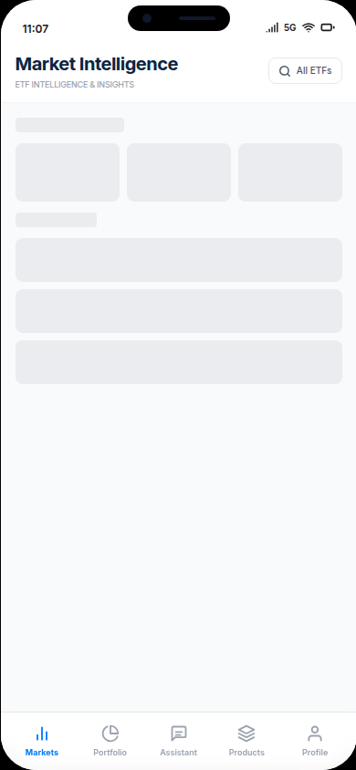
<p style="padding: 12px; margin: 0; font-size: 14px;"><strong>載入骨架屏</strong> — Dashboard 資料請求中，以 skeleton 模擬卡片、列表和行情區域載入。</p>
</div>
</td>
</tr>
<tr>
<td style="padding: 12px; vertical-align: top; width: 50%;">
<div style="border: 1px solid #e0e0e0; border-radius: 8px; overflow: hidden;">
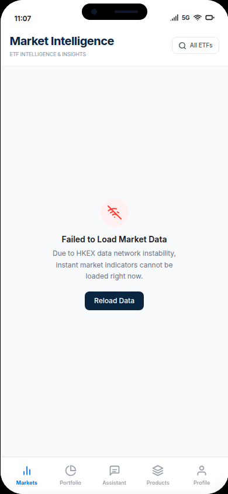
<p style="padding: 12px; margin: 0; font-size: 14px;"><strong>載入錯誤</strong> — 資料源異常時展示錯誤狀態和重試按鈕。</p>
</div>
</td>
<td style="padding: 12px; vertical-align: top; width: 50%;">
<div style="border: 1px solid #e0e0e0; border-radius: 8px; overflow: hidden;">
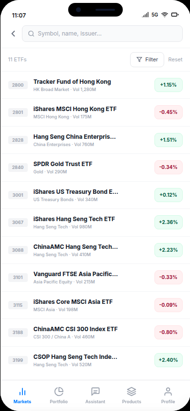
<p style="padding: 12px; margin: 0; font-size: 14px;"><strong>All ETFs Screener</strong> — 搜尋框、ETF 數量、Filter 按鈕、ETF 列表；ETF 行展示 symbol、名稱、主題標簽、價格 / 漲跌幅、星標；Admin 登入後顯示 Add ETF 入口。</p>
</div>
</td>
</tr>
<tr>
<td style="padding: 12px; vertical-align: top; width: 50%;">
<div style="border: 1px solid #e0e0e0; border-radius: 8px; overflow: hidden;">
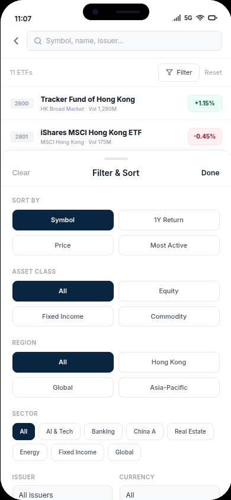
<p style="padding: 12px; margin: 0; font-size: 14px;"><strong>Filter & Sort Bottom Sheet</strong> — 支持 Sort、Asset Class、Region、Sector、Issuer、Currency 組合篩選；Filter badge 顯示激活數。</p>
</div>
</td>
<td style="padding: 12px; vertical-align: top; width: 50%;">
<div style="border: 1px solid #e0e0e0; border-radius: 8px; overflow: hidden;">
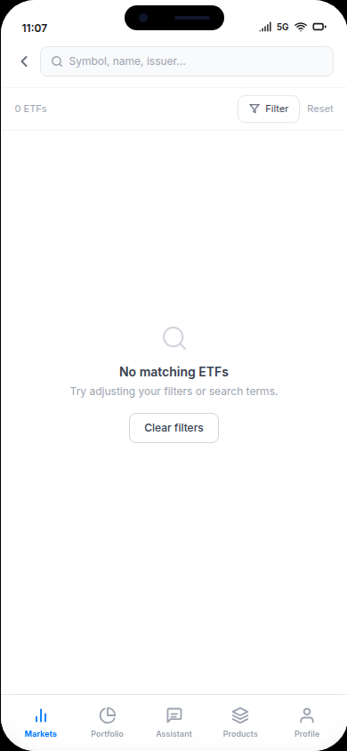
<p style="padding: 12px; margin: 0; font-size: 14px;"><strong>Screener Empty State</strong> — 搜尋 / 篩選無結果時展示 No matching ETFs 和 Clear filters。</p>
</div>
</td>
</tr>
<tr>
<td style="padding: 12px; vertical-align: top; width: 50%;">
<div style="border: 1px solid #e0e0e0; border-radius: 8px; overflow: hidden;">
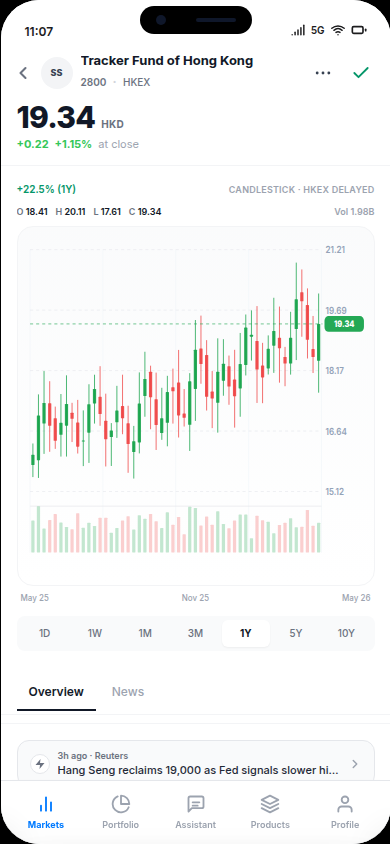
<p style="padding: 12px; margin: 0; font-size: 14px;"><strong>ETF Detail</strong> — ETF header、價格、漲跌幅、時間區間圖表、Watchlist、Quick Compare、Overview / News、風險指標、分類與新聞摘要。</p>
</div>
</td>
<td style="padding: 12px; vertical-align: top; width: 50%;">
<div style="border: 1px solid #e0e0e0; border-radius: 8px; overflow: hidden;">
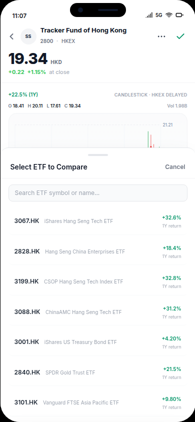
<p style="padding: 12px; margin: 0; font-size: 14px;"><strong>Compare Picker</strong> — 從 ETF 詳情打開 Bottom Sheet，搜尋並選擇第二只 ETF。</p>
</div>
</td>
</tr>
<tr>
<td style="padding: 12px; vertical-align: top; width: 50%;">
<div style="border: 1px solid #e0e0e0; border-radius: 8px; overflow: hidden;">
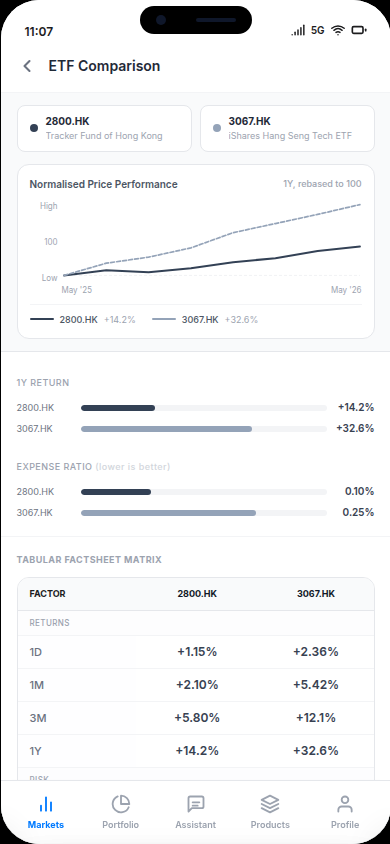
<p style="padding: 12px; margin: 0; font-size: 14px;"><strong>ETF Compare</strong> — 雙 ETF 頭部卡、標準化價格曲線、收益 / 風險 / 費用等指標對比。</p>
</div>
</td>
<td style="padding: 12px; vertical-align: top; width: 50%;"></td>
</tr>
</table>

#### 4.1.3 User Stories

**M-1：瀏覽 ETF 詳情**

> **用戶類型**：User | **需求**：從 Market Dashboard 通過 Watchlist 預覽、板塊主題、自選 ETF 入口進入 ETF 詳情頁，查看 K 線圖、風險指標、AI 評分等資料，且可以加入 watchlist 持續關註 | **價值**：快速獲取任一關註 ETF 的完整研究上下文

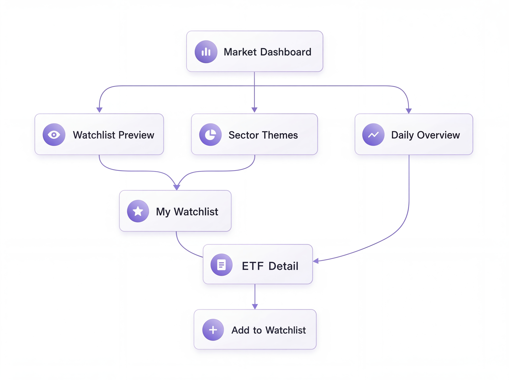

**M-2：篩選搜尋 ETF**

> **用戶類型**：User | **需求**：通過 All ETFs 篩選器，使用 Filter 或關鍵詞匹配找到目標 ETF 並進入詳情頁 | **價值**：將模糊需求轉化為具體可研究的 ETF 標的

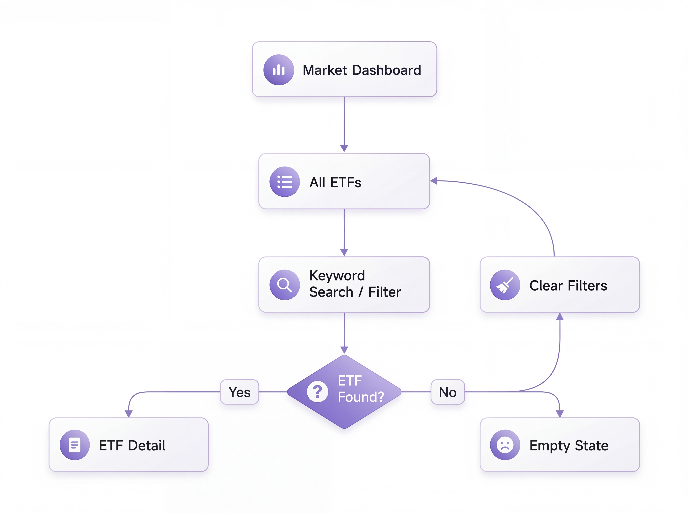

**M-3：對比 ETF**

> **用戶類型**：User | **需求**：在 ETF 詳情頁點擊 Compare，選擇第二只 ETF 進入 Compare 頁面，對比兩只 ETF 的業績、費用、風險等指標 | **價值**：輔助選品決策

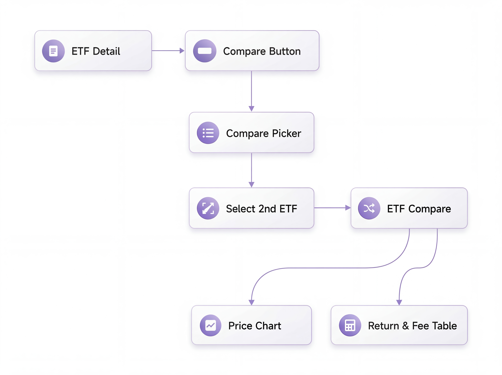

**M-4：維護 ETF 列表**

> **用戶類型**：Admin | **需求**：通過 Add ETF by ID 頁面，按 ticker 添加新 ETF 到平台，維護 Screener 可檢索的產品範圍 | **價值**：確保用戶端 ETF 研究入口資料完整、可追溯

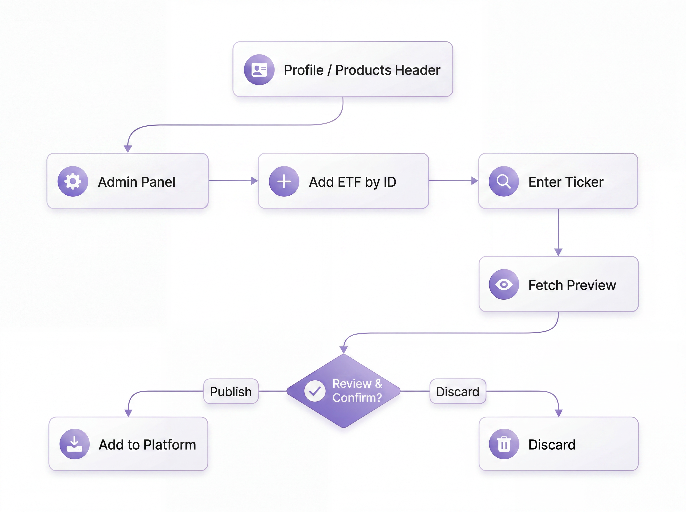

#### 4.1.4 Acceptance Criteria

| ID | 內容 | 參考 | 歸屬 | 優先級 |
| --- | --- | --- | --- | --- |
| UI-001 | Dashboard 默認展示 ETF 市場概覽、板塊、今日熱門、市場指數、自選預覽和全部 ETF 入口。 | 4.1.2 Market Dashboard | Frontend | Must |
| UI-002 | Dashboard 在資料載入中展示骨架屏，載入失敗時展示錯誤狀態和重試按鈕。 | 4.1.2 Skeleton/Error states | Integration | Must |
| UI-003 | 篩選無結果時展示空狀態，顯示"無匹配 ETF"提示和清除篩選按鈕。 | 4.1.2 Empty State; M-2 | Frontend | Must |
| UI-004 | ETF 詳情頁展示時間區間圖表、概覽/新聞標簽頁、自選切換和快捷對比按鈕。 | 4.1.2 ETF Detail; M-1 | Integration | Must |
| Flow-001 | 用戶可從自選預覽、板塊卡片或今日熱門直接進入對應 ETF 詳情頁。 | M-1 User Story flowchart | Frontend | Must |
| Flow-002 | 用戶可在 ETF 詳情頁點擊對比按鈕，通過對比選擇器搜尋選擇第二只 ETF，進入 ETF 對比頁面。 | M-3; 4.1.2 Compare Picker | Integration | Must |
| Flow-003 | 管理員可訪問按 ID 添加 ETF 頁面；普通用戶無法看到或訪問此入口。 | M-4; 4.1.2 Admin entry | Frontend | Must |
| Data-001 | ETF 篩選器在用戶輸入或切換篩選條件時即時過濾結果，並同步更新數量統計。 | M-2; 4.1.2 Filter Sheet | Integration | Must |
| Data-002 | ETF 對比頁以統一基準展示標準化價格曲線，並左右對齊展示指標對比表格。 | M-3; 4.1.2 ETF Compare | Integration | Must |
| Compliance-001 | 市場資料頁面展示資料延遲免責聲明（如"港交所資料延遲 15 分鐘"）。 | 1.2 Guardrails | Frontend | Must |

### 4.2 Portfolio Intelligence

#### 4.2.1 功能概述

| 階段 | 用戶動作 | 系統輸出 | 關鍵指標 |
| --- | --- | --- | --- |
| 輸入 | Photos / Document 上傳、粘貼文本、Add ETF、Add Structured Product、套用模板 | Draft Portfolio（symbol、qty、cost、market value、weight、P&L） | qty · cost · marketValue · weight · currency |
| 複核 | 點擊 Review holdings | 草稿持倉可讀列表、總市值、權重與 P&L 匯總 | holdings count · total value · weight |
| 分析 | 點擊 Analyze draft portfolio | 四步 checklist、評分卡、HHI、Effective N、敞口圖、Diagnosis Issues | HHI · Effective N · sector / region / currency |
| 建議 | 點擊 Generate Recommendations | AI Portfolio Recommendations、Selected diagnosis scope、Before / After、具體調整動作、rationale、impact | Health Score · HHI target · exposure change |
| 歷史 | 打開 Portfolio History Drawer | Portfolio History / Saved snapshots | date · total value · holdings summary |

#### 4.2.2 Diagnosis Issue 觸發規則

| 評分維度 | 計算方式 | Diagnosis Issue | 觸發條件 | 嚴重度 |
| --- | --- | --- | --- | --- |
| 集中度 | HHI = sum(weight_i²) | High concentration risk | HHI > 0.25 | High |
| 集中度 | HHI = sum(weight_i²) | Moderate concentration | 0.15 < HHI <= 0.25 | Medium |
| 分散化 | Effective N = 1 / HHI | Insufficient diversification | Effective N < 3 | High |
| 地區 | HK / China 權重加總 | Geographic concentration — HK/China | HK / China > 70% | High |
| 匯率 | HKD 權重加總 | FX concentration — HKD | HKD > 70% | Medium |
| 行業 | Tech sector 權重 | Technology sector overweight | Tech > 35% | Medium |
| 防御性 | Fixed Income / defensive 權重 | Insufficient defensive allocation | Fixed Income < 15% | Low |

#### 4.2.3 頁面介紹

<table style="width: 80%; margin: 0 auto; border-collapse: collapse;">
<tr>
<td style="padding: 12px; vertical-align: top; width: 50%;">
<div style="border: 1px solid #e0e0e0; border-radius: 8px; overflow: hidden;">
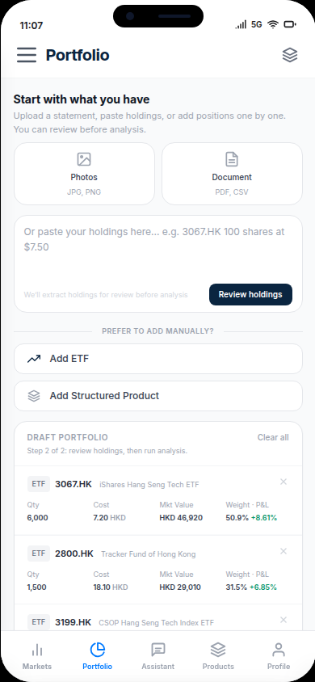
<p style="padding: 12px; margin: 0; font-size: 14px;"><strong>Start with what you have</strong> — Photos / Document 上傳入口、Add ETF、Add Structured Product、文本粘貼框、模板示例、Draft Portfolio、Review holdings 與 Analyze draft portfolio 按鈕。</p>
</div>
</td>
<td style="padding: 12px; vertical-align: top; width: 50%;">
<div style="border: 1px solid #e0e0e0; border-radius: 8px; overflow: hidden;">
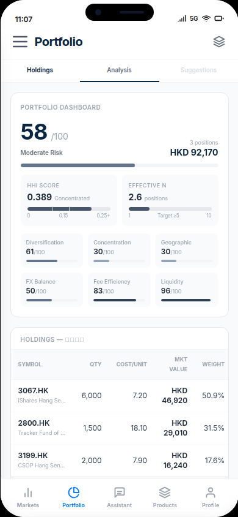
<p style="padding: 12px; margin: 0; font-size: 14px;"><strong>Portfolio Analysis</strong> — 四步 checklist（Verifying HKEX pricing、Computing HHI concentration index、Assessing sector & currency bias、Calculating risk sub-scores）；展示評分卡、HHI / Effective N、敞口與 Diagnosis Issues。</p>
</div>
</td>
</tr>
<tr>
<td style="padding: 12px; vertical-align: top; width: 50%;">
<div style="border: 1px solid #e0e0e0; border-radius: 8px; overflow: hidden;">
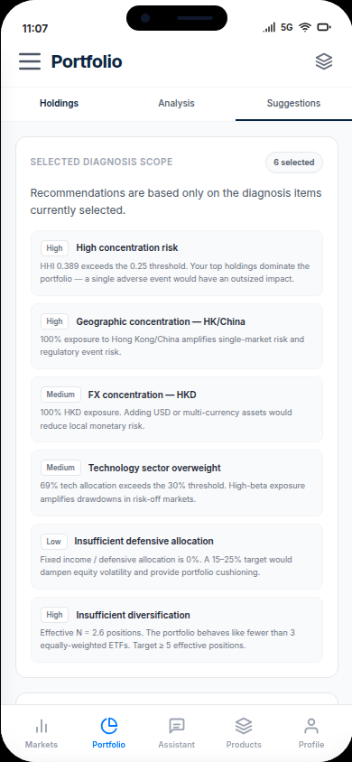
<p style="padding: 12px; margin: 0; font-size: 14px;"><strong>AI Portfolio Recommendations</strong> — Selected diagnosis scope、Before / After Optimisation、具體動作建議、rationale、impact 與合規聲明；由 Generate Recommendations 觸發。</p>
</div>
</td>
<td style="padding: 12px; vertical-align: top; width: 50%;">
<div style="border: 1px solid #e0e0e0; border-radius: 8px; overflow: hidden;">
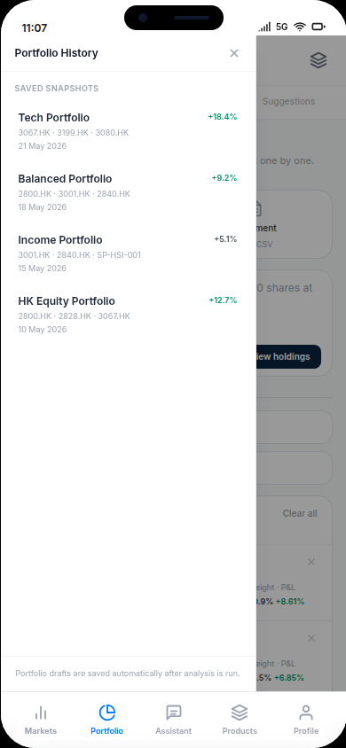
<p style="padding: 12px; margin: 0; font-size: 14px;"><strong>Portfolio History / Saved snapshots</strong> — 左側抽屜展示歷史分析快照，用於恢複或對比過往組合狀態。</p>
</div>
</td>
</tr>
</table>

#### 4.2.4 User Stories

**P-1：錄入持倉 → 運行組合診斷 → 獲取調倉建議**

> **用戶類型**：User | **需求**：通過在 ETF / 結構化產品列表中選擇，或上傳文本 / 文件 / 圖片讓 AI 解析轉化兩種方式錄入持倉；運行持倉分析，查看評分與 Diagnosis Issues，可選擇接受或放棄部分診斷；最後獲取 AI 調倉建議與 Before / After 對比 | **價值**：形成可解釋的組合風險上下文，並基於診斷獲取個性化調倉建議

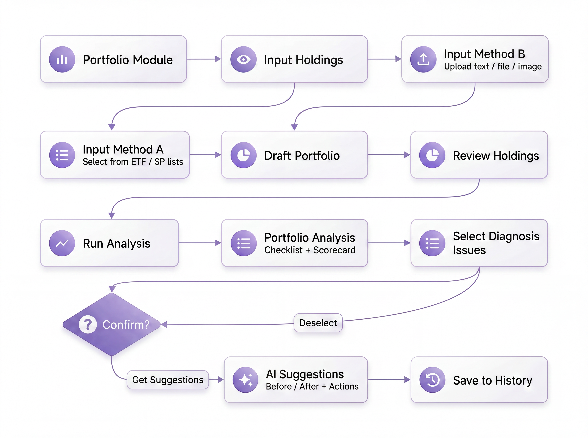

**P-2：查看歷史持倉分析記錄**

> **用戶類型**：User | **需求**：在 Portfolio 模組左上角呼出 History Drawer，瀏覽歷史持倉分析快照，選擇任意歷史記錄恢複到當前 Draft Portfolio | **價值**：支持用戶回顧和對比不同時間點的組合狀態

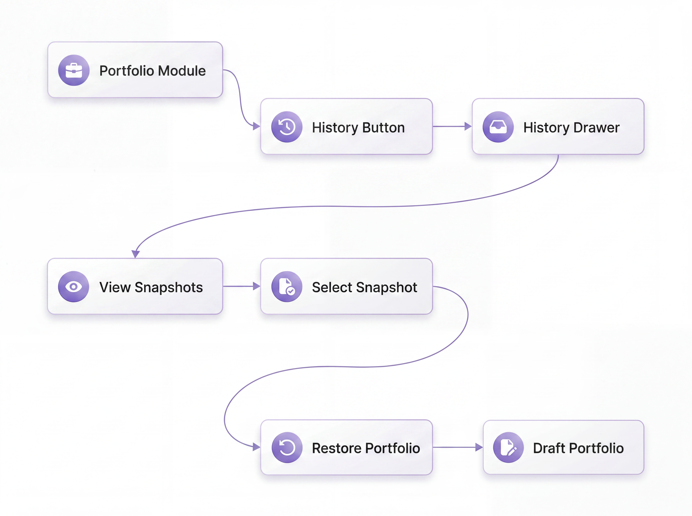

#### 4.2.5 Acceptance Criteria

| ID | 內容 | 參考 | 歸屬 | 優先級 |
| --- | --- | --- | --- | --- |
| Flow-004 | 組合錄入頁面同時提供照片上傳、文檔上傳、文本粘貼和手動添加 ETF/結構化產品四種並行輸入方式。 | P-1; 4.2.1 Input stage | Frontend | Must |
| Flow-005 | 用戶在錄入持倉後可觸發組合分析；分析過程展示帶進度指示的多步驟檢查清單。 | P-1; 4.2.3 Analysis page | Integration | Must |
| Flow-006 | 用戶可在生成建議前切換單個診斷問題的選中狀態，以納入或排除其對應的建議範圍。 | P-1; 4.2.3 Analysis page | Frontend | Must |
| Flow-007 | 用戶可從組合模組頂部打開歷史抽屜，瀏覽並恢複歷史分析快照。 | P-2; 4.2.4 History Drawer | Frontend | Should |
| Data-003 | 草稿組合展示每個持倉的代碼、數量、成本、市值、權重、盈虧和幣種。 | P-1; 4.2.1 Input stage | Integration | Must |
| Data-004 | 分析結果展示 HHI 集中度指數、有效數量 N、分行業/幣種/地區敞口分布，以及帶嚴重度等級的可選診斷問題。 | P-1; 4.2.2, 4.2.3 | Integration | Must |
| Data-005 | AI 建議展示前後對比表格，以及每條建議的代碼、目標權重、理由和預期影響詳情。 | P-1; 4.2.3 Recommendations page | Integration | Must |
| Compliance-002 | 組合分析和建議頁面底部展示非投資建議免責聲明（如"非財務建議，僅供參考"）。 | P-1; 1.2 Guardrails | Frontend | Must |

### 4.3 Assistant

#### 4.3.1 功能概述

| 能力 | 輸入 | 輸出 | 說明 |
| --- | --- | --- | --- |
| 模式化聊天 | Value focus / Income focus + 用戶問題 | 文本回複或結構化建議卡 | 關鍵詞 value / income / HHI 觸發結構化結果 |
| Portfolio Context | On / Off | 將當前組合上下文用於回答 | Toggle 高亮並影響組合相關問題 |
| 附件分析 | 圖片 / PDF / report | Attachment preview chip + 文件摘要 / 問答 | 原型模擬文件讀取 |
| 可解釋 Drawer | 點擊建議 / Analytical Details | Why this suggestion appeared、What prompted this、Data considered、Assistant interpretation、Limits to this explanation | 提升可追溯性 |
| Conversations | 左側 Drawer | 會話列表、恢複、刪除、New conversation | 管理多輪研究對話 |
| Custom Mode | 點擊 + 後用 Prompt 或 Guided Survey 創建 | 新 mode pill | 自定義投資目標、約束、風險偏好 |

#### 4.3.2 頁面介紹

<table style="width: 80%; margin: 0 auto; border-collapse: collapse;">
<tr>
<td style="padding: 12px; vertical-align: top; width: 50%;">
<div style="border: 1px solid #e0e0e0; border-radius: 8px; overflow: hidden;">
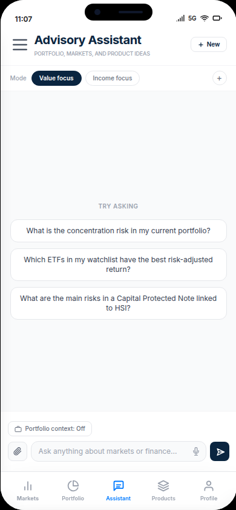
<p style="padding: 12px; margin: 0; font-size: 14px;"><strong>Advisory Assistant Chat</strong> — 標題為 Advisory Assistant；歷史按鈕、New、Value focus / Income focus 模式、+ 自定義模式入口、Sample Questions、Portfolio Context、附件與輸入框。</p>
</div>
</td>
<td style="padding: 12px; vertical-align: top; width: 50%;">
<div style="border: 1px solid #e0e0e0; border-radius: 8px; overflow: hidden;">
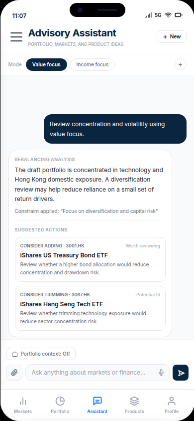
<p style="padding: 12px; margin: 0; font-size: 14px;"><strong>Structured Suggestions</strong> — 觸發 value / income / HHI 等關鍵詞後展示結構化 rebalancing analysis 與 suggested actions。</p>
</div>
</td>
</tr>
<tr>
<td style="padding: 12px; vertical-align: top; width: 50%;">
<div style="border: 1px solid #e0e0e0; border-radius: 8px; overflow: hidden;">
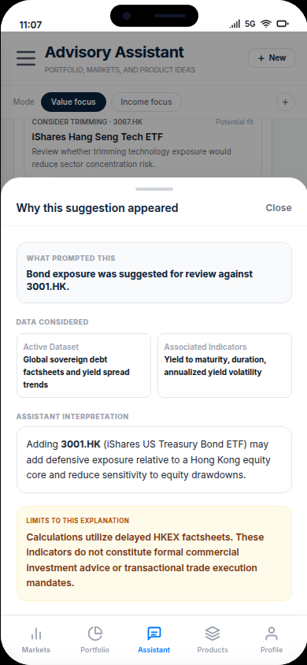
<p style="padding: 12px; margin: 0; font-size: 14px;"><strong>Explanation Drawer</strong> — Bottom Sheet 展示 Why this suggestion appeared、What prompted this、Data considered、Assistant interpretation、Limits to this explanation。</p>
</div>
</td>
<td style="padding: 12px; vertical-align: top; width: 50%;">
<div style="border: 1px solid #e0e0e0; border-radius: 8px; overflow: hidden;">
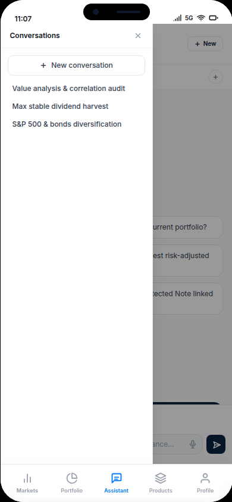
<p style="padding: 12px; margin: 0; font-size: 14px;"><strong>Conversations Drawer</strong> — 左側抽屜展示歷史會話，可恢複或刪除會話，並支持 New conversation。</p>
</div>
</td>
</tr>
<tr>
<td style="padding: 12px; vertical-align: top; width: 50%;">
<div style="border: 1px solid #e0e0e0; border-radius: 8px; overflow: hidden;">
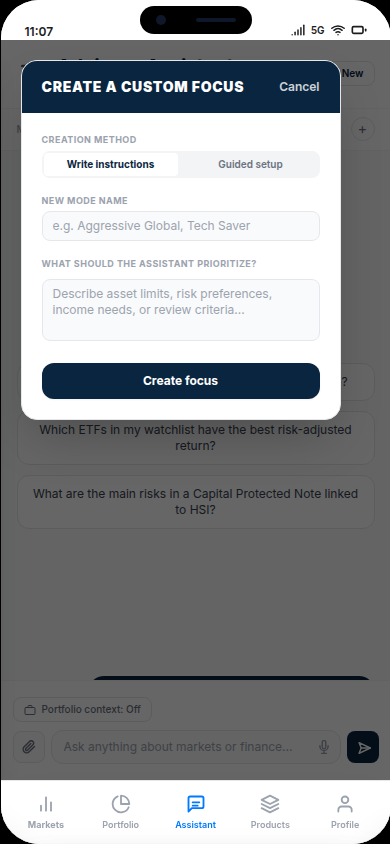
<p style="padding: 12px; margin: 0; font-size: 14px;"><strong>Create Custom Mode</strong> — 點擊 + 後創建自定義模式，支持 Prompt 與 Guided Survey 兩種創建方式，創建後新增 mode pill。</p>
</div>
</td>
<td style="padding: 12px; vertical-align: top; width: 50%;"></td>
</tr>
</table>

#### 4.3.3 User Stories

**A-1：通過 Chat 進行問答**

> **用戶類型**：User | **需求**：選擇 Value / Income / Custom 模式，配置 Portfolio Context 或附件等工具，輸入問題並獲取結構化建議與詳細解釋 | **價值**：在不同投資偏好下獲得可追溯的研究支持，支持持續追問和上下文延續

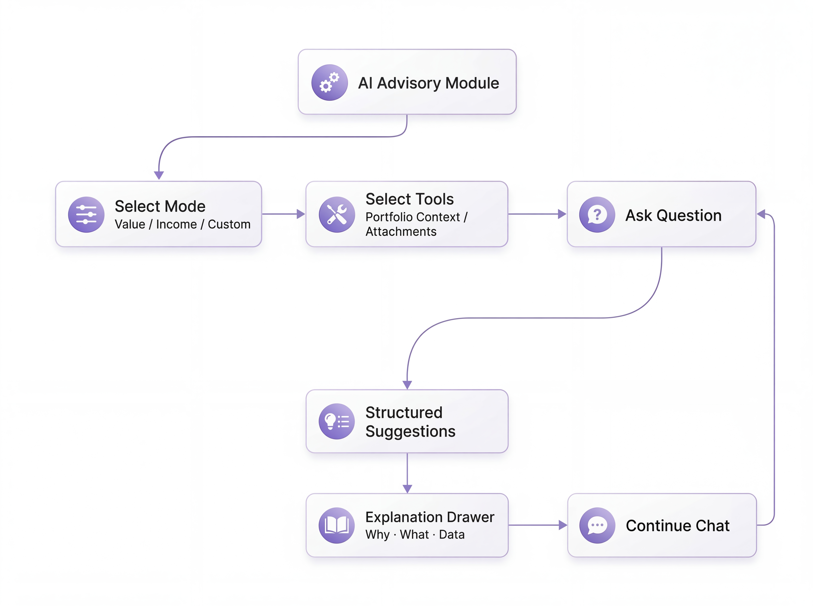

**A-2：查看歷史對話記錄**

> **用戶類型**：User | **需求**：在 AI Advisory 模組左上角呼出 History Drawer，瀏覽歷史會話列表，選擇任意歷史記錄恢複到當前對話 | **價值**：支持用戶回顧和繼續之前的咨詢上下文

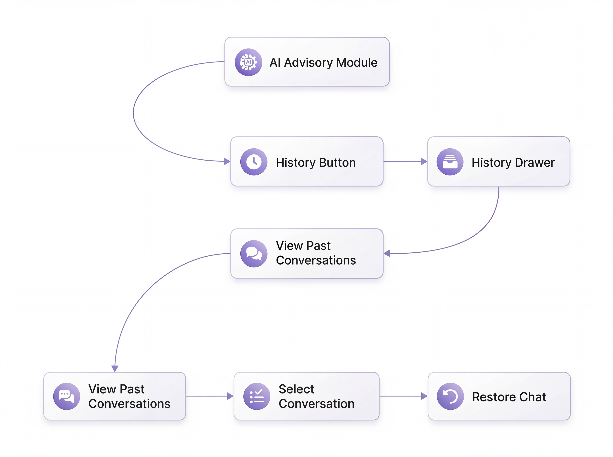

**A-3：創建自定義 Mode**

> **用戶類型**：User | **需求**：點擊 + 創建自定義 Mode，通過填寫 Prompt 或完成問卷（投資期限、風險偏好、收益目標）兩種方式生成专屬模式，並保存到 Mode 列表 | **價值**：讓用戶根據個人投資需求定制 AI 顧問的行為模式

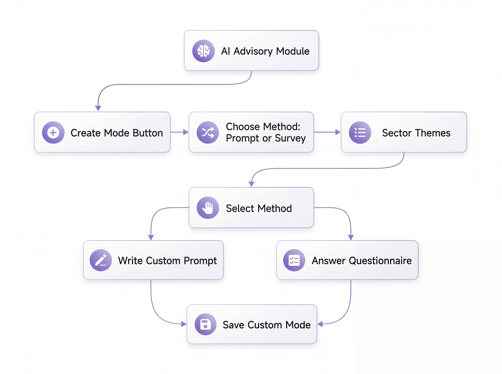

#### 4.3.4 Acceptance Criteria

| ID | 內容 | 參考 | 歸屬 | 優先級 |
| --- | --- | --- | --- | --- |
| UI-005 | 聊天頁面空狀態展示示例問題；發送第一條消息後隱藏示例。 | A-1; 4.3.2 Chat page | Frontend | Should |
| UI-006 | 用戶消息氣泡在發送後立即顯示；助手回複前展示打字指示器。 | A-1; 4.3.2 Chat page | Frontend | Must |
| UI-007 | 解釋抽屜展示五個部分：本建議出現原因、觸發因素、參考資料、助手解讀、解釋局限性。 | A-1; 4.3.2 Explanation Drawer | Integration | Must |
| Flow-008 | 用戶可在價值導向、收益導向和自定義模式間切換；當前激活模式高亮顯示並有切換反饋。 | A-1; 4.3.1 Mode capability | Frontend | Must |
| Flow-009 | 用戶可切換組合上下文開關；開啟時 AI 回答針對相關問題引用當前組合指標。 | A-1; 4.3.1 Portfolio Context | Integration | Must |
| Flow-010 | 用戶可打開歷史抽屜瀏覽、恢複或刪除歷史會話，並開始新對話。 | A-2; 4.3.2 History Drawer | Integration | Should |
| Flow-011 | 用戶可通過輸入 Prompt 或完成引導問卷創建自定義模式；新創建的模式出現在模式列表中並被激活。 | A-3; 4.3.2 Create Mode | Integration | Should |
| Compliance-003 | AI 建議和推薦不得包含交易執行措辭（如"買入"、"賣出"、"下單"、"執行"）或收益保證聲明。 | A-1; 1.2 Guardrails | Backend | Must |

### 4.4 Structured Products

#### 4.4.1 功能概述

| 能力 | 輸入 | 輸出 | 邊界 |
| --- | --- | --- | --- |
| 產品目錄 | Issuer list、Smart filters、Advanced search | 產品卡列表、風險 / 期限 / 狀態摘要、Screening only 提示 | 僅研究發現，不做交易 |
| Advanced search | 產品類型、結構、標的、barrier、日期、期限、幣種、狀態等 | 精細過濾後的產品列表 | 原型使用模擬資料 |
| 產品詳情 | product id | Overview / Performance / Note Events / Documents | 風險優先展示 |
| Note Events | Bull / Base / Bear | Payoff Story、Outcome selector、Payoff map、Rule quick check | 預設情景，非收益承諾 |
| 當前表現 / Performance | product id | indicative price、implied yield、barrier watch、source、date | 非 firm quote |
| Compare Products | 當前產品 + 同發行人產品 | Tabular Factsheet Matrix 雙欄條款對比 | 不跨發行人比較 |
| Admin Panel | PDF Term Sheet | Upload Structured Product Sheet → Select PDF product sheet → Extraction complete → Publish | 僅 Admin 可見 |
| Admin ETF 維護 | ticker id | Add ETF by ID → Fetch preview → Add to Platform | 僅 Admin 可見 |

#### 4.4.2 頁面介紹

**User 側頁面**

<table style="width: 80%; margin: 0 auto; border-collapse: collapse;">
<tr>
<td style="padding: 12px; vertical-align: top; width: 50%;">
<div style="border: 1px solid #e0e0e0; border-radius: 8px; overflow: hidden;">
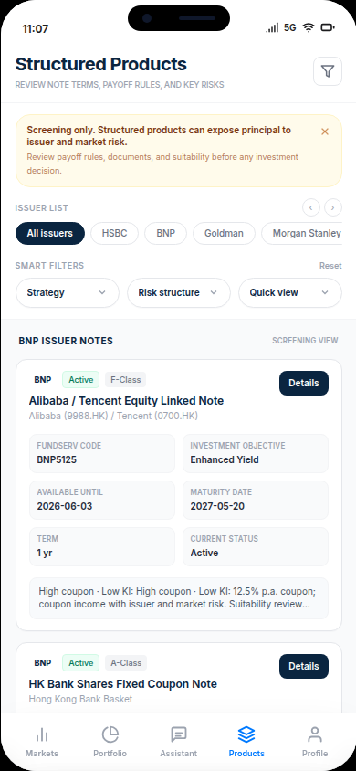
<p style="padding: 12px; margin: 0; font-size: 14px;"><strong>Structured Products</strong> — Screening only 風險提示、Issuer list、Smart filters、Advanced search、產品卡展示 payoff type、principal treatment、barrier / buffer、status、risk 與 suitability cues；Admin 登入後顯示 Admin Panel。</p>
</div>
</td>
<td style="padding: 12px; vertical-align: top; width: 50%;">
<div style="border: 1px solid #e0e0e0; border-radius: 8px; overflow: hidden;">
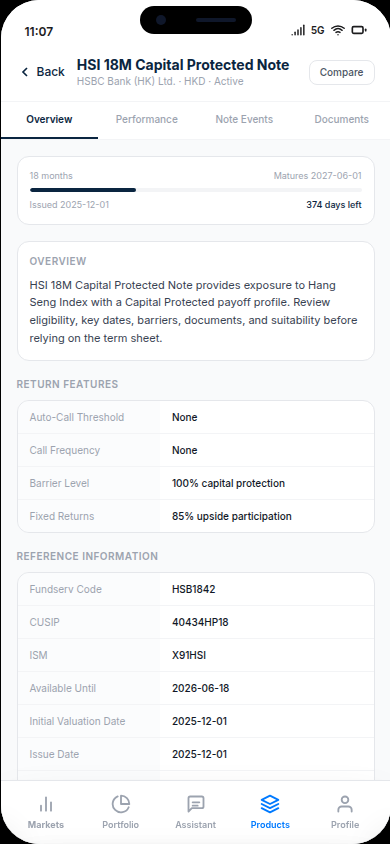
<p style="padding: 12px; margin: 0; font-size: 14px;"><strong>Product Detail Overview</strong> — 產品名稱、發行人、狀態、Overview / Performance / Note Events / Documents tabs、underlying、terms、illustrative outcomes、Risk Disclosure、compare 入口。</p>
</div>
</td>
</tr>
<tr>
<td style="padding: 12px; vertical-align: top; width: 50%;">
<div style="border: 1px solid #e0e0e0; border-radius: 8px; overflow: hidden;">
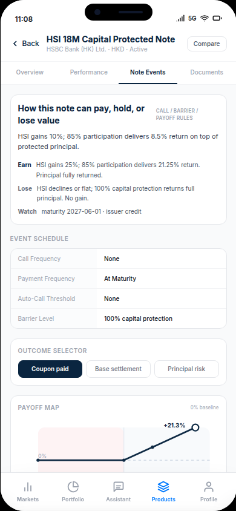
<p style="padding: 12px; margin: 0; font-size: 14px;"><strong>Note Events</strong> — 展示 Payoff Story、Outcome selector、Payoff map、Rule quick check、coupon / barrier / settlement 規則。</p>
</div>
</td>
<td style="padding: 12px; vertical-align: top; width: 50%;">
<div style="border: 1px solid #e0e0e0; border-radius: 8px; overflow: hidden;">
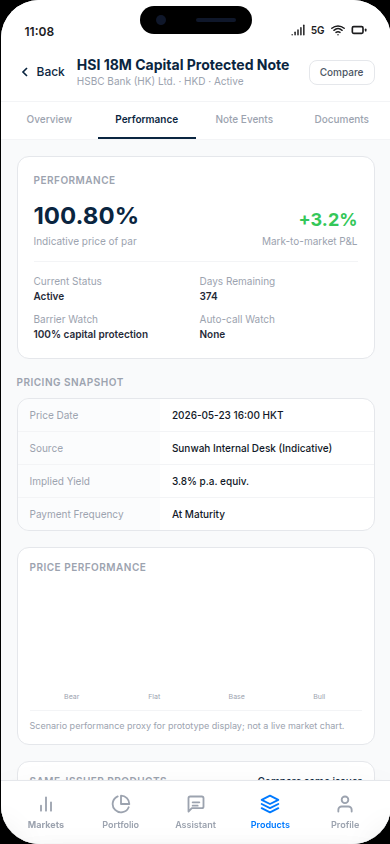
<p style="padding: 12px; margin: 0; font-size: 14px;"><strong>Performance</strong> — 指示性價格、implied yield、barrier watch、同發行人產品參考與 pricing disclaimer。</p>
</div>
</td>
</tr>
<tr>
<td style="padding: 12px; vertical-align: top; width: 50%;">
<div style="border: 1px solid #e0e0e0; border-radius: 8px; overflow: hidden;">
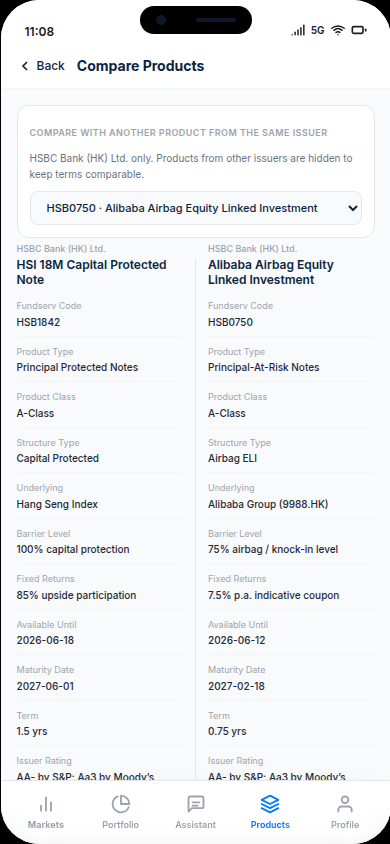
<p style="padding: 12px; margin: 0; font-size: 14px;"><strong>Compare Products</strong> — 同發行人產品選擇器 + Tabular Factsheet Matrix / 左右雙欄條款對比，避免跨發行人不可比。</p>
</div>
</td>
<td style="padding: 12px; vertical-align: top; width: 50%;"></td>
</tr>
</table>

**Admin 专屬頁面**

<table style="width: 80%; margin: 0 auto; border-collapse: collapse;">
<tr>
<td style="padding: 12px; vertical-align: top; width: 50%;">
<div style="border: 1px solid #e0e0e0; border-radius: 8px; overflow: hidden;">
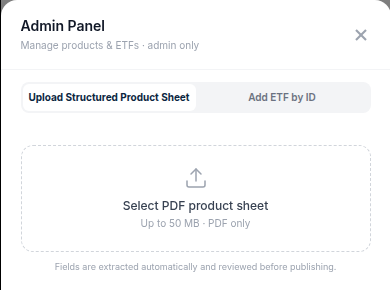
<p style="padding: 12px; margin: 0; font-size: 14px;"><strong>Admin Panel</strong> — Admin 专屬；Upload Structured Product Sheet、Select PDF product sheet 與 Add ETF by ID 兩個維護入口。</p>
</div>
</td>
<td style="padding: 12px; vertical-align: top; width: 50%;">
<div style="border: 1px solid #e0e0e0; border-radius: 8px; overflow: hidden;">
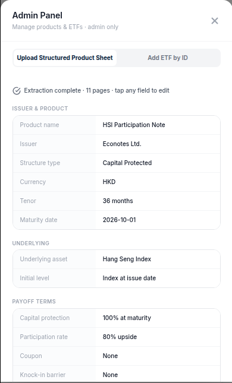
<p style="padding: 12px; margin: 0; font-size: 14px;"><strong>Extracted Review</strong> — Extraction complete 後展示 AI 抽取字段，管理員可審核、Discard 或 Publish；ETF 維護成功後可 Add to Platform。</p>
</div>
</td>
</tr>
</table>

#### 4.4.3 User Stories

**S-1：瀏覽結構化產品詳情**

> **用戶類型**：User | **需求**：通過 Issuer / Strategy / Risk 等過濾器瀏覽產品列表，點擊產品卡片進入詳情頁，查看 Overview / Performance / Note Events / Documents 等標簽頁，並可加入關註列表 | **價值**：形成結構化產品研究上下文，幫助理解條款、狀態和關鍵指標

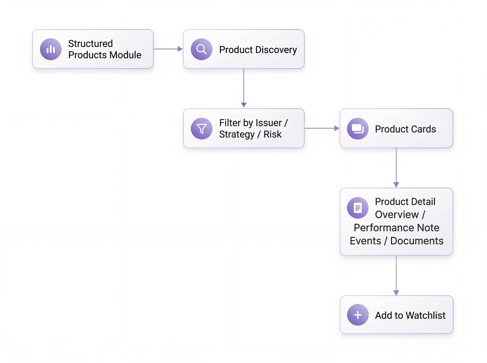

**S-2：篩選搜尋結構化產品**

> **用戶類型**：User | **需求**：通過 Smart Filters 或 Advanced Search 使用產品類型、標的、barrier、期限、幣種等條件篩選產品，找到目標產品後進入詳情頁 | **價值**：將模糊需求轉化為具體可研究的產品標的

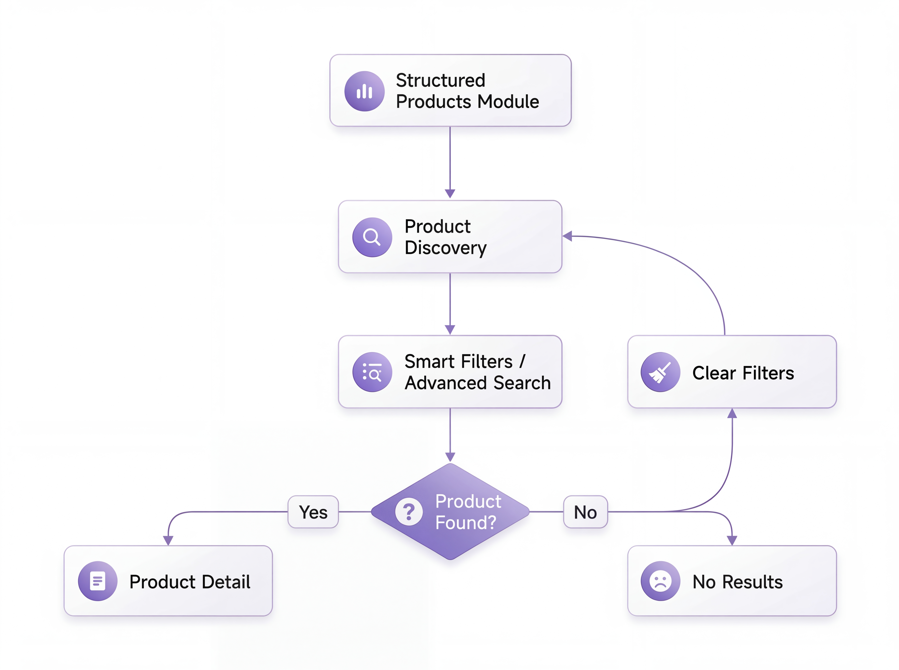

**S-3：對比結構化產品**

> **用戶類型**：User | **需求**：在產品詳情頁點擊 Compare，選擇同發行人的第二只產品進入 Compare 頁面，對比收益結構、票息、barrier、風險等條款信息 | **價值**：輔助選品決策，避免跨發行人不可比的產品對比

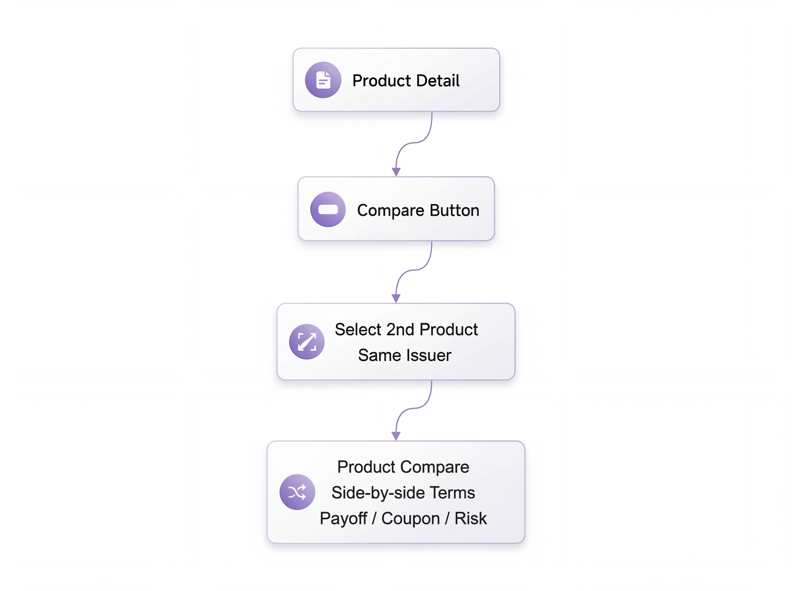

**S-4：上傳結構化產品 PDF**

> **用戶類型**：Admin | **需求**：通過 Admin Panel 上傳結構化產品 term sheet PDF，AI 自動提取字段，管理員審核編輯後 Publish 發布到平台 | **價值**：統一維護結構化產品資料，讓產品目錄保持最新

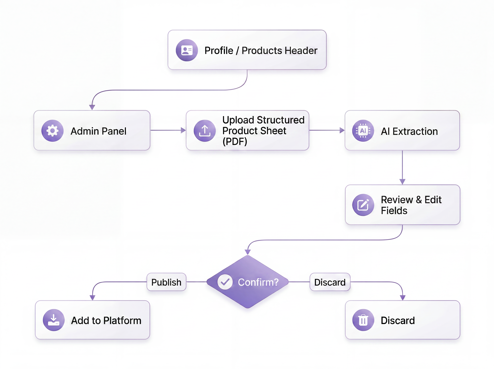

#### 4.4.4 Acceptance Criteria

| ID | 內容 | 參考 | 歸屬 | 優先級 |
| --- | --- | --- | --- | --- |
| UI-008 | 產品發現頁展示"僅供篩選"提示橫幅、發行人列表、智能篩選器和高級搜尋入口。 | S-1, S-2; 4.4.3 Product list page | Frontend | Must |
| UI-009 | 產品卡展示收益類型、本金處理、 barrier/buffer、發行人、狀態、風險等級和適當性提示。 | S-1; 4.4.3 Product list page | Integration | Must |
| UI-010 | 產品詳情頁渲染概覽、表現、情景事件和文檔標簽頁及對應內容。 | S-1; 4.4.3 Detail Overview | Integration | Must |
| UI-011 | 情景事件標簽頁展示收益故事、情景選擇器、收益地圖、規則速查和漲跌/中性/熊市情景的規則解釋。 | S-1; 4.4.3 Note Events page | Integration | Must |
| Flow-012 | 用戶可通過智能篩選或高級搜尋篩選產品；無結果時展示空狀態和清除操作。 | S-2; 4.4.3 Filter/Search | Integration | Must |
| Flow-013 | 用戶可在產品詳情頁點擊對比，通過選擇器選擇第二只產品（僅限同發行人），進入對比頁面。 | S-3; 4.4.3 Compare page | Integration | Must |
| Flow-014 | 管理員可通過管理面板上傳結構化產品 PDF；系統展示抽取進度後進入字段審核頁面。 | S-4; 4.4.3 Admin Panel | Integration | Must |
| Flow-015 | 管理員可編輯抽取的字段並選擇放棄或發布；成功後展示確認反饋。 | S-4; 4.4.3 Extracted Review | Integration | Must |
| Access-001 | 管理面板入口和上傳/添加 ETF 功能僅對管理員角色用戶可見和可訪問。 | S-4; 2.2 Role Matrix | Frontend | Must |
| Compliance-004 | 產品頁面展示非交易執行免責聲明、非確定報價免責聲明和適當性評估提示。 | S-1; 1.2 Guardrails | Frontend | Must |

### 4.5 Profile & Settings

#### 4.5.1 功能概述

| 能力 | 說明 | 優先級 |
| --- | --- | --- |
| 用戶身份 | 展示姓名、郵箱、頭像首字母、PRO / ADMIN 標簽 | Must |
| Language | EN / 繁中切換，Profile 文案即時切換 | Should |
| Notifications | iOS switch 樣式開關 | Should |
| Security & 2FA | 展示安全狀態，並提供 2FA 設定入口 | Should |
| Base Currency | 顯示基礎幣種偏好 | Should |
| Legal Links | Terms of Use、Privacy Policy、About | Must |
| Sign Out | 登出並回到 Login | Must |
| Admin Tools | Admin 专屬入口，包含 Add ETF by ID 與 Upload Structured Product | Must |

#### 4.5.2 頁面介紹

<table style="width: 80%; margin: 0 auto; border-collapse: collapse;">
<tr>
<td style="padding: 12px; vertical-align: top; width: 50%;">
<div style="border: 1px solid #e0e0e0; border-radius: 8px; overflow: hidden;">
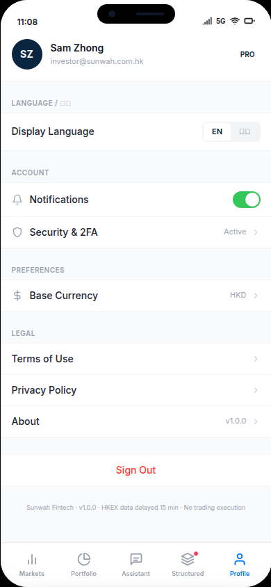
<p style="padding: 12px; margin: 0; font-size: 14px;"><strong>Profile</strong> — 用戶身份、會員標簽；Language / 語言、Account、Preferences、Legal 分組；Notifications、Security & 2FA、Base Currency、Terms / Privacy / About、Sign Out；Admin 登入時出現 Admin Tools（Add ETF by ID、Upload Structured Product）；底部提示 HKEX data delayed 15 min · No trading execution。</p>
</div>
</td>
<td style="padding: 12px; vertical-align: top; width: 50%;"></td>
</tr>
</table>

## 五、非功能性需求

### 5.1 安全

| ID | 內容 | 參考 | 歸屬 | 優先級 |
| --- | --- | --- | --- | --- |
| NFR-Security-001 | App 支持賬號密碼登入和 Google/Microsoft OAuth 2.0 SSO。 | 5.1 | Backend | Must |
| NFR-Security-002 | 登入錯誤展示 inline 紅色提示；網絡錯誤展示清晰錯誤文案。 | 5.1 | Frontend | Must |
| NFR-Security-003 | Access Token 存儲於 iOS Keychain；過期後靜默刷新；登出時撤銷本地和服務端 token。 | 5.1 | Frontend | Must |
| NFR-Security-004 | App 進入背景超過 30 分鐘需重新認證。 | 5.1 | Frontend | Should |
| NFR-Security-005 | 連續登入失敗達到閾值後鎖定或要求額外驗證。 | 5.1 | Backend | Should |
| NFR-Security-006 | App 支持 TOTP 或企業 SSO 2FA；Profile 展示 2FA 狀態。 | 5.1 | Integration | Should |
| NFR-Security-007 | 所有 API 調用使用 TLS 1.2+；生產客戶端啟用 certificate pinning。 | 5.1 | Frontend | Must |
| NFR-Security-008 | Token、敏感配置和持倉緩存存儲於 Keychain 或加密存儲。 | 5.1 | Frontend | Must |
| NFR-Security-009 | 持倉資料僅用於當前分析；不寫入明文日志。 | 5.1 | Backend | Must |
| NFR-Security-010 | 郵箱和姓名等 PII 在日志和 AI 請求前脫敏或最小化。 | 5.1 | Backend | Must |
| NFR-Security-011 | App 不申請無關權限（位置、通訊錄、麥克風）。 | 5.1 | Frontend | Must |
| NFR-Security-012 | 第三方 AI 調用不傳入可識別身份信息；輸出經過合規過濾。 | 5.1 | Integration | Should |

### 5.2 權限控制

| ID | 內容 | 參考 | 歸屬 | 優先級 |
| --- | --- | --- | --- | --- |
| NFR-Access-001 | 服務端根據賬號類型下發角色；前端僅用於顯示控制。 | 5.1, 2.2 | Backend | Must |
| NFR-Access-002 | 客戶端隱藏控件不作為唯一保護；Admin API 必須服務端鑒權。 | 5.1, 2.2 | Backend | Must |
| NFR-Access-003 | Upload Product、Add ETF、Admin Tools 對普通用戶不可見不可訪問。 | 5.1, 2.2 | Frontend | Must |
| NFR-Access-004 | 上傳、發布、刪除、字段修改記錄 actor、時間、來源和內容 ID。 | 5.1 | Backend | Should |

### 5.3 性能

| ID | 內容 | 參考 | 歸屬 | 優先級 |
| --- | --- | --- | --- | --- |
| NFR-Performance-001 | Market Dashboard 首屏在 Wi-Fi 冷啟動下 2s 內載入完成。 | 5.1 | Integration | Must |
| NFR-Performance-002 | 頁面交互響應在 300ms 內（點擊到視覺反饋）。 | 5.1 | Frontend | Must |
| NFR-Performance-003 | ETF 資料接口 p95 延遲在正常網絡下 800ms 內。 | 5.1 | Backend | Must |
| NFR-Performance-004 | Assistant 打字指示器出現後 3s 內首次響應。 | 5.1 | Integration | Must |
| NFR-Performance-005 | 文件解析（PDF/CSV/圖片，5MB 內）含抽取階段 10s 內完成。 | 5.1 | Integration | Must |
| NFR-Performance-006 | iPhone 13 正常使用內存低於 150MB RSS。 | 5.1 | Frontend | Should |
| NFR-Performance-007 | 所有網絡請求展示 Skeleton/Spinner/Error；不白屏。 | 5.1 | Frontend | Must |
| NFR-Performance-008 | 離線模式展示緩存資料並提示離線；寫操作禁用並說明原因。 | 5.1 | Integration | Should |

### 5.4 相容性

| ID | 內容 | 參考 | 歸屬 | 優先級 |
| --- | --- | --- | --- | --- |
| NFR-Compatibility-001 | App 遵循 Apple Human Interface Guidelines (HIG)。 | 5.1 | Frontend | Must |
| NFR-Compatibility-002 | Tab Bar、Bottom Sheet、Drawer、Toast、Segmented Control、iOS Switch 采用原生或行為等效組件。 | 5.1 | Frontend | Must |
| NFR-Compatibility-003 | 所有可交互元素最小觸摸區域 44x44pt。 | 5.1 | Frontend | Must |
| NFR-Compatibility-004 | App 兼容 Dynamic Island、Home Indicator 和 Safe Area Insets。 | 5.1 | Frontend | Must |
| NFR-Compatibility-005 | Drawer 左滑關閉、Bottom Sheet 下拉關閉等手勢正確響應。 | 5.1 | Frontend | Should |
| NFR-Compatibility-006 | 頁面切換、Drawer、Toast、Sheet 動畫控制在 200-350ms。 | 5.1 | Frontend | Must |
| NFR-Compatibility-007 | 輸入框獲焦時不遮擋內容；點擊空白收起鍵盤。 | 5.1 | Frontend | Must |
| NFR-Compatibility-008 | Accessibility Large Text 下核心內容不截斷。 | 5.1 | Frontend | Should |
| NFR-Compatibility-009 | 支持 iOS 16.0+；主要測試 iPhone 13/14/15 系列。 | 5.1 | Integration | Must |
| NFR-Compatibility-010 | 4.7" 至 6.7" 豎屏全部內容可滚動訪問。 | 5.1 | Frontend | Must |
| NFR-Compatibility-011 | 豎屏為主要使用方向；圖表區域在橫屏下增強展示。 | 5.1 | Frontend | Could |

### 5.5 可存取性

| ID | 內容 | 參考 | 歸屬 | 優先級 |
| --- | --- | --- | --- | --- |
| NFR-Accessibility-001 | 核心按鈕、輸入框、圖表摘要提供 accessibilityLabel/Hint 支持 VoiceOver。 | 5.1 | Frontend | Should |
| NFR-Accessibility-002 | 支持英文和繁體中文雙語；關鍵業務文案進入 i18n 資源。 | 5.1 | Frontend | Should |
| NFR-Accessibility-003 | 正文和背景滿足 WCAG AA 對比度（4.5:1）。 | 5.1 | Frontend | Should |

### 5.6 合規

| ID | 內容 | 參考 | 歸屬 | 優先級 |
| --- | --- | --- | --- | --- |
| NFR-Compliance-001 | 所有 Assistant、Portfolio、Product 建議明確聲明不構成正式投資建議。 | 5.1, 1.2 | Integration | Must |
| NFR-Compliance-002 | App 不出現 Execute/Order/Place Trade 等交易執行 UI 或文案。 | 5.1, 1.2 | Integration | Must |
| NFR-Compliance-003 | ETF 行情標註 delayed；產品定價標註 indicative/non-firm quote。 | 5.1, 1.2 | Frontend | Must |
| NFR-Compliance-004 | 結構化產品頁註明 Private Placement 和 Suitability assessment required。 | 5.1, 1.2 | Frontend | Must |
| NFR-Compliance-005 | 不承諾收益；歷史表現不代表未來。 | 5.1, 1.2 | Integration | Must |
| NFR-Compliance-006 | App 提供 Privacy Policy；遵循香港 PDPO。 | 5.1 | Backend | Must |
| NFR-Compliance-007 | 明確用戶資料處理和存儲地區。 | 5.1 | Backend | Should |

### 5.7 可觀測性

| ID | 內容 | 參考 | 歸屬 | 優先級 |
| --- | --- | --- | --- | --- |
| NFR-Observability-001 | 集成崩潰監控，含設備、系統版本和頁面上下文。 | 5.1 | Frontend | Must |
| NFR-Observability-002 | API 錯誤、文件解析失敗、Assistant 超時記錄 request ID。 | 5.1 | Backend | Must |
| NFR-Observability-003 | ETF 資料源、AI prompt、評分閾值、合規聲明文案可配置。 | 5.1 | Backend | Should |
| NFR-Observability-004 | 新功能通過 feature flag 灰度上線。 | 5.1 | Integration | Should |
| NFR-Observability-005 | 後端 API 采用版本化路由（如 /v1/）。 | 5.1 | Backend | Should |
| NFR-Observability-006 | ETF 資料、Assistant 推理、產品發布設定 p95 和錯誤率告警。 | 5.1 | Backend | Should |
